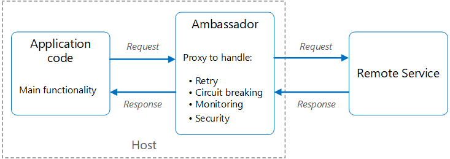

  

‏Ambassador pattern

سرویس‌های helper ایجاد کنیم که درخواست‌های (requests) شبکه را از طرف یک سرویس مصرف‌کننده consumer service یا اپلیکیشن ارسال کند.

یک سرویس سفیر (ambassador) را می‌توان به‌عنوان یک پروکسی از پردازش در نظر گرفت که در کنار client قرار می‌گیرد. این الگو می‌تواند برای بارگیری وظایف مشترک اتصال client مانند monitoring، logging، مسیریابی، امنیت (مانند TLS) و الگوهای انعطاف‌پذیر مفید باشد. اغلب با برنامه‌های قدیمی یا سایر برنامه‌هایی که اصلاح آن‌ها دشوار است، به‌منظور گسترش قابلیت‌های ارتباطی آنها استفاده می‌شود.

### **زمینه و مشکل**

 
در اپلیکیشن‌های مبتنی بر فضای ابری باقابلیت انعطاف عملکرد بالا، به ویژگی‌هایی مانند
 [circuit breaking](obsidian://open?vault=cloud_softwares&file=docs%2FCircuit%20Breaker%20pattern)
و مسیردهی و اندازه‌گیری‌ها و متریک‌ها و نظارت (monitoring) و توانایی ایجاد و به‌روزرسانی‌های پیکربندی مرتبط با شبکه نیاز دارند. ممکن است به‌روزرسانی برنامه‌های قدیمی یا کتابخانه‌های مربوط به کدهای موجود برای افزودن این ویژگی‌ها دشوار یا غیرممکن باشد، زیرا توسعه کد دیگر پشتیبانی نمی‌شود یا نمی‌توان آن را به‌راحتی توسط تیم توسعه اصلاح کرد.

فراخوانی و درخواست‌های مکرر روی شبکه ممکن است به پیکربندی قابل‌توجهی برای اتصالات و **احراز هویت** (authentication) و کنترل دسترسی (authorization) نیاز داشته باشند. اگر این درخواست‌ها در چندین اپلیکیشن که با استفاده از چندین زبان و framework ساخته شده‌اند، استفاده می‌شوند، پس باید درخواست‌ها باید برای هر یک از این حالت‌ها پیکربندی شوند. علاوه بر این، عملکرد شبکه و امنیت آن ممکن است نیاز به مدیریت یک تیم حرفه‌ای داشته باشد و این فقط تمام ماجرا نیست و معمولاً در این شرایط یک پایگاه کد بزرگ هم داریم که به‌روزرسانی و کدهای آن سختی زیادی دارد.

### راه‌حل: 

کتابخانه‌ها و frameworksهای کلاینت را در یک پردازش خارجی قرار بدیم که به‌عنوان یک پروکسی بین برنامه شما و سرویس‌های خارجی عمل کند. پروکسی را در همان محیط host برنامه مستقر کنید تا امکان کنترل مسیریابی، انعطاف‌پذیری، ویژگی‌های امنیتی و جلوگیری از هرگونه محدودیت دسترسی مربوط به host را فراهم کند. همچنین می‌توانیم از الگوی ambassador برای استانداردسازی و گسترش دقیق سایر بخش‌های برنامه و ماژول‌های جدیدتر استفاده کنیم. پروکسی می‌تواند معیارهای مرتبط با کارایی مانند تأخیر زمانی (latency) یا استفاده از مصرف منابع را نظارت (monitor) کند و این نظارت در همان محیط host برنامه انجام می‌شود.

ویژگی‌هایی که برای ambassador واگذار می‌شوند را می‌توان مستقل از برنامه مدیریت کرد. می‌توانید بدون ایجاد اختلال در عملکرد قدیمی برنامه، ambassador را به‌روزرسانی و اصلاح کنید. همچنین به تیم‌های مجزا و تخصصی اجازه می‌دهد تا ویژگی‌های مربوط به شبکه و امنیت و  authentication که به ambassador منتقل شده‌اند را پیاده‌سازی و حفظ کنند.

سرویس Ambassador را می‌توان به‌عنوان یک سرویس جانبی برای متصل‌کردن با اپلیکیشن مصرف‌کننده یا سرویس‌های دیگر استفاده کرد. از طرف دیگر، اگر یک Ambassador توسط چندین فرایند جداگانه در یک host مشترک به اشتراک گذاشته شود، می‌تواند به‌عنوان یک [daemon](https://en.wikipedia.org/wiki/Daemon_(computing)) مستقر یا deploy شود. اگر سرویس مصرف‌کننده کانتینری باشد، Ambassador باید به‌عنوان یک کانتینر جداگانه در همان host ایجاد شود، با لینک‌های مناسبی برای ارتباط با سایر سرویس‌ها پیکربندی شده باشد.

### مسائل و ملاحظات:

-‏ پروکسی مقداری سربار و تأخیر زمانی اضافه می‌کند. در نظر بگیرید که آیا رابط یا interface یا کتابخانه کلاینت که مستقیماً توسط برنامه فراخوانی می‌شود، رویکرد بهتری است یا خیر.
-‏ تأثیر احتمالی گنجاندن ویژگی‌های تعمیم‌یافته یا ویژگی‌هایی که در آینده ممکن است اضافه شود را در پروکسی را در نظر بگیرید.
-‏ مکانیزمی را در نظر بگیرید که به کاربر اجازه می‌دهد تا مقداری محتوی (context) را به پروکسی و همچنین به کاربر بازگرداند. برای مثال، هدرهای درخواست HTTP را برای انصراف از اتصال مجدد (retry) اضافه کنید یا حداکثر تعداد دفعات اتصال مجدد را مشخص کنید.
-‏ نحوه چگونگی package و deploy سرویس پروکسی را در نظر بگیرید.
-‏ در نظر بگیرید که آیا از یک نمونه مشترک برای همه کاربرها استفاده کنید یا یک نمونه جدا برای هر کاربر.

## **چه زمانی از این الگو استفاده کنیم؟**

**از این الگو زمانی استفاده کنید که:**

-‏ نیاز به ایجاد مجموعه‌ای مشترک از ویژگی‌های ارتباطی با کاربر برای حالتی که چندین زبان برنامه‌نویسی یا frameworkهای مختلف داریم.

-‏ نیاز به کاهش مشکلات ارتباطی کاربر با نرم‌افزار و جداسازی وظایف بین توسعه‌دهندگان زیرساخت با سایر تیم‌های تخصصی‌تر داریم.

-‏ نیاز به پشتیبانی یا راه‌اندازی محیط ابری یا خوشه‌ای(cluster) در یک برنامه قدیمی یا برنامه‌ای که تغییر آن در ساختار ابری دشوار است.

**این الگو ممکن است مناسب نباشد در حالتی که:**

-‏ زمانی که تأخیر زمانی در درخواست‌های شبکه بسیار مهم است. در این حالت یک پروکسی مقداری سربار را ایجاد می‌کند، هرچند بسیار ناچیز ولی در برخی موارد ممکن است روی برنامه تأثیر بگذارد.

-‏ وقتی در توسعه نرم‌افزار فقط از یک framework یا فقط از یک‌زبان برنامه‌نویسی خاص استفاده شده باشد. در آن صورت، یک گزینه بهتر ممکن است یک کتابخانه یا interface برای کاربر باشد که به‌عنوان یک package بین تیم‌های توسعه استفاده شود.

-‏ هنگامی که ویژگی‌های ارتباطی قابل‌تعمیم و سازگاری نیستند و نیاز به یکپارچگی عمیق‌تر با برنامه مشتری دارند.

### **مثال:**

دیاگرام زیر برنامه‌ای را نشان می‌دهد که از طریق یک پراکسی ambassador به یک سرویس ریموت درخواست می‌دهد. Ambassador مواردی مثل routing, circuit breaking, logging به سیستم را فراهم می‌کند و سرویس ریموت را فراخوانی می‌کند و سپس پاسخ را به برنامه کلاینت بر می‌گرداند.

