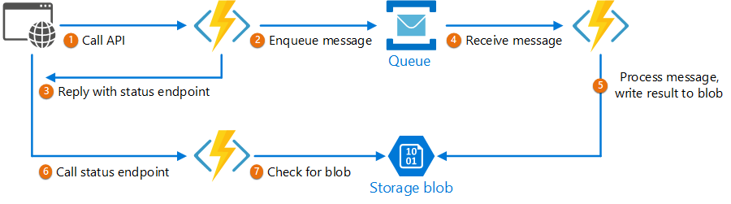

پردازش مربوط به سرویس backend را از یک میزبان مربوط به frontend جدا کنید، جایی که پردازش backend باید ناهمزمان یا asynchronous باشد، اما frontend  به response/پاسخ واضحی نیاز دارد.

### **طرح صورت مسئله:**

در توسعه اپلیکیشن‌های مدرن، طبیعی است که برنامه‌های کلاینت -‏ اغلب کدهایی که در یک سرویس  web-client (browser) اجرا می‌شوند -‏ به APIها برای ارائه business logic و ساختارهای  اجرایی وابسته باشند. این APIها ممکن است مستقیماً با برنامه مرتبط باشند یا ممکن است ارائه سرویس‌ها توسط شخص ثالث/third partyها باشند. معمولاً این فراخوانی‌های API روی پروتکل HTTP(S) انجام می‌شوند و از ساختار REST پیروی می‌کنند.

در بیشتر موارد، APIهای یک client application به گونه ای طراحی شده اند که به سرعت، در حدود 100 میلی ثانیه یا کمتر پاسخ دهند. عوامل زیادی می‌توانند بر تأخیر پاسخ (response latency) تأثیر بگذارند، از جمله موارد زیر:

-‏  hosting stack برنامه 

-‏ موارد امنیتی

-‏ موقعیت جغرافیایی نسبی درخواست دهنده و backend.

-‏ زیرساخت شبکه

-‏ بار در حال حاضر روی شبکه و برنامه

-‏ اندازه request payload

-‏ زمان پردازش مربوط به طول صف‌ها

-‏ زمان پردازش درخواست توسط Backend


هر یک از این عوامل می‌تواند تأخیر(latency) را به پاسخ اضافه کند. برخی از آنها را می‌توان scaling out کردن سرویس backend کاهش داد. بقیه چیزها مانند زیرساخت شبکه، تا حد زیادی خارج از کنترل توسعه دهنده برنامه هستند. اکثر APIها می‌توانند به اندازه کافی سریع پاسخ دهند تا پاسخها از طریق همان اتصال برسند .همین طور کد برنامه می‌تواند یک تماس API همزمان (synchronous API call) را به روش non-blocking برقرار کند و در ظاهر پردازش ناهمزمان (asynchronous processing) را ارائه دهد که برای عملیات I/O-bound توصیه می‌شود. 

با این حال، در برخی از سناریوها، کار انجام شده توسط Backend ممکن است مدت طولانی طول بکشند، مثلا از  چند ثانیه گرفته تا حتی یک فرآیند پس‌زمینه‌ای که در چند دقیقه یا حتی ساعت‌ها اجرا می‌شود. در آن صورت، انتظار برای تکمیل کار قبل از response به request، امکان پذیر نیست. این وضعیت یک مشکل جدی برای هر الگوی synchronous request-reply است.

برخی از معماری‌ها با استفاده از یک message broker برای جداسازی مراحل request و response این مشکل را حل می‌کنند. این جداسازی اغلب با استفاده از [Queue-Based Load Leveling pattern](obsidian://open?vault=cloud_softwares&file=docs%2FQueue-Based%20Load%20Leveling%20pattern) حاصل می‌شود. این جداسازی می‌تواند به client process و backend API  اجازه دهد تا به طور مستقل مقیاس‌دهی شوند. اما این جداسازی همچنین پیچیدگی بیشتری را در زمانی که client به اعلان موفقیت نیازمند است را به همراه دارد زیرا این مرحله باید ناهمزمان (asynchronous) شود.

بسیاری از ملاحظات مشابهی که برای برنامه‌های کلاینت مطرح شد، برای فراخوانی‌های REST API در حالت server-to-server در سیستم‌های توزیع‌شده نیز اعمال می‌شود -‏ به عنوان مثال، در معماری میکروسرویس‌ها.

## راه حل

یکی از راه حلهای این مشکل استفاده از HTTP polling است. polling برای کد سمت کلاینت بسیار مفید است، زیرا ارائه call-back endpoints یا استفاده از اتصال در حال پرادزش طولانی مدت (long running process) می‌تواند دشوار باشد. حتی زمانی که  callbackها مقدور هستند، کتابخانه‌ها و سرویس‌های اضافی مورد نیاز گاهی اوقات می‌توانند پیچیدگی بیشتری را اضافه کنند.

-‏ یک  client application  درواقع یک فراخوانی همزمان (synchronous call) با API برقرار می‌کند و یک عملیات پردازشی طولانی مدت در سرویس backend را راه اندازی می‌کند.

-‏ این API در سریع ترین زمان ممکن به صورت همزمان (synchronous) پاسخ می‌دهد. یک status code با حالت HTTP 202 (Accepted) را برمی گرداند و تأیید می‌کند که request برای پردازش دریافت شده است.

```
توجه داشته باشید

در واقع این  API باید هر دو موارد  request و  اقدامی را که باید قبل از شروع پردازش طولانی مدت، پردازش شود را تأیید کند. اگر request نامعتبر باشد، بلافاصله با یک کد خطا مانند HTTP 400 (Bad Request) پاسخ دهید.
```


-‏ پاسخ یا response مورد نظر دارای یک مرجع مکانی (location reference) است که به یک endpoint اشاره می‌کند که کاربر می‌تواند برای بررسی نتیجه عملیات طولانی مدت (long running operation) روی آن polling و نتیجه کند.  
  
 -‏ این API پردازش را به مؤلفه دیگری مانند message queue واگذار می‌کند.  
  
-‏ برای هر فراخوانی موفق با status endpoint مورد نظر، مقدار  HTTP 200 را برمی گرداند. در حالی که عملیات مورد نظر هنوز در حالت انتظار است، status endpoint حالتی را برمی گرداند که نشان می‌دهد کار هنوز در حال انجام است. هنگامی که کار کامل شد، status endpoint می‌تواند حالتی را که نشان‌دهنده اتمام است برگرداند یا به URL منبع دیگری redirect شود. به عنوان مثال، اگر عملیات ناهمزمان یک منبع جدید ایجاد کند،  status endpoint  به URL مربوط به آن منبع redirect می‌شود.  
  
نمودار زیر یک حالت معمولی از پردازش مورد نظر را نشان می‌دهد:


1 -‏ client یک درخواست ارسال می‌کند و یک پاسخ HTTP 202 (Accepted) دریافت می‌کند.  
2-‏ client یک درخواست HTTP GET را به status endpoint ارسال می‌کند. کار هنوز در انتظار است، بنابراین این فراخوانی مقدار HTTP 200 را برمی گرداند.  
3-‏ در برخی مواقع که کار مورد نظر انجام می‌شود و status endpoint مقدار (Found) 302  را با redirect مجدد به منبع برمی گرداند.  
4-‏ client منبع را در URL مشخص شده واکشی(fetch) می‌کند.

## مسائل و ملاحظات:

-‏ چندین راه مختلف برای پیاده سازی این الگو بر روی HTTP وجود دارد و همه سرویسهای upstream فوق معنایی یکسان ندارند. به عنوان مثال، بیشتر سرویس‌ها پاسخ HTTP 202 را از روش GET برنمی‌گردانند به خصوص زمانی که یک فرآیند remote تمام نشده باشد. با توجه به ساختار REST، آنها باید مقدار HTTP 404 (Not Found) را برگردانند. زمانی که فکر می‌کنید نتیجه تماس هنوز هم وجود ندارد، این پاسخ منطقی است.  
  
-‏ یک پاسخ HTTP 202 باید موقعیت و تناوبی  را که client باید برای پاسخ رای گیری(poll) کند را نشان دهد. در نتیجه باید هدرهای اضافی زیر را داشته باشد:

|Header|Description|Notes|
|---|---|---|
|Location|A URL the client should poll for a response status.|This URL could be a SAS token with the [Valet Key Pattern](https://learn.microsoft.com/en-us/azure/architecture/patterns/valet-key) being appropriate if this location needs access control. The valet key pattern is also valid when response polling needs offloading to another backend|
|Retry-After|An estimate of when processing will complete|This header is designed to prevent polling clients from overwhelming the back-end with retries.|


* ممکن است لازم باشد از یک processing proxy یا [Facade](https://en.wikipedia.org/wiki/Facade_pattern "Facade pattern") (نما) برای دستکاری response headerها یا payloadها با توجه به سرویس‌های مورد استفاده شده را به کار ببرید.

* اگر status endpoint پس از تکمیل فرآیند مورد نظر  باید redirect شود، با توجه به ساختار دقیقی که پشتیبانی می‌کنید، معمولا کدهای بازگشتی مناسب برای این قسمت که مقدارهای [HTTP 302](https://tools.ietf.org/html/rfc7231#section-6.4.3)  یا [HTTP 303](https://tools.ietf.org/html/rfc7231#section-6.4.4)  هستند را مورد استفاده قرار دهید.

* پس از پردازش موفقیت آمیز، منبع مشخص شده توسط  Location header باید کد پاسخ HTTP مناسب مانند 200 (OK), 201 (Created)  یا 204 (No Content) را برگرداند.

* اگر در حین پردازش خطایی رخ داد، خطا را در URL منبع توضیح داده شده در Location header توضیح دهید و در حالت ایده آل یک کد پاسخ مناسب را از آن منبع(resource) به client برگردانید (4xx code)).

* همه راه حلها این الگو را به یک شکل پیاده سازی نمی‌کنند و برخی از سرویسها شامل headerهای اضافی یا جایگزین می‌شوند. به عنوان مثال، Azure Resource Manager از یک نوع تغییر یافته از این الگو استفاده می‌کند. برای اطلاعات بیشتر، [Azure Resource Manager Async Operations](https://learn.microsoft.com/en-us/azure/azure-resource-manager/resource-manager-async-operations). را ببینید.

* کلاینت‌های قدیمی ممکن است از این الگو پشتیبانی نکنند. در این صورت، ممکن است لازم باشد یک [Facade](https://en.wikipedia.org/wiki/Facade_pattern "Facade pattern") (نما) روی asynchronous API قرار دهید تا پردازش ناهمزمان را از client اصلی پنهان کنید. به عنوان مثال، Azure Logic Apps که به صورت native از این الگو پشتیبانی می‌کند، می‌تواند به عنوان یک لایه یکپارچه‌سازی بین یک API ناهمزمان و یک کلاینت که تماس‌های همزمان برقرار می‌کند استفاده شود. به انجام کارهای طولانی مدت با الگوی اقدام webhook مراجعه کنید ([Perform long-running tasks with the webhook action pattern](https://learn.microsoft.com/en-us/azure/logic-apps/logic-apps-create-api-app#perform-long-running-tasks-with-the-webhook-action-pattern)).

* در برخی از سناریوها، ممکن است بخواهید راهی برای لغو درخواست طولانی مدت (long-running request) برای کلاینت‌ها فراهم کنید. در آن صورت، سرویس backend باید از نوعی دستورالعمل لغو پشتیبانی کند.

## این الگو در چه زمانی مناسب است


**از این الگو برای موارد زیر استفاده کنید:**  
  
-‏ کدهای سمت کلاینت‌ (Client-side)، مانند برنامه‌های مورد استفاده در مرورگر، که در آن ارائه call-back endpointها برگشتی دشوار است یا استفاده از اتصالات طولانی مدت(long-running connections)، پیچیدگی بیشتری را اضافه می‌کند.  
  
-‏ فراخوانیهای سرویس (Service calls) که فقط در پروتکل HTTP در دسترس است و سرویس برگشتی نمی‌تواند به دلیل محدودیت‌های firewall در سمت کلاینت، تماس‌ها و فراخوانی‌های برگشتی را برقرار کند.  
  
-‏ فراخوانی‌های سرویس (Service calls) که نیاز به ادغام با معماری‌های قدیمی دارند که از فن‌آوری‌های فراخوانی‌های مدرن مانند WebSockets یا webhooks پشتیبانی نمی‌کنند.  
  
**این الگو ممکن است زمانی مناسب نباشد:**  
  
-‏ به جای آن می‌توانید از سرویسی استفاده کنید که برای اعلانهای ناهمزمان ساخته شده است، مانند Azure Event Grid.  
-‏ پاسخها باید در لحظه (real time) و به سرعت برای client ارسال شوند.  
-‏ client باید نتایج زیادی را جمع آوری کند و تأخیر دریافتی آن نتایج مهم است. به جای آن یک الگوی service bus را در نظر بگیرید.  
-‏ می‌توانید از اتصالات شبکه پایدار سمت سرور مانند WebSockets یا SignalR استفاده کنید. از این سرویس‌ها می‌توان برای اطلاع فراخوان کننده از نتیجه استفاده کرد.  
-‏ طراحی مناسب network به شما این امکان را می‌دهد که پورت‌هایی را برای  asynchronous callback یا webhookها باز کنید.


## مثال

کد زیر گزیده هایی از برنامه ای را نشان می‌دهد که از توابع Azure برای پیاده سازی این الگو استفاده می‌کند. سه عملکرد در راه حل وجود دارد:

-‏ یک asynchronous API endpoint.

-‏ The status endpoint. 

-‏ یک function Backend که آیتمهای کاری و تسکها در صف را می‌گیرد و آنها را اجرا می‌کند.


این نمونه در  [GitHub](https://github.com/mspnp/cloud-design-patterns/tree/master/async-request-reply) موجود است.

### AsyncProcessingWorkAcceptor function

تابع AsyncProcessingWorkAcceptor یک endpoint را پیاده سازی می‌کند که کار یک برنامه client را می‌پذیرد و آن را در یک صف برای پردازش قرار می‌دهد.

-‏ این تابع request ID  تولید می‌کند و آن را به عنوان metadata به  queue message اضافه می‌کند.

-‏ پاسخ HTTP شامل یک location header است که به یک status endpoint اشاره می‌کند. همینطور request ID بخشی از مسیر URL است.

```csharp
public static class AsyncProcessingWorkAcceptor
{
    [FunctionName("AsyncProcessingWorkAcceptor")]
    public static async Task<IActionResult> Run(
        [HttpTrigger(AuthorizationLevel.Anonymous, "post", Route = null)] CustomerPOCO customer,
        [ServiceBus("outqueue", Connection = "ServiceBusConnectionAppSetting")] IAsyncCollector<ServiceBusMessage> OutMessages,
        ILogger log)
    {
        if (String.IsNullOrEmpty(customer.id) || string.IsNullOrEmpty(customer.customername))
        {
            return new BadRequestResult();
        }

        string reqid = Guid.NewGuid().ToString();

        string rqs = $"http://{Environment.GetEnvironmentVariable("WEBSITE_HOSTNAME")}/api/RequestStatus/{reqid}";

        var messagePayload = JsonConvert.SerializeObject(customer);
        var message = new ServiceBusMessage(messagePayload);
        message.ApplicationProperties.Add("RequestGUID", reqid);
        message.ApplicationProperties.Add("RequestSubmittedAt", DateTime.Now);
        message.ApplicationProperties.Add("RequestStatusURL", rqs);

        await OutMessages.AddAsync(message);

        return new AcceptedResult(rqs, $"Request Accepted for Processing{Environment.NewLine}ProxyStatus: {rqs}");
    }
}
```

### AsyncProcessingBackgroundWorker function

تابع AsyncProcessingBackgroundWorker عملیات یا تسک مورد نظر  را از صف دریافت می‌کند، برخی کارها را بر اساس message payload انجام می‌دهد و نتیجه را در یک storage account می‌نویسد.

```csharp
public static class AsyncProcessingBackgroundWorker
{
    [FunctionName("AsyncProcessingBackgroundWorker")]
    public static async Task RunAsync(
        [ServiceBusTrigger("outqueue", Connection = "ServiceBusConnectionAppSetting")] BinaryData customer,
        IDictionary<string, object> applicationProperties,
        [Blob("data", FileAccess.ReadWrite, Connection = "StorageConnectionAppSetting")] BlobContainerClient inputContainer,
        ILogger log)
    {
        // Perform an actual action against the blob data source for the async readers to be able to check against.
        // This is where your actual service worker processing will be performed

        var id = applicationProperties["RequestGUID"] as string;

        BlobClient blob = inputContainer.GetBlobClient($"{id}.blobdata");

        // Now write the results to blob storage.
        await blob.UploadAsync(customer);
    }
}
```


### AsyncOperationStatusChecker function

تابع AsyncOperationStatusChecker که status endpoint را پیاده سازی می‌کند. این تابع ابتدا بررسی می‌کند که آیا request تکمیل شده است یا خیر  
  
-‏ اگر request تکمیل شد، تابع یا یک valet-key به پاسخ برمی‌گرداند، یا تماس را فوراً به valet-key هدایت می‌کند.  

-‏ اگر درخواست هنوز معلق یا pending است، باید یک کد 200 شامل وضعیت فعلی هم است را برگردانیم.  [200 code, including the current state](https://learn.microsoft.com/en-us/azure/architecture/best-practices/api-design#asynchronous-operations)


```csharp
public static class AsyncOperationStatusChecker
{
    [FunctionName("AsyncOperationStatusChecker")]
    public static async Task<IActionResult> Run(
        [HttpTrigger(AuthorizationLevel.Anonymous, "get", Route = "RequestStatus/{thisGUID}")] HttpRequest req,
        [Blob("data/{thisGuid}.blobdata", FileAccess.Read, Connection = "StorageConnectionAppSetting")] BlockBlobClient inputBlob, string thisGUID,
        ILogger log)
    {

        OnCompleteEnum OnComplete = Enum.Parse<OnCompleteEnum>(req.Query["OnComplete"].FirstOrDefault() ?? "Redirect");
        OnPendingEnum OnPending = Enum.Parse<OnPendingEnum>(req.Query["OnPending"].FirstOrDefault() ?? "OK");

        log.LogInformation($"C# HTTP trigger function processed a request for status on {thisGUID} -‏ OnComplete {OnComplete} -‏ OnPending {OnPending}");

        // Check to see if the blob is present
        if (await inputBlob.ExistsAsync())
        {
            // If it's present, depending on the value of the optional "OnComplete" parameter choose what to do.
            return await OnCompleted(OnComplete, inputBlob, thisGUID);
        }
        else
        {
            // If it's NOT present, then we need to back off. Depending on the value of the optional "OnPending" parameter, choose what to do.
            string rqs = $"http://{Environment.GetEnvironmentVariable("WEBSITE_HOSTNAME")}/api/RequestStatus/{thisGUID}";

            switch (OnPending)
            {
                case OnPendingEnum.OK:
                    {
                        // Return an HTTP 200 status code.
                        return new OkObjectResult(new { status = "In progress", Location = rqs });
                    }

                case OnPendingEnum.Synchronous:
                    {
                        // Back off and retry. Time out if the backoff period hits one minute.
                        int backoff = 250;

                        while (!await inputBlob.ExistsAsync() && backoff < 64000)
                        {
                            log.LogInformation($"Synchronous mode {thisGUID}.blob -‏ retrying in {backoff} ms");
                            backoff = backoff * 2;
                            await Task.Delay(backoff);
                        }

                        if (await inputBlob.ExistsAsync())
                        {
                            log.LogInformation($"Synchronous Redirect mode {thisGUID}.blob -‏ completed after {backoff} ms");
                            return await OnCompleted(OnComplete, inputBlob, thisGUID);
                        }
                        else
                        {
                            log.LogInformation($"Synchronous mode {thisGUID}.blob -‏ NOT FOUND after timeout {backoff} ms");
                            return new NotFoundResult();
                        }
                    }

                default:
                    {
                        throw new InvalidOperationException($"Unexpected value: {OnPending}");
                    }
            }
        }
    }

    private static async Task<IActionResult> OnCompleted(OnCompleteEnum OnComplete, BlockBlobClient inputBlob, string thisGUID)
    {
        switch (OnComplete)
        {
            case OnCompleteEnum.Redirect:
                {
                    // Redirect to the SAS URI to blob storage

                    return new RedirectResult(inputBlob.GenerateSASURI());
                }

            case OnCompleteEnum.Stream:
                {
                    // Download the file and return it directly to the caller.
                    // For larger files, use a stream to minimize RAM usage.
                    return new OkObjectResult(await inputBlob.DownloadContentAsync());
                }

            default:
                {
                    throw new InvalidOperationException($"Unexpected value: {OnComplete}");
                }
        }
    }
}

public enum OnCompleteEnum
{

    Redirect,
    Stream
}

public enum OnPendingEnum
{

    OK,
    Synchronous
}
```

## Next steps

اطلاعات زیر ممکن است هنگام استفاده از  این الگو مورد استفاده باشد:  
  
-‏ [Azure Logic Apps -‏ Perform long-running tasks with the polling action pattern](https://learn.microsoft.com/en-us/azure/logic-apps/logic-apps-create-api-app#perform-long-running-tasks-with-the-polling-action-pattern).

-‏  برای یافتن بهترین روش‌های اصولی در هنگام طراحی وب API، به [Web API design](https://learn.microsoft.com/en-us/azure/architecture/best-practices/api-design). مراجعه کنید.

##   Related resources

-‏ [Backends for Frontends pattern](obsidian://open?vault=cloud_softwares&file=docs%2FBackends%20for%20Frontends)