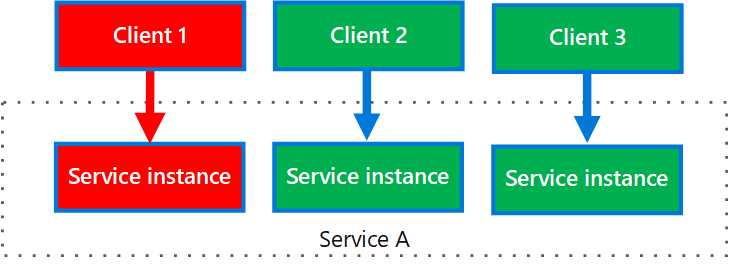

# ‏Bulkhead pattern

الگوی Bulkhead  مربوط به نوعی از طراحی اپلیکیشن است که در برابر شکست(failure) مقاوم است. در معماری Bulkhead، عناصر یا اجزای  یک اپلیکیشن در مخزنی ایزوله می‌شوند تا اگر یکی از مخزن‌ها کار بیفتد، بقیه آن‌ها به کار خود ادامه دهند. نام این الگو  برگرفته از پارتیشن‌های برش خورده (bulkheads) بدنه کشتی است. اگر بدنه کشتی آسیب ببیند، فقط قسمت آسیب دیده پر از آب می‌شود که از غرق شدن کشتی جلوگیری می‌کند.

## **زمینه و مشکل**


یک  اپلیکیشن مبتنی بر فضای ابر ممکن است شامل چندین سرویس باشد که هر سرویس یک یا چند مصرف کننده دارد. سربار بیش از حد(Excessive load) یا خرابی در یک سرویس بر همه مصرف کنندگان سرویس تأثیر می‌گذارد.  
  
علاوه بر این، یک مصرف کننده (consumer) ممکن است با مصرف منابع زیاد برای هر درخواستی که سمت سرویس ارسال می‌کند یا درحالتی دیگر درخواست‌هایی را به طور همزمان به چندین سرویس ارسال کند که باعث سربار بیش از حد روی آن سرویس شود. هنگامی که مصرف کننده درخواستی را به سرویسی ارسال می‌کند که پیکربندی آن اشتباه است یا سرویس مورد نظر هیچ پاسخی را نمی‌دهد در این صورت منابع مورد استفاده جهت پردازش درخواست کاربر ممکن است به موقع آزاد نشوند. با ادامه ارسال درخواست‌ها برای سرویس هدف، ممکن است این منابع تمام شود. به عنوان مثال،[ client's connection pool](https://en.wikipedia.org/wiki/Connection_pool) ممکن است تمام شده باشد. در آن مرحله، درخواست‌‌‌های مصرف کننده برای سرویس‌‌های دیگر تحت تأثیر قرار می‌گیرد. در نهایت مصرف‌کننده(consumer) دیگر نمی‌تواند درخواست‌‌‌های‌‌هایی را برای سرویس‌‌های دیگر ارسال کند.

همین مسئله فرسودگی منابع بر سرویس‌‌هایی با چندین مصرف‌کننده تأثیر می‌گذارد. تعداد زیادی درخواست از یک کاربر ممکن است منابع موجود در سرویس را تمام کند. در نتیجه سایر مصرف‌کننده‌ها دیگر قادر به استفاده از سرویس نیستند و این باعث ایجاد  شکست‌‌های پشت سر هم و متوالی (cascading failure effect) می‌شود.

## راه حل

نمونه‌‌های سرویس را بر اساس بار مصرف کننده و الزامات در دسترس بودن به گروه‌‌های مختلف تقسیم بندی کنید. این طراحی به جداسازی خرابی‌ها کمک می‌کند و به شما امکان می‌دهد تا عملکرد سرویس را برای برخی از مصرف‌کنندگان حتی در هنگام خرابی، حفظ کنید.

یک مصرف کننده همچنین می‌تواند منابع را پارتیشن‌بندی کند تا اطمینان حاصل شود که منابع استفاده شده برای فراخوانی یک سرویس بر منابع استفاده شده برای فراخوانی سرویس دیگر تأثیر نمی‌گذارد. برای مثال، مصرف‌کننده‌ای که چندین سرویس را فراخوانی می‌کند، ممکن است برای هر سرویس یک مخزن اتصال اختصاص داده شود. اگر سرویسی شروع به شکست و خرابی کند، فقط بر روی [connection pool](https://en.wikipedia.org/wiki/Connection_pool) اختصاص داده شده برای آن سرویس تأثیر می‌گذارد و به مصرف کننده اجازه می‌دهد تا به استفاده از سایر سرویس‌ها ادامه دهد.

مزایای این الگو عبارتند از:

*‏ مصرف کنندگان و سرویس‌ها را از خرابی‌‌های متوالی (cascading failures) جدا می‌کند. مشکلی که بر یک مصرف کننده یا سرویس تأثیر می‌گذارد می‌تواند در قسمت خود جدا شود و از شکست و با خطا مواجه شدن کل مسئله جلوگیری کند.  

*‏ به شما امکان می‌دهد در صورت خرابی سرویس، برخی از عملکردها را حفظ کنید و سایر سرویس‌ها و ویژگی‌های برنامه به کار خود ادامه خواهند داد.  

*‏ به شما امکان می‌دهد سرویس‌‌هایی را که کیفیت متفاوتی دارند را با توجه به ویژگی‌‌های مورد نیاز  برای اپلیکیشن‌‌های مورد استفاده خود انتخاب کرده و در نهایت برنامه خود را با توجه به ویژگی‌های سفارشی و مورد نظر مستقر کنید. همینطور یک مجموعه مصرف کننده با اولویت بالا را می‌توان برای استفاده از سرویس‌‌هایی با اولویت بالاتر پیکربندی کرد.

نمودار زیر دیاگرام bulkheads را نشان می‌دهد که در اطراف connection pool ساخته شده اند و سرویس‌‌های منحصر به فردی را فراخوانی می‌کنند. اگر سرویس A از کار بیفتد یا مشکل دیگری ایجاد کند، connection pool ایزوله یا جداسازی می‌شود، بنابراین فقط workload‌هایی با استفاده از [thread pool ]( https://en.wikipedia.org/wiki/Thread_pool) اختصاص داده شده به سرویس A تحت تأثیر قرار می‌گیرند. بار‌هایی که از سرویس B و C استفاده می‌کنند تحت تأثیر قرار نمی‌گیرند و می‌توانند بدون وقفه به کار خود ادامه دهند.


نمودار بعدی چندین کلاینت را نشان می‌دهد که با یک سرویس ارتباط می‌گیرند. به هر کلاینت یک نمونه سرویس جداگانه اختصاص داده می‌شود. کلاینت 1 که درخواست‌‌‌های مکرر و زیادی کرده است و نمونه‌‌های زیادی  را تحت تاثیر قرار داده است. از آنجایی که هر نمونه از سرویس از بقیه سرویس‌ها جدا شده است، سایر کلاینت‌ها می‌توانند به برقراری تماس و ارتباطات خود ادامه دهند.



## مسائل و ملاحظات


*‏  پارتیشن‌‌هایی را در مورد نیازمندی‌‌های تجاری و فنی برنامه تعریف کنید.

*‏ هنگام پارتیشن‌بندی سرویس‌ها یا مصرف‌کننده‌ها از طریق  bulkheadها حتما باید سطح ایزوله‌سازی ارائه‌شده توسط فناوری را به همراه هزینه تمام شده، کارایی و قابلیت مدیریت را به عنوان هزینه‌‌های اضافی در نظر بگیرید.

*‏ ترکیب bulkheadsها با الگو‌های retry, circuit breaker  و throttling را در نظر بگیرید تا مدیریت خطای پیچیده‌تری (fault handling) را ارائه دهید.

*‏ هنگام پارتیشن بندی مصرف کننده‌ها (consumers) به bulkheadها، استفاده از processesها ، thread poolها و semaphoreها را در نظر بگیرید. پروژه‌هایی مانند [resilience4j](https://github.com/resilience4j/resilience4j) و [Polly](https://github.com/App-vNext/Polly) چارچوبی را برای ایجاد bulkhead‌های مصرفی ارائه می‌دهند.

*‏ هنگام پارتیشن بندی سرویسها به bulkheadها، استقرار آنها را در ماشین‌های مجازی، کانتینرها یا فرآیند‌های جداگانه در نظر بگیرید. کانتینرها تعادل خوبی از جداسازی منابع را با سربار نسبتاً کم ارائه می‌دهند.

*‏ سرویس‌هایی که با استفاده از پیام‌های ناهمزمان(asynchronous) ارتباط برقرار می‌کنند را می‌توان از طریق مجموعه‌های مختلفی از  صف‌ها جدا کرد. هر صف می‌تواند مجموعه‌ای اختصاصی از نمونه‌‌هایی داشته باشد که پیام‌ها را در صف پردازش می‌کنند یا  یک گروه واحد از نمونه‌ها که از الگوریتمی برای خارج کردن اطلاعات از صف و ارسال پردازش آن‌ها استفاده می‌کنند. .  

*‏ سطح دانه بندی (granularity) مربوط bulkheadها را تعیین کنید. به عنوان مثال، اگر می‌خواهید [tenant](https://en.wikipedia.org/wiki/Multitenancy) ‌ای را در بین پارتیشن‌ها توزیع کنید برای این کار  می‌توانید هر tenant را در یک پارتیشن جداگانه قرار دهید یا چندین tenant را در یک پارتیشن قرار دهید.  

*‏ مانیتور یا نظارت کردن بر کارایی هر پارتیشن و SLA.

## چه زمانی از این الگو استفاده کنیم

از این الگو برای موارد زیر استفاده کنید:

*‏ منابع مورد استفاده برای مصرف یک مجموعه از سرویس‌‌های backend را جدا سازی کنید، به ویژه اگر برنامه بتواند تا حدودی از قابلیت عملکردی برخوردار باشد حتی در زمانی که یکی از سرویس‌ها پاسخگو نباشد.

*‏ مصرف کنندگان(consumers) پر اهمیت را از مصرف کنندگان معمولی جدا کنید.  
*‏ از اپلیکیشن در برابر خرابی‌های متوالی (cascading failures) محافظت کنید.

این الگو ممکن است زمانی مناسب نباشد که:

*‏ استفاده ناکافی ار منابع ممکن است در پروژه قابل قبول نباشد.  
*‏ اضافه کردن این پیچیدگی مورد نیاز نباشد.

## مثال

فایل پیکربندی [Kubernetes](https://en.wikipedia.org/wiki/Kubernetes) زیر یک محفظه ایزوله برای اجرای یک سرویس واحد با منابع و محدودیت‌های CPU و حافظه خود ایجاد می‌کند.

```yml
apiVersion: v1
kind: Pod
metadata:
  name: drone-management
spec:
  containers:
  - name: drone-management-container
    image: drone-service
    resources:
      requests:
        memory: "64Mi"
        cpu: "250m"
      limits:
        memory: "128Mi"
        cpu: "1"
```


