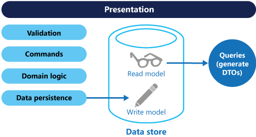

# ‏CQRS
در این قسمت به سراغ پترن CQRS می‌رویم، CQRS مخفف
Command and Query Responsibility Segregation است، الگویی که عملیات خواندن و به‌روزرسانی را برای ذخیره داده‌ها جدا می‌کند. پیاده‌سازی CQRS در برنامه شما می‌تواند مقیاس‌پذیری یا scalability و کارایی و امنیت آن را به حداکثر برساند. انعطاف‌پذیری ایجاد شده توسط CQRS به سیستم اجازه می‌دهد در طول زمان بهتر تکامل یابد و از ایجاد merge conflicts توسط به‌روزرسانی‌ها جلوگیری می‌کند.
 
## زمینه و مشکل
 
در معماری‌های قدیمی‌تر نرم‌افزار از data model یکسانی برای query و به‌روزرسانی پایگاه‌داده استفاده می‌شود. این روش خیلی ساده بوده و برای عملیات اولیه و معمولی CRUD به‌خوبی کار می‌کند. بااین‌حال، در برنامه‌های پیچیده‌تر، این روش خوب نیست. به‌عنوان‌مثال: در سمت خواندن پایگاه‌داده، برنامه ممکن است queryهای مختلفی را انجام دهد و data transfer objects (DTO) را با اشکال مختلف برگرداند. Object mapping می‌تواند پیچیده شود. در سمت نوشتن، مدل ممکن است validation و business logic پیچیده‌ای را پیاده‌سازی کند. در نتیجه؛ با یک مدل بیش از حد پیچیده روبرو می‌شویم که بیش از حد کار می‌کند و به‌نوعی تحت‌فشار است. حجم عملیات خواندن و نوشتن نامتقارن و نابرابر است و به جهت مشکلات performance در این موارد نیاز به scale برنامه به وجود می‌آید.

 


 
 
-‏ معمولاً یک عدم تطابق بین نمایش خواندن و نوشتن داده‌ها وجود دارد، مانند ستون‌ها یا ویژگی‌های اضافی که باید به‌درستی به‌روزرسانی شوند، حتی اگر به‌عنوان بخشی از یک عملیات موردنیاز نباشند.
 
-‏ زمانی که عملیات به‌صورت موازی روی یک مجموعه از داده‌ها انجام شود، اختلاف داده‌ها ممکن است منجر به تداخل (conflict) در آن‌ها شود.
 
-‏ رویکرد قدیمی می‌تواند به دلیل بارگذاری روی ذخیره داده‌ها و لایه دسترسی به داده‌ها و پیچیدگی queryهای موردنیاز برای بازیابی اطلاعات، تأثیر منفی بر عملکرد و کارایی داشته باشد.
 
-‏ مدیریت امنیت و مجوزها (permissions) می‌تواند پیچیده شود، زیرا هر موجودیت (entity) تابع عملیات خواندن و نوشتن است که ممکن است داده‌ها را در زمینه (context) اشتباهی نشان دهد.
 
## راه‌حل:
 
به‌طورکلی CQRS خواندن و نوشتن را در مدل‌های مختلف جدا می‌کند و از دستورات برای به‌روزرسانی داده‌ها و کوئری برای خواندن داده‌ها استفاده می‌کند.
 
 
-‏ دستورات باید task-based باشند، نه داده‌محور (data centric). به‌عنوان‌مثال جهت رزرو اتاق در یک هتل به‌صورت آنلاین، داریم:
("Book hotel room", not "set ReservationStatus to Reserved").
این گزینه ممکن است به برخی تغییرات مربوطه در سبک تعامل با کاربر نیازمند باشد. بخش دیگر مسئله این موضوع است که به منطق تجاری که این دستورات را پردازش می‌کند و درصد موفقیت این دستورات دارند، نگاه کنیم. یکی از تکنیک‌هایی که از این امر پشتیبانی می‌کند اجرای برخی از قوانین اعتبارسنجی بر روی بخشی از درخواست‌های سمت کاربر است که حتی قبل از ارسال دستورات یا commandها انجام می‌شود. به‌عنوان‌مثال دکمه‌ها و سایر عملکردهای رابط کاربردی را غیرفعال کنیم و دلیل آن را در UI توضیح می‌دهیم؛ مثلاً در حالتی که هیچ اتاق‌خالی ای وجود ندارد این پیغام ('هیچ اتاق باقی نمانده') را به کاربر نشان دهیم و سایر گزینه‌های ثبت اتاق را از طریق رابط کاربری غیرفعال کنیم. پس در حالت دیگر به همین ترتیب می‌توان شکست دستورات یا commandها سمت سرور را به وضعیت رقابتی یا race conditions محدود کرد (دو کاربر سعی می‌کنند آخرین اتاق را رزرو کنند) و حتی گاهی اوقات می‌توان با داده‌ها و دادن منطق بیشتری به آنها پرداخت (قراردادن یک مهمان در فهرست انتظار).
 
-‏ دستورات ممکن است در یک صفا یا queue برای پردازش ناهم‌زمان([asynchronous processing](https://learn.microsoft.com/en-us/dotnet/architecture/microservices/architect-microservice-container-applications/asynchronous-message-based-communication)) قرار گیرند، نه اینکه به‌صورت هم‌زمان پردازش شوند.
 
-‏ کوئری‌ها هرگز پایگاه‌داده را تغییر نمی‌دهند. یک کوئری یک [DTO](https://en.wikipedia.org/wiki/Data_transfer_object) را برمی‌گرداند که هیچ [domain knowledge](https://en.wikipedia.org/wiki/Domain_knowledge) را کپسوله نمی‌کند.
 
سپس می‌توان مدل‌ها را جدا کرد، همان‌طور که در نمودار زیر نشان‌داده‌شده است.
------
 


 -------
 
داشتن انواع کوئری‌ها و به‌روزرسانی مدل‌ها به‌صورت جداگانه تا حد زیادی طراحی و پیاده‌سازی را ساده می‌کند. بااین‌حال، یک نقطه‌ضعف این است که کد CQRS نمی‌تواند به طور خودکار از یک طرح پایگاه‌داده با استفاده از سازوکارهایی مانند ابزارهای Object–relational mapping یا به‌اختصار ORM تولید شود.
 
برای جداسازی بیشتر، می‌توانید داده‌های خوانده شده را از داده‌های نوشتن به‌صورت فیزیکی جدا کنید. در آن صورت، پایگاه‌داده خوانده شده می‌تواند از طرح داده‌های خود استفاده کند که برای کوئری‌ها بهینه شده است. به‌عنوان‌مثال، می‌تواند یک [materialized view](./Materialized%20View%20pattern.md) از داده‌ها را ذخیره کند تا از اتصالات پیچیده یا O/RM mapping پیچیده جلوگیری کند. حتی ممکن است از نوع دیگری از ذخیره داده استفاده کند. به‌عنوان‌مثال، پایگاه‌داده مخصوص نوشتن داده‌ها ممکن است relational باشد، درحالی‌که پایگاه‌داده مخصوص خواندن داده‌ها یک پایگاه document database است.
 
اگر از پایگاه‌های داده خواندن و نوشتن جداگانه استفاده می‌شود، باید آنها را sync نگه داشت. این حالت معمولاً با publish شدن یک رویداد یا event توسط مدل نوشتن در زمانی که پایگاه‌داده به‌روز شود انجام می‌شود. برای اطلاعات بیشتر در مورداستفاده از رویدادها، به سبک معماری [Event-driven architecture style](https://learn.microsoft.com/en-us/azure/architecture/guide/architecture-styles/event-driven) مراجعه کنید. به‌روزرسانی پایگاه‌داده و publish شدن رویدادها باید در یک تراکنش (transaction) انجام شود.
 

 
ذخیره داده‌های خواندن می‌تواند یک کپی(replica) از read-only از ذخیره داده‌های نوشتن باشد، یا ذخیره داده‌های خواندن و نوشتن می‌توانند ساختار متفاوتی داشته باشند. استفاده از چند replica به‌صورت read-only می‌تواند کارایی کوئری‌ها را افزایش دهد، به‌خصوص در سناریوهای توزیع شده که
در آن replicaهای فقط خواندنی نزدیک به برنامه در حال اجرا قرار دارند.
 
جداسازی ذخیره‌گاه‌های داده‌های خواندن و نوشتن این مجوز را می‌دهد تا هر کدام به طور مناسب برای مطابقت با حجم کاری برنامه و دستورات آن مقیاس‌دهی یا scale شوند. به‌عنوان‌مثال، ذخیره داده‌های خواندن معمولاً با حجم کاری بسیار بالاتری نسبت به ذخیره داده‌های نوشتن مواجه می‌شوند.
 
برخی از پیاده‌سازی‌های CQRS از الگوی Event Sourcing استفاده می‌کنند. با این الگو، وضعیت برنامه به‌عنوان یک دنباله‌ای از رویدادها ذخیره می‌شود. هر event نشان‌دهنده مجموعه‌ای از تغییرات در داده‌ها است. وضعیت فعلی با پخش مجدد رویدادها ساخته می‌شود. در موضوع CQRS، یکی از مزایای Event Sourcing این است که از همان رویدادها می‌توان از اطلاع‌رسانی (notify) به اجزای دیگر استفاده کرد - به‌ویژه برای اطلاع‌رسانی (notify) به مدل فقط باقابلیت خواندن (read model) این مورد بسیار مناسب است. read model از رویدادها برای ایجاد یک snapshot از وضعیت فعلی استفاده می‌کند که برای کوئری کارآمدتر است. بااین‌حال، Event Sourcing پیچیدگی زیادی را به طراحی اضافه می‌کند.

## مزایای CQRS عبارت‌اند از:

 
-‏ مقیاس‌بندی مستقل (Independent scaling): CQRS اجازه می‌دهد تا حجم کار خواندن و نوشتن به طور مستقل مقیاس‌دهی شود و ممکن است تداخل (conflict) در داده‌ها کمتر دیده شود.

 
- بهینه‌سازی و ساختار طراحی(Optimized data schemas): سمت خواندن داده‌ها می‌تواند از طرحی استفاده کند که برای queryها بهینه شده است، درحالی‌که سمت نوشتن داده‌ها از طرحی استفاده می‌کند که برای به‌روزرسانی بهینه شده است.
- امنیت (Security): اطمینان از اینکه فقط موجودیت‌های(entities) مناسب روی نوشتن داده‌ها در پایگاه‌داده انجام می‌گیرد.
- تفکیک نگرانی‌ها(Separation of concerns): جداسازی دو طرف خواندن و نوشتن می‌تواند منجر به مدل‌هایی شود که قابلیت نگهداری و انعطاف‌پذیری بیشتری دارند. بیشتر منطق پیچیده کسب‌وکار وارد مدل نوشتن می‌شود. مدل خواندن می‌تواند نسبتاً ساده باشد.
- کوئری ساده‌تر (Simpler queries): با ذخیره به‌صورت [materialized view](https://en.wikipedia.org/wiki/Materialized_view) در پایگاه داده‌ای که مخصوص خواندن داده طراحی شده، برنامه می‌تواند از اتصالات پیچیده هنگام query زدن جلوگیری کند.

 
### مسائل و ملاحظات:

 
برخی از چالش‌های اجرای این الگو عبارت‌اند از:

 
- پیچیدگی (Complexity): ایده اصلی CQRS ساده است. اما می‌تواند منجر به طراحی اپلیکیشن پیچیده‌تر شود، به‌ویژه اگر شامل الگوی Event Sourcing باشد.
- پیام‌رسانی (Messaging): اگرچه CQRS به messaging نیازی ندارد، استفاده از messaging برای پردازش دستورات و publish update events متداول است. در آن صورت، برنامه باید با failure شدن پیام‌ها یا پیام‌های تکراری مقابله کند. برای برخورد با دستوراتی که اولویت‌های متفاوتی دارند، راهنمای [Priority Queues](https://learn.microsoft.com/en-us/azure/architecture/patterns/priority-queue) را ببینید.
- یکپارچگی تدریجی (Eventual consistency): اگر پایگاه‌داده‌های خواندن و نوشتن را از هم جدا کنید، داده‌های خوانده شده ممکن است قدیمی شده باشند یا به‌روز نباشند. دیتابیس مربوط به خواندن باید بروز رسانی شود تا تغییرات در دیتابیس نوشتن را منعکس کند و تشخیص زمانی که کاربر بر اساس داده‌های خوانده شده قدیمی درخواستی صادر کرده است و این به‌اصطلاح sync شدن داده‌ها در دیتابیس بیس خواندن و نوشتن ایجاد کند، می‌تواند دشوار باشد.

 
## چه زمانی از این الگو استفاده کنیم؟

 
برای CQRS سناریوهای زیر را در نظر بگیرید:

 
- حوزه‌های مشارکتی که در آن بسیاری از کاربران به طور موازی به داده‌های مشابه دسترسی دارند. CQRS به شما اجازه می‌دهد تا دستوراتی را با جزئیات کافی تعریف کنید تا تداخل ادغام
 (merge conflicts) را در سطوح مختلف به حداقل برسانید و تداخل‌هایی که به وجود می‌آیند را می‌توان با commandهایی ادغام (merged) کرد.
- رابط‌های کاربری تسک محور که در آن کاربران از طریق یک فرایند پیچیده به یک سری مراحل با domain models پیچیده هدایت می‌شوند. write model دارای یک command-processing stack کامل با business logic و اعتبارسنجی ورودی و اعتبارسنجی تجاری است. write model ممکن است مجموعه‌ای از objects مرتبط را به‌عنوان یک واحد برای تغییرات داده‌ها (یک aggregate، در اصطلاح مربوط به [DDD](https://en.wikipedia.org/wiki/Domain-driven_design)) در نظر بگیرد و اطمینان حاصل کند که این object همیشه در یک حالت ثابت هستند. read model هیچ منطق تجاری‌سازی یا validation stack ندارد و فقط یک DTO را برای استفاده در یک view model برمی‌گرداند. read model در نهایت با write model سازگار است.
- سناریوهایی که عملکرد خواندن داده‌ها باید جدا از عملکرد نوشتن داده‌ها تنظیم شود به‌خصوص زمانی که تعداد خواندن‌ها بسیار بیشتر از تعداد نوشتن‌ها باشد. در این سناریو، می‌توانید read model را scale out کنید اما write model را فقط در چند نمونه محدود اجرا کنید. تعداد کمی از نمونه‌های write model نیز به‌حداقل‌رساندن وقوع merge conflicts کمک می‌کند.
- سناریوهایی که در آن یک تیم از توسعه‌دهندگان می‌توانند بر روی [Domain model](https://en.wikipedia.org/wiki/Domain_model) پیچیده که بخشی از write model است تمرکز کنند، و تیم دیگری می‌توانند بر روی read model و رابط‌های کاربری تمرکز کنند.
- سناریوهایی که در آن انتظار می‌رود سیستم در طول زمان تکامل یابد و ممکن است چندین ورژن از مدل برای داده‌ها را داشته باشد یا قواعد تجاری آن به طور منظم تغییر می‌کنند.
- ادغام با سیستم‌های دیگر به‌ویژه در ترکیب با [event sourcing](https://microservices.io/patterns/data/event-sourcing.html) که در آن خرابی موقت یک زیرسیستم نباید بر دردسترس‌بودن سایر سیستم‌ها تأثیر بگذارد.

 
این الگو در موارد زیر توصیه نمی‌شود:

 
- حوزه‌ای با [business rules](https://en.wikipedia.org/wiki/Business_rules_approach) ساده است.
- یک رابط کاربری ساده به دارای CRUD که عملیات دسترسی به داده برای برنامه موردنظر مناسب باشد.

 
استفاده از CQRS را در بخش‌های محدودی از سیستم خود در نظر بگیرید که در آن بیشترین ارزش و حساسیت را دارد.

 
## طراحی Workload

 
یک طراح باید ارزیابی کند که چگونه الگوی CQRS می‌تواند در طراحی بارهای کاری(workloads) خود برای پرداختن به اهداف و اصول توضیح داده شده در بالا، استفاده شود. درنتیجه برای کارایی بالاتر:

 
جداسازی عملیات خواندن و نوشتن در بارهای کاری مربوط به خواندن به نوشتن با نرخ بالا، کارایی هدفمند و بهینه‌سازی مقیاس‌بندی(scaling optimizations) را برای هدف خاص هر عملیات امکان‌پذیر می‌کند.
برای بررسی بیشتر لینک‌های زیر می‌تواند مفید باشد:

 
- [PE:05 Scaling and partitioning](https://learn.microsoft.com/en-us/azure/well-architected/performance-efficiency/scale-partition)
- [PE:08 Data performance](https://learn.microsoft.com/en-us/azure/well-architected/performance-efficiency/optimize-data-performance)

 
## معرفی الگوی Event Sourcing و CQRS :

 
الگوی CQRS اغلب همراه با الگوی [Event Sourcing](https://learn.microsoft.com/en-us/azure/architecture/patterns/event-sourcing) استفاده می‌شود. سیستم‌های مبتنی بر CQRS از مدل‌های داده خواندن و نوشتن جداگانه استفاده می‌کنند که هر کدام برای وظایف مربوطه طراحی شده‌اند و اغلب در ذخیره‌سازهای فیزیکی مجزا قرار دارند. هنگامی CQRS با الگوی Event Sourcing استفاده می‌شود، ذخیره رویدادها به‌صورت write model است که منبع اصلی داده‌ها و اطلاعات است. read model یک سیستم مبتنی بر CQRS که نمای مادی یا [materialized view](https://en.wikipedia.org/wiki/Materialized_view) داده‌ها را ارائه می‌کند. این نماها بر اساس واسط‌ها و الزامات نمایش برنامه طراحی شده‌اند که برای به حداکثر رساندن کارایی آن‌ها جهت‌نمایش دادن و اجرای queryها کمک می‌کند.

 
استفاده از جریان رویدادها به‌عنوان ذخیره‌سازی مخصوص نوشتن داده‌ها به‌جای داده‌های واقعی در یک نقطه خاصی از زمان قطعاً از conflictsهای مربوط به به‌روزرسانی در یک aggregate اجتناب می‌کند و کارایی و مقیاس‌پذیری را به حداکثر می‌رساند. از eventها می‌توان برای تولید ناهم‌زمان [materialized views](./Materialized%20View%20pattern.md) داده‌هایی که برای پر کردن ذخیره‌سازی خوانده استفاده می‌شود استفاده کرد.

 
ازآنجایی‌که ذخیره‌سازی رویداد (event store) منبع اصلی اطلاعات و داده‌هاست، می‌توان [materialized views](./Materialized%20View%20pattern.md) را حذف کرد و همه رویدادهای گذشته را مجدداً پخش کرد تا زمانی که سیستم تکامل می‌یابد یا زمانی که مدل read model باید تغییر کند یا نمایش جدیدی از وضعیت فعلی ایجاد شود. materialized views در واقع یک حافظه cache فقط خواندنی (read-only) از داده‌ها هستند.

 
هنگام استفاده از CQRS همراه با الگوی Event Sourcing، موارد زیر را در نظر بگیرید:

 
-‏ مانند هر سیستمی که دیتابیس ذخیره داده‌های نوشتن و خواندن آن مجزا هستند، سیستم‌های مبتنی بر این الگو تنها یکپارچگی تدریجی [eventually consistent](https://en.wikipedia.org/wiki/Eventual_consistency) هستند و بین ایجاد رویداد و به‌روزرسانی ذخیره داده‌ها تأخیر و ناهم‌زمانی وجود خواهد داشت.

 
-‏ این الگو پیچیدگی را افزایش می‌دهد، زیرا کد باید برای شروع و مدیریت رویدادها و جمع‌آوری یا به‌روزرسانی viewها یا objectهای مناسب موردنیاز کوئری‌ها یا read model ایجاد شود. پیچیدگی الگوی CQRS هنگامی که با الگوی Event Sourcing استفاده می‌شود، می‌تواند پیاده‌سازی موفقیت‌آمیز را دشوارتر کند و نیاز به رویکرد متفاوتی برای طراحی سیستم‌ها دارد. بااین‌حال، Event Sourcing می‌تواند [model domain](https://en.wikipedia.org/wiki/Domain_model) را آسان‌تر کند و بازسازی viewها یا ایجاد viewهای جدید را آسان‌تر می‌کند؛ زیرا هدف از تغییرات در داده‌ها حفظ می‌شود.

 
-‏ ایجاد نماهای مادی یا materialized views برای استفاده در read model یا پیش‌بینی داده‌ها با replaying و handling رویدادها برای موجودیت‌ها یا مجموعه‌های خاص می‌تواند به زمان پردازش و استفاده از منابع سخت‌افزاری قابل‌توجهی نیاز داشته باشد. این امر به‌ویژه در صورتی صادق است که به جمع‌بندی یا تحلیل مقادیر در زمان‌های طولانی نیاز داشته باشد؛ زیرا ممکن است همه رویدادهای مرتبط نیاز به بررسی داشته باشند. این مشکل را با پیاده‌سازی snapshotهایی از داده‌ها در فواصل زمانی برنامه‌ریزی‌شده مانند شمارش کل تعداد یک عمل خاص که رخ‌داده است یا وضعیت فعلی یک موجودیت، حل کنید.

 
### مثالی از الگوی CQRS:

 
کد زیر چکیده‌ای از پیاده‌سازی CQRS را نشان می‌دهد که از تعاریف مختلفی برای مدل‌های خواندن و نوشتن استفاده می‌کند. رابط‌های مدل هیچ ویژگی ذخیره‌سازی داده‌های زیربنایی را تعیین نمی‌کنند و می‌توانند به طور مستقل توسعه‌یافته و تنظیم شوند؛ زیرا این رابط‌ها از هم جدا هستند.

 
کد زیر تعریف read model را نشان می‌دهد.

 

```csharp
// Query interface
namespace ReadModel
{
  public interface ProductsDao
  {
    ProductDisplay FindById(int productId);
    ICollection<ProductDisplay> FindByName(string name);
    ICollection<ProductInventory> FindOutOfStockProducts();
    ICollection<ProductDisplay> FindRelatedProducts(int productId);
  }

  public class ProductDisplay
  {
    public int Id { get; set; }
    public string Name { get; set; }
    public string Description { get; set; }
    public decimal UnitPrice { get; set; }
    public bool IsOutOfStock { get; set; }
    public double UserRating { get; set; }
  }

  public class ProductInventory
  {
    public int Id { get; set; }
    public string Name { get; set; }
    public int CurrentStock { get; set; }
  }
}
```


این سیستم به کاربران اجازه می‌دهد تا محصولات را رتبه بندی کنند. کد برنامه این کار را با استفاده از دستور `RateProduct` نشان داده شده در کد زیر انجام می‌دهد.

```csharp
public interface ICommand
{
  Guid Id { get; }
}

public class RateProduct : ICommand
{
  public RateProduct()
  {
    this.Id = Guid.NewGuid();
  }
  public Guid Id { get; set; }
  public int ProductId { get; set; }
  public int Rating { get; set; }
  public int UserId {get; set; }
}
```

این سیستم از کلاس `ProductsCommandHandler` برای کنترل دستورات ارسال شده توسط برنامه استفاده می‌کند. کلاینتها معمولاً دستورات را از طریق یک سیستم messaging مانند صف به دامنه ارسال می‌کنند. کنترل کننده فرمان این دستورات را می‌پذیرد و متد‌های رابط دامنه را فراخوانی می‌کند. جزئیات هر فرمان به گونه ‌ای طراحی شده است که شانس درخواست‌های conflict دار را کاهش دهد. کد زیر یک طرح کلی از کلاس `ProductsCommandHandler` را نشان می دهد.

```csharp
public class ProductsCommandHandler :
    ICommandHandler<AddNewProduct>,
    ICommandHandler<RateProduct>,
    ICommandHandler<AddToInventory>,
    ICommandHandler<ConfirmItemShipped>,
    ICommandHandler<UpdateStockFromInventoryRecount>
{
  private readonly IRepository<Product> repository;

  public ProductsCommandHandler (IRepository<Product> repository)
  {
    this.repository = repository;
  }

  void Handle (AddNewProduct command)
  {
    ...
  }

  void Handle (RateProduct command)
  {
    var product = repository.Find(command.ProductId);
    if (product != null)
    {
      product.RateProduct(command.UserId, command.Rating);
      repository.Save(product);
    }
  }

  void Handle (AddToInventory command)
  {
    ...
  }

  void Handle (ConfirmItemsShipped command)
  {
    ...
  }

  void Handle (UpdateStockFromInventoryRecount command)
  {
    ...
  }
}
```


###   مراحل بعدی

الگوها و راهنمایی‌های زیر هنگام اجرای این الگو مفید هستند

 
-‏ [Data Consistency Primer](https://learn.microsoft.com/en-us/previous-versions/msp-n-p/dn589800(v=pandp.10)). مشکلاتی را که معمولاً به دلیل یکپارچگی تدریجی
 (Eventual Consistency) بین ذخیره‌های داده‌های خواندن و نوشتن در هنگام استفاده از الگوی CQRS با آن مواجه می‌شوند و اینکه چگونه می‌توان این مسائل را حل کرد را توضیح می‌دهد.

 
-‏ [Horizontal, vertical, and functional data partitioning](https://learn.microsoft.com/en-us/azure/architecture/best-practices/data-partitioning) بهترین روش‌ها را برای تقسیم داده‌ها به پارتیشن‌هایی را توصیف می‌کند که می‌توانند به طور جداگانه مدیریت شوند و به آن‌ها دسترسی داشته باشیم تا مقیاس‌پذیری را بهبود ببخشیم، اختلافات را کاهش دهیم و عملکرد را بهینه کنیم. الگوها و شیوه‌های راهنمایی [CQRS Journey](https://learn.microsoft.com/en-us/previous-versions/msp-n-p/jj554200(v=pandp.10)). به طور خاص، معرفی الگوی
 [Introducing the Command Query Responsibility Segregation pattern](https://learn.microsoft.com/en-us/previous-versions/msp-n-p/jj591573(v=pandp.10)) و حالت‌های مفیدبودن آن را بررسی می‌کند و [Epilogue: Lessons Learned](https://learn.microsoft.com/en-us/previous-versions/msp-n-p/jj591568(v=pandp.10)) به شما کمک می‌کند تا برخی از مسائلی را که هنگام استفاده از این الگو پیش می‌آیند را درک کنید.

 
-‏ [What do you mean by "Event-Driven"?](https://martinfowler.com/articles/201701-event-driven.html)

 
-‏ [CQRS](https://martinfowler.com/bliki/CQRS.html)

 
### مراجع مرتبط

 
-‏ الگوی موجود [Event Sourcing pattern](./Event%20Sourcing%20pattern.md) با جزئیات بیشتری توضیح می‌دهد که چگونه می‌توان از Event Sourcing با الگوی CQRS برای ساده‌کردن وظایف در حوزه‌های پیچیده و درعین‌حال بهبود کارایی، مقیاس‌پذیری و پاسخگویی استفاده کرد و همچنین نحوه ارائه یکپارچگی برای تراکنش داده‌ها را نشان می‌دهد.

 
-‏ الگوی[Materialized View](./Materialized%20View%20pattern.md). یک read model پیاده‌سازی CQRS می‌تواند حاوی materialized views از داده‌های write model باشد یا یک read model می‌تواند برای تولید materialized views استفاده شود.

 
-‏ [Presentation on better CQRS through asynchronous user interaction patterns](https://particular.net/videos/cqrs-user-interaction-patterns)

 
 
