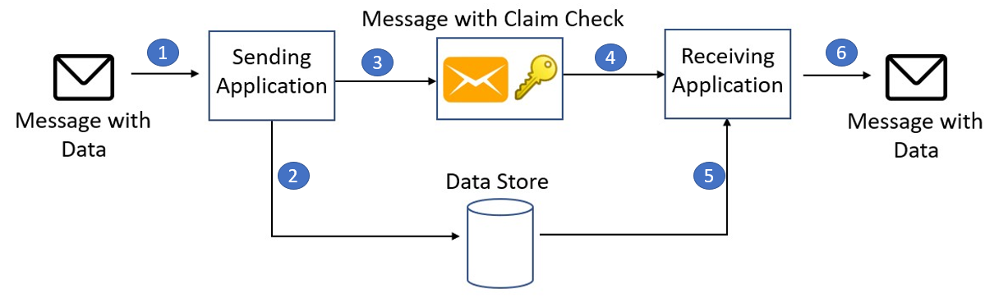

# ‏Claim-Check pattern
یک پیام بزرگ را به یک Claim-Check و یک payload تقسیم کنید. Claim-Check را به پلتفرم پیام رسانی ارسال کنید و payload را در یک سرویس خارجی ذخیره کنید. این الگو اجازه می‌دهد تا پیام‌‌های بزرگ پردازش شوند، در حالی که از  message bus  و client  در برابر پر مشغله شدن (overwhelmed) یا کاهش سرعت محافظت می‌کند. این الگو همچنین به کاهش هزینه‌ها کمک می‌کند، زیرا ذخیره سازی معمولاً ارزان تر از واحد‌های منبع استفاده شده توسط پلت فرم پیام رسانی است.  
  
این الگو به عنوان پیام رسانی Reference-Based نیز شناخته می‌شود و در اصل داخل کتاب الگو‌های یکپارچه سازی سازمانی توسط Gregor Hohpe و Bobby Woolf توضیح داده شده است.

## **زمینه و مشکل**

یک معماری مبتنی بر پیام (messaging-based) در برخی مواقع باید قادر به ارسال، دریافت و دستکاری پیام‌های بزرگ باشد. چنین پیام‌هایی ممکن است حاوی هر چیزی باشد، از جمله تصاویر (به عنوان مثال، اسکن MRI)، فایل‌های صوتی (به عنوان مثال، تماس‌های مرکز تماس)، اسناد متنی، یا هر نوع داده باینری با اندازه دلخواه.  
  
ارسال چنین پیام‌های بزرگ به طور مستقیم به  message busها توصیه نمی‌شود، زیرا آنها نیاز به منابع و پهنای باند بیشتری برای مصرف دارند. پیام‌‌های بزرگ همچنین می‌توانند کل راه‌حل را آهسته کنند، زیرا پلتفرم‌‌های پیام‌رسان معمولاً برای بکار گیری به مقادیر عظیمی از پیام‌‌های کوچک به خوبی تنظیم می‌شوند. همچنین، اکثر پلتفرم‌‌های پیام‌رسان محدودیت‌‌هایی در اندازه پیام دارند، بنابراین ممکن است لازم باشد برای پیام‌‌های بزرگ این محدودیت‌ها را دور بزنید.

## راه حل

همه payload و بار مربوط به پیام را در یک سرویس خارجی مانند پایگاه داده ذخیره کنید. ارجاع به payload ذخیره شده را دریافت کنید و فقط اطلاعات مربوط به آن ارجاع را به  message bus  ارسال کنید. ارجاع مانند Claim-Check‌هایی عمل می‌کند که برای بازیابی یک تکه استفاده می‌شود. client  نیازمند به پردازش آن پیام خاص می‌توانند در صورت نیاز از ارجاع به دست آمده برای بازیابی payload استفاده کنند.



1- پیام فرستادن  
2- ذخیره پیام در  data store  
3- مرجع پیام را در صف قرار دهید  
4- مرجع پیام را بخوانید  
5- پیام را بازیابی کنید  
6- پیام را پردازش کنید

## مسائل و ملاحظات:

هنگام تصمیم گیری در مورد نحوه اجرای این الگو به نکات زیر توجه کنید:  
  
* اگر نیازی به آرشیو کردن پیام‌ها بعد از استفاده از آن را ندارید، پس داده‌‌های پیام را حذف کنید. اگرچه [blob storage](https://en.wikipedia.org/wiki/Object_storage) نسبتاً ارزان است، اما در درازمدت مقداری هزینه دارد، به خصوص اگر داده‌های زیادی وجود داشته باشد. حذف پیام می‌تواند به صورت همزمان توسط برنامه ‌ای که پیام را دریافت و پردازش می‌کند یا به صورت ناهمزمان توسط یک فرآیند اختصاصی جداگانه انجام شود. رویکرد ناهمزمان داده‌‌های قدیمی را بدون تأثیر بر توان عملیاتی و عملکرد پردازش پیام در سمت برنامه کلاینت یا دریافت‌کننده، حذف می‌کند.  
  
* ذخیره و بازیابی پیام باعث ایجاد مقداری سربار و تأخیر اضافی می‌شود. ممکن است بخواهید منطق را در برنامه ارسال کننده پیاده سازی کنید تا از این الگو فقط زمانی استفاده کنید که اندازه پیام از حد داده‌‌های صف پیام یا  message bus  فراتر رود. این الگو برای پیام‌‌های کوچکتر نادیده گرفته می‌شود. این رویکرد منجر به یک الگوی claim-check مشروط می‌شود.

## **چه زمانی از این الگو استفاده کنیم؟**

این الگو را می‌توان هر زمان که پیامی با  قابلیت پیشتیبانی از  محدودیت در پیام‌‌هایی (supported message limit) که در message bus  مورد نظر،  قابلیت اجرا نداشته باشد، استفاده شود. به عنوان مثال، Service Bus در حال حاضر دارای محدودیت 100 مگابایتی (بالاترین سطح) است، در حالی که Event Grid (در پایین در موردEvent Grid بیشتر توضیح داده می‌شود) حداکثر 1 مگابایت پیام را پشتیبانی می‌کند.  
  
این الگو همچنین می‌تواند در حالتی  که payload فقط توسط سرویس‌هایی که مجاز به دیدن آن هستند قابل دسترسی باشد، مورد استفاده قرار گیرد. با تخلیه payload به یک منبع خارجی(external resource)، قوانین authentication و authorization  سخت گیرانه تری را می‌توان وضع کرد تا اطمینان حاصل شود که هنگام ذخیره داده‌‌های حساس در payload، امنیت آن به حد لازم اعمال می‌شود.

## مثال

در Azure می‌توان این الگو را به چند روش و با تکنولوژی‌های مختلف پیاده سازی کرد اما دو دسته اصلی وجود دارد. در هر دو مورد، گیرنده مسئولیت دارد Claim-Check را بخواند و از آن برای بازیابی payload استفاده کند.  
  
*  **تولید claim-check اتوماتیک**. این رویکرد از Azure Event Grid برای تولید خودکار Claim-Check و انتقال دادن آن به  message bus  استفاده می‌کند.  
  
* **تولید Claim-Check  دستی**. در این رویکرد فرستنده مسئولیت مدیریت payload را بر عهده دارد. فرستنده payload را با استفاده از سرویس مناسب ذخیره می‌کند، Claim-Check را دریافت یا تولید می‌کند و Claim-Check را به message bus ارسال می‌کند.  
  
Event Grid یک سرویس مسیریابی رویداد(event routing) است و سعی می‌کند رویدادها را در مدت زمان قابل تنظیم تا 24 ساعت ارائه دهد. پس از آن، رویدادها یا کنار گذاشته می‌شوند یا با حروف مرده(dead lettered) نوشته می‌شوند. اگر نیاز دارید payload‌های مربوط به رویداد را بایگانی کنید یا جریان رویداد( event stream) را دوباره اجرا کنید، می‌توانید اشتراک Event Grid را به Event Hubs یا Queue Storage اضافه کنید، جایی که پیام‌ها را می‌توان برای مدت طولانی‌تری حفظ کرد و بایگانی کردن پیام‌ها پشتیبانی می‌شود. برای اطلاعات در مورد تنظیم دقیق Event Grid message delivery و retry، و پیکربندی حروف مرده(dead letter configuration)، به [Dead letter and retry policies](https://learn.microsoft.com/en-us/azure/event-grid/manage-event-delivery) مراجعه کنید.

### تولید خودکار claim-check  با Blob Storage و Event Grid

در این روش، فرستنده payload پیام را در یک محفظه  Azure Blob Storage مشخص می‌کند. Event Grid به طور خودکار یک برچسب/مرجع  (tag/reference ) تولید می‌کند و آن را به یک  message bus  پشتیبانی شده مانند Azure Storage Queues ارسال می‌کند. گیرنده می‌تواند صف را رای گیری (poll) کند و پیام را دریافت کند و سپس از داده‌های مرجع ذخیره شده برای دانلود مستقیم از Blob Storage استفاده کند.  
  
همان Event Grid message را می‌توان مستقیماً توسط توابع Azure مصرف کرد، بدون اینکه نیازی به عبور از یک  message bus  باشد. این رویکرد از ماهیت serverless هر دوی Event Grid و توابع بهره کامل می‌برد.  
  
شما می‌توانید کد نمونه برای این رویکرد را در [اینجا](https://github.com/mspnp/cloud-design-patterns/tree/master/claim-check/code-samples/sample-1) بیابید.

### Event Grid با Event Hubs

مشابه مثال قبلی، Event Grid به طور خودکار پیامی را هنگامی که یک payload در یک Azure Blob container نوشته می‌شود تولید می‌کند. اما در این مثال،  message bus  با استفاده از Event Hubs پیاده سازی شده است. یک client  می‌تواند خود را ثبت کند تا جریان پیامها را همانطور که در event hub نوشته می‌شود، دریافت کند. event hub همچنین می‌تواند برای آرشیو کردن پیام‌ها پیکربندی شود و آنها را به‌عنوان یک فایل Avro در دسترس قرار دهد که می‌توان با استفاده از ابزار‌هایی مانند Apache Spark، Apache Drill یا هر یک از کتابخانه‌‌های Avro موجود، پرس و جو کرد.  
  
شما می‌توانید کد نمونه برای این رویکرد را در [اینجا](https://github.com/mspnp/cloud-design-patterns/tree/master/claim-check/code-samples/sample-2) بیابید.

### Claim check generation با Service Bus

این راه حل از یک پلاگین Service Bus خاص، `ServiceBus.AttachmentPlugin` بهره می‌برد، که پیاده سازی گردش کار(workflow) مربوط به  claim-check را آسان می‌کند. این افزونه هر پیامی را به یک پیوست تبدیل می‌کند که هنگام ارسال پیام در فضای Azure Blob Storage ذخیره می‌شود.

```csharp
using ServiceBus.AttachmentPlugin;
...

// Getting connection information
var serviceBusConnectionString = Environment.GetEnvironmentVariable("SERVICE_BUS_CONNECTION_STRING");
var queueName = Environment.GetEnvironmentVariable("QUEUE_NAME");
var storageConnectionString = Environment.GetEnvironmentVariable("STORAGE_CONNECTION_STRING");

// Creating config for sending message
var config = new AzureStorageAttachmentConfiguration(storageConnectionString);

// Creating and registering the sender using Service Bus Connection String and Queue Name
var sender = new MessageSender(serviceBusConnectionString, queueName);
sender.RegisterAzureStorageAttachmentPlugin(config);

// Create payload
var payload = new { data = "random data string for testing" };
var serialized = JsonConvert.SerializeObject(payload);
var payloadAsBytes = Encoding.UTF8.GetBytes(serialized);
var message = new Message(payloadAsBytes);

// Send the message
await sender.SendAsync(message);
```

 یک Azure Blob Storage به عنوان یک صف اعلانات (notification queue) عمل می‌کند که client  می‌تواند در آن مشترک (subscribe) شود. هنگامی که مصرف کننده (consumer) پیام را دریافت می‌کند، این افزونه امکان خواندن مستقیم داده‌های پیام را از Blob Storage فراهم می‌کند. سپس می‌توانید نحوه پردازش بقیه پیام را انتخاب کنید. مزیت این رویکرد این است که workflow مربوط به claim-check  را از فرستنده و گیرنده، انتزاع (abstracts) می‌کند.  
  
شما می‌توانید کد نمونه برای این رویکرد را در  [اینجا](https://github.com/mspnp/cloud-design-patterns/tree/master/claim-check/code-samples/sample-3) بیابید.

### تولید  claim-check دستی با Kafka

در این مثال، یک Kafka client که payload را در Azure Blob Storage نوشته شده و سپس یک notification message را با استفاده از [Kafka-enabled Event Hubs](https://learn.microsoft.com/en-us/azure/event-hubs/event-hubs-quickstart-kafka-enabled-event-hubs) را ارسال می‌کند. مصرف کننده (consumer)  پیام را دریافت می‌کند و می‌تواند از Blob Storage به payload دسترسی پیدا کند. این مثال نشان می‌دهد که چگونه می‌توان از یک پروتکل پیام رسانی متفاوت برای پیاده سازی الگوی claim-check در Azure استفاده کرد. به عنوان مثال، ممکن است لازم باشد از client کنونی Kafka حمایت کنید.  
  
شما می‌توانید کد نمونه برای این رویکرد را در [اینجا](https://github.com/mspnp/cloud-design-patterns/tree/master/claim-check/code-samples/sample-4) بیابید.
## قدم بعدی

* نمونه‌هایی که در بالا توضیح داده شد در [GitHub](https://github.com/mspnp/cloud-design-patterns/tree/master/claim-check) موجود هستند.  
* سایت Enterprise Integration Patterns توضیحاتی در مورد این الگو دارد.  
* در مثال دیگر، به [Dealing with large Service Bus messages using claim check pattern](https://www.serverless360.com/blog/deal-with-large-service-bus-messages-using-claim-check-pattern)مراجعه کنید.  
* این یک الگوی جایگزین برای مدیریت پیام‌های بزرگ،  [Split](https://www.enterpriseintegrationpatterns.com/patterns/messaging/Sequencer.html) و [Aggregate](https://www.enterpriseintegrationpatterns.com/patterns/messaging/Aggregator.html) است.  
کتابخانه‌‌هایی مانند NServiceBus با عملکرد  ["data bus" functionality](https://docs.particular.net/nservicebus/messaging/databus/azure-blob-storage) خود از این الگو پشتیبانی می‌کنند.

## منابع مرتبط

- [Asynchronous Request-Reply Pattern](./Asynchronous%20Request-Reply%20pattern.md)
- [Competing Consumers pattern](./Compensating%20Transaction%20pattern.md)
- [Sequential Convoy pattern](./Sequential%20Convoy%20pattern.md)

