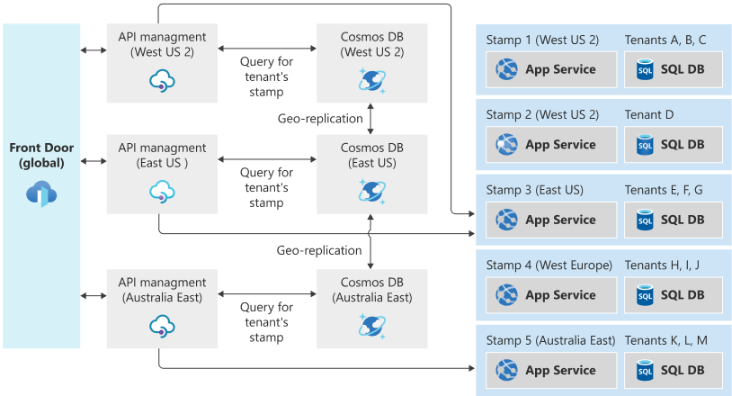

الگوی Deployment Stamps  شامل، مدیریت و نظارت یا مانیتورینگ بر یک گروه ناهمگن از منابع برای میزبانی و بهره برداری از workloadها یا tenantهای متعدد است. هر کپی منفرد یک _stamp_ یا  یک _service unit_, _scale unit_ یا _cell_ نامیده می‌شود. در یک محیط  دارای چند tenant، هر واحد stamp یا scale می‌تواند به تعداد از پیش تعریف‌شده tenant سرویس دهی کند . از stampهای  مختلفی می‌توان استفاده کرد تا راه حل‌های مورد نظر را ساده‌تر کند و به تعداد زیادی از tenant آن سرویس دهی کند. این رویکرد می‌تواند مقیاس‌پذیری (scalability) راه‌حل شما را بهبود بخشد و به شما این امکان را می‌دهد که نمونه‌هایی از برنامه را در چندین منطقه مستقر کنید و داده‌های مشتری‌های خود را جداسازی کنید.

## **طرح صورت مسئله:**

هنگام میزبانی (hosting) یک برنامه در فضای ابری معمولا ملاحظات خاصی وجود دارد. یکی از نکات کلیدی که باید در نظر داشته باشید عملکرد مناسب و قابلیت اطمینان برنامه شما است. اگر یک نمونه از راه حل‌های مورد نظر خود را میزبانی می‌کنید، شاید مواجه با محدودیتهای زیر شوید:  
  
*  **محدودیت‌های مقیاس دهی (Scale limits)**.  مستقر کردن یک نمونه از برنامه شما ممکن است منجر به محدودیتهای مقیاس دهی (scaling) به صورت طبیعی شود. برای مثال، ممکن است از سرویس هایی استفاده کنید که محدودیت هایی در تعداد اتصالات ورودی، نام دامنه، سوکتهای TCP یا منابع دیگر دارند.  
* **مقیاس بندی غیر خطی یا افزایش هزینه‌ها.** برخی از مؤلفه‌های مورد نظر شما ممکن است scale خطی نداشته باشند و با افزایش تعداد request‌ها یا  دادهها این احتمال افزایش یابد. همینطور، زمانی که شرط‌های یک آستانه خاصی برآورده شود این احتمال وجود دارد که کاهش ناگهانی در کارایی برنامه یا افزایش هزینه‌ها وجود داشته باشد. برای مثال، ممکن است از یک پایگاه داده استفاده کنید و متوجه شوید که هزینه نهایی اضافه کردن ظرفیت بیشتر (scaling up) گران‌تر می‌شود و استراتژی کاهش مقیاس‌دهی( scaling out)  راه حل مقرون‌ به‌ صرفه‌تری است.  
* **جداسازی مشتریان (Separation of customers)**. ممکن است لازم باشد داده‌های مشتریان خاص را از داده‌های مشتریان دیگر جدا نگه دارید. به طور مشابه، ممکن است مشتریانی داشته باشید که به منابع سیستم بیشتری نسبت به سایرین نیاز دارند و آنها را در زیرساختهای مختلف گروه بندی کنید.  
* **رسیدگی به موارد تک و چند tenant ای.** ممکن است مشتریان بزرگی داشته باشید که به نمونههای مستقل خود از راه حل شما نیاز دارند. همچنین ممکن است مجموعه ای از مشتریان کوچکتر داشته باشید که می‌توانند یک deployment چند tenant را به اشتراک بگذارند. 
* **الزامات deployment پیچیده.** ممکن است لازم باشد به‌روزرسانی‌ها را به شیوه‌ای کنترل‌شده در سرویس خود اجرا کنید و در زمان‌های مختلف در زیرمجموعه‌های مختلف زیرساخت‌های مربوط مشتریان خود مستقر کنید.  
* **فرکانس به روز رسانی Update frequency** ممکن است مشتریانی داشته باشید که به‌روزرسانی‌های مکرر سیستم شما را تحمل می‌کنند، در حالی که برخی دیگر ممکن است ریسک گریز باشند و بخواهند سیستمی که درخواست‌هایشان را پاسخ می‌دهد به‌روزرسانی‌های نادری انجام شود. ممکن است منطقی باشد که این مشتریان در محیطهای ایزوله مستقر شوند.  
* **محدودیتهای جغرافیایی یا ژئوپلیتیکی.** برای داشتن یک معماری با تاخیر کم و سرعت مناسب یا رعایت الزامات حاکمیت داده(data sovereignty)، ممکن است برخی از مشتریان خود را در مناطق خاصی مستقر یا deploy کنید.

این محدودیت‌ها اغلب برای فروشندگان نرم‌افزار مستقل independent software vendors (ISVs) که نرم‌افزار را به‌عنوان سرویس (SaaS) می‌سازند، که اغلب برای چند tenant بودن طراحی می‌شوند، اعمال می‌شود. با این حال، همین محدودیتها می‌تواند برای سناریوهای دیگر نیز اعمال شود.

## راه حل

برای جلوگیری از این مسائل، منابع را در واحدهای مقیاس‌ دهی یا _scale unitها_ گروه بندی کنید و چندین نسخه از _stampهای_ خود تهیه کنید. هر scale unit میزبان زیرمجموعه ای از tenantهای شما خواهد بود و به آنها سرویس‌دهی می‌کند. stampها مستقل از یکدیگر عمل می‌کنند و می‌توانند به طور مستقل deploy و update شوند. یک منطقه جغرافیایی منفرد ممکن است حاوی یک یا چندین stamp باشد تا امکان کاهش مقیاس دهی افقی(horizontal scale-out) در داخل منطقه را فراهم کند. stampها شامل زیرمجموعه ای از مشتریان شما هستند.


گزینه Deployment stamps   چه در حالت  استفاده از infrastructure as a service (IaaS) یا ‏‏‏platform as a service (Paas)‏ یا حالتهای ترکیبی از این دو به کار می‌رود. معمولاً workload مورد استفاده در IaaS نیاز به دستکاری بیشتری برای scale دارند، بنابراین این الگو ممکن است برای workloadهای سنگین در IaaS مفید باشد تا امکان کاهش مقیاس (scaling out) را فراهم کند.  
  
از stampها می‌توان برای اجرای حلقههای ([deployment rings](https://learn.microsoft.com/en-us/azure/devops/migrate/phase-rollout-with-rings)) استفاده کرد. اگر مشتریان مختلف بخواهند به‌روزرسانی‌های سرویس‌ها را در زمان‌های مختلف دریافت کنند، می‌توان آن‌ها را در stampهای مختلف گروه‌بندی کرد و هر stamp می‌تواند به‌روزرسانی‌هایی را در وزن‌های متفاوتی داشته باشد.  
  
از آنجا که stampها به طور مستقل از یکدیگر اجرا می‌شوند، دادهها به طور ضمنی خرد(_shard_) می‌شوند. علاوه بر این، یک stamp می‌تواند از _shard_ شدن بیشتر داده‌ها استفاده کند تا به صورت داخلی امکان مقیاس‌پذیری و elasticity درون stamp را فراهم کند.  
  
الگوی deployment stamp  به صورت داخلی توسط بسیاری از سرویس‌های Azure از جمله App Service، Azure Stack و Azure Storage استفاده می‌شود.  
  
‏Deployment stamps  با اینکه مربوط به [geodes](https://learn.microsoft.com/en-us/azure/architecture/patterns/geodes) هستند، اما متمایز از  آنها نیز هستند. در معماری Deployment stamps، چندین نمونه مستقل از سیستم شما Deploy می‌شوند که شامل زیرمجموعه ای از مشتریان و کاربران شما هستند. در  [geodes](https://learn.microsoft.com/en-us/azure/architecture/patterns/geodes)، همه نمونه‌ها می‌توانند درخواست‌های هر کاربر را ارائه دهند، اما این معماری اغلب برای طراحی و ساخت پیچیده‌تر است. همچنین ممکن است ترکیب دو الگو را در یک محلول در نظر بگیرید. رویکرد مسیریابی ترافیک که در زیر توضیح داده شده است نمونه ای از چنین سناریوی ترکیبی است.

### Deployment

به دلیل پیچیدگی که در deployment کپی‌های یکسان از اجزای یکسان وجود دارد، اقدامات خوب یک متخصص DevOps برای اطمینان از موفقیت در اجرای این الگو بسیار مهم است. در نظر بگیرید که زیرساخت خود را به صورت کد و اسکریپت‌ها توصیف کنید، مانند استفاده از قالب‌های[Bicep](https://learn.microsoft.com/en-us/azure/azure-resource-manager/bicep/overview), [JSON Azure Resource Manager templates (ARM templates)](https://learn.microsoft.com/en-us/azure/azure-resource-manager/template-deployment-overview), [Terraform](https://learn.microsoft.com/en-us/azure/developer/terraform/overview) . با این رویکرد، می‌توانید اطمینان حاصل کنید که deployment هر stamp قابل پیش بینی و تکرار است. همچنین احتمال خطاهای انسانی مانند عدم تطابق تصادفی در پیکربندی بین stampها را کاهش می‌دهد.  
  
می‌توانید به‌روزرسانی‌ها را به‌طور خودکار برای همه stampها به صورت موازی اجرا کنید، در این صورت ممکن است فناوری‌هایی مانند الگوهای [Bicep](https://learn.microsoft.com/en-us/azure/azure-resource-manager/bicep/overview) یا Resource Manager را برای هماهنگ کردن deployment زیرساخت‌ها و برنامه‌های کاربردی خود در نظر بگیرید. از طرف دیگر، ممکن است تصمیم بگیرید ابتدا به‌روزرسانی‌ها را برای برخی از stampها و سپس به تدریج برای برخی دیگر به‌روزرسانی کنید. استفاده از یک ابزار مدیریت انتشار(release management) مانند [Azure Pipelines](https://azure.microsoft.com/services/devops/pipelines/) یا  [GitHub Actions](https://docs.github.com/actions) را برای هماهنگ کردن Deploymentها در هر stamp در نظر بگیرید. برای اطلاعات بیشتر:

- ‏[Integrate Bicep with Azure Pipelines](https://learn.microsoft.com/en-us/azure/azure-resource-manager/bicep/add-template-to-azure-pipelines)
- ‏[Integrate JSON ARM templates with Azure Pipelines](https://learn.microsoft.com/en-us/azure/azure-resource-manager/templates/add-template-to-azure-pipelines)

توپولوژی اشتراک‌های (subscriptions) در مورد Azure و resource groups را برای deployment خود با دقت در نظر بگیرید:  
  
* به طور معمول یک اشتراک(subscription) شامل کلیه منابع برای یک راه حل واحد خواهد بود، بنابراین به طور کلی استفاده از یک اشتراک واحد برای همه stampها را در نظر بگیرید. با این حال، برخی از سرویس‌های Azure سهمیه‌های گسترده ای را تحمیل ([Azure services impose subscription-wide quotas](https://learn.microsoft.com/en-us/azure/azure-subscription-service-limits)) می‌کنند، بنابراین اگر از این الگوی استفاده می‌کنید تا درجه بالایی از مقیاس را فراهم کنید، ممکن است لازم باشد که stampها را در اشتراک‌های مختلف در نظر بگیرید.  
* ‏Resource groupها به طور کلی برای deployment اجزای مختلف با  چرخه عمر مشخص استفاده می‌شوند. اگر قصد دارید به طور همزمان به روزرسانی‌ها را برای همه stampهای خود deploy کنید، استفاده از یک منبع گروهی منفرد (single resource group) را در نظر بگیرید تا تمام اجزای مختلف  را برای همه stampهای خود داشته باشید و از قراردادها و برچسبهای نامگذاری منابع استفاده کنید تا مؤلفه هایی را که متعلق به هر stamp هستند، شناسایی کنید. از طرف دیگر، اگر قصد دارید به روزرسانیهای هر stamp را به طور مستقل مستقر کنید، در نظر بگیرید که هر stamp را در resource group خود deploy کنید.


### برنامه‌ریزی ظرفیت

از آزمایش‌های مربوط به load و کارایی برنامه برای تعیین تقریبی load  که یک stamp معین می‌تواند تحمل کند، استفاده کنید. متریک‌های مربوط به  load ممکن است بر اساس تعداد customers/tenant هایی باشد که یک stamp می‌تواند در خود جای دهد یا متریک‌های مربوط به سرویس‌هایی که اجزای درونی stamp منتشر می‌کنند. اطمینان حاصل کنید که ابزار کافی برای اندازه گیری زمانی که یک stamp به ظرفیت نهایی خود نزدیک شده است به همراه توانایی deployment سریع stampهای جدید برای پاسخگویی به تقاضا را دارید.

### مسیریابی ترافیک

الگوی Deployment Stamp اگر به هر stamp به طور مستقل پرداخته شود، به خوبی کار می‌کند. به عنوان مثال، اگر شرکتی خاص مثلا شرکت [Contoso](https://learn.microsoft.com/en-us/microsoft-365/enterprise/contoso-overview?view=o365-worldwide)  یک برنامه API یکسان را در چند stamp deploy کند، ممکن است استفاده از DNS را برای هدایت ترافیک به stamp مربوطه در نظر بگیرد:  
  
* ‏`unit1.aus.myapi.contoso.com` ترافیک را به سمت `stamp unit1` در یک منطقه استرالیا هدایت می‌کند.  
* ‏`unit2.aus.myapi.contoso.com` ترافیک را به سمت `stamp unit2` در یک منطقه استرالیا هدایت می‌کند.  
* `‏unit1.eu.myapi.contoso.com` ترافیک را به سمت `stamp unit1` در یک منطقه اروپایی هدایت می‌کند.  
سپس مشتریان مسئول اتصال به stamp صحیح هستند.  
  
اگر یک نقطه ورودی (ingress) یکسان برای تمام ترافیک عبوری مورد نیاز باشد، می‌توان از سرویس مسیریابی ترافیک(traffic routing) برای رفع stamp مربوط به request، مشتری یا tenant استفاده کرد. سرویس مسیریابی ترافیک، مشتری را به URL مربوطه برای stamp هدایت می‌کند (به عنوان مثال، با استفاده از کد وضعیت پاسخ HTTP 302) یا ممکن است به عنوان یک پروکسی معکوس(reverse proxy) عمل کرده و ترافیک را بدون اطلاع مشتری به stamp مربوطه ارسال کند.  
  
یک سرویس مسیریابی ترافیک متمرکز می‌تواند جزء پیچیده ای برای طراحی باشد، به خصوص زمانی که یک راه حل در چندین منطقه اجرا می‌شود. مستقر کردن سرویس مسیریابی ترافیک را در چندین منطقه در نظر بگیرید (به طور بالقوه شامل هر منطقه ای که stampها در آن مستقر شده‌اند) و سپس اطمینان حاصل کنید که ذخیره داده (نگاشت tenant به stamp) به طور مناسبی هماهنگ‌سازی(synchronized) شده است. مولفه مسیریابی ترافیک ممکن است خود نمونه‌ای از الگوی [geode](https://learn.microsoft.com/en-us/azure/architecture/patterns/geodes) باشد.  
  
به عنوان مثال، [Azure API Management](https://learn.microsoft.com/en-us/azure/api-management/) می‌تواند برای عمل در نقش سرویس مسیریابی ترافیک deploy شود. این گزینه می‌تواند با جستجوی داده‌ها در مجموعه [Azure Cosmos DB](https://learn.microsoft.com/en-us/azure/cosmos-db)که نگاشت(mapping) بین tenantها و stampها را ذخیره می‌کند و در نتیجه stamp مناسب را برای درخواست کردن تعیین کند. سپس API Management می‌تواند به صورت پویا URL بک‌اند( [dynamically set the back-end URL](https://learn.microsoft.com/en-us/azure/api-management/api-management-transformation-policies#SetBackendService)) را روی سرویس API stamp مربوطه تنظیم کند.  
  
برای فعال کردن توزیع جغرافیایی (geo-distribution) درخواست‌ها و افزونگی جغرافیایی(geo-redundancy) سرویس مسیریابی ترافیک، API Management را می‌توان در چندین منطقه deploy کرد یا از [Azure Front Door](https://learn.microsoft.com/en-us/azure/frontdoor/) برای هدایت ترافیک به نزدیک‌ترین نمونه(instance) استفاده کرد. Front Door را می‌توان با یک [backend pool](https://learn.microsoft.com/en-us/azure/frontdoor/front-door-backend-pool#backend-pools) پیکربندی کرد و درخواست‌ها را به نزدیک‌ترین نمونه API Management موجود هدایت کرد. اگر برنامه شما از طریق HTTP/S نمایش یا در معرض قرار  داده نمی‌شود، می‌توانید از متعادل‌کننده بار Azure بین منطقه‌ای([cross-region Azure Load Balancer](https://learn.microsoft.com/en-us/azure/load-balancer/cross-region-overview)) برای توزیع تماس‌های دریافتی بین Azure Load Balancer منطقه‌ای استفاده کنید. از ویژگی[global distribution feature of Azure Cosmos DB](https://learn.microsoft.com/en-us/azure/cosmos-db/distribute-data-globally) می‌توان برای به روز نگه داشتن اطلاعات نگاشت شده(mapping) در هر منطقه استفاده کرد.  
  
اگر یک سرویس مسیریابی ترافیک(traffic-routing) در راه حل مورد استفاده شما گنجانده شده است حتما در نظر بگیرید که آیا به عنوان یک [gateway](https://learn.microsoft.com/en-us/azure/architecture/patterns/gateway-routing) عمل می‌کند؟  بنابراین می‌تواند ([gateway offloading](https://learn.microsoft.com/en-us/azure/architecture/patterns/gateway-offloading)) را برای سرویسهای دیگری مانند authorization، throttling و validation انجام دهد.

#### نمونه معماری مسیریابی ترافیک

نمونه زیر معماری مسیریابی ترافیک زیر را در نظر بگیرید که از Azure Front Door، Azure API Management و Azure Cosmos DB برای مسیریابی ترافیک جهانی و سپس یک سری از stampهای خاص منطقه استفاده می‌کند:



فرض کنید یک کاربر به طور معمول در نیویورک زندگی می‌کند. دادههای آنها در stamp 3، در منطقه شرق ایالات متحده ذخیره می‌شود.  
  
اگر کاربر به کالیفرنیا سفر کند و سپس به سیستم دسترسی پیدا کند، احتمالاً ارتباط آنها از طریق منطقه West US 2 انجام می‌شود زیرا در هنگام درخواست(request)، این منطقه از نظر جغرافیایی نزدیکترین مکان است. با این حال، درخواست در نهایت باید با stamp 3 ارائه شود، زیرا دادههای آنها در آنجا ذخیره می‌شود. سیستم مسیریابی ترافیک، اطمینان حاصل می‌کند که درخواست به stamp صحیح هدایت می‌شود.

## مسائل و ملاحظات

هنگام تصمیم گیری در مورد نحوه اجرای این الگو باید نکات زیر را در نظر بگیرید:  
  
* **فرآبندهای ‏Deployment**. هنگام مستقر کردن چندین stamp، بسیار توصیه می‌شود که فرآیندهای deployment خودکار و کاملاً تکرار شونده داشته باشید. استفاده از [Bicep](https://learn.microsoft.com/en-us/azure/azure-resource-manager/bicep/overview), [JSON ARM templates](https://learn.microsoft.com/en-us/azure/azure-resource-manager/templates/overview)یا ماژول‌های [Terraform](https://learn.microsoft.com/en-us/azure/developer/terraform/overview) را در نظر بگیرید تا stamp را به صورت ثابت تعریف کنید.  
* **عملیات ‏Cross-stamp**. هنگامی که راه حل شما به طور مستقل در چندین stamp،‏ مستقر می‌شود، سؤالاتی مانند: «چند مشتری در تمام stampهایمان داریم؟» پاسخ دادن را می‌تواند پیچیده‌تر شود. ممکن است لازم باشد پرس و جوها در مقابل هر stamp اجرا شوند و نتیجه‌ها یک پارچه شوند. همینطور، در نظر بگیرید که تمام stampها دادهها را در یک انبار داده(data warehouse) متمرکز برای گزارش  منتشر کنند.  
* **تعیین خط مشیهای ‏ scale-out**.  معمولا ‏stampها ظرفیت محدودی دارند که ممکن است با استفاده از یک متریک یا معیار پراکسی مانند تعدادی tenantهایی که می‌توانند روی stamp،‏ مستقر شوند، تعریف شود. نظارت بر ظرفیت موجود و ظرفیت مورد استفاده برای هر stamp و به کارگیری فعال stampهای اضافی برای اجازه دادن به فعالیت tenantهای جدید که به سمت آنها هدایت شود بسیار مهم است.  
* **حداقل‏ stampها**. هنگامی که از الگوی Deployment Stamp استفاده می‌کنید، توصیه می‌شود حداقل دو stamp از راه حل مورد نظر خود را مستقر کنید. اگر فقط یک stamp را به کار می‌گیرید، به راحتی می‌توانید مفروضاتی را به‌طور تصادفی در کد یا پیکربندی خود hard-code کنید که در زمان scale out اعمال و اجرا نمی‌شوند.  
* **هزینه**. الگوی Deployment Stamp شامل استقرار چندین نسخه از مؤلفه زیرساخت شما است که احتمالاً شامل افزایش قابل توجهی در هزینه راه‌حل مورد نظر شما خواهد بود.  
* **حرکت بین stampها.** از آنجایی که هر stamp به طور مستقل مستقر شده و کار می‌کند، جابجایی tenantها بین stampها می‌تواند دشوار باشد. برنامه شما به منطق سفارشی نیاز دارد تا اطلاعات مربوط به یک مشتری خاص را به stamp دیگری منتقل کند و سپس اطلاعات tenant را از stamp اصلی حذف کند. این فرآیند ممکن است به یک صفحه پشتی(backplane) برای ارتباط بین stampها نیاز داشته باشد که پیچیدگی راه حل کلی را بیشتر می‌کند.  
* **‏مسیر یابی**. همانطور که در بالا توضیح داده شد، مسیریابی ترافیکی به stamp صحیح برای یک درخواست معین می‌تواند به یک مؤلفه اضافی برای حل و فصل tenantها به stampها نیاز داشته باشد. این مؤلفه، به نوبه خود، ممکن است نیاز داشته باشد که به شدت قابل دسترس (highly available) باشد.  
* **اجزای مشترک(Shared components).** ممکن است اجزایی داشته باشید که بتوان آنها را در stampها به اشتراک گذاشت. به عنوان مثال، اگر یک برنامه تک صفحه ای مشترک(shared single-page app) برای همه tenantها دارید، آن را در یک منطقه deploy کنید و از  [Azure CDN](https://learn.microsoft.com/en-us/azure/storage/blobs/storage-blob-static-website) برای تکرار آن در سطح جهانی استفاده کنید.


## **چه زمانی از این الگو استفاده کنیم؟**

این الگو زمانی مفید است که:  
  
* **محدودیتهای طبیعی در مقیاس پذیری.** به عنوان مثال، اگر برخی از مؤلفه‌ها نمی‌توانند یا نباید از تعداد معینی مشتری یا درخواست به مقدار بیشتری scale شوند پس بهتر است با استفاده از stampها گزینه scaling out را در نظر بگیرید.  
* **الزامی برای جداسازی برخی tenantها از دیگران**. اگر مشتریانی دارید که به دلیل نگرانی‌های امنیتی نمی‌توانند در یک stamp چند tenant ای با مشتریان دیگر مستقر شوند، می‌توانند روی stamp جدا شده خودشان مستقر شوند.  
* نیاز به داشتن چند tenant در نسخههای مختلف، به طور همزمان.  
* برنامههای با قابلیت اجرای چند منطقه ای که در آن دادهها و ترافیک هر tenant باید به یک منطقه خاص هدایت شود.  
* دستیابی به انعطاف پذیری در هنگام خاموشی یا قطع برق (outages). از آنجایی که stampها مستقل از یکدیگر هستند، اگر قطعی یک stamp را تحت تأثیر قرار دهد، tenantها که در stampهای دیگر deploy شده‌اند نباید تحت تأثیر قرار گیرند. این جداسازی به مهار «شعاع انفجار(blast radius)» یک حادثه یا قطعی برق/خاموشی کمک می‌کند.  

این الگو برای موارد زیر مناسب نیست:  
  
* راه حلهای ساده ای که نیازی به مقیاس‌دهی یا scale در درجه بالایی ندارند.  
* سیستم هایی که می‌توانند به راحتی در یک نمونه ساده scaled out یا  scaled up شوند، مانند افزایش اندازه لایه برنامه یا با افزایش ظرفیت رزرو شده برای پایگاههای داده و لایه ذخیره سازی.  
* راه حل هایی که در آن دادهها باید در تمام نمونههای مستقر شده تکرار شوند. الگوی  [geode](https://learn.microsoft.com/en-us/azure/architecture/patterns/geodes) را برای این سناریو در نظر بگیرید.  
* راه حل هایی که در آنها فقط برخی از مؤلفهها باید scale شوند، اما برخی دیگر نه. به عنوان مثال، در نظر بگیرید که آیا راه‌حل شما می‌تواند با  [sharding data store](https://learn.microsoft.com/en-us/azure/architecture/patterns/sharding) به جای استقرار یک کپی جدید از تمام اجزای راه حل، مقیاس‌دهی شود.  
* راه حل‌های موجود برای محتوای استاتیک یا ثابت، مانند یک برنامه JavaScript از نوع front-end تشکیل شده‌اند. برای ذخیره چنین محتوایی در یک [storage account](https://learn.microsoft.com/en-us/azure/storage/blobs/storage-blob-static-website) و استفاده از [Azure CDN](https://learn.microsoft.com/en-us/azure/storage/blobs/storage-blob-static-website) را در نظر بگیرید.

## تکنولوژی‌های مورد استفاده

* به عنوان مثال Infrastructure as code  مواردی مثلResource Manager templates Bicep، Manager، Azure CLI، Terraform، PowerShell، Bash را می‌توان استفاده کرد.  
* ‏Azure Front Door که می‌تواند ترافیک را به یک stamp خاص یا به یک سرویس مسیریابی ترافیک هدایت کند.

## مثال

مثال زیر چندین stamp از یک راه حل ساده PaaS را با یک سرویس app و یک پایگاه داده SQL در هر stamp ،‏ مستقر می‌کند. در حالی که stampها را می‌توان در هر منطقه ای پیکربندی کرد که از سرویس‌های مستقر شده در الگوی مورد نظر پشتیبانی می‌کند. به منظور  تصور بهتر، این الگو دو stamp را در منطقه 2 در غرب آمریکا و یک stamp دیگر را در منطقه غرب اروپا مستقر می‌کند. در داخل یک stamp، سرویس برنامه نام میزبان DNS عمومی خود را دریافت می‌کند و می‌تواند اتصالات را مستقل از سایر stampها دریافت کند.

```
هشدار  
  
مثال زیر از SQL Server administrator account استفاده می‌کند. به طور کلی استفاده از یک حساب کاربری مدیریتی از برنامه شما کار خوبی نیست. برای یک برنامه واقعی، از یک احراز هویت مدیریت شده برای اتصال از برنامه خود به [پایگاه داده SQL استفاده]([database](https://learn.microsoft.com/en-us/azure/app-service/app-service-web-tutorial-connect-msi)) کرده یا از یک حساب با حداقل دسترسی استفاده کنید.
```

برای deployment این راه حل روی لینک زیر کلیک کنید.
[](https://portal.azure.com/#create/Microsoft.Template/uri/https%3A%2F%2Fraw.githubusercontent.com%2Fmspnp%2Fsolution-architectures%2Fmaster%2Fapps%2Fdeployment-stamp%2Fdeployment-stamp.json)


```
توجه داشته باشید  
  
روش‌های جایگزینی برای deployment stampها با الگوی Resource Manager وجود دارد، از جمله استفاده از [الگوهای تودرتو]([nested templates](https://learn.microsoft.com/en-us/azure/azure-resource-manager/resource-group-linked-templates#nested-template)) یا [الگوهای پیوندی](https://learn.microsoft.com/en-us/azure/azure-resource-manager/resource-group-linked-templates#linked-template) برای جدا کردن مشخصات هر stamp از تکرار مورد نیاز برای مستقر کردن چندین نسخه از برنامه استفاده کنید.
```

### Example traffic routing approach

مثال زیر پیاده سازی راه حل مسیریابی ترافیک (traffic routing) را به کار می‌گیرد که می‌تواند با مجموعه ای از stampهای مستقر شده برای یک برنامه API فرضی استفاده شود. برای اجازه دادن به توزیع جغرافیایی درخواست‌های دریافتی، سرویس Front Door در کنار چندین نمونه از API Management در لایه مربوط به مصرف کننده deploy می‌شود. هر نمونه API Management شناسه tenant را از request URL می‌خواند و سپس stamp مربوط به request را از یک Azure Cosmos DB data store با توزیع جغرافیایی جستجو می‌کند. سپس درخواست به stamp پشتیبان مربوطه ارسال می‌شود.  
  
برای deployment راه حل بالا روی لینک زیر کلیک کنید.
[](https://portal.azure.com/#create/Microsoft.Template/uri/https%3A%2F%2Fraw.githubusercontent.com%2Fmspnp%2Fsolution-architectures%2Fmaster%2Fapps%2Fdeployment-stamp%2Ftraffic-routing.json)

## مشارکت کنندگان

این مقاله توسط مایکروسافت نگهداری می‌شود. در اصل توسط مشارکت کنندگان زیر نوشته شده است.

Principal author:

- [John Downs](http://linkedin.com/in/john-downs) | Principal Customer Engineer, FastTrack for Azure

Other contributors:

- [Daniel Larsen](http://linkedin.com/in/daniellarsennz) | Principal Customer Engineer, FastTrack for Azure
- [Angel Lopez](http://linkedin.com/in/iangellopez) | Senior Software Engineer, Azure Patterns and Practices
- [Paolo Salvatori](http://linkedin.com/in/paolo-salvatori) | Principal Customer Engineer, FastTrack for Azure
- [Arsen Vladimirskiy](http://linkedin.com/in/arsenv) | Principal Customer Engineer, FastTrack for Azure

_To see non-public LinkedIn profiles, sign in to LinkedIn._

## منابع مرتبط 

* الگوی ‏Sharding می‌تواند به عنوان یک روش ساده برای scale out لایه مربوط به داده‌های شما استفاده شود. stampها به طور ضمنی دادههای خود را shard می‌کنند، هر چند الگوی Sharding  نیازی به الگوی Deployment Stamp ندارد. برای اطلاعات بیشتر، الگوی Sharding را ببینید. 

* اگر یک سرویس مسیریابی ترافیک deploy شود، الگوهای [Gateway Routing](https://learn.microsoft.com/en-us/azure/architecture/patterns/gateway-routing) و [Gateway Offloading](https://learn.microsoft.com/en-us/azure/architecture/patterns/gateway-offloading) می‌توانند با هم استفاده شوند تا بهترین استفاده را از این مؤلفه داشته باشند.