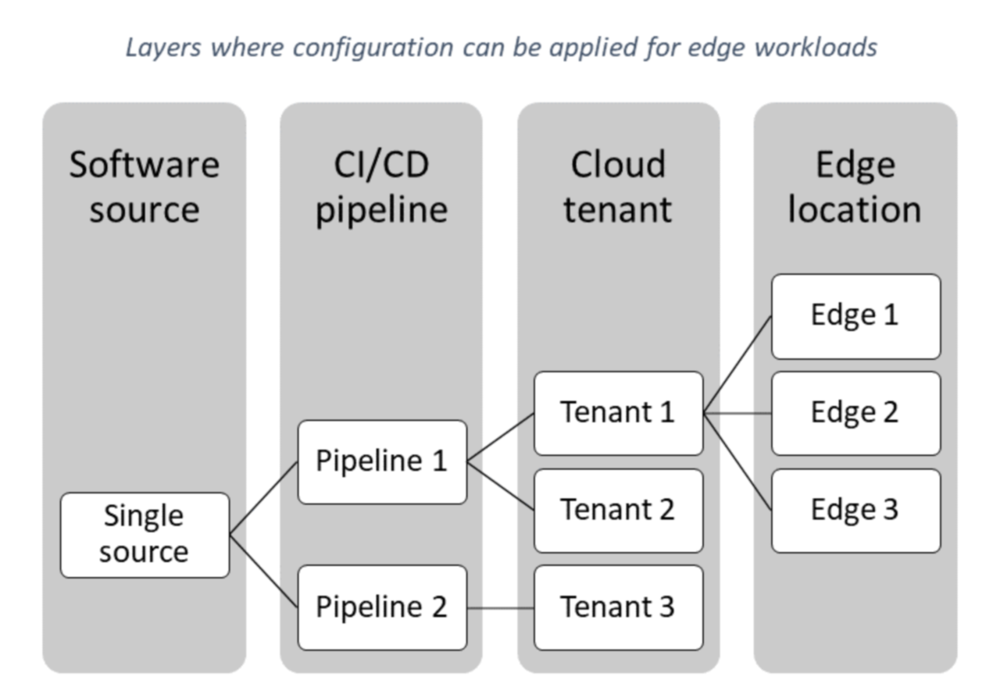
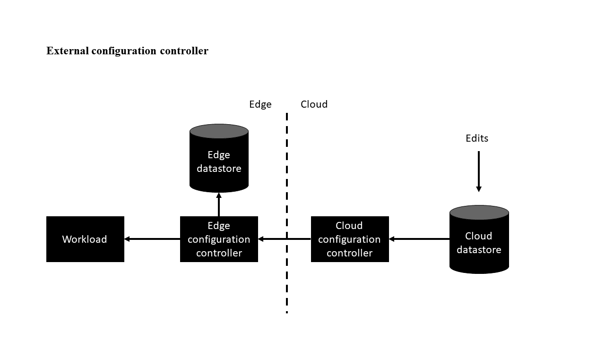
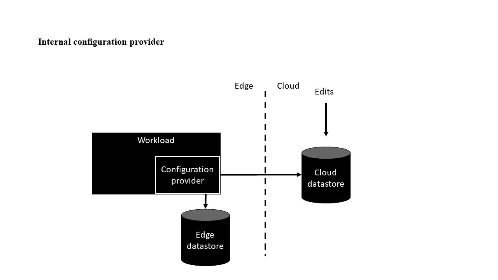
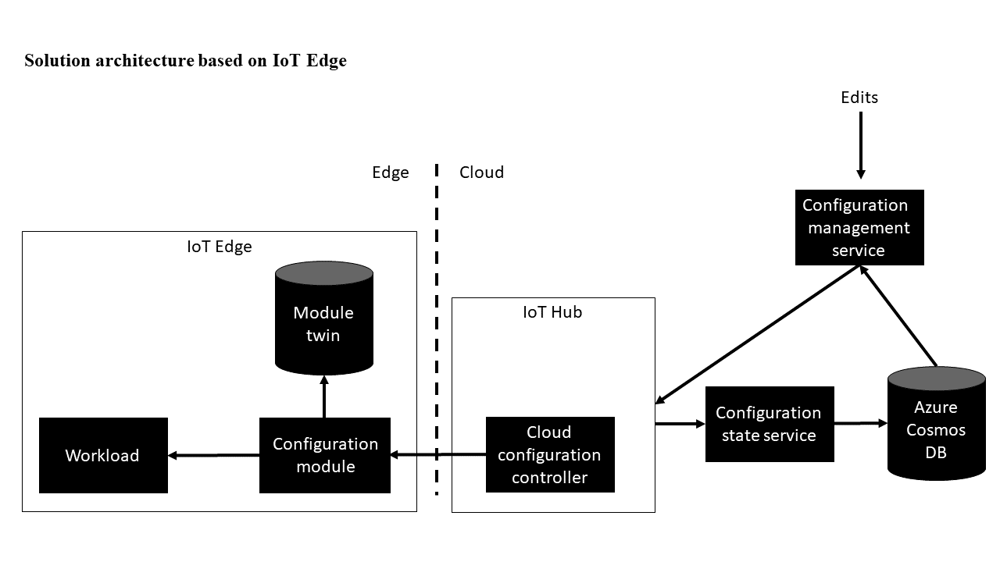

# ‏Edge Workload Configuration pattern

تنوع زیاد سیستمها و دستگاه‌ها در محیط تولیدی می‌تواند پیکربندی workload را به یک مشکل دشوار تبدیل کند. این مقاله روش هایی برای حل آن ارائه می‌دهد.

## **طرح صورت مسئله:**

شرکتهای تولیدی، به عنوان بخشی از سفر مهاجرت به دنیای دیجیتال خود، به طور فزاینده ای بر ساخت راه حلهای نرم افزاری تمرکز می‌کنند که می‌توانند به عنوان قابلیتهای مشترک مورد استفاده مجدد قرار گیرند. با توجه به انواع دستگاه‌ها و سیستمها در طبقه فروشگاه، بارهای کاری(workload) ماژولار برای پشتیبانی از پروتکل ها، درایورها و فرمتهای مختلف داده پیکربندی شده‌اند. گاهی اوقات حتی چندین نمونه از یک workload با پیکربندیهای مختلف در یک مکان لبه(edge location) اجرا می‌شوند. برای برخی از workloadها، پیکربندیها بیش از یک بار در روز به روزرسانی می‌شوند. بنابراین، مدیریت پیکربندی به طور فزاینده‌ای برای مقیاس‌بندی  به صورت scaling out  راه‌حل‌های  مربوط به لبه (edge) اهمیت دارد.

## راه حل

چند ویژگی مشترک مدیریت پیکربندی برای workloadها لبه وجود دارد:

*‏ چندین مدیریت پیکربندی وجود دارد که می‌توان آنها را در لایه‌های مجزا دسته‌بندی کرد، مانند:

*‏ software source

*‏ CI/CD pipeline

*‏ cloud tenant

*‏ edge location

*‏ لایه‌های مختلف می‌تواند توسط افراد مختلف به روزرسانی شود.  

*‏ مهم نیست که چگونه پیکربندی‌ها به روزرسانی می‌شوند، آن‌ها باید به دقت ردیابی و ممیزی شوند.  

*‏ برای تداوم کسب و کار تجاری، لازم است که به  تنظیمات در لبه به صورت آفلاین دسترسی داشت. 

*‏ همچنین لازم است که یک نمای کلی از تنظیمات موجود در فضای ابری وجود داشته باشد.

## مسائل و ملاحظات:

هنگام تصمیم گیری در مورد نحوه اجرای این الگوی، نکات زیر را در نظر بگیرید:  
  
*‏ مجوز ویرایش‌ در صورتی که اتصال لبه (edge) به ابر برقرار نیست، پیچیدگی مدیریت پیکربندی را به میزان قابل توجهی افزایش می‌دهد. تکرار تغییرات در ابر امکان پذیر است، اما چالش هایی به صورت زیر دارد:

	*‏ احراز هویت کاربر (authentication)، زیرا به یک سرویس ابری مانند Microsoft Entra ID وابسته  است.  

	*‏ تضاد و تداخل پس از اتصال مجدد(reconnection) ، اگر workloadها تنظیمات غیر منتظره‌ای را  که نیاز به دستکاری دارند را دریافت می‌کنند.    

*‏ اگر توپولوژی مطابق با الزامات [ISA-95](https://en.wikipedia.org/wiki/ANSI/ISA-95) باشد، محیط لبه می‌تواند محدودیتهای مرتبط با شبکه داشته باشد. شما می‌توانید با انتخاب فناوری ای که اتصال به لایه‌ها را ارائه می‌دهد، مانند [device hierarchies](https://learn.microsoft.com/en-us/azure/iot-edge/tutorial-nested-iot-edge) در [Azure IoT Edge](https://azure.microsoft.com/services/iot-edge) ، بر چنین محدودیت هایی غلبه کنید.  

*‏ اگر تنظیمات زمان اجرا (run-time) از نسخه‌های اجرایی نرم افزار جدا شود، باید تغییرات پیکربندی به طور جداگانه انجام شود. برای ارائه تاریخچه و ویژگیهای rollback ، باید تنظیمات گذشته را در یک ذخیره‌گاه داده در فضای ابری ذخیره کنید.  

*‏ یک خطای در یک پیکربندی، مانند یک  اتصال که به یک end-point ای که وجود خارجی ندارد، می‌تواند workload را تخریب کند. بنابراین، بهینه سازی تغییرات پیکربندی مهم است زیرا شما با سایر رخدادهای چرخه عمر استقرار(deployment lifecycle) ;i در راه حل مشاهده پذیری رفتار می‌کنید باید بررسی کنید، به طوری که observability dashboard می‌توانند به همبستگی خطاهای سیستم در تغییرات پیکربندی کمک کنند. برای اطلاعات بیشتر در مورد مشاهده، به راهنمای نظارت بر ابر مراجعه کنید ([Cloud monitoring guide: Observability](https://learn.microsoft.com/en-us/azure/cloud-adoption-framework/manage/monitor/observability)).  

*‏ نقش‌ها و وظایفی  را که محیط ابری و ذخیره‌گاه داده در  لبه (edge datastores) در پیوستگی مسائل تجاری برنامه بازی می‌کنند را به خوبی درک کنید. اگر اگر ذخیره ساز ابری داده‌ها  تنها منبع  موجود باشد، باید  workload لبه با استفاده از فرآیندهای خودکار بتواند حالتهای مورد نظر را بازیابی کند.  

*‏ برای انعطاف پذیری بیشتر ،ذخیره ساز داده در لبه باید به عنوان حافظه cache آفلاین عمل کند. این مورد بر ملاحظات تأخیر زمانی اولویت دارد.

## **چه زمانی از این الگو استفاده کنیم؟**

از این الگو زمانی استفاده کنید که:  
  
*‏ نیاز به پیکربندی workloadها خارج از چرخه انتشار نرم افزار وجود دارد. 

*‏ افراد مختلف باید بتوانند پیکربندی‌ها را بخوانند و به روزرسانی کنند.  

*‏ حتی اگر هیچ اتصالی به فضای ابری وجود نداشته باشد، تنظیمات مربوط به آن باید در دسترس باشند.  

نمونه workload:  
  
*‏ راه‌حل‌هایی که برای دریافت داده‌ها به دارایی‌های موجود در فروشگاه متصل می‌شوند - برای مثال OPC Publisher - و فرمان و کنترل

*‏ workload یادگیری ماشین برای نگهداری و تعمیرات قابل پیش بینی شده  

*‏ workload یادگیری ماشینی که در زمان واقعی کیفیت را در خط تولید بررسی می‌کنند

## مثال

راه حل برای پیکربندی ‏های لبه در طول زمان اجرا (run-time) می‌تواند بر اساس یک کنترل کننده پیکربندی خارجی یا یک ارائه دهنده پیکربندی داخلی باشد.

### تغییر کنترلر پیکربندی خارجی

این تغییرات دارای یک کنترلر پیکربندی است که خارج از workload است. نقش مؤلفه کنترلر پیکربندی ابری این است که ویرایشها را از ذخیره‌گاه داده (datastore) ابری به workload از طریق کنترلر پیکربندی لبه هدایت کند. لبه همچنین حاوی یک ذخیره‌سازی اطلاعات است تا سیستم حتی در صورت قطع ارتباط با ابر کار کند.  
  
با لبه در اینترنت اشیاء (IoT Edge)، کنترل‌کننده پیکربندی لبه را می‌توان به‌عنوان یک ماژول پیاده‌سازی کرد و تنظیمات را می‌توان به ماژول دوقلو ([module twins](https://learn.microsoft.com/en-us/azure/iot-hub/iot-hub-devguide-module-twins)) اعمال کرد. این ماژول دوقلو دارای محدودیت در اندازه خود است. اگر پیکربندی از حد مجاز فراتر رفت، راه حل را می‌توان با [extended with Azure Blob Storage](https://github.com/Azure-Samples/azure-iot-hub-large-twin-example) یا با تقسیم بارهای بزرگتر از طریق روشهای مستقیم 
([direct methods](https://learn.microsoft.com/en-us/azure/iot-edge/how-to-edgeagent-direct-method)) گسترش داد.  
  
برای  مثال از ابتدا تا انتها در تغییرات کنترل‌کننده پیکربندی خارجی، [Connected factory signal pipeline](https://learn.microsoft.com/en-us/azure/architecture/example-scenario/iot/connected-factory-signal-pipeline) را ببینید.  
  
مزایای این تغییرات عبارتند از:

*‏ خود workload نباید از سیستم پیکربندی آگاه باشد. اگر کد منبع workload قابل ویرایش نباشد  برای مثال، هنگام استفاده از یک ماژول از  [Azure IoT Edge Marketplace](https://azuremarketplace.microsoft.com/marketplace/apps/category/internet-of-things?page=1&subcategories=iot-edge-modules)، این قابلیت الزامی است.  
*‏ این امکان وجود دارد که پیکربندی چندین workload را همزمان با هماهنگ کردن تغییرات از طریق کنترلر پیکربندی ابری تغییر دهید.  

*‏ اعتبار سنجی اضافی را می‌توان به عنوان بخشی از push pipeline اجرا کرد - به عنوان مثال، برای تأیید وجود endpoint در لبه قبل از push کردن پیکربندی به workload آن را بررسی کرد.

### تنوع ارائه دهنده پیکربندی داخلی

در تغییرات ارائه‌دهنده پیکربندی داخلی، workload پیکربندی‌ها را از یک ارائه‌دهنده پیکربندی pull‌ می‌کند. برای مثال مورد پیاده سازی، به [Implement a custom configuration provider in .NET](https://learn.microsoft.com/en-us/dotnet/core/extensions/custom-configuration-provider). مراجعه کنید. این مثال از سی شارپ استفاده می‌کند، اما می‌توان از زبانهای دیگر نیز استفاده کرد.
  
در این تغییر، workloadها دارای شناسه‌های منحصر به فرد هستند به طوری که کد منبع یکسانی که در محیطهای مختلف اجرا می‌شود، می‌تواند پیکربندیهای متفاوتی داشته باشد. یکی از راه‌های ساخت یک شناسه، الحاق رابطه سلسله مراتبی workloadها به یک گروه سطح بالا مانند tenantها است. برای IoT Edge، می‌تواند ترکیبی از Azure resource group و  IoT hub name و IoT Edge device name و شناسه ماژول باشد. این مقادیر با هم یک شناسه منحصر به فرد را تشکیل می‌دهند که به عنوان یک کلید در ذخیره‌گاه داده کار کند.  
  
اگرچه نسخه هر ماژول را می‌توان به مشخصه منحصربه‌فرد اضافه کرد و این یک نیاز رایج برای تداوم پیکربندی‌ها در به‌روزرسانی‌های نرم‌افزار است. گرچه نسخه نرم افزار بخشی از مشخصه آن است، نسخه قدیمی پیکربندی باید با یک پیاده سازی اضافی به مرحله بعد منتقل شود.  
 
مزایای این تغییرات عبارتند از:

*‏ برخلاف ذخیره‌ساز داده‌ها، راه‌حل کلی به اجزای مختلف نیاز ندارد و پیچیدگی کلی را کاهش می‌دهد.  

*‏ منطق مهاجرت از نسخه‌های قدیمی ناسازگار را می‌توان در به کار گیری مناسب از workload انجام داد.

### راه حلی مبتنی بر IoT Edge

مؤلفه ابری پیاده‌سازی  IoT Edge شامل یک هاب اینترنت اشیا است که به عنوان کنترل‌کننده پیکربندی ابر عمل می‌کند. عملکرد ماژول دوقلو [Azure IoT Hub](https://azure.microsoft.com/services/iot-hub)  تغییرات پیکربندی و اطلاعات مربوط به پیکربندی اعمال شده در حال حاضر را با استفاده از ویژگی‌های مورد نظر و گزارش شده ماژول منتشر می‌کند. سرویس  مدیریت پیکربندی که به عنوان منبع پیکربندی‌ها عمل می‌کند. همچنین می‌تواند از یک رابط کاربری برای مدیریت پیکربندی‌ها یا یک build system یا سایر ابزارهایی  که برای ساخت پیکربندی  workloadها استفاده کنند.  
  
یک پایگاه داده  [Azure Cosmos DB](https://azure.microsoft.com/services/cosmos-db) تمام تنظیمات را ذخیره می‌کند. این کار می‌تواند با چندین هاب اینترنت اشیا تعامل داشته باشد و تاریخچه پیکربندی را ارائه دهد.  
  
پس از اینکه یک دستگاه لبه(edge device) از طریق ویژگیهای گزارش شده، نشان داد که یک پیکربندی اعمال شده است، سرویس وضعیت پیکربندی رویداد را در نمونه‌ی پایگاه داده ذخیره می‌کند.
  
هنگامی که یک پیکربندی جدید در سرویس مدیریت پیکربندی ایجاد می‌شود در ادامه در Azure Cosmos DB ذخیره می‌شود و ویژگی‌های مورد نظر ماژول لبه در هاب IoT که دستگاه در آن قرار دارد تغییر می‌کند. سپس پیکربندی توسط IoT Hub به دستگاه لبه منتقل می‌شود. انتظار می‌رود که ماژول لبه پیکربندی را اعمال کند و از طریق ماژول وضعیت پیکربندی را گزارش دهد. سپس سرویس وضعیت پیکربندی به رویدادهای تغییر دوگانه گوش می‌دهد و با تشخیص اینکه یک ماژول تغییر وضعیت پیکربندی را گزارش می‌دهد، تغییر مربوطه را در پایگاه داده Azure Cosmos DB ثبت می‌کند.  
  
اجزای لبه می‌تواند از کنترلر پیکربندی خارجی یا ارائه دهنده پیکربندی داخلی استفاده کند. در هر دو پیاده‌سازی، پیکربندی مورد نظر یا در ویژگی‌های دلخواه ماژول دوقلو منتقل می‌شود یا در صورت نیاز به انتقال پیکربندی‌های بزرگ، ویژگی‌های مورد نظر ماژول دوقلو حاوی URL به [Azure Blob Storage](https://azure.microsoft.com/services/storage/blobs) یا به سرویس دیگری است که می‌تواند برای بازیابی پیکربندی استفاده شود. سپس ماژول در ویژگی‌های گزارش شده ماژول دوقلو سیگنال می‌دهد که آیا پیکربندی جدید با موفقیت اعمال شده است؟ همینطور چه پیکربندی در حال حاضر اعمال می‌شود؟

## مشارکت کنندگان

این مقاله توسط مایکروسافت نگهداری می‌شود. در اصل توسط مشارکت کنندگان زیر نوشته شده است.  
  
نویسنده اصلی:

- [Heather Camm](https://www.linkedin.com/in/heather-camm-2367ba15/) | Senior Program Manager

## قدم بعدی

- [Azure IoT Edge](https://azure.microsoft.com/services/iot-edge)
- [What is Azure IoT Edge?](https://learn.microsoft.com/en-us/azure/iot-edge/about-iot-edge)
- [Azure IoT Hub](https://azure.microsoft.com/services/iot-hub)
- [IoT Concepts and Azure IoT Hub](https://learn.microsoft.com/en-us/azure/iot-hub/iot-concepts-and-iot-hub)
- [Azure Cosmos DB](https://azure.microsoft.com/services/cosmos-db)
- [Welcome to Azure Cosmos DB](https://learn.microsoft.com/en-us/azure/cosmos-db/introduction)
- [Azure Blob Storage](https://azure.microsoft.com/services/storage/blobs)
- [Introduction to Azure Blob storage](https://learn.microsoft.com/en-us/azure/storage/blobs/storage-blobs-introduction)

## منابع مرتبط

- [External Configuration Store pattern](./External%20Configuration%20Store%20pattern.md)