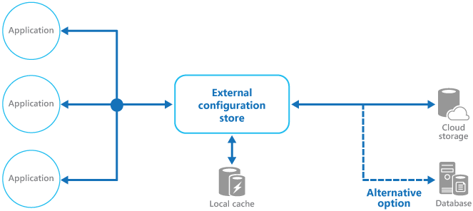

# External Configuration Store pattern

اطلاعات مرتبط با پیکربندی یا configuration برنامه را از deployment package  به یک مکان متمرکز منتقل کنید. این کار می‌تواند فرصت‌‌هایی را برای مدیریت و کنترل آسان‌تر داده‌‌های پیکربندی و برای اشتراک‌گذاری داده‌‌های پیکربندی در بین برنامه‌ها و نمونه‌‌های (instance‌) برنامه فراهم کند.


## **زمینه و مشکل**


اکثر محیط‌های زمان اجرا برنامه شامل اطلاعات پیکربندی است که در فایل‌‌های مستقر شده با برنامه نگهداری می‌شود. در برخی موارد، امکان ویرایش این فایل‌ها برای تغییر رفتار برنامه پس از استقرار(deployed) آن وجود دارد. با این حال، تغییرات در پیکربندی نیاز به استقرار مجدد برنامه (redeployed) دارد، که اغلب منجر به خرابی غیرقابل قبول و سایر هزینه‌‌های اجرایی (administrative overhead) می‌شود.

فایل‌‌های پیکربندی محلی یا Local configuration نیز پیکربندی را به یک برنامه محدود می‌کنند، اما گاهی اوقات اشتراک‌گذاری تنظیمات پیکربندی در چندین برنامه مفید است. به عنوان مثال می‌توان به رشته‌‌های اتصال پایگاه داده، اطلاعات مربوط به رابط کاربری یا آدرس‌‌های اینترنتی، صف‌ها و فضای ذخیره‌سازی مورد استفاده توسط مجموعه‌ای از اپلیکیشن‌‌های مرتبط اشاره کرد.

مدیریت تغییرات در پیکربندی محلی در چندین نمونه در حال اجرا برنامه به‌ویژه در سناریوی میزبانی ابری(cloud-hosted)، چالش برانگیز است. این می‌تواند منجر به مواردی شود که از تنظیمات پیکربندی مختلف در حین اجرای به روزرسانی استفاده می‌کنند.

علاوه بر این، به‌روزرسانی برنامه‌ها و اجزای مختلف آن ممکن است به تغییراتی در طرح‌واره‌‌های پیکربندی(configuration schemas) نیاز داشته باشد. بسیاری از سیستم‌های پیکربندی از نسخه‌‌های مختلف اطلاعات پیکربندی پشتیبانی نمی‌کنند.

##  **راه حل:**


اطلاعات configuration را در ذخیره ساز خارجی یا external storage ذخیره کنید و رابطی(interface) ارائه دهید که می‌تواند برای خواندن سریع و کارآمد تنظیمات پیکربندی و به روز رسانی آن استفاده شود. حالت external storage بستگی به محیط میزبانی(hosting) و زمان اجرا برنامه دارد. در یک سناریوی میزبانی ابری، معمولاً یک سرویس  cloud-based storage یا سرویس dedicated configuration است، اما می‌تواند یک پایگاه داده میزبانی شده یا سایر سیستم‌های سفارشی باشد.

همینطور که ذخیره پشتیبان یا backing store (برای یادآوری به مقدمه رجوع کنید) برای  اطلاعات موجود در پیکربندی انتخاب می‌کنید باید رابطی داشته باشد که دسترسی سازگار و آسان برای استفاده از آن را فراهم کند. باید اطلاعات را در قالبی مناسب و ساختار یافته نشان دهد. همچنین ممکن است پیاده‌سازی نیاز به مجوز دسترسی کاربران به منظور محافظت از داده‌‌های پیکربندی داشته باشد و به اندازه کافی انعطاف‌پذیر باشد تا امکان ذخیره‌سازی نسخه‌‌های متعدد پیکربندی (مانند توسعه، مرحله‌بندی، یا تولید، از جمله نسخه‌‌های انتشار چندگانه هر یک) را فراهم کند.


> بسیاری از پیکربندی‌‌های سیستمی که به صورت پیش‌فرض هستند، هنگام راه‌اندازی برنامه، داده‌ها را می‌خوانند و داده‌ها را در حافظه cache می‌کنند تا دسترسی سریع را فراهم کنند و تأثیر آن بر عملکرد برنامه به حداقل برسد. بسته به نوع ذخیره پشتیبان مورد استفاده و تاخیر زمانی بین این ذخیره ساز‌ها، ممکن است پیاده سازی  مکانیزم cache در حافظه به صورت external configuration مناسب باشد. برای اطلاعات بیشتر، [Caching Guidance](https://learn.microsoft.com/en-us/previous-versions/msp-n-p/dn589802(v=pandp.10)) را ببینید. شکل یک نمای کلی از External Configuration Store pattern با حافظه  optional local cache را نشان می‌دهد



شکل 1

### مسائل و ملاحظات:


هنگام تصمیم گیری در مورد نحوه اجرای این الگو به نکات زیر توجه کنید:

یک ذخیره پشتیبان (backing store) را انتخاب کنید که کارایی قابل قبول، دسترسی(availability) بالا و استحکام (robustness) بالا را ارائه می‌دهد و می‌تواند به عنوان بخشی از فرآیند maintenance و administration برنامه از آن به صورت دقیق backup تهیه کند. در یک برنامه cloud-hosted، استفاده از مکانیزم ذخیره سازی ابری یا سرویس پلتفرم پیکربندی اختصاصی (dedicated configuration) معمولاً انتخاب خوبی برای برآورده کردن این الزامات است.

باید schema backing store را طوری طراحی کنید تا از امکان انعطاف پذیری (flexibility) در انواع اطلاعاتی را که می‌تواند نگه دارد را داشته باشد. همینطور اطمینان کامل حاصل کنید  تمام الزامات پیکربندی مانند typed dataها ، مجموعه‌ای از تنظیمات، نسخه‌‌های چندگانه تنظیمات و هر ویژگی دیگری را که برنامه‌‌هایی که از آن استفاده می‌کنند و به آن نیاز دارد را فراهم می‌کند. schema باید به راحتی قابلیت توسعه  برای پشتیبانی از تنظیمات اضافی با تغییر نیازمندیها را داشته باشد.

قابلیت‌‌های فیزیکی  backing store، نحوه ارتباط آن با روش‌‌های ذخیره سازی اطلاعات مربوط به پیکربندی و تأثیرات آن بر کارایی سیستم  را در نظر بگیرید. به عنوان مثال، ذخیره یک سند XML حاوی اطلاعات پیکربندی به رابط پیکربندی یا برنامه نیاز دارد تا سند را برای خواندن تنظیمات جداگانه تجزیه کند. این به‌روزرسانی تنظیمات را پیچیده‌تر می‌کند، اگرچه ذخیره تنظیمات می‌تواند به جبران کارایی خواندن کندتر کمک کند.

در نظر بگیرید که چگونه  رابط پیکربندی (configuration interface)  اجازه کنترل محدوده و ارث‌بری(inheritance) بر تنظیمات پیکربندی را می‌دهد. به عنوان مثال، ممکن است نیاز باشد که تنظیمات پیکربندی در سطح سازمان، برنامه و دستگاه انجام شود. ممکن است نیاز باشد که از تفویض(delegation) کنترل دسترسی به حوزه‌‌های مختلف پشتیبانی کند و از تغییر تنظیمات به اپلیکیشن‌‌های خاصی جلوگیری کند یا اجازه استفاده از آن را دهد.


اطمینان حاصل کنید که رابط پیکربندی می‌تواند داده‌‌های پیکربندی را در قالب‌‌های مورد نیاز مانند مقادیر تایپ‌شده، مجموعه‌ها، جفت‌‌های key/valu یا property bags را نمایش دهد (در واقع property bags نوعی hashTable است که خصوصیت‌های کلید و مقدار آن را ذخیره می‌کند).

در نظر بگیرید که وقتی تنظیمات حاوی خطا هستند یا در ذخیره‌ساز پشتیبان وجود ندارند، اینترفیس ذخیره‌ساز پیکربندی چگونه رفتار خواهد کرد؟ شاید  مناسب باشد که تنظیمات پیش فرض و خطا‌های log را برگردانید. همچنین جنبه‌‌هایی مانند حساسیت به حروف کوچک و بزرگ کلید‌های تنظیمات پیکربندی یا نام‌ها، ذخیره‌سازی و مدیریت داده‌‌های باینری و روش‌‌هایی که مقادیر پوچ یا خالی را مدیریت می‌کنند، در نظر بگیرید.

نحوه محافظت از داده‌‌های پیکربندی را در نظر بگیرید تا فقط به کاربران و اپلیکیشن‌‌های مناسب دسترسی داشته باشید. این کار احتمالاً یکی از ویژگی‌‌های اینترفیس ذخیره‌ساز پیکربندی است اما لازم است اطمینان حاصل شود که داده‌‌های موجود در ذخیره پشتیبان نمی‌توانند مستقیماً بدون مجوز مناسب دسترسی داشته باشند. از جداسازی دقیق بین مجوز‌های مورد نیاز برای خواندن و نوشتن داده‌‌های پیکربندی اطمینان حاصل کنید. همچنین در نظر بگیرید که آیا باید برخی یا همه تنظیمات پیکربندی را رمزگذاری کنید و چگونه این کار در رابط ذخیره‌ساز پیکربندی پیاده سازی می‌شود.

پیکربندی‌‌های ذخیره‌شده مرکزی، که رفتار برنامه را در طول زمان اجرا تغییر می‌دهند، بسیار مهم هستند و باید با استفاده از مکانیسم‌‌هایی مانند استقرار کد برنامه، مستقر، به‌روزرسانی و مدیریت شوند. به عنوان مثال، تغییراتی که می‌توانند بیش از یک برنامه کاربردی را تحت تأثیر قرار دهند، باید با استفاده از روش استقرار آزمایشی کامل و مرحله‌ای انجام شوند تا اطمینان حاصل شود که تغییر برای همه برنامه‌‌هایی که از این پیکربندی استفاده می‌کنند مناسب است. اگر یک مدیر تنظیمی را برای به‌روزرسانی یک برنامه ویرایش کند، می‌تواند بر سایر برنامه‌‌هایی که از همان تنظیمات استفاده می‌کنند تأثیر منفی بگذارد.

اگر برنامه ‌ای اطلاعات پیکربندی را در حافظه کَش ذخیره می‌کند، در صورت تغییر پیکربندی باید به برنامه هشدار داده شود. ممکن است بتوان یک خط‌مشی انقضا را روی داده‌‌های پیکربندی حافظه کَش پیاده‌سازی کرد تا این اطلاعات به‌طور خودکار به‌صورت دوره‌ای بازخوانی شوند و هر گونه تغییر برداشته شود (و بر اساس آن عمل شود).

در حالی که کش کردن (caching) داده‌‌های پیکربندی می‌تواند به رفع مشکلات اتصال گذرا با ذخیره‌سازی پیکربندی خارجی در زمان اجرای برنامه کمک کند، این کار معمولاً مشکل را حل نمی‌کند اگر ذخیره خارجی در هنگام شروع برنامه برای اولین بار شروع به کار کند. اگر برنامه شما نمی‌تواند مقادیر زنده را هنگام شروع بازیابی کند، مطمئن شوید که خط لوله (pipeline) استقرار برنامه شما می‌تواند آخرین مجموعه شناخته شده از مقادیر پیکربندی را در یک فایل پیکربندی به عنوان یک بازگشت ارائه کند.

### چه زمانی از این الگو استفاده کنیم؟

این الگو برای موارد زیر مفید است:

تنظیمات پیکربندی که بین چندین برنامه و نمونه برنامه به اشتراک گذاشته شده است یا در جایی که یک پیکربندی استاندارد باید در چندین برنامه و نمونه برنامه اعمال شود.

* یک سیستم پیکربندی استاندارد که از همه تنظیمات پیکربندی مورد نیاز، مانند ذخیره تصاویر یا انواع داده‌‌های پیچیده، پشتیبانی نمی‌کند.

* به عنوان یک ذخیره‌ساز مکمل برای برخی از تنظیمات برنامه‌ها، شاید به برنامه‌ها اجازه می‌دهد تا برخی یا همه تنظیمات ذخیره‌شده در مرکز را لغو کنند.

* به عنوان راهی برای ساده‌سازی مدیریت چندین برنامه و به صورت اختیاری برای نظارت بر استفاده از تنظیمات پیکربندی با ثبت برخی یا همه انواع دسترسی به ذخیره‌ساز پیکربندی.

### مثالی از ذخیره پشتیبان


در یک برنامه میزبانی شده Microsoft Azure، یک انتخاب ممکن برای ذخیره اطلاعات پیکربندی به صورت خارجی، استفاده از Azure Storage است. این ابزار بسیار انعطاف‌پذیر است، عملکرد بالایی ارائه می‌دهد و سه بار با failover خودکار تکرار می‌شود (**Failover** یک اصطلاح شبکه‌ای است که در اصل در زمان‌‌های از کار افتادگی سرویس را بیان می‌کند) تا در دسترس بودن بالا  به طرز مناسبی ارائه شود. ذخیره سازی Azure Table یک ذخیره key/value با قابلیت استفاده از طرح‌‌های انعطاف پذیر برای مقادیر فراهم می‌کند. ذخیره سازی Azure Blob یک ذخیر‌ساز سلسله مراتبی و مبتنی بر کانتینر را فراهم می‌کند که می‌تواند هر نوع داده ‌ای را در حباب‌هایی با نام جداگانه نگهداری کند (به طور خلاصه، حباب یا **Blob** در رایانش ابری یک روش ذخیره‌سازی داده‌هاست که به صورت باینری و مقیاس‌پذیر عمل می‌کند و برای ذخیره‌سازی انواع مختلف داده‌ها مورد استفاده قرار می‌گیرد..

هنگام پیاده‌سازی این الگو، شما مسئول حذف فضای ذخیره‌سازی Azure Blob و نمایش تنظیمات خود در برنامه‌‌هایتان هستید، از جمله بررسی به‌روزرسانی‌ها در زمان اجرا و رسیدگی به نحوه پاسخگویی به آن‌ها.

مثال زیر نشان می‌دهد که چگونه می‌توان یک ذخیره‌سازی پیکربندی ساده را روی ذخیره‌سازی Blob برای ذخیره و دسترسی به اطلاعات پیکربندی پیش‌بینی کرد. یک کلاس `BlobSettingsStore` می‌تواند ذخیره سازی Blob را برای نگهداری اطلاعات پیکربندی انتزاعی کند و یک رابط ساده `ISettingsStore` را پیاده سازی کند. (نکته: ذخیره ساز حباب یا **Blob Storage** یک سرویس ذخیره‌سازی ابری است که به کاربران امکان ذخیره‌سازی و مدیریت داده‌‌های بزرگ را ارائه می‌دهد. این سرویس به صورت مقیاس‌پذیر عمل می‌کند و می‌تواند با توجه به نیاز‌های کاربران تنظیم شود.)


```csharp
public interface ISettingsStore
{
    Task<ETag> GetVersionAsync();
    Task<Dictionary<string, string>> FindAllAsync();
}
```


این اینترفیس روش‌‌هایی را برای بازیابی تنظیمات پیکربندی موجود در ذخیره‌ساز پیکربندی تعریف می‌کند و شامل یک شماره ورژن است که می‌تواند برای تشخیص اینکه آیا تنظیمات پیکربندی اخیراً اصلاح شده است یا خیر استفاده شود. یک کلاس `BlobSettingsStore` می‌تواند از ویژگی ETag blob برای پیاده سازی نسخه سازی استفاده کند. ویژگی ETag هر بار که یک blob نوشته می‌شود به طور خودکار به روز می‌شود.

```
با طراحی، این تصویر ساده تمام تنظیمات پیکربندی را به‌عنوان مقادیر رشته‌ای به جای مقادیر نوعی نشان می‌دهد.
```

سپس یک کلاس `ExternalConfigurationManager` می‌تواند پوششی در اطراف یک نمونه `BlobSettingsStore` ارائه دهد. یک برنامه می‌تواند از این کلاس برای بازیابی اطلاعات پیکربندی استفاده کند. این کلاس ممکن است از چیزی مانند Microsoft Reactive Extensions استفاده کند تا تغییرات ایجاد شده در پیکربندی را در حین اجرای سیستم منتشر کند. همچنین مسئول پیاده‌سازی الگوی Cache-Aside برای تنظیماتی است که انعطاف‌پذیری و کارایی بیشتری را ارائه می‌کند.

کد مورد استفاده ممکن است چیزی شبیه به زیر باشد.


```csharp
static void Main(string[] args)
{
    // Start monitoring configuration changes.
    ExternalConfiguration.Instance.StartMonitor();

    // Get a setting.
    var setting = ExternalConfiguration.Instance.GetAppSetting("someSettingKey");
    …
}

```


## Using Azure App Configuration


در حالی که ایجاد یک ذخیره‌گاه پیکربندی سفارشی ممکن است در برخی شرایط ضروری باشد، بسیاری از برنامه‌ها می‌توانند در عوض از پیکربندی برنامه Azure استفاده کنند. پیکربندی برنامه Azure از جفت‌‌های  [key-value](https://learn.microsoft.com/en-us/azure/azure-app-configuration/concept-key-value) پشتیبانی می‌کند که می‌توانند فضای نامی داشته باشند. کلیدها تایپ می‌شوند و به صورت جداگانه ویرایش می‌شوند. Azure App Configuration همچنین از [point-in-time snapshots](https://learn.microsoft.com/en-us/azure/azure-app-configuration/concept-point-time-snapshot) پشتیبانی می‌کند تا بتوانید به راحتی مقادیر پیکربندی قبلی را بررسی کنید یا حتی به آن برگردید. مقادیر پیکربندی را می‌توان به گونه ‌ای صادر کرد که در صورت عدم دسترسی به سرویس هنگام شروع برنامه، یک کپی از پیکربندی می‌تواند با برنامه شما ارسال شود.


###  کتابخانه‌‌های سمت کاربر

بسیاری از این ویژگی‌ها از طریق کتابخانه‌‌های سرویس گیرنده که با زمان اجرای برنامه یکپارچه می‌شوند، برای تسهیل واکشی و ذخیره مقادیر یا تازه‌سازی مقادیر در هنگام تغییر و حتی مدیریت قطعی‌‌های گذرا در سرویس پیکربندی برنامه، ادغام می‌شوند.

|Runtime|Client Library|Notes|Quickstart|
|---|---|---|---|
|.NET|[Microsoft.Extensions.Configuration.AzureAppConfiguration](https://www.nuget.org/packages/Microsoft.Extensions.Configuration.AzureAppConfiguration/)|Provider for `Microsoft.Extensions.Configuration`|[Quickstart](https://learn.microsoft.com/en-us/azure/azure-app-configuration/quickstart-aspnet-core-app)|
|ASP.NET|[Microsoft.Azure.AppConfiguration.AspNetCore](https://www.nuget.org/packages/Microsoft.Azure.AppConfiguration.AspNetCore)|Provider for `Microsoft.Extensions.Configuration`|[Quickstart](https://learn.microsoft.com/en-us/azure/azure-app-configuration/quickstart-dotnet-core-app)|
|Azure Functions in .NET|[Microsoft.Extensions.Configuration.AzureAppConfiguration](https://www.nuget.org/packages/Microsoft.Extensions.Configuration.AzureAppConfiguration/)|Used with Azure Function extensions to support configuration in _Startup.cs_|[Quickstart](https://learn.microsoft.com/en-us/azure/azure-app-configuration/quickstart-azure-functions-csharp?tabs=in-process)|
|.NET Framework|[Microsoft.Configuration.ConfigurationBuilders.AzureAppConfiguration](https://www.nuget.org/packages/Microsoft.Configuration.ConfigurationBuilders.AzureAppConfiguration)|Configuration builder for `System.Configuration`|[Quickstart](https://learn.microsoft.com/en-us/azure/azure-app-configuration/quickstart-dotnet-app)|
|Java Spring|[com.azure.spring > azure-spring-cloud-appconfiguration-config](https://mvnrepository.com/artifact/com.azure.spring/azure-spring-cloud-appconfiguration-config)|Supports Spring Framework access via `ConfigurationProperties`|[Quickstart](https://learn.microsoft.com/en-us/azure/azure-app-configuration/quickstart-java-spring-app)|
|Python|[azure.appconfiguration](https://pypi.org/project/azure-appconfiguration/)|Provides an `AzureAppConfigurationClient`|[Quickstart](https://learn.microsoft.com/en-us/azure/azure-app-configuration/quickstart-python)|
|JavaScript/Node.js|[@azure/app-configuration](https://www.npmjs.com/package/@azure/app-configuration)|Provides an `AppConfigurationClient`|[Quickstart](https://learn.microsoft.com/en-us/azure/azure-app-configuration/quickstart-javascript)|

علاوه بر کتابخانه‌‌های سرویس گیرنده،  [Azure App Configuration Sync](https://github.com/marketplace/actions/azure-app-configuration-sync) و  [Azure App Configuration Pull](https://marketplace.visualstudio.com/items?itemName=AzureAppConfiguration.azure-app-configuration-task) و [Azure App Configuration Push](https://marketplace.visualstudio.com/items?itemName=AzureAppConfiguration.azure-app-configuration-task-push) نیز برای ادغام مراحل پیکربندی در فرآیند ساخت شما وجود دارد.

### مراحل بعدی

- نمونه‌‌های پیکربندی  [App Configuration Samples](https://github.com/Azure/AppConfiguration/tree/main/examples) را ببینید
-  با نحوه ادغام پیکربندی برنامه [integrate Azure](https://learn.microsoft.com/en-us/azure/azure-app-configuration/integrate-kubernetes-deployment-helm) با Kubernetes آشنا شوید
- یاد بگیرید که چگونه پیکربندی برنامه Azure نیز می‌تواند کمک کند ([manage feature flags](https://learn.microsoft.com/en-us/azure/azure-app-configuration/manage-feature-flags))
