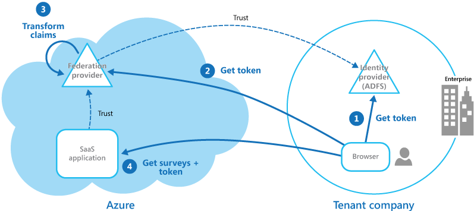

# ‏Federated Identity pattern

احراز هویت را به یک ارائه دهنده identity provider  واگذار کنید. این می‌تواند توسعه را ساده‌تر کند، نیاز به مدیریت کاربر را به حداقل برساند و تجربه کاربری برنامه را بهبود بخشد.

## **زمینه و مشکل**

کاربران معمولاً نیاز به کار با چندین برنامه دارند که توسط سازمان‌‌های مختلفی که با آنها رابطه تجاری دارند، ارائه و میزبانی می‌شوند. ممکن است از این کاربران خواسته شود که از اعتبارنامه‌‌های (credentials) خاص و متفاوت برای هر یک استفاده کنند. این کار می‌تواند:

باعث ایجاد یک تجربه کاربری ناخوشایند شود به خصوص هنگامی که کاربران دارای اعتبارنامه‌‌های مختلف هستند، اغلب sign-in credentials به سیستم را فراموش می‌کنند.  
  
آسیب پذیری‌‌های امنیتی را افزایش دهد. هنگامی که یک کاربر شرکت را ترک می‌کند، حساب کاربری او باید فوراً لغو شود. و نادیده گرفتن این موضوع در سازمان‌های بزرگ آسان است.  
  
پیچیده کردن **user management**. در واقع Administrators باید credentials را برای همه کاربران مدیریت کنند و کار‌های اضافی مانند ارائه یادآوری رمز عبور را انجام دهند.

کاربران معمولاً ترجیح می‌دهند از اعتبار(credentials) یکسانی برای همه این برنامه‌‌های استفاده کنند.

## راه حل

یک مکانیزم احراز هویت را پیاده سازی کنید که می‌تواند از هویت فدرال(federated) استفاده کند. احراز هویت کاربر را از کد برنامه جدا کنید و احراز هویت را به یک ارائه دهنده هویت قابل اعتماد واگذار کنید. این می‌تواند توسعه را ساده کند و به کاربران اجازه دهد تا با استفاده از طیف وسیع تری از ارائه دهندگان هویت (IdP) احراز هویت کنند و در عین حال هزینه‌‌های اداری را به حداقل برساند. همچنین به شما این امکان را می‌دهد که به وضوح احراز هویت (authentication) را از مجوز(authorization) جدا کنید.  
  
ارائه‌دهندگان هویت مورد اعتماد شامل دایرکتوری‌‌های شرکتی، سایر سرویس‌‌های توکن‌‌های امنیتی  (security token services (STS)) ارائه‌شده توسط شرکای تجاری یا ارائه‌دهندگان هویت social identity هستند که می‌توانند کاربرانی را که مثلاً دارای حساب کاربری Microsoft، Google، Yahoo! یا Facebook هستند، احراز هویت کنند.  لازم به ذکر است که دایرکتوری‌های شرکتی یا Corporate directories که به آن 'دایرکتوری‌های الکترونیکی' نیز گفته می‌شود، نوع تخصصی پایگاه داده ‌ای هستند که  حاوی اطلاعات مرتب شده از کارکنان به صورت سلسله مراتبی در یک سازمان یا یک شرکت است.
  
شکل زیر الگوی هویت فدرال (Federated Identity) را در زمانی که یک client application نیاز به دسترسی به سرویسی دارد که باید احراز هویت شود را نشان می‌دهد. احراز هویت توسط یک identity providers (IdP) که در هماهنگی با security token services (STS) کار می‌کند انجام می‌شود. IdP توکن‌‌های امنیتی صادر می‌کند که اطلاعاتی در مورد کاربر تأیید شده ارائه می‌کند. این اطلاعات، که به عنوان claims نامیده می‌شود، شامل هویت کاربر است و همچنین ممکن است شامل اطلاعات دیگری مانند role membership و granular access دقیق تر باشد.

این مدل اغلب  claims-based access control نامیده می‌شود. برنامه‌ها و سرویس‌ها بر اساس موارد موجود در توکن، اجازه دسترسی به ویژگی‌ها و اجرای عملیات‌ها را می‌دهند. سرویسی که نیاز به احراز هویت دارد باید به IdP اعتماد کند. برنامه مشتری با IdP که احراز هویت را انجام می‌دهد تماس می‌گیرد. اگر احراز هویت موفقیت آمیز باشد، IdP یک توکن حاوی claims که کاربر را به STS شناسایی می‌کند، برمی گرداند (توجه داشته باشید که IdP و STS می‌توانند یک سرویس باشند). STS می‌تواند claim‌های موجود در توکن را بر اساس قوانین از پیش تعریف شده، قبل از بازگرداندن آن به client، تبدیل و تکمیل کند. سپس برنامه کلاینت می‌تواند این نشانه را به عنوان اثبات هویت خود به سرویس ارسال کند.

ممکن است STS یا security token services اضافی در دنباله ‌ای از اعتماد‌ها وجود داشته باشد. به عنوان مثال، در سناریویی که بعدا توضیح داده شد، یک STS داخلی به STS دیگری اعتماد می‌کند که مسئول دسترسی به یک identity provider برای احراز هویت کاربر است. این رویکرد در سناریو‌های سازمانی که در آن on-premises STS و directory وجود دارد رایج است.

احراز هویت فدرال (Federated authentication) راه حلی مبتنی بر استانداردها را برای مسئله اعتماد به هویت (trusting identities) در دامنه‌‌های مختلف ارائه می‌دهد و می‌تواند از یک ورود به سیستم پشتیبانی کند. این نوع احراز هویت در همه انواع برنامه‌ها، به‌ویژه برنامه‌‌های میزبانی شده در فضای ابری رایج‌تر می‌شود، زیرا از یک ورود بدون نیاز به اتصال مستقیم شبکه به ارائه‌دهندگان هویت پشتیبانی می‌کند. کاربر مجبور نیست برای هر برنامه ‌ای اعتبارنامه را وارد کند. این امر امنیت را افزایش می‌دهد زیرا از ایجاد اعتبار مورد نیاز برای دسترسی به بسیاری از برنامه‌‌های مختلف جلوگیری می‌کند و همچنین اعتبار کاربر را از همه افراد به جز ارائه دهنده هویت اصلی پنهان می‌کند. برنامه‌‌های فقط اطلاعات هویت احراز هویت شده موجود در توکن را می‌بینند.

هویت فدرال (Federated identity) همچنین دارای این مزیت عمده است که مدیریت هویت و اعتبار را به عهده  identity provider میگذارد. برنامه یا سرویس نیازی به ارائه ویژگی‌‌های  مدیریتی provide identity  ندارد. علاوه بر این، در سناریو‌های شرکتی، دایرکتوری شرکت در صورت اعتماد به  identity provider، نیازی به اطلاع از کاربر ندارد. این کار تمام  سربار اجرایی مرتبط به مدیریت هویت کاربر را حذف می‌کند.

### مسائل و ملاحظات:

احراز هویت (Authentication) می‌تواند تنها یک نقطه شکست باشد. اگر application خود را بر روی چندین دیتاسنتر مستقر می‌کنید، مکانیسم مدیریت هویت (identity management) خود را در دیتاسنتر یکسانی برای حفظ قابلیت اطمینان و در دسترس بودن برنامه در نظر بگیرید.

ابزار‌های Authentication  ممکن است سطح دسترسی قابل تنظیمی را روی نقش‌‌های موجود در authentication token را ممکن سازند. که اغلب به عنوان [role-based access control (RBAC)](https://en.wikipedia.org/wiki/Role-based_access_control) نامیده می‌شود و می‌تواند سطح دقیق تری از کنترل دسترسی به ویژگیها و منابع را فراهم کند.

بر خلاف دایرکتوری شرکتی که معمولا claims-based authentication با استفاده از social identity providers اطلاعات بیشتری در مورد کابر احراز هویت شده به نسبت روش‌‌های دیگه مثلا احراز هویت فقط با email address  نمی‌دهد. برخی از  social identity providers مثل Microsoft account فقط یک identifier یکتا تولید می‌کنند.  برنامه معمولاً باید برخی از اطلاعات کاربران ثبت نام شده را حفظ کند و بتوانید این اطلاعات را با شناسه  موجود در token مطابقت دهید. معمولاً این کار از طریق ثبت نام(registration) انجام می‌شود، زمانی که کاربر برای اولین بار به برنامه دسترسی پیدا می‌کند، و اطلاعات پس از هر بار احراز هویت به عنوان  claims اضافی به توکن تزریق می‌شود.

اگر بیش از یک identity provider برای STS تنظیم شده باشد  STS باید تعیین کند که identity provider کاربر باید برای تأیید اعتبار (authentication) به آن redirected شود. این فرایند Discovery Home Realm نامیده می‌شود. STS ممکن است بتواند این کار را به طور خودکار بر اساس آدرس ایمیل یا نام کاربری که کاربر ارائه می‌دهد، انجام دهد، subdomain برنامه ‌ای که کاربر به آن دسترسی دارد دارای دامنه آدرس IP کاربر یا محتوای یک کوکی ذخیره شده در کاربر مرورگر است به عنوان مثال، اگر کاربر آدرس ایمیل را در دامنه مایکروسافت مانند user@live.com وارد کند، STS کاربر را به صفحه ورود به حساب مایکروسافت هدایت می‌کند. در بازدید‌های بعدی، STS می‌تواند از یک کوکی استفاده کند تا نشان دهد آخرین علامت ورود به حساب مایکروسافت بود. اگر Discovery Automatic نتواند  home realm را تعیین کند، STS یک صفحه Discovery Realm Home را نشان می‌دهد که  identity provider  قابل اعتماد را لیست می‌کند  و کاربر باید گزینه مورد نظر را انتخاب کند.

## چه زمانی از این الگو استفاده کنیم

این الگو برای سناریو‌هایی مانند حالت‌های زیر مناسب هست :

در حالت **Single sign-on یا به اختصار SSO**.

در این سناریو شما باید افراد را برای اپلیکیشن‌‌های شرکتی که در فضای ابری خارج از مرز‌های امنیتی شرکت میزبانی می‌شوند، احراز هویت کنید، بدون اینکه هر بار که از برنامه‌ای بازدید می‌کنند مجبور به ورود به سیستم شوند. تجربه کاربر مانند استفاده از برنامه‌‌های داخلی سازمان است که در آن هنگام ورود به شبکه شرکتی احراز هویت می‌شوند و از آن پس بدون نیاز به ورود مجدد به همه برنامه‌‌های مربوطه دسترسی دارند.

در حالت **تعیین هویت فدرال با شرکای متعدد**.

در این سناریو شما باید هم کارمندان شرکت و هم شرکای تجاری را که حسابی در فهرست شرکتی ندارند، احراز هویت کنید. این امر در اپلیکیشن‌‌های تجاری و در کسب‌وکار‌های (business-to-business) رایج است، برنامه‌‌هایی که با  سرویس‌های شخص ثالث یکپارچه می‌شوند و شرکت‌‌هایی با سیستم‌‌های فناوری اطلاعات مختلف ادغام یا منابع مشترک را به اشتراک گذاشته‌اند.

در حالت ** تعیین هویت فدرال در برنامه‌‌های SaaS**.

در این سناریو، فروشندگان نرم افزار مستقل (independent software vendors) یک سرویس آماده برای استفاده برای چندین مشتری  ارائه می‌دهند. هر مشتری با استفاده از identity provider مناسب تأیید می‌شود. به عنوان مثال ، کاربران تجاری از اعتبار شرکت‌های خود استفاده می‌کنند، در حالی که مصرف کنندگان و مشتریان از اعتبار هویت اجتماعی خود استفاده می‌کنند.

این الگو ممکن است در شرایط زیر مفید نباشد:

همه کاربران application می‌توانند توسط یک  identity provider احراز هویت شوند و هیچ نیازی به احراز هویت با استفاده از  identity provider دیگر وجود ندارد. این امر در برنامه‌‌های تجاری که از دایرکتوری شرکتی (قابل دسترسی در برنامه) برای احراز هویت، با استفاده از VPN یا (در سناریوی میزبان ابری) از طریق یک اتصال شبکه مجازی بین دایرکتوری داخلی و برنامه استفاده می‌کنند، معمول است.

این برنامه در ابتدا با استفاده از مکانیزم احراز هویت متفاوت ساخته شد. اضافه کردنclaims-based authentication و کنترل سطح دسترسی به برنامه‌‌های موجود از قبل می‌تواند پیچیده باشد و احتمالا مقرون به صرفه نیست.

## مثال

  
یک organization hosts یک نرم افزار multi-tenant به عنوان software as a service (SaaS)  در Microsoft Azure است. این برنامه شامل وب سایتی است که کلاینت‌ها می‌توانند از آن برای مدیریت برنامه برای کاربران خود استفاده کنند. این برنامه به کاربران اجازه می‌دهد تا با استفاده از هویت فدرال که توسط [Active Directory Federation Services](https://en.wikipedia.org/wiki/Active_Directory)  یا به اختصار  AD FS تولید می‌شود، به وب سایت مورد نظر دسترسی پیدا کنند.

شکل بالا نشان می‌دهد که چگونه کاربرها با identity provider خود احراز هویت می‌کنند (مرحله 1)، در این مورد AD FS. پس از احراز هویت موفق کاربرها، AD FS یک توکن صادر می‌کند. مرورگر کاربر این نشانه را به ارائه‌دهنده فدراسیون برنامه SaaS، که به توکن‌‌های صادر شده توسط AD FS مستاجر اعتماد می‌کند، می‌فرستد تا رمزی را که برای SaaS federation provide معتبر است، پس بگیرد (مرحله 2). در صورت لزوم،  SaaS federation provide قبل از بازگرداندن رمز یا توکن جدید به مرورگر کلاینت، claims موجود در توکن را به claims که برنامه تشخیص می‌دهد (مرحله 3) انجام می‌دهد. برنامه به توکن‌های صادر شده توسط SaaS federation provide اعتماد می‌کند و از claims موجود در توکن برای اعمال قوانین مجوز استفاده می‌کند (مرحله 4).  
  
کاربرها و  Tenantها(رجوع به مقدمه) برای دسترسی به برنامه نیازی به به خاطر سپردن اعتبارنامه ‌های(credentials) جداگانه ندارند و administrator  می‌تواند لیست کاربرانی را که می‌توانند به برنامه دسترسی داشته باشند در AD FS خود پیکربندی کند.

## قدم‌های بعدی

- [Microsoft Entra ID](https://azure.microsoft.com/services/active-directory/)
- [Active Directory Domain Services](https://learn.microsoft.com/en-us/previous-versions/windows/server-2008/bb897402(v=msdn.10))
- [Active Directory Federation Services](https://learn.microsoft.com/en-us/previous-versions/windows/server-2008/bb897402(v=msdn.10))
- [Multitenant Applications in Azure](https://learn.microsoft.com/en-us/azure/dotnet-develop-multitenant-applications)

- [federated-identity](./Federated%20Identity%20pattern.md)

## منابع مرتبط

- [Identity management for multitenant applications in Microsoft Azure](https://learn.microsoft.com/en-us/azure/architecture/multitenant-identity/)
- [Gatekeeper pattern](./Gatekeeper%20pattern.md)
- [Edge Workload Configuration pattern](./Edge%20Workload%20Configuration%20pattern.md)
- [Compute Resource Consolidation pattern](./Compute%20Resource%20Consolidation%20pattern.md)
- [Gateway Offloading pattern](./Gateway%20Offloading%20pattern.md)