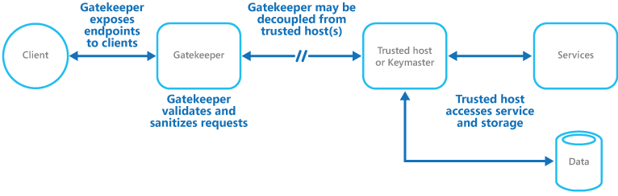
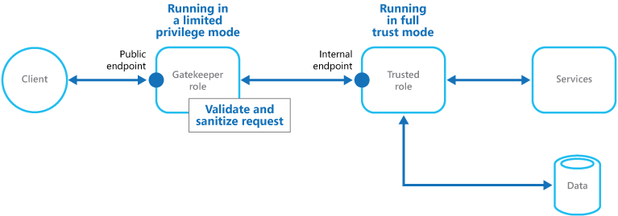

# ‏Gatekeeper pattern
از برنامه‌ها و سرویس‌ها با استفاده از یک نمونه host اختصاصی برای broker requests بین کاربر و برنامه یا سرویس‌‌های مختلف محافظت کنید. broker درخواست‌ها را تأیید و پاک‌سازی می‌کند و می‌تواند یک‌لایه امنیتی اضافی فراهم کند و سطح حمله سیستم را محدود کند.

 
## زمینه و مشکل

 
سرویس‌‌های ابری endpointهایی را نشان می‌دهند که به برنامه‌‌های سرویس‌گیرنده اجازه می‌دهند تا APIهای خود را فراخوانی کنند. کد مورداستفاده برای پیاده‌سازی APIها چندین کار را انجام می‌دهد، از جمله احراز هویت، مجوزها، اعتبارسنج و برخی یا همه پردازش درخواست‌ها. کد API احتمالاً از طرف کاربر به فضای ذخیره‌سازی و سایر سرویس‌ها دسترسی دارد.

 
اگر یک کاربر مخرب سیستم را در معرض خطر قرار دهد و به محیط میزبانی برنامه دسترسی پیدا کند، سازوکارهای امنیتی و دسترسی به داده‌ها و سایر سرویس‌ها در معرض خطر قرار داده می‌شود. در نتیجه، کاربر مخرب می‌تواند دسترسی نامحدودی به اعتبارنامه‌ها، storage keys، اطلاعات حساس و سایر سرویس‌ها داشته باشد.

 
 از فصل مقدمه می‌دانیم که Endpoint در نرم‌افزار به دستگاه‌‌های فیزیکی یا مجازی اشاره دارد که به یک شبکه متصل شده و اطلاعات را با آن تبادل می‌کنند.
## راه‌حل

 
یک راه‌حل برای این مشکل جداکردن کدی است که endpoints عمومی را پیاده‌سازی می‌کند از کدی که درخواست‌ها را پردازش می‌کند و به فضای ذخیره‌سازی دسترسی دارد. شما می‌توانید با استفاده از یک نما (façade) یا نوعی تسک اختصاصی که با کاربر تعامل دارد و در ادامه درخواست‌ها را (شاید از طریق یک interface جداگانه) به hostها یا تسک‌‌هایی که درخواست‌ها را پردازش می‌کنند ارسال می‌کند، به این جداسازی موردنظر برسید. شکل زیر نمای کلی و سطح بالایی از این الگو را ارائه می‌دهد.

 
 

 
الگوی gatekeeper می‌تواند برای محافظت از فضای ذخیره‌سازی استفاده شود، یا می‌توان از آن به‌عنوان façade (نمای) جامع‌تری برای محافظت از تمام عملکردهای برنامه استفاده کرد. عوامل مهم عبارت‌اند از: 

 
‏* ‏**Controlled validation** (اعتبارسنجی کنترل شده) gatekeeper تمام درخواست‌ها را تأیید می‌کند و درخواست‌‌هایی را که الزامات اعتبارسنجی را برآورده نمی‌کنند رد می‌کند.

 
‏* ‏**Limited risk and exposure** در واقع gatekeeper به اعتبارنامه‌ها یا کلیدهایی که مورداعتماد host که برای دسترسی به فضای ذخیره‌سازی و سرویس‌ها استفاده می‌کند، دسترسی ندارد. اگر gatekeeper به خطر بیفتد، مهاجم به این اعتبارنامه‌ها یا کلیدها دسترسی نخواهد داشت.

 
‏* ‏**Appropriate security** همین‌طور gatekeeper در یک حالت دسترسی محدود شده اجرا می‌شود، درحالی‌که بقیه برنامه‌ها در حالت full trust mode موردنیاز برای دسترسی به فضای ذخیره‌سازی و سرویس‌ها اجرا می‌شوند. اگر gatekeeper به خطر بیفتد، نمی‌تواند مستقیماً به سرویس‌ها یا داده‌‌های برنامه دسترسی داشته باشد.

 
این الگو مانند یک فایروال در یک توپوگرافی شبکه معمولی عمل می‌کند. این به gatekeeper اجازه می‌دهد تا درخواست‌ها را بررسی کند و تصمیم بگیرد که آیا درخواست را به میزبان مورداعتمادی که وظایف موردنیاز را انجام می‌دهد ارسال کند یا خیر. این تصمیم معمولاً از gatekeeper می‌خواهد که محتوای درخواست را قبل از ارسال آن به trusted host تأیید و پاک‌سازی کند.

 
### مسائل و ملاحظات: 

 
هنگام تصمیم‌گیری در مورد نحوه اجرای این الگو به نکات زیر توجه کنید: 
*‏ اطمینان حاصل کنید که hostهای مورداعتماد فقط endpointهای داخلی یا محافظت شده را که فقط توسط gatekeeper استفاده می‌شود، در معرض دید قرار(expose) می‌دهند. hostهای مورداعتماد نباید هیچ endpoint خارجی یا اینترفیس‌ها را در معرض دید قرار دهند.

 
*‏ در واقع gatekeeper باید در یک حالت دسترسی محدود (limited privilege) اجرا شود که معمولاً نیاز به اجرای gatekeeper و host مورداعتماد در سرویس‌‌های host جداگانه یا ماشین‌‌های مجازی دارد.

 
*‏ همین‌طور gatekeeper نباید هیچ‌گونه پردازش مربوط به برنامه یا سرویس را انجام دهد یا به هیچ داده‌ای دسترسی داشته باشد. عملکرد آن صرفاً اعتبارسنجی و صحت سنجی درخواست‌ها است. hostهای مورداعتماد ممکن است نیاز به تأیید اعتبار درخواست اضافی داشته باشند، اما gatekeeper باید اعتبارسنجی اصلی را انجام دهد.

 
*‏ در صورت امکان از یک کانال ارتباطی امن (HTTPS، SSL یا TLS) بین gatekeeper و hostها یا task مورداعتماد استفاده کنید. بااین‌حال، برخی از hosting environments از HTTPS در endpointهای داخلی پشتیبانی نمی‌کنند.

 
*‏ افزودن لایه اضافی برای اجرای الگوی gatekeeper به دلیل پردازش اضافی و ارتباطات شبکه موردنیاز، احتمالاً بر عملکرد کلی سیستم تأثیر می‌گذارد.

 
*‏ یک gatekeeper instance می‌تواند تنها یک نقطه شکست باشد. برای به‌حداقل‌رساندن تأثیر خرابی، به‌کارگیری نمونه‌‌هایی اضافی و استفاده از مکانیزم autoscaling برای اطمینان از ظرفیت برای حفظ دردسترس‌بودن gatekeeper را در نظر بگیرید.

 
### چه زمانی از این الگو استفاده کنیم؟

 
 
این الگو برای برنامه‌هایی مفید است که: 

 
*‏ مدیریت اطلاعات حساس
*‏ نمایش‌دادن سرویس‌‌هایی که نیاز به درجه بالایی از محافظت در برابر حملات مخرب دارند
*‏ انجام عملیات مهم و حیاتی که نمی‌توان آنها را در نظر نگرفت کرد.
*‏ نیاز به اعتبارسنجی درخواست‌ها به طور جداگانه از وظایف اصلی انجام شود یا این اعتبارسنجی برای ساده‌کردن تعمیر و نگهداری و مدیریت متمرکز شود.

 
## مثال

 
در یک سناریوی مبتنی بر محیط ابری از این الگو را می‌توان با جداکردن نقش gatekeeper یا ماشین مجازی از نقش‌ها و سرویس‌‌های قابل‌اعتماد در یک اپلیکیشن پیاده‌سازی کرد. پیاده‌سازی می‌تواند از یک endpoint داخلی، یک صف یا ذخیره‌سازی به‌عنوان مکانیزم ارتباطی میانی استفاده کند. شکل زیر این الگو را با استفاده از یک endpoint داخلی را نشان می‌دهد.

 

 
## منابع مرتبط

 
الگوی [Valet Key pattern](./Valet%20Key%20pattern.md) ممکن است هنگام اجرای الگوی Gatekeeper نیز مرتبط و موردنیاز باشد. هنگام برقراری ارتباط بین Gatekeeper و نقش یا roleهای مورداعتماد، تقویت امنیت با استفاده از کلیدها یا توکن‌‌هایی که مجوزهای(permissions) دسترسی به منابع را محدود می‌کنند، تمرین خوبی است. این الگو استفاده از یک توکن یا کلید را توصیف می‌کند که دسترسی محدود و مستقیم به یک منبع یا سرویس خاص را برای clientها فراهم می‌کند.