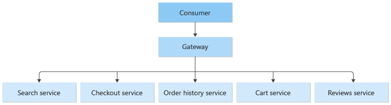
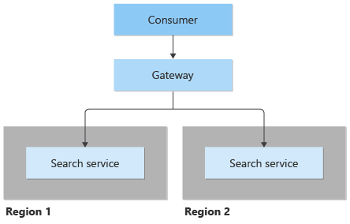
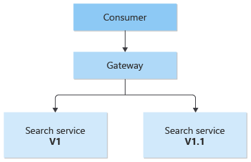

# ‏Gateway Routing pattern

در این الگو باید requestها را با استفاده از یک endpoint به چندین سرویس یا چندین instance از سرویس هدایت کنید. این الگو زمانی مفید است که می‌خواهید:

-‏ چندین سرویس را در یک endpoint واحد نشان دهید و بر اساس request به سمت سرویس مورد نظر بروید.

-‏ چندین نمونه از یک سرویس را در یک endpoint برای تعادل بار (load balancing) یا  جهت دردسترس بودن (availability)  قرار دهیم.

-‏ نسخه‌های مختلف از یک سرویس را در  endpoint منحصر به فرد با مسیردهی ترافیک جداگانه در هر نسخه‌ مختلف Expose  کنید (برای یاد آوری Expose به فصل مقدمه  رجوع کنید).

## **طرح صورت مسئله:**

هنگامی که یک کاربر یا client نیاز به استفاده چندین سرویس دارد (چندین نمونه از یک سرویس یا ترکیبی از سرویس‌های مختلف) در این حالت کاربر باید از وضعیت ارتباطی سرویسها آگاه باشد. به عنوان مثال سناریوهای زیر را در نظر بگیرید.

-‏  **Multiple disparate services (** چندین سرویس متفاوت) : یک برنامه تجارت الکترونیک (e-commerce application) ممکن است خدماتی مانند جستجو، بررسی، سبد خرید، تسویه حساب و تاریخچه سفارش ارائه دهد. هر سرویس دارای یک API متفاوت است که کلاینت باید با آن تعامل داشته باشد و کلاینت باید در مورد نحوه ارتباطی هر endpoint برای اتصال به سرویسها بداند. اگر یک API تغییر کند، کلاینت نیز باید به‌روزرسانی شود. اگر یک سرویس را به دو یا چند سرویس جداگانه تغییر دهید، کد باید هم در سرویس و هم در کلاینت تغییر کند.

-‏ **Multiple instances of the same service** (چندین نمونه از یک سرویس): سیستم می‌تواند نیاز به اجرای چندین نمونه از یک سرویس در جایی مشابه یا متفاوت داشته باشد. اجرای چندین نمونه را می‌توان برای اهداف تعادل بار (load balancing) یا برای برآوردن نیازهای در دسترس بودن (availability) انجام داد. هر بار که یک نمونه برای مطابقت با تعداد درخواست‌های بالا یا پایین روی اپلیکیشن تغییر می‌کند در این حالت client باید به روزرسانی شود.

-‏ **Multiple versions of the same service** (چندین ورژن از یک سرویس) : به عنوان بخشی از استراتژی deployment، نسخه‌های جدید یک سرویس را می‌توان در کنار نسخه‌های موجود مستقر یا deploy کرد که این به عنوان استقرار **سبز آبی**  (blue green deployments) شناخته می‌شود. در این سناریوها، client باید هر بار که تغییراتی در درصد ترافیک هدایت شده به نسخه جدید و endpoint موجود ایجاد می‌شود را به‌روزرسانی کند.


## **راه حل:**

یک gateway در جلوی مجموعه ای از برنامه‌ها، سرویس‌ها، deploymentها قرار دهید. از مسیریابی لایه ۷ اپلیکیشن برای مسیریابی request به نمونه‌های مناسب استفاده کنید.

با استفاده از این الگو، برنامه client فقط باید در مورد یک endpoint واحد بداند و با یک endpoint واحد ارتباط برقرار کند. موارد زیر نشان می‌دهد که چگونه الگوی gateway routing به سه سناریویی که در بخش **طرح صورت مسئله** شده‌اند، می‌پردازد.

### روش Multiple disparate services (چندین سرویس نامساوی)




در روش چندین سرویس نابرابر (Multiple disparate services) الگوی gateway routing در این سناریو که یک client از چندین سرویس را استفاده می‌کند مناسب است. اگر یک سرویس یکپارچه، تجزیه یا جایگزین شود، client لزوماً نیازی به به‌روزرسانی ندارد و می‌تواند به requestهایی روی gateway ادامه دهد و فقط مسیردهی(routing) تغییر می‌کند.

یک gateway همچنین این امکان را می‌دهد که backend service را از کلاینتها abstract کنید و به شما این امکان را می‌دهد که فراخوانی‌های client را ساده نگه دارید و در عین حال تغییرات را در سرویسهای backend در پشت gateway کنترل کنید. فراخوانی‌های client را می‌توان به هر سرویس یا سرویسی که برای مدیریت رفتار مورد انتظار client نیاز دارد هدایت کرد و این امکان را می‌دهد که سرویس را در پشت gateway بدون تغییر در سمت client به راحتی؛ اضافه، تقسیم و سازماندهی مجدد کنید.




### ‏Multiple instances of the same service (چندین نمونه از سرویس‌های مشابه)

کلید واژه Elasticity کلمه بسیار مهمی در رایانش ابری است. سرویس‌ها را می‌توان برای پاسخگویی به تقاضای رو به افزایش، زیاد (spun up) کرد و یا زمانی که تقاضا کم است برای صرفه جویی در هزینه‌ها، کاهش (spun down) داد. پیچیدگی ثبت و لغو ثبت نمونه سرویس‌ها در gateway خلاصه شده است. client از افزایش یا کاهش تعداد سرویس‌ها بی اطلاع است.

همیشه نمونه سرویس‌ها می‌توانند در یک جا یا چند جا روی سرورهای مختلف مستقر شوند. الگوی [Geode pattern](https://learn.microsoft.com/en-us/azure/architecture/patterns/geodes) توضیح می‌دهد که چگونه deployment در چند ناحیه  یا node یا سرور می‌تواند تاخیر زمانی در ارتباط‌ها را را بهبود بخشد و availability بودن یک سرویس را افزایش دهد.

### ‏ Multiple versions of the same service (چندین نسخه از سرویس‌های مشابه)



این الگو را می‌توان برای deployment استفاده کرد و این امکان را می‌دهد که نحوه به روز رسانی به کاربران را مدیریت کنید. هنگامی که یک نسخه جدید از سرویس شما مستقر می‌شود، می‌توان آن را به موازات نسخه موجود مستقر کرد. مسیریابی به شما امکان می‌دهد تا کنترل کنید چه نسخه‌ای از سرویس به مشتریان ارائه می‌شود، و به شما این امکان را می‌دهد که از استراتژی‌های انتشار مختلف استفاده کنید، چه به‌روزرسانی‌های incremental، parallel یا complete rollouts. هر مشکلی که پس از استقرار سرویس جدید مشاهده شود، می‌تواند به سرعت با ایجاد یک تغییر پیکربندی در gateway، بدون تأثیر بر کلاینت‌ها، بازگردانده شود.

### مسائل و ملاحظات:

-‏ سرویس gateway می‌تواند یک نقطه شکست را ایجاد کند. مطمئن شوید که به درستی طراحی شده است تا نیازهایavailability بودن برنامه را برآورده کند. قابلیت انعطاف پذیری(resiliency) و تحمل خطا را در اجرا در نظر بگیرید.

-‏ سرویس gateway می‌تواند یک گلوگاه(bottleneck) ایجاد کند. اطمینان حاصل کنید که gateway عملکرد مناسبی برای مدیریت کردن load دارد و به راحتی می‌تواند مطابق با انتظارات scale یا مقیاس‌دهی شود.

-‏ تست بار ( load testing) را در برابر gateway انجام دهید تا مطمئن شوید که خرابی‌های زنجیره‌ای و دنباله دار برای سرویسها ایجاد نمی‌کند.

-‏ مسیریابی gateway در شبکه در لایه سطح 7 است که می‌تواند بر اساس IP، port، header یا URL باشد.

-‏ به طور کلی سرویس gateway  می‌تواند  سراسری (global) یا ناحیه‌ای (regional)  باشد. Azure Front Door یک gateway سراسری  است، در حالی که Azure Application Gateway به صورت ناحیه‌ای است. اگر راه حل شما به سرویس deployment  به صورت چندناحیه‌ای (multi-region) نیاز دارد، از یک  gateway سراسری استفاده کنید. اگر workload به شکل ناحیه‌ای دارید که به کنترل دقیق نحوه متعادل سازی ترافیک نیاز دارد از Application Gateway استفاده کنید. به عنوان مثال؛ وقتی می‌خواهید ترافیک بین ماشینهای مجازی را متعادل سازی  کنید.

-‏ سرویس gateway یک public endpoint برای سرویس‌هایی است که در جلو آن قرار دارد. محدود کردن دسترسی public network به سرویس‌های backend  را در طراحی در نظر بگیرید آن هم فقط به صورت ایجاد دسترسی به سرویس‌ها فقط از طریق gateway یا از طریق یک private virtual network.


### **چه زمانی از این الگو استفاده کنیم؟**

-‏ یک client نیاز به استفاده از چندین سرویس دارد که در پشت یک gateway قابل دسترسی است.

-‏ وقتی که می‌خواهیم برنامههای client را با استفاده از یک endpoint ساده کنید.

-‏ وقتی که requestها را از externally addressable endpoints به internal virtual endpoints هدایت یا مسیردهی کنید، مانند قرار دادن پورت‌های یک VM برای cluster کردن آدرس‌های IP مجازی.

-‏ یک کلاینت باید سرویس‌هایی را که در چندین ناحیه مختلف (فیزیکی/مجازی) اجرا می‌شود برای رسیدن به تاخیر زمانی یا دسترسی مناسب، استفاده کند.

-‏ یک کلاینت باید تعداد مختلفی از نمونه سرویس‌ها را مورد استفاده قرار دهد.

-‏ وقتی که می‌خواهیم یک استراتژی deployment  را پیاده سازی کنیم که در آن کاربرها به چندین نسخه از سرویس به طور همزمان دسترسی داشته باشند.

### مثال:

با استفاده از Nginx به عنوان router؛ در مثال زیر یک فایل پیکربندی ساده برای سروری است که درخواست‌های برنامه‌های موجود در دایرکتوری‌های مجازی مختلف را به ماشین‌های مختلف در سرویس backend هدایت می‌کند.

```lua
server {
    listen 80;
    server_name domain.com;

    location /app1 {
        proxy_pass http://10.0.3.10:80;
    }

    location /app2 {
        proxy_pass http://10.0.3.20:80;
    }

    location /app3 {
        proxy_pass http://10.0.3.30:80;
    }
}
```


  
برای پیاده سازی الگوی gateway routing می‌توان از سرویس‌های Azure زیر استفاده کرد:

-‏ یک [Application Gateway instance](https://learn.microsoft.com/en-us/azure/application-gateway/tutorial-multiple-sites-cli) که مسیردهی ناحیه‌ای لایه 7 را فراهم می‌کند.

-‏ یک  [Azure Front Door instance](https://learn.microsoft.com/en-us/azure/frontdoor) که مسیردهی سراسری لایه 7 را فراهم می‌کند.

### منابع مرتبط:

- [Backends for Frontends pattern](./Backends%20for%20Frontends.md)
- [Gateway Aggregation pattern](./Gateway%20Aggregation%20pattern.md)
- [Gateway Offloading pattern](./Gateway%20Offloading%20pattern.md)