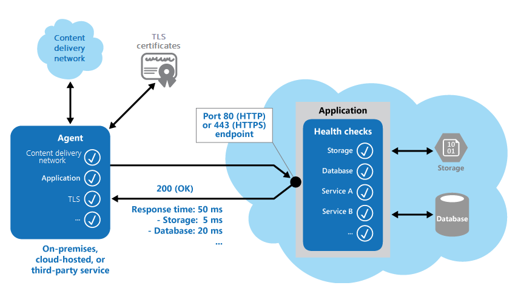

# ‏Health Endpoint Monitoring pattern

برای تأیید اینکه برنامه‌ها و سرویس‌ها به‌درستی کار می‌کنند، می‌توانید از الگوی Health Endpoint Monitoring استفاده کنید. این الگو نظارت و مانیتورکردن عملکرد یا کارایی مناسب یک برنامه را انجام می‌دهد. ابزارهای خارجی می‌توانند در فواصل زمانی منظم از طریق endpointها به این نظارت‌ها دسترسی داشته باشند.

 
## زمینه و مشکل

 
نظارت یا مانیتور بر برنامه‌های تحت وب و سرویس‌های back-end تمرین خوبی است. نظارت (Monitoring) کمک می‌کند تا اطمینان حاصل شود که برنامه‌ها و سرویس‌ها در دسترس هستند و به‌درستی کار می‌کنند. نیازمندی‌های یک برنامه تجاری اغلب شامل استفاده از Monitoring است.
گاهی اوقات Monitoring بر سرویس‌های ابری نسبت به سرویس‌های داخلی دشوارتر است. یک دلیل این است که شما کنترل کاملی بر محیط میزبانی (hosting) ندارید. مورد دیگر این است که سرویس‌ها معمولاً به سرویس‌های دیگری وابستگی دارد که فروشندگان پلتفرم ارائه می‌دهند.
عوامل زیادی بر برنامه‌های cloud-hosted تأثیر می‌گذارد. به‌عنوان‌مثال می‌توان به تأخیر شبکه، کارایی (performance) و دردسترس‌بودن (availability) سیستم‌های محاسباتی و ذخیره‌سازی اساسی و پهنای باند شبکه بین آنها اشاره کرد. یک سرویس می‌تواند به طور کامل یا جزئی به دلیل هر یک از این عوامل شکست بخورد. برای اطمینان از سطح موردنیاز در availability، باید در فواصل زمانی منظم بررسی کنید که سرویس‌های شما به‌درستی کار می‌کنند. قرارداد سطح سرویس‌ها شما (SLA) ممکن است سطحی را که باید رعایت کنید مشخص کند.

 
## راه‌حل

 
‏ health monitoring را با ارسال درخواست‌ها به endpoint در برنامه خود اجرا کنید. برنامه باید بررسی‌های لازم را انجام دهد و سپس وضعیت خود را نشان دهد.
یک health monitoring check معمولاً دو عامل زیر را ترکیب می‌کند: 

*‏ بررسی‌هایی (در صورت وجود) را انجام می‌دهند که برنامه یا سرویس در پاسخ به درخواست‌ها به health verification endpoint را انجام می‌دهد.

 
*‏ تجزیه‌وتحلیل نتایج توسط ابزار یا چارچوبی که بررسی تأیید سلامت (health verification check) را انجام می‌دهد

 
معمولاً یک response code وضعیت برنامه را نشان می‌دهد. همین‌طور ابزارها یا چارچوب مانیتورینگ بررسی تأخیر یا زمان پاسخ را انجام می‌دهد.
شکل زیر نمای کلی الگو را نشان می‌دهد.

 

 
همچنین این health monitoring code در برنامه ممکن است بررسی‌های دیگری را برای تعیین موارد زیر انجام دهد: 
*‏ دردسترس‌بودن (availability) و زمان پاسخگویی مربوط به cloud storage یا پایگاه‌داده.

 
*‏ وضعیت سایر منابع یا سرویس‌هایی که برنامه از آنها استفاده می‌کند. این منابع و سرویس‌ها ممکن است در برنامه یا خارج از آن باشند.

 
سرویس‌ها و ابزارهایی در دسترس هستند که برنامه‌های تحت وب را با ارسال درخواست به مجموعه‌ای از endpointها قابل‌تنظیم، مانیتور یا نظارت می‌کنند سپس این سرویس‌ها و ابزارها نتایج را بر اساس مجموعه‌ای از قوانین قابل‌تنظیم ارزیابی می‌کنند. همین‌طور ایجاد یک سرویس endpoint تنها باهدف انجام برخی آزمایش‌ها و تست‌های عملکردی روی یک سیستم کاری بسیار مناسب و آسان است.
بررسی‌های معمولی که ابزارهای نظارت و مانیتورینگ انجام می‌دهند عبارت‌اند از: 

 
*‏ اعتبارسنجی response code به‌عنوان‌مثال، پاسخ HTTP 200 (OK) نشان می‌دهد که برنامه بدون خطا پاسخ داده است. سیستم نظارت همچنین ممکن است response codeهای دیگر را برای ارائه نتایج جامع‌تر بررسی کند.

 
*‏ بررسی محتوای پاسخ برای تشخیص خطا، حتی زمانی که status code برابر 200 (OK) باشد. با بررسی محتوا، می‌توانید خطاهایی را شناسایی کنید که فقط بر بخشی از صفحه وب برگشتی یا پاسخ سرویس تأثیر می‌گذارد. به‌عنوان‌مثال، ممکن است عنوان یک صفحه را بررسی کنید یا به دنبال عبارت خاصی بگردید که نشان می‌دهد برنامه، صفحه صحیح را برگردانده است.

 
*‏ اندازه‌گیری زمان پاسخگویی این مقدار شامل تأخیر شبکه و زمانی است که برنامه برای صدور درخواست صرف کرده است. افزایش این مقدار می‌تواند نشان‌دهنده یک مشکل در حال ظهور در برنامه یا شبکه باشد.

 
*‏ بررسی منابع یا سرویس‌هایی که خارج از برنامه قرار دارند. به‌عنوان‌مثال یک شبکه تحویل محتوا (delivery network) که برنامه از آن برای ارائه محتوا از global cache استفاده می‌کند.

 
*‏ بررسی انقضای گواهینامه‌های TLS.

 
*‏ اندازه‌گیری زمان پاسخ جستجوی DNS برای URL برنامه. این بررسی تأخیر DNS و خرابی‌های DNS را اندازه‌گیری می‌کند.

 
*‏ اعتبارسنجی URL که جستجوی DNS برمی‌گرداند. با اعتبارسنجی، می‌توانید از صحیح بودن ورودی‌ها اطمینان حاصل کنید. همچنین می‌توانید از تغییر مسیر درخواست‌های مخربی که ممکن است پس از حمله به سرور DNS شما ایجاد شود، استفاده کنید.

 
در صورت امکان، اجرای این بررسی‌ها در محیط میزبانی داخلی (on-premises) یا محیط میزبانی خارجی و سپس مقایسه زمان‌های پاسخ آن‌ها بسیار مناسب است. در حالت ایده‌آل، شما باید applicationها را از مکان‌هایی که نزدیک به مشتریان هستند نظارت و مانیتور کنید. سپس دید دقیقی از کارایی هر مکان دریافت می‌کنید. این عمل مکانیزم بررسی قوی‌تری را فراهم می‌کند. نتایج همچنین می‌تواند به شما در تصمیم‌گیری‌های زیر کمک کند: 
*‏ کجا برنامه خود را deploy کنید

 
*‏ اینکه آیا بهتر است آن برنامه را در بیش از یک مرکز داده مستقر کنیم

 
برای اطمینان از اینکه برنامه شما برای همه مشتریان به‌درستی کار می‌کند، آزمایش‌هایی را بر روی تمام نمونه سرویس‌هایی که مشتریان استفاده می‌کنند، اجرا کنید. برای مثال، اگر فضای ذخیره‌سازی مشتری در بیش از یک حساب کاربری ذخیره‌سازی توزیع شده باشد، فرایند نظارت باید هر حساب کاربری را بررسی کند.

 
 
### مسائل و ملاحظات:

هنگام تصمیم‌گیری در مورد نحوه اجرای این الگو به نکات زیر توجه کنید: 
 
*‏ به این فکر کنید که چگونه پاسخ را تأیید کنید. به‌عنوان‌مثال، تعیین کنید که آیا یک status code 200 (OK) برای تأیید درستی کارکرد برنامه کافی است یا خیر. بررسی کد وضعیت (status code) حداقل حالت موردنیاز برای اجرای این الگو است. status code یک معیار اساسی از دردسترس‌بودن (availability) برنامه را ارائه می‌دهد. اما یک کد اطلاعات کمی در مورد عملیات، روندها و مشکلات احتمالی آینده در برنامه ارائه می‌دهد. 
 
*‏ تعداد نقاط پایانی (endpoints) برای نمایش یک برنامه را تعیین کنید. یک رویکرد این است که حداقل یک endpoint برای سرویس‌های اصلی که برنامه استفاده می‌کند و دیگری برای سرویس‌های با اولویت پایین‌تر در معرض نمایش قرار گیرد. با این رویکرد، می‌توانید سطوح مختلفی از اهمیت را به هر نتیجه حاصل از مانیتورینگ اختصاص دهید. همچنین در معرض دید گذاشتن (expose) هر  endpoint اضافی را در نظر بگیرید. می‌توانید برای هر سرویس اصلی، یکی را در معرض دید قرار دهید تا جزئیات مربوط به  monitoring را افزایش دهید. برای مثال، یک  health verification check ممکن است پایگاه‌داده، فضای ذخیره‌سازی و یک سرویس کدگذاری جغرافیایی خارجی را که یک برنامه از آن استفاده می‌کند، بررسی کند. هر کدام ممکن است به سطح متفاوتی از زمان کاری و زمان پاسخ نیاز داشته باشند. ممکن است سرویس رمزگذاری جغرافیایی یا برخی کارهای پس‌زمینه دیگر برای چند دقیقه در دسترس نباشد. اما ممکن است برنامه هنوز سالم باشد. 
 
*‏ تصمیم بگیرید که آیا از همان endpoint برای monitoring و دسترسی عمومی استفاده کنید یا خیر. حتی می‌توانید از یک endpoint برای هر دو مورداستفاده کنید، اما مسیر خاصی را برای health verification check طراحی کنید. به‌عنوان‌مثال، می‌توانید از آدرس /health در endpoint دسترسی عمومی استفاده کنید. با این رویکرد، ابزارهای نظارتی می‌توانند برخی از تست‌های عملکردی را در برنامه اجرا کنند. به‌عنوان‌مثال می‌توان به ثبت‌نام کاربر جدید، ورود به سیستم و ثبت سفارش آزمایشی اشاره کرد. در همان زمان، می‌توانید تأیید کنید که endpoint دسترسی عمومی در دسترس است.  
  
*‏ نوع اطلاعات جمع‌آوری‌شده در سرویس را در پاسخ به درخواست‌های نظارتی تعیین کنید. همچنین باید نحوه بازگرداندن این اطلاعات را تعیین کنید. اکثر ابزارها و چارچوب‌‌های موجود فقط به HTTP status code  که endpoint برمی‌گرداند نگاه می‌کنند. برای بازگرداندن و تأیید اعتبار اطلاعات اضافی، ممکن است لازم باشد یک ابزار یا سرویس نظارتی سفارشی ایجاد کنید.  
  
*‏ مشخص کنید چه مقدار اطلاعات باید جمع‌آوری کنید. انجام پردازش بیش از حد در حین بررسی می‌تواند برنامه را بیش از حد بارگذاری کند و سایر کاربران را تحت‌تأثیر قرار دهد. زمان پردازش ممکن است از مهلت زمانی یا timeout سیستم نظارتی (monitoring) نیز بیشتر شود. در نتیجه، سیستم ممکن است برنامه را به‌عنوان غیرقابل‌دسترس (unavailable) علامت‌گذاری کند. اکثر برنامه‌ها شامل ابزارهای دقیقی مانند کنترل‌کننده خطا (error handlers) و شمارشگر کارایی (performance counters) هستند. این ابزارها می‌توانند عملکرد و اطلاعات دقیق خطا را ثبت کنند که ممکن است برای این کار کافی باشد. پس به‌جای بازگرداندن اطلاعات اضافی موجود در health verification check از این داده‌ها استفاده کنید.  
  
*‏ ذخیره‌کردن وضعیت نقطه پایانی (endpoint) را در نظر بگیرید. انجام مکرر health check ممکن است هزینه داشته باشد. به‌عنوان‌مثال، اگر وضعیت سلامت (health status) از طریق داشبورد گزارش شود، معمولاً نمی‌خواهید هر درخواستی به داشبورد انجام شود تا بررسی سلامتی را آغاز کند. در عوض، به طور دوره‌ای سلامت سیستم را بررسی کنید و وضعیت را در حافظه cache ذخیره کنید. یا این کار، نقطه پایانی (endpoint) را که وضعیت ذخیره شده در حافظه cache را برمی‌گرداند، در معرض نمایش قرار دهید.  
  
*‏ نحوه پیکربندی امنیت برای monitoring endpointها را برنامه‌ریزی کنید. با پیکربندی امنیت، می‌توانید به محافظت از endpointها در برابر دسترسی عمومی برنامه کمک کنید که ممکن است:  
  
	* برنامه را در معرض حملات مخرب قرار دهید.  
	* قرارگرفتن در معرض لورفتن اطلاعات حساس افزایش دهید.  
	* حملات denial of service (DoS) را جذب کنید.  

به طور معمول، شما امنیت را در پیکربندی برنامه تنظیم می‌کنید. سپس می‌توانید بدون راه‌اندازی مجدد برنامه، تنظیمات را به‌راحتی به‌روزرسانی کنید. بهتر است استفاده از یک یا چند تکنیک زیر را در نظر بگیرید:  

*‏ با استفاده احراز هویت، endpointها را ایمن کنید. اگر سرویس یا ابزار monitoring از احراز هویت (authentication) پشتیبانی می‌کند، می‌توانید از یک کلید امنیتی احراز هویت در هدر درخواست (request header) استفاده کنید. همچنین می‌توانید اعتبارنامه را با استفاده از  درخواست (request)، ارسال کنید. هنگامی که از احراز هویت استفاده می‌کنید، نحوه دسترسی به health check endpoint را در نظر بگیرید. به‌عنوان‌مثال،[Azure App Service] (https://learn.microsoft.com/en-us/azure/app-service/monitor-instances-health-check#authentication-and-security) دارای یک health check داخلی است که با ویژگی‌های authentication و authorization مربوط به App Service یکپارچه می‌شود.  
  
*‏ از یک endpoint مبهم یا پنهان استفاده کنید. به‌عنوان‌مثال، endpointها را در یک آدرس IP متفاوت از آدرسی که URL برنامه پیش‌فرض استفاده می‌کند، قرار دهید. endpointها را روی یک پورت HTTP غیراستاندارد پیکربندی کنید. همچنین، از یک مسیر پیچیده برای صفحه آزمایشی خود استفاده کنید. معمولاً می‌توانید آدرس‌ها و پورت‌‌های endpointهای اضافی را در پیکربندی برنامه مشخص کنید. در صورت لزوم، می‌توانید ورودی‌هایی را برای این endpointها به سرور DNS اضافه کنید. سپس از تعیین مستقیم آدرس IP اجتناب می‌کنید.  
  
*‏ روشی را در endpoint نشان دهید که پارامتری مانند مقدار کلید (key value) یا مقدار حالت عملیات (operation mode value) را می‌پذیرد. زمانی که درخواستی می‌رسد، کد می‌تواند تست‌های خاصی را اجرا کند که به مقدار پارامتر بستگی دارد. اگر کد مقدار پارامتر را تشخیص ندهد، می‌تواند خطای 404 (Not Found) را برگرداند. پس امکان تعریف مقادیر پارامتر در پیکربندی برنامه را فراهم کنید.  
  
	*‏ از یک endpoint جداگانه استفاده کنید که تست‌های عملکردی اولیه را بدون به خطر انداختن کارایی برنامه انجام می‌دهد. با این رویکرد، می‌توانید به کاهش تأثیر حمله DoS کمک کنید. در حالت ایده‌آل، از استفاده از آزمایشی که ممکن است اطلاعات حساس را در معرض دید قرار دهد، خودداری کنید. گاهی اوقات باید اطلاعاتی را برگردانید که ممکن است برای یک مهاجم مفید باشد. در این مورد، نحوه محافظت از endpoint و داده‌ها را از دسترسی غیرمجاز را در نظر بگیرید. تکیه‌کردن به روش‌‌های مبهم‌سازی کافی نیست. همچنین استفاده از اتصال HTTPS و رمزگذاری داده‌های حساس را در نظر بگیرید، اگرچه این رویکرد بار روی سرور را افزایش می‌دهد.  
  
	*‏ تصمیم بگیرید که چگونه از عملکرد صحیح عامل نظارت یا monitoring اطمینان حاصل کنید. یک روش این است که endpoint را در معرض دید قرار دهید یا به معنی دیگر expose کنید که مقداری را از پیکربندی برنامه برمی‌گرداند یا یک مقدار تصادفی را که می‌توانید برای آزمایش عامل استفاده کنید. همچنین اطمینان حاصل کنید که سیستم مانیتورینگ خود را بررسی می‌کند. برای جلوگیری از صدور نتایج مثبت کاذب یا false positive توسط سیستم مانیتورینگ، می‌توانید از خودآزمایی یا تست داخلی استفاده کنید.

## چه زمانی از این الگو استفاده کنیم؟

این الگوی برای حالت‌های زیر مناسب است: 

*‏ نظارت بر وب‌سایت‌ها و برنامه‌های تحت وب برای تأیید دردسترس‌بودن (availability) آن‌ها.

*‏ نظارت بر وب‌سایت‌ها و برنامه‌های تحت وب برای بررسی عملکرد صحیح آن‌ها.

*‏ نظارت بر سرویس‌‌های میان‌رده (middle-tier) یا اشتراکی، برای تشخیص و جداسازی خرابی‌هایی که می‌تواند سایر برنامه‌ها را مختل کند.

*‏ کامل‌کردن ابزارهای موجود در برنامه، مانند شمارنده‌های عملکردی (performance counters) و error handler ها. مورد Health verification check جزئی از ضروریات برنامه برای logging و بررسی‌‌های آن نیست. این ابزارها می‌تواند اطلاعات ارزشمندی را برای یک چارچوب (framework) موجود فراهم کند که بر  شمارش گرهای نظارتی (monitors counters) و error logها نظارت می‌کند تا خرابی‌ها یا سایر خطاهای اتفاقی را تشخیص دهد. اما در صورت عدم دسترسی به برنامه، این ابزارها  نمی‌تواند اطلاعاتی را ارائه دهد.

## مثال

می‌توانید از میان‌افزارها (middleware) و کتابخانه‌‌های  [ASP.NET health checks](https://learn.microsoft.com/en-us/aspnet/core/host-and-deploy/health-checks) برای گزارش health مؤلفه‌‌های زیرساخت برنامه استفاده کنید. این چارچوب راهی برای گزارش health checkها به روشی ثابت ارائه می‌دهد و بسیاری از شیوه‌هایی را که این مقاله توضیح می‌دهد، اجرا می‌کند. به‌عنوان‌مثال، ASP.NET health checks شامل بررسی‌های خارجی مانند اتصال به پایگاه‌داده و مفاهیم خاصی مانند پروب‌ها(probes) مربوط به liveness و readiness است که برای یادآوری مبحث پروب‌ها به فصل مقدمه رجوع کنید.  
  
چندین مثال پیاده‌سازی که از ASP.NET health استفاده می‌کنند در [GitHub](https://github.com/dotnet/AspNetCore.Docs/tree/main/aspnetcore/host-and-deploy/health-checks/samples/7.x/HealthChecksSample) در موجود هستند.

## Monitor endpoints in Azure-hosted applications

گزینه‌های مانیتورکردن بر endpointها در Azure applications شامل موارد زیر است:  
  
*‏ از ویژگی‌های مانیتورکردن داخلی Azure مانند  [Azure Monitor](https://azure.microsoft.com/products/monitor) استفاده کنید. 

*‏ از یک سرویس شخص ثالث (third-party) یا چارچوبی مانند [Microsoft System Center Operations Manager](https://learn.microsoft.com/en-us/system-center/scom/welcome)استفاده کنید.  

*‏ یک ابزار سفارشی یا سرویسی را ایجاد کنید که روی سرور شخصی شما یا یک سرور میزبان اجرا شود.  

حتی اگر Azure گزینه‌های نظارتی و monitoring کاملی را ارائه دهد، می‌توانید از سرویس‌ها و ابزارهای اضافی برای ارائه اطلاعات اضافی استفاده کنید. Insights Application ، یکی از ویژگی‌های مانیتور، برای تیم‌های توسعه طراحی شده است. این ویژگی به شما کمک می‌کند تا نحوه عملکرد برنامه و نحوه استفاده از آن را درک کنید. Application Insights monitors ، نرخ پاسخ، زمان پاسخ، نرخ خرابی و نرخ وابستگی را درخواست می‌کنند. این کار می‌تواند به شما کمک کند تا تعیین کنید که آیا سرویس‌‌های خارجی شما را آهسته‌تر می‌کند یا خیر.  
  
شرایطی که می‌توانید نظارت کنید به سازوکار میزبانی که برای برنامه خود انتخاب می‌کنید بستگی دارد. کلیه گزینه‌های موجود در این بخش از قوانین هشدار (alert rules) خاص خود پشتیبانی می‌کند. یک alert rule از یک endpoint وب استفاده می‌کند که در تنظیمات سرویس‌‌های خود مشخص می‌کنید. این endpoint باید به‌موقع پاسخ دهد تا alert system بتواند تشخیص دهد که برنامه به‌درستی کار می‌کند. برای اطلاعات بیشتر، به [Create a new alert rule](https://learn.microsoft.com/en-us/azure/azure-monitor/alerts/alerts-create-new-alert-rule?tabs=metric) مراجعه کنید.  
  
در صورت بروز شرایط قطع ارتباط (outage)، باید ترافیک مربوط به client  برای برنامه موردنظر که در مناطق  یا نواحی مختلف مستقر شده است، قابل مسیریابی باشد. این وضعیت مورد مناسبی برای اتصال متقابل(cross-premises) و global load balancing است. این انتخاب بستگی به این دارد که این برنامه به‌صورت internal یا external باشد. سرویس‌‌هایی از قبیل Azure Front Door ، Azure Traffic Manager یا شبکه‌های تحویل محتوا(content delivery networks) یا به‌اختصار CDN می‌توانند بر اساس داده‌هایی که health probeها ارائه می‌دهند، ترافیک را در مناطق مختلف مسیریابی کنند.  
  
مدیر ترافیک([Traffic Manager](https://learn.microsoft.com/en-us/azure/traffic-manager/traffic-manager-overview)) در واقع یک سرویس مسیریابی و متعادل‌کردن بار(load-balancing) است که می‌تواند از طیف وسیعی از قوانین و تنظیمات برای توزیع درخواست‌ها در موارد خاص روی برنامه موردنظر ما استفاده کند. علاوه بر اینکه درخواست‌های مسیریابی، مدیر ترافیک می‌تواند به طور مرتب URL ، PORT و مسیر نسبی را پیگیری کند. شما اهداف پینگ را باهدف تعیین اینکه کدام نمونه از برنامه شما فعال است و به درخواست‌ها پاسخ می‌دهد، مشخص می‌کنید. اگر مدیر ترافیک status code - 200 (OK) را تشخیص دهد، این برنامه را به‌صورت موجود مشخص می‌کند. هر کد وضعیت(status code) دیگر باعث می‌شود مدیر ترافیک برنامه را به‌صورت آفلاین علامت‌گذاری کند. داشبورد مدیر ترافیک وضعیت هر برنامه را نشان می‌دهد. شما می‌توانید هر قانون(rule) را برای درخواست مجدد درخواست‌های دیگر به موارد دیگر برنامه که پاسخ می‌دهند پیکربندی کنید.  
  
مدیر ترافیک(Traffic Manager) منتظر زمان معینی([certain amount of time](https://learn.microsoft.com/en-us/azure/traffic-manager/traffic-manager-monitoring#configure-endpoint-monitoring)) برای دریافت پاسخ از monitoring URL است. اطمینان حاصل کنید که health verification code در این زمان اجرا می‌شود. برای تأخیر شبکه (network latency) از Traffic Manager به برنامه خود و دوباره برگرداندن شبکه اجازه دهید.

## مراحل بعدی

The following guidance is useful for implementing this pattern:

- [Health monitoring guidance in microservices-based applications](https://learn.microsoft.com/en-us/dotnet/architecture/microservices/implement-resilient-applications/monitor-app-health)

- [Monitoring application health for reliability](https://learn.microsoft.com/en-us/azure/architecture/framework/resiliency/monitoring), part of the Azure Well-Architected Framework

- [Create a new alert rule](https://learn.microsoft.com/en-us/azure/azure-monitor/alerts/alerts-create-new-alert-rule?tabs=metric)

## منابع مرتبط

- [External Configuration Store pattern](./External%20Configuration%20Store%20pattern.md)
- [Circuit Breaker pattern](./Circuit%20Breaker%20pattern.md)
- [Gateway Routing pattern](./Gateway%20Routing%20pattern.md)
- [Gatekeeper pattern](./Geode%20pattern.md)