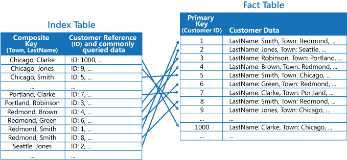
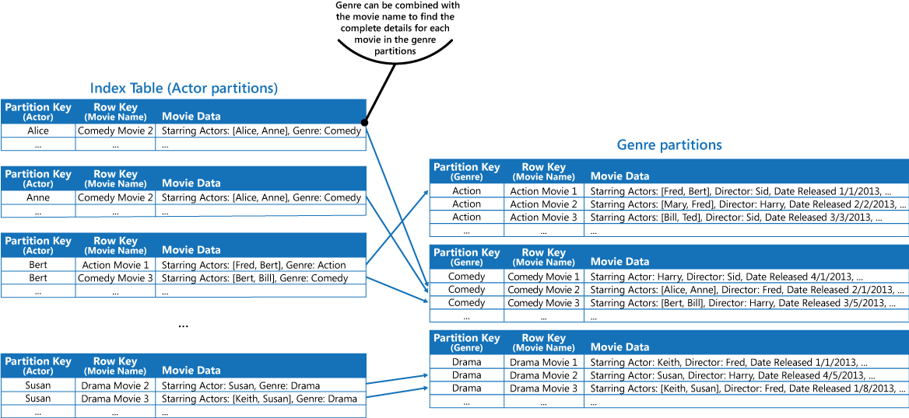

# Index Table pattern

شاخص یا index‌هایی را بر روی فیلد‌های موجود در ذخیر‌گاه داده‌ها (data stores) ایجاد کنید که اغلب توسط کوئری‌ها(queries) به آنها ارجاع داده می‌شود. این الگو می‌تواند عملکرد کوئری‌ها را با اجازه دادن به برنامه‌ها برای مکان یابی سریعتر داده‌ها جهت بازیابی آن‌ها از  ذخیر‌گاه داده‌ها را  بهبود بخشد.

### **زمینه و مشکل**

بسیاری ازذخیر‌گاه‌‌های داده‌، داده‌ها را برای مجموعه ‌ای از موجودیت‌ها با استفاده از کلید اولیه (primary key)  سازماندهی می‌کنند. یک برنامه می‌تواند از این کلید برای مکان یابی و بازیابی داده‌ها استفاده کند. شکل زیر نمونه ‌ای از یک data store را نشان می‌دهد که اطلاعات مشتری را در خود نگهداری می‌کند. در واقع primary key برابر با شناسه یا  ID مشتری است. این شکل، اطلاعات مشتری سازماندهی شده توسط  primary key (Customer ID) را نشان می‌دهد.

در برخی موارد ممکن است نتوانیم از primary key استفاده کنیم. به عنوان مثال در زمانی که primary key با query‌هایی که داده‌ها را مبتنی بر مقدار آن کلید واکشی میکند، اگر برنامه‌ای نیاز به بازیابی داده‌ها بر اساس فیلد دیگری داشته باشد در این صورت استفاده از primary key غیر ممکن می‌شود.  در این مثال مشتریان، یک application نمی‌تواند از primary key شناسه مشتری(Customer ID primary key) برای بازیابی مشتریان استفاده کند، اگر داده‌ها را صرفاً با ارجاع به مقدار مشخصه‌‌های دیگر، مانند شهری که مشتری در آن قرار دارد، جستجو کند. برای انجام یک کوئری مانند این، برنامه ممکن است مجبور باشد هر رکورد مشتری را واکشی و بررسی کند که این رویکرد می‌تواند روند کندی داشته باشد.
  
بسیاری از سیستم‌های مدیریت پایگاه داده رابطه ‌ای از index‌های ثانویه پشتیبانی می‌کنند. index ثانویه یک ساختار داده جداگانه است که توسط یک یا چند فیلد کلیدی nonPrimary (ثانویه) سازماندهی شده است و نشان می‌دهد که داده‌های هر مقدار index شده در کجا ذخیره می‌شود. موارد موجود در یک index ثانویه معمولاً بر اساس مقدار کلید‌های ثانویه مرتب می‌شوند تا امکان جستجوی سریع داده‌ها فراهم شود. این فهرستها معمولاً به طور خودکار توسط سیستم مدیریت پایگاه داده نگهداری می‌شوند.  
  
شما می‌توانید به تعداد مورد نیاز ایندکس ثانویه ایجاد کنید تا از کوئری‌های مختلفی که برنامه شما انجام می‌دهد پشتیبانی کند. به عنوان مثال، در یک Customers table در یک پایگاه داده رابطه‌ای که ID مشتری primary key است، اگر برنامه مرتباً مشتریان را بر اساس شهر محل سکونت آنها جستجو می‌کند، افزودن یک فهرست ثانویه در قسمت شهر مفید است.  
  
با این حال، اگرچه index‌‌های ثانویه در سیستم‌‌های رابطه‌ای رایج هستند، برخی از  ذخیره‌گاه‌‌های داده از نوع NoSQL  که توسط برنامه‌‌های ابری استفاده می‌شوند، ویژگی مشابهی را ارائه نمی‌دهند.

## راه حل

اگر data store از index‌‌های ثانویه پشتیبانی نمی‌کند، می‌توانید با ایجاد جداول فهرست(index tables) خود، آنها را به صورت دستی شبیه‌سازی کنید. یک index table داده‌ها را با یک کلید مشخص سازماندهی می‌کند. بسته به تعداد index‌های ثانویه مورد نیاز و ماهیت کوئری‌هایی که یک application  انجام می‌دهد، معمولاً از سه استراتژی برای ساختاربندی index table استفاده می‌شود.  
  
اولین استراتژی این است که داده‌ها را در هر index table کپی کنید اما آنها را با کلید‌های مختلف سازماندهی کنید یا به اصلاح غیر نرمال سازی کامل(complete denormalization) کنید. شکل بعدی index table‌های را نشان می‌دهد که اطلاعات مشتری یکسان را بر اساس شهر و نام خانوادگی سازماندهی می‌کند.

این استراتژی در صورتی مناسب است که داده‌ها در مقایسه با تعداد دفعاتی که با استفاده از هر کلید  که پرس و جو می‌شوند با احتمال بالایی ثابت باشند. اگر داده‌ها dynamic تر باشند، سربار پردازش نگهداری هر index table برای این رویکرد بسیار بزرگ می‌شود که در نتیجه  این مسئله حالت مناسبی نیست. همچنین اگر حجم داده‌ها بسیار زیاد باشد، میزان فضای مورد نیاز برای ذخیره سازی داده‌های تکراری قابل توجه است.  
  
استراتژی دوم ایجاد index table‌های نرمال(normalized) و سازماندهی شده توسط کلید‌های مختلف و ارجاع داده‌های اصلی با استفاده از primary key به جای تکرار آن است، همانطور که در شکل زیر نشان داده شده است. داده‌های اصلی جدول واقعیت (fact table) نامیده می‌شود.

این تکنیک باعث صرفه جویی در فضا و کاهش هزینه‌های سربار نگهداری داده‌های تکراری می‌شود. نقطه ضعف این است که یک application  باید دو عملیات جستجو را برای یافتن داده‌ها با استفاده از یک کلید ثانویه (secondary key) انجام دهد. باید primary key داده‌ها را در index table پیدا کند و سپس از primary key برای جستجوی داده‌ها در fact table استفاده کند.  

راهبرد سوم ایجاد index table که به صورت جزئی نرمال (normalized) و سازماندهی شده توسط کلید‌های مختلف است که فیلد‌های اغلب بازیابی شده را کپی می‌کنند. برای دسترسی به فیلد‌هایی که کمتر به آنها دسترسی دارید، به جدول واقعیت (fact table) مراجعه کنید. شکل بعدی نشان می‌دهد که چگونه داده‌‌هایی که معمولاً در دسترس هستند در هر index table تکرار می‌شوند.

با این استراتژی می‌توانید بین دو رویکرد اول تعادل برقرار کنید. داده‌‌های کوئری‌های(queries) رایج را می‌توان با استفاده از یک جستجوی واحد به سرعت بالا بازیابی کرد، در حالی که فضا و سربار نگهداری به اندازه کپی کردن کل مجموعه داده مهم نیست.  
  
اگر برنامه‌ای اغلب با تعیین ترکیبی از مقادیر، داده‌ها را جستجو می‌کند (به عنوان مثال، «همه مشتریانی را که در شهر Redmond زندگی می‌کنند و نام خانوادگی Smith دارند را بیابید»)، می‌توانید کلید‌های موارد موجود در index table را به صورت الحاقی پیاده‌سازی کنید. از ویژگی Town و ویژگی LastName. شکل بعدی یک index table بر اساس کلید‌های ترکیبی را نشان می‌دهد. کلیدها بر اساس Town و سپس برای رکورد‌هایی که مقدار مشابهی برای  شهر (Town) دارند بر اساس نام خانوادگی (LastName) مرتب می‌شوند.

استفاده از index table ها می‌توانند عملیات  کوئری (query) را بر روی داده‌های خرد شده (sharded data) سرعت بخشند و به ویژه در مواردی که shard key هش شده است مناسب هستند. شکل بعدی مثالی را نشان می‌دهد که در آن shard key به صورت هش Customer ID است. index table می‌تواند داده‌ها را بر اساس مقدار غیرهش‌شده (Town و LastName) سازمان‌دهی کند و کلید هش‌شده را به‌عنوان داده جستجو ارائه دهد. این مورد می‌تواند برنامه را از محاسبه مکرر کلید‌های هش (عملیات پر هزینه) نجات دهد. به خصوص در حالتی که نیاز به بازیابی داده‌‌هایی داشته باشد که در یک محدوده قرار می‌گیرند یا نیاز به واکشی داده‌ها به ترتیب کلید غیرهش‌شده داشته باشد. به عنوان مثال، پرس و جوی مانند 'یافتن همه مشتریانی که در ردموند زندگی می‌کنند' را می‌توان با قرار دادن موارد منطبق در index table به سرعت حل کرد، جایی که همه آنها در یک بلوک به هم پیوسته ذخیره می‌شوند. سپس، ارجاعات به داده‌های customer را با استفاده از shard key‌های ذخیره شده در index table دنبال کنید.

### مسائل و ملاحظات:

هنگام تصمیم گیری در مورد نحوه اجرای این الگو به نکات زیر توجه کنید:  
  
*‏ سربار حفظ ایندکس‌های ثانویه می‌تواند قابل توجه باشد. شما باید کوئری‌‌هایی را که برنامه شما استفاده می‌کند، تجزیه و تحلیل و درک کنید. index table را فقط زمانی ایجاد کنید که احتمالاً به طور منظم از آنها استفاده می‌شود. برای پشتیبانی از کوئری‌هایی که یک application  انجام نمی‌دهد یا فقط گاهی اوقات انجام می‌دهد، index table مبهم ایجاد نکنید.  
  
*‏ کپی کردن داده‌ها در یک index table می‌تواند هزینه‌های ذخیره سازی و تلاش لازم برای نگهداری چندین نسخه از داده‌ها را افزایش دهد.  
  
*‏ پیاده‌سازی index table به‌عنوان یک ساختار نرمال‌شده که به داده‌‌های اصلی ارجاع می‌دهد، نیازمند اجرای دو عملیات جستجو برای یافتن داده‌ها است. عملیات اول index table را برای بازیابی primary key جستجو می‌کند و عملیات دوم از primary key برای واکشی داده‌ها استفاده می‌کند.  
  
*‏ اگر یک سیستم تعدادی index table را در مجموعه داده‌های بسیار بزرگ ترکیب کند، حفظ یکپارچگی بین index tableها و داده‌های اصلی می‌تواند دشوار باشد. ممکن است بتوان برنامه را بر اساس مدل یکپارچگی تدریجی(eventual consistency model) طراحی کرد. به عنوان مثال، برای درج، به‌روزرسانی یا حذف داده‌ها، یک برنامه می‌تواند پیامی را به یک صف ارسال کند و به یک کار جداگانه اجازه دهد این عملیات را انجام دهد و  index table ‌ای را که به صورت ناهمزمان به این داده‌ها ارجاع می‌دهند را حفظ کند. برای اطلاعات بیشتر در مورد اجرای یکپارچگی تدریجی(eventual consistency model)، به [Data Consistency Primer](https://learn.microsoft.com/en-us/previous-versions/msp-n-p/dn589800(v=pandp.10))  یا فصل مقدمه مراجعه کنید.

> 	جداول ذخیره‌سازی Microsoft Azure از به‌روزرسانی‌‌های تراکنشی برای تغییرات ایجاد شده در داده‌‌های موجود در همان پارتیشن (که به آن تراکنش‌‌های entity group گفته می‌شود) پشتیبانی می‌کنند. اگر می‌توانید داده‌ها را برای یک fact table و یک یا چند index table در یک پارتیشن ذخیره کنید، می‌توانید از این ویژگی برای اطمینان از یکپارچگی استفاده کنید.

*‏ index tableها ممکن است به صورت پارتیشن بندی یا خرد شده (sharded) باشند.

### **چه زمانی از این الگو استفاده کنیم؟**

از این الگو برای بهبود عملکرد کوئری‌ها زمانی که یک برنامه اغلب نیاز به بازیابی داده‌ها با استفاده از کلیدی غیر از primary key (یا کلید shard) دارد، استفاده کنید.  
  
این الگو ممکن است زمانی مفید نباشد که:  
  
*‏ **داده‌ها فَرار (volatile) هستند.** یک index table می‌تواند خیلی سریع منسوخ شود یا ناکارآمد شود یا هزینه سربار نگهداری index table را بیشتر از صرفه جویی در استفاده از آن کند.  

*‏ فیلدی که به‌عنوان کلید ثانویه برای index table انتخاب می‌شود، بدون انحصار (non discriminating) است و فقط می‌تواند مجموعه‌ای از مقادیر کوچک (مثلاً جنسیت هر فرد) داشته باشد.  

*‏ متعادل سازی مقادیر داده برای یک فیلد انتخاب شده به عنوان کلید ثانویه برای index table بسیار ناهماهنگ است. به عنوان مثال، اگر 90 درصد رکوردها دارای مقدار یکسان در یک فیلد باشند، ایجاد و نگهداری یک index table برای جستجوی داده‌ها بر اساس این فیلد ممکن است هزینه بیشتری نسبت به پویش و بررسی متوالی داده‌ها ایجاد کند. با این حال، اگر کوئری‌ها اغلب مقادیری را هدف قرار می‌دهند که در 10٪ باقی مانده قرار دارند، این شاخص یا index می‌تواند مناسب باشد. شما باید کوئری‌‌هایی را که برنامه شما انجام می‌دهد و تعداد دفعات انجام آنها را به خوبی بشناسید و درک کنید.

## مثال

‏ Azure storage table  یک ذخیره‌سازی key/value بسیار مقیاس‌پذیر (scalable) برای برنامه‌‌های در حال اجرا در محیط ابری فراهم می‌کنند. برنامه‌ها با تعیین یک کلید، مقادیر داده را ذخیره و بازیابی می‌کنند. مقادیر داده‌ها می‌توانند شامل چندین فیلد باشند، اما ساختار یک آیتم داده نسبت به ذخیره‌سازی جدول (table storage) تقریبا ناواضح است که در نهایت به سادگی یک آیتم داده را به‌عنوان آرایه‌ای از بایت‌ها مدیریت می‌کند.   
  
‏ Azure storage table نیز از sharding  پشتیبانی می‌کنند. کلید اشتراک گذاری شامل دو عنصر اساسی است که، یک کلید پارتیشن و یک کلید ردیف است. آیتم‌‌هایی که دارای کلید پارتیشن یکسان هستند در همان پارتیشن  shard ذخیره شده  و آیتم‌ها به ترتیب کلید‌های ردیفی در یک shard ذخیره می‌شوند. Table storage برای انجام پرس و جو‌هایی بهینه شده است که داده‌ها را در محدوده پیوسته ‌ای از مقادیر کلید ردیف شده (row key values) در یک پارتیشن واکشی می‌کند. اگر در حال ساخت برنامه‌های ابری هستید که اطلاعات را درAzure table ذخیره می‌کنند، باید داده‌های خود را با در نظر گرفتن این ویژگی ساختار دهی کنید.  
  
به عنوان مثال، برنامه ‌ای را در نظر بگیرید که اطلاعات فیلمها را ذخیره می‌کند. این برنامه اغلب فیلمها را بر اساس ژانر (اکشن، مستند، تاریخی، کمدی، درام و غیره) جستجو می‌کند. می‌توانید با استفاده از ژانر به عنوان کلید پارتیشن، و تعیین نام فیلم به عنوان کلید ردیف، همانطور که در شکل بعدی نشان داده شده است، یک جدول Azure با پارتیشنهایی برای هر ژانر ایجاد کنید.

اگر برنامه همچنین نیاز به پرس و جو روی فیلمها با توجه به بازیگر‌های آن‌ها داشته باشد، این رویکرد گفته شده در بالا کمی نامناسب است. در این حالت می‌توانید یک جدول Azure جداگانه ایجاد کنید که به عنوان index table عمل می‌کند. کلید پارتیشن برابر نام بازیگر و کلید ردیف برابر با نام فیلم است. داده‌های هر بازیگر در پارتیشن‌های جداگانه ذخیره می‌شود. اگر در یک فیلم بیش از یک بازیگر نقش آفرینی کند، همان فیلم در چندین پارتیشن نمایش داده می‌شود.  
  
می‌توانید داده‌‌های فیلم را در مقادیر نگه‌داشته شده توسط هر پارتیشن با اتخاذ اولین رویکردی که در بخش راه‌حل بالا توضیح داده شد، کپی کنید. با این حال، این احتمال وجود دارد که هر فیلم چندین بار تکرار شود (یک بار برای هر بازیگر)، بنابراین ممکن است کارآمدتر باشد که داده‌ها را تا حدی غیرعادی‌سازی (partially denormalize) کنیم تا از رایج‌ترین کوئری‌ها  مانند «نام دیگر بازیگر‌ها» نیز پشتیبانی شود و یک برنامه‌ای که برای بازیابی جزئیات باقیمانده با گنجاندن کلید‌‌های پارتیشنی مورد نیاز برای یافتن اطلاعات کامل در پارتیشن‌‌های مربوط به  ژانر فیلم است، فعال شود. این رویکرد توسط گزینه سوم در بخش "راه حل‌ها" توضیح داده شده است. شکل بعدی این رویکرد را نشان می‌دهد.

## قدم بعدی

*‏  [Data Consistency Primer](https://learn.microsoft.com/en-us/previous-versions/msp-n-p/dn589800(v=pandp.10)) .  یک index table باید با تغییر داده‌هایی که ایندکس‌‌هایش می‌کند قابل نگهداری و در نتیجه قابل استفاده است. در محیط ابری، ممکن است انجام عملیاتی برای به روز رسانی یک ایندکس به عنوان بخشی از همان تراکنش که داده‌ها را تغییر می‌دهد، ممکن یا مناسب نباشد. در آن صورت، گزینه یکپارچگی تدریجی  (eventually consistent)  مناسب تر است که در نتیجه اطلاعاتی در مورد مسائل مربوط به یکپارچگی تدریجی را ارائه می‌دهد.

## Related resources

الگو‌های زیر نیز ممکن است هنگام اجرای این الگو مرتبط باشند:  
  
*‏  [Sharding pattern](./Sharding%20pattern.md). الگوی index table اغلب در ارتباط با داده‌های تقسیم بندی شده با استفاده از خرده‌ها(shards) استفاده می‌شود. الگوی Sharding اطلاعات بیشتری در مورد نحوه تقسیم یک data store به مجموعه ‌ای از shardها ارائه می‌دهد. 

*‏  [Materialized View pattern](./Materialized%20View%20pattern.md) . به‌جای ایندکس کردن داده‌ها برای پشتیبانی از کوئری‌ها که داده‌ها را خلاصه بندی می‌کنند، شاید بهتر باشد که یک   materialized view از داده‌ها ایجاد کنیم.