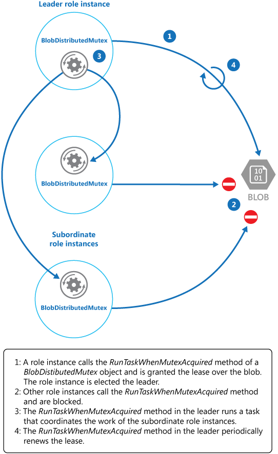

# ‏Leader Election pattern

با انتخاب یک نمونه به عنوان رهبر که مسئولیت مدیریت بقیه را بر عهده می‌گیرد، اقدامات انجام شده توسط مجموعه ای از نمونههای همکار را در یک برنامه توزیع شده هماهنگ و کنترل کنید. این ایده باعث می‌شود که دیگر نمونهها با یک دیگر اختلاف نداشته باشند، اختلافی که باعث ایجاد اختلاف برای مصرف منابع مشترک(shared resources) می‌شود، یا به طور ناخواسته در کاری که نمونه‌های دیگر انجام می‌دهند تداخل ایجاد می‌کنند.

### **طرح صورت مسئله:**

یک cloud application معمولی وظایف زیادی دارد که به صورت هماهنگ عمل می‌کنند. این وظایف همگی می‌توانند نمونه‌هایی باشند که کد یکسانی را اجرا می‌کنند و نیاز به دسترسی به منابع یکسانی دارند یا ممکن است به طور موازی با هم کار کنند تا بخش‌های جداگانه یک محاسبه پیچیده را انجام دهند.

نمونه‌های هر task ممکن است برای بیشتر اوقات به طور جداگانه اجرا شوند یا ممکن است لازم باشد اقدامات هر نمونه با نمونه دیگر نیازمند هماهنگی باشد تا اطمینان حاصل شود که آنها دچار اختلاف و تضاد نیستند یا باعث ایجاد اختلاف بر سر منابع مشترک نمی‌شوند، حتی تا جایی که به طور تصادفی در اجرای تسک خود دچار تداخلی با سایر نمونه‌ها ایجاد شده نشوند.

##### مثلا:

-‏ در یک سیستم مبتنی بر ابری که مقیاس‌دهی افقی یا horizontal scaling را پیاده‌سازی می‌کند، چندین نمونه از یک تسک می‌توانند همزمان با هر نمونه سرویسی با کاربرهای متفاوتی اجرا شوند. اگر این نمونه‌ها در یک منبع مشترک  ذخیره سازی و نوشته می‌شوند پس لازم است اقدامات آنها هماهنگ‌سازی شود تا از بازنویسی یا ذخیره مجدد تغییرات ایجاد شده توسط سایر نمونه‌ها جلوگیری شود.


-‏ اگر تسک‌های یکی از عناصر منفرد که  محاسبات پیچیده را به صورت موازی انجام می‌دهند در این سیسیتم وجود داشته باشد آنگاه باید نتیجه‌ها پس از تکمیل شدن نتیجه همه موارد، تجمیع (aggregate) شوند.

همینطور نمونه‌های هر تسک منحصرد به فرد هستند، بنابراین یک رهبر وجود ندارد که بتواند به عنوان هماهنگ‌کننده(coordinator) یا جمع‌کننده(aggregator) عمل کند.

### راه حل:

فقط یک نمونه تسک باید انتخاب شود تا به عنوان رهبر عمل کند و این نمونه باید اقدامات سایر موارد زیرمجموعه را هماهنگ‌سازی کند. اگر همه تسک‌ها که یک کد را اجرا کنند بتوانند به عنوان رهبر عمل کنند. بنابراین، فرآیند انتخابات(election) باید با دقت مدیریت شود تا از تصاحب همزمان دو یا چند تسک به عنوان leader یا رهبر جلوگیری شود.

سیستم باید مکانیزمی قوی برای انتخاب leader فراهم کند. این روش باید با رویدادهایی مانند قطع شبکه یا خرابی‌های در حین پردازش داده‌ها مقابله کند. در بسیاری از راه‌حل‌ها، نمونه‌ تسک‌های وابسته می‌توانند  leader را از طریق نوعی تکنیک  heartbeat  یا  polling نظارت یا مانیتور کنند. اگر leader تعیین‌شده به‌طور غیرمنتظره‌ای خاتمه یابد یا خرابی شبکه رخ دهد آن‌گاه leader را برای نمونه‌ تسک‌های وابسته از دسترس خارج‌ می‌کند پس در نهایت لازم است که leader جدیدی انتخاب کنند.

چندین استراتژی برای انتخاب یک leader از میان مجموعه ای از وظایف در یک محیط توزیع شده وجود دارد، از جمله:

-‏ انتخاب نمونه تسک (task instance) با کمترین instance rank یا process ID.

-‏ مسابقه برای به دست آوردن یک [mutex](https://stackoverflow.com/a/34556) مشترک و توزیع شده. اولین نمونه وظیفه ای که mutex را بدست می‌آورد leader است. با این حال، سیستم باید اطمینان حاصل کند که در صورت پایان یا قطع ارتباط leader با بقیه سیستم، [mutex](https://stackoverflow.com/a/34556) آزاد می‌شود تا به نمونه تسک دیگری اجازه دهد تا leader یا رهبر شود.

-‏ پیاده سازی یکی از الگوریتم‌های رایج انتخاب رهبر مانند [Bully Algorithm](https://www.cs.colostate.edu/%7Ecs551/CourseNotes/Synchronization/BullyExample.html) یا [Ring Algorithm](https://www.cs.colostate.edu/%7Ecs551/CourseNotes/Synchronization/RingElectExample.html). این الگوریتم‌ها فرض می‌کنند که هر نامزد در انتخابات یک شناسه منحصربه‌فرد(unique ID) دارد و می‌تواند به طور قابل اعتماد با سایر نامزدها ارتباط برقرار کند.

### مسائل و ملاحظات:

هنگام تصمیم گیری در مورد نحوه اجرای این الگو به نکات زیر توجه کنید:

-‏ فرآیند انتخاب leader باید در برابر شکستهای گذرا و مداوم، مقاوم باشد.

-‏ تشخیص اینکه چه زمانی leader دچار خرابی شده است یا غیر قابل دسترسی شده (مثلاً به دلیل نقص ارتباطات) باید امکان پذیر باشد. سرعت تشخیص مورد نیاز در این مورد به سیستم بستگی دارد. برخی از سیستمها ممکن است بتوانند برای مدت کوتاهی بدون leader کار کنند که در طی آن ممکن است یک خطای گذرا برطرف شود. در موارد دیگر، ممکن است لازم باشد فوراً leader failure را تشخیص داده و یک انتخابات (election) جدید راه اندازی شود.

-‏ در سیستمی که horizontal autoscaling را پیاده‌سازی می‌کند، اگر سیستم کوچک(scales back) شود و برخی از منابع محاسباتی را خاموش کند، leader می‌تواند terminated شود.

-‏ استفاده از یک mutex مشترک و توزیع شده یک وابستگی به سرویس خارجی ارائه دهنده mutex ایجاد می‌کند. سرویس یک نقطه شکست واحد را تشکیل می‌دهد. اگر به هر دلیلی از دسترس خارج شود، سیستم قادر به انتخاب leader نخواهد بود.

-‏ استفاده از یک فرآیند اختصاصی واحد (single dedicated process) به عنوان leader یک رویکرد خیلی ساده بوده و با این حال اگر process دچار خرابی شود، ممکن است تاخیر قابل توجهی در هنگام راه اندازی مجدد آن وجود داشته باشد. latency یا تاخیر  حاصل می‌تواند بر کارایی و افزایش زمان پاسخ سایر فرآیندها تأثیر بگذارد به خصوص اگر آنها منتظر leader برای هماهنگ‌سازی عملیات باشند.

-‏ پیاده‌سازی یکی از leader election algorithmها به صورت دستی، بیشترین انعطاف‌پذیری را برای تنظیم و بهینه‌سازی کد فراهم می‌کند.

**چه زمانی از این الگو استفاده کنیم؟**

از این الگو زمانی استفاده کنید که تسک‌ها در یک اپلیکیشن توزیع شده، مانند راه‌حل cloud-hosted، نیاز به هماهنگی دقیق دارند و هیچ leader دقیقی وجود ندارد.

> از تبدیل شدن leader به گلوگاه(bottleneck) در سیستم اجتناب کنید. هدف leader هماهنگ کردن subordinate taskهاست و لزوماً لازم نیست که خود در این کار شرکت کند - اگرچه اگر task به عنوان leader انتخاب نشود باید بتواند این کار را انجام دهد.

**چه زمانی نباید از این الگو استفاده کنیم؟**

-‏ یک leader یا process اختصاصی وجود دارد که همیشه می‌تواند به عنوان leader عمل کند. برای مثال، ممکن است بتوان یک singleton process را پیاده سازی کرد که نمونه تسک‌ها را هماهنگ می‌کند. اگر این process به نوعی fail یا unhealthy شود، سیستم می‌تواند آن را خاموش کرده و دوباره راه اندازی کند.

-‏ هماهنگی بین تسک‌ها را می‌توان با استفاده از روشی سبک تر به دست آورد. به عنوان مثال، اگر چندین نمونه تسک به سادگی نیاز به دسترسی هماهنگ به یک  منبع اشتراکی یا shared resource دارند پس راه حل بهتر استفاده از [optimistic or pessimistic locking](https://virgool.io/@bulwark/%D8%AA%D9%81%D8%A7%D9%88%D8%AA-optimistic-%D9%88-pessimistic-locking-dis3nymz2yp1) برای کنترل دسترسی است.

-‏ معمولا راه حل‌های third-party مناسب تر است. به عنوان مثال، سرویس Microsoft Azure HDInsight (بر اساس Apache Hadoop) از سرویس ارائه شده توسط Apache Zookeeper برای هماهنگ کردن نگاشتی (coordinate the map) و کاهش تسکها که باعث جمع آوری و خلاصه کردن دادهها می‌شود، استفاده می‌کند.

### مثال:

پروژه DistributedMutex در راه‌حل LeaderElection (نمونه‌ای که نشان می‌دهد این الگو در [GitHub]([mutex](https://stackoverflow.com/a/34556)) موجود است) نشان می‌دهد که چگونه می‌توان با استفاده از یک Azure Storage blob برای ارائه مکانیزمی برای اجرای یک mutex مشترک و توزیع‌شده استفاده کرد. این mutex می‌تواند برای انتخاب یک leader در میان گروهی از role instanceها در Azure cloud service استفاده شود. اولین [role instance](https://learn.microsoft.com/en-us/cli/azure/cloud-service/role-instance?view=azure-cli-latest) که [lease](https://learn.microsoft.com/en-us/rest/api/storageservices/lease-blob?tabs=microsoft-entra-id) را به دست می‌آورد، به عنوان leader انتخاب می‌شود و تا زمانی که lease را آزاد نکند یا نتواند مجوز را تمدید کند، leader باقی می‌ماند. در صورتی که leader دیگر در دسترس نباشد، سایر role instanceها می‌توانند به monitor کردن [blob lease](https://learn.microsoft.com/en-us/rest/api/storageservices/lease-blob?tabs=microsoft-entra-id) ادامه دهند.

  

> یک blob lease یک قفل نوشتن انحصاری روی یک blob است. یک blob می‌تواند تنها موضوع یک lease در هر نقطه از زمان باشد. یک role instance می‌تواند یک lease را روی یک blob مشخص درخواست کند، و اگر هیچ role instance دیگری lease را روی همان blob lease نداشته باشد، به آن lease داده می‌شود. در غیر این صورت درخواست یک استثنا ایجاد می‌کند.

> برای جلوگیری از یک role instance معیوب که lease را به طور نامحدود حفظ می‌کند، محدودیت مادام العمر را برای lease تعیین کنید. وقتی این مدت منقضی شد، lease در دسترس می‌شود. با این حال، در حالی که یک role instance یک lease را نگه می‌دارد، می‌تواند درخواست تمدید lease را داشته باشد وleaseبرای مدت زمان بیشتری به آن اعطا می‌شود. اگر role instance بخواهدlease را حفظ کند، می‌تواند به طور مداوم این فرآیند را تکرار کند. برای اطلاعات بیشتر در مورد نحوه lease a blob مقاله؛ [Lease Blob (REST API)](https://learn.microsoft.com/en-us/rest/api/storageservices/lease-blob?tabs=microsoft-entra-id) را ببینید.

کلاس `BlobDistributedMutex` در مثال سی شارپ زیر حاوی متد `RunTaskWhenMutexAcquired` است که یک role instance را قادر می‌سازد تا  توافق نامه را روی یک blob مشخص به دست آورد. هنگامی که شی `BlobDistributedMutex` ایجاد می‌شود، جزئیات blob (نام، container و حساب ذخیره سازی) به سازنده در یک شی `BlobSettings` منتقل می‌شود (این شی یک ساختار ساده است که در کد نمونه گنجانده شده است). سازنده همچنین Task را می‌پذیرد که به کدی ارجاع می‌دهد که role instance باید اجرا کند در صورتی که توافق نامه را با موفقیت در blob به دست آورد و leader انتخاب شده است. توجه داشته باشید که کدی که جزئیات سطح پایین کسب توافق نامه را مدیریت می‌کند در یک کلاس کمکی جداگانه به نام `BlobLeaseManager` پیاده سازی شده است.

```csharp
public class BlobDistributedMutex

{

...

private readonly BlobSettings blobSettings;

private readonly Func<CancellationToken, Task> taskToRunWhenLeaseAcquired;

...

  

public BlobDistributedMutex(BlobSettings blobSettings,

Func<CancellationToken, Task> taskToRunWhenLeaseAcquired)

{

this.blobSettings = blobSettings;

this.taskToRunWhenLeaseAcquired = taskToRunWhenLeaseAcquired;

}

  

public async Task RunTaskWhenMutexAcquired(CancellationToken token)

{

var leaseManager = new BlobLeaseManager(blobSettings);

await this.RunTaskWhenBlobLeaseAcquired(leaseManager, token);

}
```


متد `RunTaskWhenMutexAcquired` در نمونه کد بالا روش `RunTaskWhenBlobLeaseAcquired` را که در نمونه کد زیر نشان داده شده است فراخوانی می‌کند تا در واقع توافق‌نامه را بدست آورد. متد `RunTaskWhenBlobLeaseAcquired` به صورت ناهمزمان اجرا می‌شود. اگر توافق با موفقیت به دست آید، role instance به عنوان leader انتخاب شده است. هدف از `taskToRunWhenLeaseAcquired` نماینده انجام کاری است که سایر role instance را هماهنگ می‌کند. اگر توافق‌نامه تملک نشود، role instance دیگری به عنوان رهبر انتخاب شده است و role `instance` فعلی تابع باقی می‌ماند. توجه داشته باشید که روش `TryAcquireLeaseOrWait` یک روش کمکی است که از شی `BlobLeaseManager` برای به دست آوردن توافق‌نامه استفاده می‌کند.

```csharp
private async Task RunTaskWhenBlobLeaseAcquired(
    BlobLeaseManager leaseManager, CancellationToken token)
  {
    while (!token.IsCancellationRequested)
    {
      // Try to acquire the blob lease.
      // Otherwise wait for a short time before trying again.
      string leaseId = await this.TryAcquireLeaseOrWait(leaseManager, token);

      if (!string.IsNullOrEmpty(leaseId))
      {
        // Create a new linked cancellation token source so that if either the
        // original token is canceled or the lease can't be renewed, the
        // leader task can be canceled.
        using (var leaseCts =
          CancellationTokenSource.CreateLinkedTokenSource(new[] { token }))
        {
          // Run the leader task.
          var leaderTask = this.taskToRunWhenLeaseAcquired.Invoke(leaseCts.Token);
          ...
        }
      }
    }
    ...
  }
```

یک task آغاز شده توسط leader نیز به صورت ناهمزمان اجرا می‌شود. در حالی که این کار در حال اجرا است، متد `RunTaskWhenBlobLeaseAcquired` نشان داده شده در نمونه کد زیر به صورت دوره‌ای سعی می‌کند توافق‌نامه را تمدید کند. این کمک می‌کند تا اطمینان حاصل شود که role instance به عنوان leader باقی می‌ماند. در راه حل نمونه، تاخیر بین درخواستهای تمدید کمتر از زمان مشخص شده برای مدت توافق‌نامه است تا از انتخاب role instance دیگری به عنوان توافق‌نامه جلوگیری شود. اگر تمدید به هر دلیلی ناموفق باشد، کار لغو می‌شود.

اگر توافق‌نامه تمدید نشد یا کار لغو شد (احتمالاً در نتیجه خاموش شدن role instance ، توافق‌نامه آزاد می‌شود. در این مرحله، این یا role instance دیگری ممکن است به عنوان leader انتخاب شود. استخراج کد زیر این بخش از فرآیند را نشان می‌دهد.

```csharp
private async Task RunTaskWhenBlobLeaseAcquired(
    BlobLeaseManager leaseManager, CancellationToken token)
  {
    while (...)
    {
      ...
      if (...)
      {
        ...
        using (var leaseCts = ...)
        {
          ...
          // Keep renewing the lease in regular intervals.
          // If the lease can't be renewed, then the task completes.
          var renewLeaseTask =
            this.KeepRenewingLease(leaseManager, leaseId, leaseCts.Token);

          // When any task completes (either the leader task itself or when it
          // couldn't renew the lease) then cancel the other task.
          await CancelAllWhenAnyCompletes(leaderTask, renewLeaseTask, leaseCts);
        }
      }
    }
  }
  ...
}
```

متد `KeepRenewingLease` یکی دیگر از روشهای کمکی است که از شی `BlobLeaseManager` برای تمدید lease استفاده می‌کند. متد `CancelAllWhenAnyCompletes` وظایف مشخص شده به عنوان دو پارامتر اول را لغو می‌کند. نمودار زیر استفاده از کلاس `BlobDistributedMutex` را برای انتخاب leader و اجرای task ای که عملیات را هماهنگ می‌کند، نشان می‌دهد.




مثال کد زیر نحوه استفاده از کلاس `BlobDistributedMutex` را در نقش worker نشان می‌دهد. این کد بر روی bolb به نام `MyLeaderCoordinatorTask` در lease's container در development storage، مجوز می‌گیرد و مشخص می‌کند که اگر role instance به عنوان leader انتخاب شود، کد تعریف‌شده در متد `MyLeaderCoordinatorTask` باید اجرا شود.

```csharp
var settings = new BlobSettings(CloudStorageAccount.DevelopmentStorageAccount,
  "leases", "MyLeaderCoordinatorTask");
var cts = new CancellationTokenSource();
var mutex = new BlobDistributedMutex(settings, MyLeaderCoordinatorTask);
mutex.RunTaskWhenMutexAcquired(this.cts.Token);
...

// Method that runs if the role instance is elected the leader
private static async Task MyLeaderCoordinatorTask(CancellationToken token)
{
  ...
}
```

در مورد کد نمونه بالا به نکات زیر توجه کنید:


-‏ یک blob یک نقطه به شدت محتمل خرابی است. اگر سرویس blob در دسترس نباشد، یا غیر قابل دسترسی باشد، leader نمی‌تواند توافق‌نامه را تمدید کند و هیچ role instance دیگری نمی‌تواند توافق‌نامه را به دست آورد. در این صورت، هیچ role instance نمی‌تواند به عنوان leader عمل کند. با این حال، سرویس blob به گونه ای طراحی شده است که انعطاف پذیر باشد، بنابراین شکست کامل سرویس blob بسیار بعید در نظر گرفته می‌شود.

-‏ اگر تسکی که توسط leader انجام می‌شود متوقف شود، leader ممکن است به تمدید توافق‌نامه ادامه دهد و از گرفتن توافق‌نامه و به عهده گرفتن نقش leader به منظور هماهنگ کردن تسک‌‌ها جلوگیری کند. در دنیای واقعی، درست کار کردن leader باید در فواصل زمانی مکرر بررسی شود.

-‏ روند انتخابات(election) غیر قطعی است. شما نمی‌توانید هیچ فرضی در مورد اینکه کدام role instance در نهایت توافق‌نامه blob  را به دست می‌آورد و leader می‌شود را ندارید.

-‏ همیشه blob مورد استفاده به عنوان هدف  توافق‌نامه blob نباید برای هیچ هدف دیگری استفاده شود. اگر یک role instance تلاش کند دادهها را در این blob ذخیره کند پس این دادهها قابل دسترسی نخواهند بود مگر اینکه role instance یک leader باشد و blob lease را نگه دارد.


### مراحل بعدی:

راهنمایی زیر ممکن است هنگام اجرای این الگو نیز مرتبط باشد:

-‏ این الگو دارای نمونه کاربردی قابل [دانلود](https://github.com/mspnp/cloud-design-patterns/tree/master/leader-election) می باشد.

-‏ راهنمای [Autoscaling Guidance](https://learn.microsoft.com/en-us/previous-versions/msp-n-p/dn589774(v=pandp.10)). با تغییر load روی برنامه، می‌توان نمونه‌های task host را شروع و متوقف کرد. Autoscaling می‌تواند به حفظ توان و عملکرد در زمان اوج پردازش کمک کند.ری را توضیح می‌دهد به

-‏ راهنمای پارتیشن بندی([Compute Partitioning Guidance](https://learn.microsoft.com/en-us/previous-versions/msp-n-p/dn589773(v=pandp.10)) را محاسبه کنید. این راهنما نحوهallocate task به hostها در یک سرویس اب گونه ای که به حداقل رساندن هزینههای جاری و حفظ scalability، performance، در availability و امنیت سرویس کمک می‌کند.

-‏ الگوی [Task-based Asynchronous pattern](https://learn.microsoft.com/en-us/dotnet/standard/asynchronous-programming-patterns/task-based-asynchronous-pattern-tap).

-‏ مثالی که [Bully Algorithm](https://www.cs.colostate.edu/%7Ecs551/CourseNotes/Synchronization/BullyExample.html) را نشان می‌دهد.

-‏ مثالی که [Ring Algorithm](https://www.cs.colostate.edu/%7Ecs551/CourseNotes/Synchronization/RingElectExample.html) را نشان می‌دهد.

-‏ استفاده از [Apache Curator](https://curator.apache.org/) یک کتابخانه client برای Apache ZooKeeper.

-‏ مقاله[ Lease Blob (REST API)](https://learn.microsoft.com/en-us/rest/api/storageservices/Lease-Blob) در MSDN.