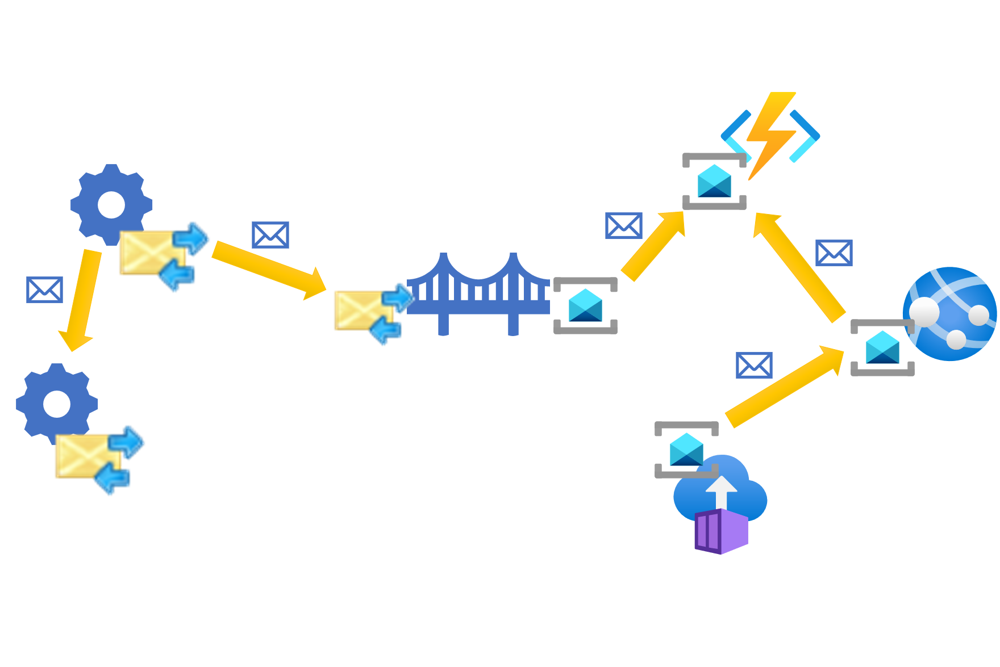

# ‏Messaging Bridge

این مقاله الگوی پل پیام‌رسانی را شرح می‌دهد که در واقع یک روشی است و با کمک  آن می‌توانید برای ادغام سیستم‌های متفاوتی که بر روی زیرساخت‌های پیام‌رسانی مختلف ساخته شده‌اند، بهره بردای مورد نظر را انجام دهید.

## **طرح صورت مسئله:**

بسیاری از سازمان‌ها و workloadها می‌توانند به طور ناخواسته سیستم‌های فناوری اطلاعاتی را داشته باشند که از زیرساخت‌های پیام‌رسانی متعددی مانندMicrosoft Message Queuing (MSMQ)  RabbitMQ، Azure Service Bus و Amazon SQS استفاده می‌کنند. که تنوع زیاد این سرویس‌های می‌تواند باعث مشکلاتی مانند: 

-‏  یک پارچه سازی فرآیند‌ها 

-‏  گسترش و توسعه سیستم‌های on-premises یا داخلی نسبت  سیستم‌های توسعه مبتنی بر میزبان ابری (cloud-hosted)  بسیار پیچیده‌تر است.

-‏ کاهش هزینه‌ها  و سهولت نگهداری برنامه و داده‌ها که در محیط ابری مناسب‌تر است.  

  
توسعه‌ دهندگان ممکن است با اصلاح سیستم‌هایی که برای برقراری ارتباط با استفاده از سرویس‌های وب مبتنی بر HTTP یکپارچه شده اند، این چالش را برطرف کنند. با این حال، این رویکرد دارای معایبی مثل موارد زیر است:  
  
*‏ سیستم‌ها باید با افزودن یک سرویس گیرنده HTTP در یک طرف و یک کنترل کننده درخواست HTTP در طرف دیگر اصلاح شوند. سپس سیستمها باید مجددا آزمایش شده و مجدداً مستقر شوند.  

*‏ آن دسته از ‏endpointهای HTTP باید میزبانی یا host شوند که وقتی این وب سرویس‌ها را با امکاناتی مثل ایمنی  و  دسترسی سطح بالا قرار می‌دهید، پیچیدگی آن افزایش می‌یابد.  

*‏ مشکلات مکرر اتصال به شبکه که نیازمند مکانیزم‌های retry است.

## راه حل

اگر سیستم‌های در حال ادغام از اجزایی تشکیل شده باشند که از طریق تبادل پیام‌ها با هم ارتباط برقرار می‌کنند، الگوی پل پیام‌رسانی ادغام سازی را بهبود می‌بخشد و مشکلات را کاهش می‌دهد.  
  
در این سناریو، هر سیستم به یک زیرساخت پیام رسانی متصل می‌شود. برای ادغام در زیرساختهای پیام رسانی مختلف همیشه یک جزء پل یا واسط را معرفی کنید که به دو یا چند زیرساخت پیام رسانی به طور همزمان متصل می‌شود. پل پیام‌ها را از یکی pull می‌کند و بدون تغییر آن پیام به دیگری push می‌دهد.  
  
سیستم هایی که یکپارچه یا ادغام می‌شوند نیازی به شناسایی سایر سرویس‌ها حتی سرویس  پل یا واسط ندارند. سیستم فرستنده طوری پیکربندی شده است که پیامهای خاصی را به یک صف تعیین شده در زیرساخت پیام رسانی محلی خود ارسال کند. پل آن پیامها را دریافت می‌کند و آنها را به صف دیگری در زیرساخت پیام رسانی دیگری که سیستم گیرنده آنها را دریافت می‌کند را ارسال می‌کند.

### مزایا

*‏ سیستم‌هایی که از طریق پلٍ پیام (Messaging Bridge) ادغام می‌شوند نیازی به اصلاح ندارند. در حالت ایده آل، نقاط پایانی(endpoints) از پل زدن پیامها آگاه نیستند.  

*‏ ادغام در مقایسه با جایگزینی آن با HTTP به دلیل تضمین مکانیزم تحویل پیام به میزان حداقل یک بار، بسیار قابل اعتمادتر است. 

*‏ سناریوهای مهاجرت(Migration) می‌توانند انعطاف پذیرتر باشند. به عنوان مثال، نقاط پایانی (endpoints) را می‌توان از یک زیرساخت پیام رسانی به زیرساخت دیگری منتقل یا migrate کرد چنانکه برنامه زمان بندی شده (schedule)  این اجازه را  می‌دهد و این مورد جایگزین روشهای قدیمی تر مانند همه endpointها به یکباره منتقل شوند است.

### معایب

*‏ ویژگی‌های پیشرفته یک یا هر دو فناوری پیام‌رسانی ممکن است در مسیر پل (bridged route) در دسترس نباشد.  

*‏ مسیر پل شده باید محدودیتهای هر دو فناوری را در نظر بگیرد. به عنوان مثال، حداکثر اندازه پیام ممکن است 4 مگابایت در MSMQ باشد اما این مقدار فقط برابر 64 کیلوبایت در صفهای ذخیره سازی Azure است.

## مسائل و ملاحظات:

هنگام اجرای الگوی پل پیام رسانی به نکات زیر توجه کنید:

*‏ اگر یکی از سیستمهای یکپارچه یا ادغام سازی  به تراکنشهای توزیع شده متکی است، به عنوان مثال Microsoft Distributed Transaction Coordinator (DTC)، برای صحت سنجی بیشتر، باید یک مکانیسم  کپی برداری (deduplication) را در پل پیاده سازی کنید.  
  
*‏ اگر یکی از سیستم‌های در حال ادغام از هیچ زیرساخت پیام‌رسانی استفاده نمی‌کند و نمی‌توان آن را تغییر داد، می‌توانید بین زیرساختی که توسط سیستم دیگر استفاده می‌شود و یک صف شبیه‌سازی شده توسط SQL Server، پل پیام‌رسانی ایجاد کنید. سیستم قدیمی می‌تواند پیام‌ها را با استفاده از قابلیت تغییر ضبط داده ([change data capture](https://learn.microsoft.com/en-us/sql/relational-databases/track-changes/about-change-data-capture-sql-server)) برای SQL Server ارسال کند تا تغییرات خود را به یک جدول صف اختصاصی منتقل کند. پل می‌تواند این پیامها را به زیرساخت پیام رسانی واقعی ارسال کند.  
  
*‏ شما می‌توانید در هر زیرساخت پیام رسانی از یک صف استفاده کنید که به عنوان صف پل (_bridging queue_) زدن تعیین شده است. در این توپولوژی، سیستم ارسال را پیکربندی کنید تا از آن صف خاص به عنوان مقصد برای انواع پیام‌هایی که به سیستم دیگر ارسال می‌شوند استفاده کند. همچنین می‌توانید از چندین جفت صف در هر زیرساخت پیام‌رسانی استفاده کنید، بنابراین فرستنده از وجود پل بی‌اطلاع است. با این کار یک صف سایه(_shadow queue_) برای هر صف مقصد در زیرساخت پیام رسانی سیستم مقصد ایجاد می‌شود. پل پیامها را بین صفهای سایه و همتایان آنها ارسال می‌کند.  
  
*‏ به منظور دستیابی به توافقنامه‌های سطح سرویس در دسترس بودن (service-level agreements (SLAs))، ممکن است لازم باشد پل پیام‌رسانی را با استفاده از رویکرد مصرف‌کنندگان رقابتی([Competing consumers](./Competing%20Consumers%20pattern.md)) کوچک کنید.  
  
*‏ اجزای معمولی پردازش پیام‌ها از الگوی [Retry](./Retry%20pattern.md) برای رسیدگی به خرابیهای گذرا استفاده می‌کنند. محدودیت شمارنده retry به اجزای سازنده امکان می‌دهد پیامهای سمی را شناسایی کرده و آنها را از صف حذف کنند تا پردازش را رفع انسداد کنند. اگر خرابی زیرساخت رخ دهد، ممکن است پل به سیاست retry متفاوتی نیاز داشته باشد تا از شناسایی نادرست پیام‌ها به عنوان سم جلوگیری کند. ممکن است از الگوی  [Circuit Breaker](./Circuit%20Breaker%20pattern.md) برای توقف موقت ارسال استفاده کنید.

## **چه زمانی از این الگو استفاده کنیم؟**

در صورت نیاز از الگوی پل پیام‌رسانی استفاده کنید:

*‏ سیستمهای موجود را با حداقل نیاز به اصلاح یکپارچه یا ادغام کنید. 

*‏ برنامههای قدیمی را که نمی‌توانند از سایر فناوریهای پیام رسانی استفاده کنند، ادغام کنید.  

*‏ برنامههای موجود در محل یا on-premises را با مؤلفههای میزبان ابری گسترش دهید.  

*‏ هنگامی که اتصال اینترنت پایدار نیست، سیستم‌های توزیع‌شده جغرافیایی (geo-distributed) را متصل کنید.  

*‏ انتقال تدریجی یک سیستم توزیع شده از یک زیرساخت پیام رسانی به زیرساخت دیگر بدون نیاز به انتقال  یک مرتبه کل سیستم.

این الگو ممکن است مناسب نباشد اگر:

*‏ حداقل یکی از سیستم‌های درگیر به ویژگی یکی از زیرساخت‌های پیام‌رسانی متکی است که در دیگری وجود ندارد.  

*‏ ادغام سازی ماهیت همزمان دارد و سیستم آغازگر نیاز به پاسخ فوری دارد.  

*‏ ادغام سازی الزامات عملکردی یا غیرعملکردی خاصی مانند نگرانیهای امنیتی یا حفظ حریم خصوصی دارد.  

*‏ حجم داده برای یکپارچه سازی بیش از ظرفیت سیستم پیام رسانی است یا پیام رسانی را به یک راه حل گران قیمت برای حل این مشکل تبدیل می‌کند.

## مثال

این مثال در مورد یک برنامه یا application است که با NET framework برای مدیریت برنامه ریزی کارمندان به صورت  میزبانی در محل (hosted on-premises) نوشته شده است. این برنامه با مؤلفههای جداگانه از طریق MSMQ به خوبی ساختار یافته است. این برنامه به خوبی کار میکنه و تیم مربوط به مسایل workload قصد بازنویسی آن را ندارد.  برای تأمین نیازمندیهای تجاری، یک مصرف کننده جدید از دادههای برنامه ریزی شده باید ساخته شود و استراتژی IT خواستار ساختن نرم افزار جدید به عنوان cloud-native application برای بهینه سازی هزینه‌ها و زمان پاسخ دهی‌ها است.  
  
معماری مبتنی بر صف ناهمزمان (asynchronous queue-based) در گذشته برای تیم workload کار می‌کرد، بنابراین تیم قصد دارد از همان رویکرد معماری اما با فناوری مدرن Service Bus استفاده کند. تیم workload نمی‌خواهد ارتباطات همزمان بین محیط ابری و محیط  استقرار در محل (on-premises deployment) را برای کاهش تأخیر یا عدم دسترسی به شخص تحت تأثیر دیگری معرفی کند.  
  
این تیم تصمیم می‌گیرد از الگوی پل پیام رسانی برای اتصال این دو سیستم استفاده کند. این الگوی از دو بخش تشکیل شده است. یک قسمت پیام هایی را از صف MSMQ موجود دریافت می‌کند و آنها را به Service Bus منتقل می‌کند. بخش دیگر پیام هایی را از Service Bus می‌گیرد و آنها را به صف MSMQ مورد نظر منتقل می‌کند.

هنگامی که تیم پیاده سازی از این رویکرد استفاده می‌کند، در واقع از زیرساخت موجود در برنامه برای ادغام با اجزای جدید استفاده می‌کند. برنامه موجود نمی‌داند که اجزای جدید در Azure میزبانی می‌شوند. به طور مشابه، اجزای جدید با برنامه قدیمی به همان روشی که بین خود ارتباط برقرار می‌کنند با ارسال پیامهای Service Bus ارتباط برقرار می‌کنند در نتیجه پل پیامها را بین دو سیستم ارسال می‌کند.

## مشارکت کننده‌ها

این مقاله توسط مایکروسافت نگهداری می‌شود. در اصل توسط مشارکت کنندگان زیر نوشته شده است.

  
نویسندگان اصلی:

- [Rob Bagby](https://www.linkedin.com/in/robbagby) | Principal Architecture Content Lead
- [Kyle Baley](https://www.linkedin.com/in/kylebaley) | Software Engineer
- [Udi Dahan](https://www.linkedin.com/in/udidahan) | Founder & CEO of Particular Software
- [Chad Kittel](https://www.linkedin.com/in/chadkittel) | Principal Software Engineer
- [Bryan Lamos](https://www.linkedin.com/in/bryanlamos) | Developer Relations
- [Szymon Pobiega](https://www.linkedin.com/in/szymonpobiega) | Engineer

## Next steps

-‏ شرح الگوی پل پیام رسانی ([Messaging Bridge pattern description](https://www.enterpriseintegrationpatterns.com/patterns/messaging/MessagingBridge.html)) از  الگوهای یکپارچه سازی سازمانی.

-‏ یاد بگیرید که چگونه یک پل پیام رسانی ([Messaging Bridge](https://docs.spring.io/spring-integration/reference/bridge.html)) را در چارچوب Spring Java پیاده سازی کنید. 

-‏ می‌توان از  [QPid bridge](https://openmama.finos.org/openmama_qpid_bridge.html)  برای پل زدن فناوریهای پیام رسانی با AMQP فعال کرد.  

-‏ یک [NServiceBus Messaging Bridge](https://docs.particular.net/nservicebus/bridge) که بیانگر پیاده سازی دات نت از یک پل صف به صف است و از طیفی از زیرساختهای پیام رسانی از جمله MSMQ، Service Bus و Azure Queue Storage پشتیبانی می‌کند.  

-‏ استفاده از [NServiceBus.Router](https://github.com/SzymonPobiega/NServiceBus.Router) یک پروژه متن باز است که الگوی Messaging Bridge را پیاده سازی می‌کند. همچنین امکان پل زدن بیش از دو فناوری را در یک نمونه واحد فراهم می‌کند و دارای قابلیتهای پیشرفته مسیریابی پیام است.

## Related resources

-‏ الگوی مصرف‌کنندگان رقابتی ([Competing Consumers](./Competing%20Consumers%20pattern.md)) تضمین می‌کند که پیاده‌سازی پل پیام‌رسان می‌تواند انوع بار را تحمل کند.  

-‏ الگوی [Retry](./Retry%20pattern.md) به پل پیام‌رسانی اجازه می‌دهد تا خرابی‌های گذرا را مدیریت کند.  

-‏ الگوی [Circuit Breaker](./Circuit%20Breaker%20pattern.md) زمانی که هر طرف پل دچار خرابی می‌شود، منابع مصرفی را حفظ و مدیریت می‌کند.