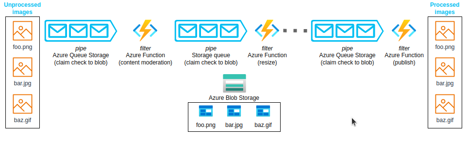

# Pipes and Filters pattern
وظیفه یا task ‌ای را که پردازش پیچیده ‌ای را انجام می‌دهد به یک سری عناصر جداگانه که می‌توانند دوباره استفاده شوند تجزیه کنید. انجام این کار می‌تواند عملکرد، مقیاس‌پذیری و قابلیت استفاده مجدد برنامه را با دسترسی دادن به اجزای تسک‌ای که پردازش را انجام می‌دهند و به طور مستقل deploy و scale  می‌شوند را بهبود بخشد.
### **زمینه و مشکل**

یک برنامه یا اپلیکیشن می‌تواند وظایف مختلفی را انجام دهد که از نظر پیچیدگی در اطلاعاتی که پردازش می‌کند متفاوت است. یک رویکرد ساده اما غیر قابل انعطاف برای اجرای یک اپلیکیشن، انجام این پردازش در یک ماژول یکپارچه است. با این حال این رویکرد احتمالاً فرصت‌‌های refactoring و بهینه‌سازی یا استفاده مجدد از کد را در صورتی که بخش‌‌هایی از همان پردازش در جای دیگری در برنامه مورد نیاز باشد را کاهش می‌دهد.  
  
نمودار زیر مشکلات پردازش داده‌ها را با استفاده از رویکرد یکپارچه نشان می‌دهد. یک اپلیکیشن داده‌ها را از دو منبع دریافت و پردازش می‌کند. داده‌های هر منبع توسط یک ماژول جداگانه پردازش می‌شود که یک سری تسک را برای تبدیل داده‌ها قبل از انتقال نتیجه به منطق تجاری (business logic) برنامه انجام می‌دهد.


برخی از تسک‌‌هایی که ماژول‌های یکپارچه انجام می‌دهند از نظر عملکردی مشابه هستند، اما ماژولها به طور جداگانه طراحی شده اند. کدی که وظایف را پیاده‌سازی می‌کند در یک ماژول به صورت محکم جفت شده یا (closely coupled) است. همینطور استفاده مجدد (reuse) و مقیاس پذیری(scalability) در طول توسعه در نظر گرفته نشد.  
  
با این حال تسک‌‌های پردازشی انجام شده توسط هر ماژول یا الزامات استقرار آن برای هر تسک خاص ممکن است با به روز رسانی در سیاست‌‌های تجاری برنامه تغییر کند. برخی از تسک‌ها ممکن است کار‌های محاسباتی فشرده ‌ای باشند که می‌توانند از اجرای بر روی سخت افزار قدرتمند بهره‌مند شوند. سایر تسک‌ها ممکن است به چنین منابع گران قیمتی نیاز نداشته باشند. همچنین ممکن است در آینده به پردازش بیشتری نیاز باشد یا ترتیب انجام وظایف پردازش احتمالا تغییر کند. درنهایت راه حلی برای رفع این مشکلات و افزایش احتمال استفاده مجدد از کد مورد نیاز است.


## راه حل

پردازش مورد نیاز برای هر جریان را به مجموعه‌ای از مؤلفه‌ها (یا فیلترها) جداگانه تقسیم کنید که هر کدام یک کار واحد را انجام می‌دهند. برای دستیابی به یک فرمت استاندارد از داده‌هایی که هر جزء دریافت و ارسال می‌کند، می‌توان فیلترها را می‌توان دریک pipeline ترکیب کرد. انجام این کار از تکرار کد جلوگیری می‌کند و حذف یا جایگزینی اجزا یا ادغام اجزای اضافی را در صورت تغییر نیاز‌های پردازشی بسیار آسان می‌کند. این نمودار راه حلی را نشان می‌دهد که با pipeها و فیلترها پیاده سازی شده است:


مدت زمان پردازش یک درخواست، به سرعت کندترین فیلترها در pipeline بستگی دارد. یک یا چند فیلتر می‌تواند مشابه گلوگاه عمل کند، به خصوص اگر تعداد زیادی درخواست در یک جریان از یک منبع داده خاص ظاهر شود. مزیت اصلی ساختار pipeline‌ ‌ای این است که فرصت‌هایی را برای اجرای نمونه‌های موازی فیلتر‌های کم سرعت  فراهم می‌کند که سیستم را قادر پخش کردن بار را  می‌کند که در نتیجه توان عملیاتی را بهبود ‌می‌بخشد.  
  
فیلتر‌هایی که یک pipeline‌ را تشکیل می‌دهند می‌توانند روی ماشین‌‌های مختلف اجرا شوند که به آنها این امکان را می‌دهد که به طور مستقل scale شوند و از خاصیت elasticity که بسیاری از محیط‌‌های ابری ارائه می‌دهند بهره ببرند. فیلتری که از نظر محاسباتی فشرده است، می‌تواند روی سخت‌افزار با کارایی بالا اجرا شود، در حالی که فیلتر‌های کم‌تقاضا روی سخت‌افزار کالایی ارزان‌تر میزبانی می‌شوند. حتی نیازی نیست که فیلترها در یک datacenter یا موقعیت جغرافیایی یکسان باشند، بنابراین هر عنصر در یک pipeline‌ در محیطی نزدیک به منابع مورد نیاز اجرا می‌شود. این نمودار نمونه ‌ای را نشان می‌دهد که برای داده‌های Source 1 روی pipeline‌ اعمال شده است:


اگر ورودی و خروجی یک فیلتر به صورت جریانی ساختار یافته باشد، می‌توانید پردازش هر فیلتر را به صورت موازی انجام دهید. اولین فیلتر در pipeline‌ می‌تواند کار خود را شروع کند و نتایج خود را خروجی دهد که قبل از اینکه فیلتر اول کار خود را کامل کند مستقیماً به ترتیب به فیلتر بعدی منتقل می‌شود.  
  
یکی دیگر از مزایای این مدل انعطاف پذیری است که می‌تواند ارائه دهد. اگر فیلتری از کار بیفتد یا دستگاهی که روی آن کار می‌کند دیگر در دسترس (available) نباشد، pipeline‌ می‌تواند کاری را که فیلتر انجام می‌داد تغییر دهد و آن را به نمونه دیگری از اجزا هدایت کند. همینطور خرابی یک فیلتر لزوماً منجر به خرابی کل pipeline‌ نمی‌شود.  
  
استفاده از الگوی لوله‌ها و فیلترها همراه با الگوی [Compensating Transaction pattern](https://learn.microsoft.com/en-us/azure/architecture/patterns/compensating-transaction) یک رویکرد جایگزین برای اجرای تراکنش‌‌های توزیع‌شده (distributed transactions) است. شما می‌توانید یک تراکنش توزیع شده را به تسک‌‌های جداگانه و قابل جبران (compensable) تقسیم کنید که هر یک از آنها می‌توانند از طریق فیلتری که الگوی  Compensating Transaction را نیز پیاده سازی می‌کند، پیاده سازی شوند. می‌توانید فیلترها را در یک pipeline‌ به‌عنوان تسک‌‌های میزبان و جداگانه که نزدیک به داده‌‌هایی که آنها نگهداری می‌کنند اجرا کنید.

### مسائل و ملاحظات:

هنگام تصمیم گیری در مورد نحوه اجرای این الگو به نکات زیر توجه کنید:  
  
*‏ **پیچیدگی(Complexity)**. افزایش انعطاف‌پذیری که این الگو فراهم می‌کند باعث افزایش پیچیدگی نیز می‌شود، به خصوص اگر فیلترها در pipeline‌ در سرور‌های مختلف توزیع شوند.  
  
*‏ **قابلیت اطمینان(Reliability)**. از زیرساختی استفاده کنید که تضمین کند جریان داده‌ها بین فیلترها در pipeline‌ از بین نمی‌روند.  
  
*‏ **ناتوانی(Idempotency)**. اگر فیلتری در pipeline‌ پس از دریافت پیام از کار بیفتد و این کار به نمونه دیگری از این فیلتر تغییر کند، بخشی از این کار ممکن است انجام شود. اگر کار برخی از جنبه‌های این وضعیت global را به روزرسانی کند (مانند اطلاعات ذخیره شده در یک پایگاه داده)، یک به روز رسانی ساده می‌تواند تکرار شود. اگر فیلتری  قبل از اینکه نشان دهد کار خود را با موفقیت به پایان رساند در حال ارسال نتایج به فیلتر بعدی در pipeline‌ باشد احتمالا مشکل مشابه حالت قبل ممکن است رخ دهد. در این موارد، همان کار می‌تواند توسط نمونه دیگری از فیلتر تکرار شود و باعث شود نتایج یکسان دو بار ارسال شود. این سناریو می‌تواند منجر به فیلتر‌های بعدی در pipeline‌ شود که همان داده‌ها را دو بار پردازش می‌کند. بنابراین، فیلترها در یک pipeline‌ باید به گونه ‌ای طراحی شوند که فاقد این توانایی باشند. برای اطلاعات بیشتر، الگو‌های  [Idempotency Patterns](https://blog.jonathanoliver.com/idempotency-patterns) را در وبلاگ Jonathan Oliver's ببینید.  
  
*‏ **پیام‌های تکراری(Repeated messages).** اگر فیلتری در pipeline‌ پس از ارسال پیام به مرحله بعدی pipeline‌ از کار بیفتد در نتیجه ممکن است نمونه دیگری از فیلتر اجرا شود و یک کپی از همان پیام را به pipeline‌ ارسال کند. این سناریو می‌تواند باعث شود دو نمونه از یک پیام به فیلتر بعدی منتقل شود. برای جلوگیری از این مشکل pipeline‌ باید پیام‌های تکراری را شناسایی و حذف کند.

```
توجه داشته باشید  
  
اگر pipeline‌ را با استفاده از صف‌‌های پیام (message queues) (مانند Azure Service Bus queues) پیاده‌سازی کنید، زیرساخت message queues ممکن است شناسایی و حذف خودکار پیام تکراری را فراهم کند.
```

*‏ **زمینه و حالت(Context and state)**. در یک pipeline‌، هر فیلتر اساسا به صورت مجزا اجرا می‌شود و نباید هیچ فرضی در مورد نحوه فراخوانی آن داشته باشد. بنابراین، هر فیلتر باید زمینه و اطلاعات کافی برای انجام کار خود را داشته باشد. این زمینه می‌تواند مقدار قابل توجهی از اطلاعات state را شامل شود.

### **چه زمانی از این الگو استفاده کنیم؟**

*‏ پردازش مورد نیاز یک برنامه به راحتی می‌تواند به مجموعه ‌ای از مراحل مستقل تقسیم شود.  
  
*‏ مراحل پردازش انجام شده توسط یک application دارای الزامات مقیاس پذیری (scalability) متفاوتی هستند.

```
توجه داشته باشید  
  
می توانید فیلتر‌هایی را که باید در یک فرآیند با هم مقیاس شوند گروه بندی کنید. برای اطلاعات بیشتر، الگوی [Compute Resource Consolidation pattern](https://learn.microsoft.com/en-us/azure/architecture/patterns/compute-resource-consolidation) را بررسی کنید.
```

*‏ برای اجازه دادن به ترتیب مجدد مراحل پردازشی که توسط یک application انجام می‌شود، یا امکان افزودن و حذف مراحل، به قابلیت انعطاف پذیری (flexibility) نیاز دارید.  
  
*‏ این سیستم می‌تواند از توزیع منابع پردازشی برای هر مرحله  در سرور‌های مختلف بهره مند شود.  
  
*‏ شما به یک راه حل قابل اعتماد نیاز دارید که اثرات شکست و failure را در یک مرحله در حین پردازش داده‌ها به حداقل برساند.  
  
این الگو ممکن است زمانی مفید نباشد که:  
  
*‏ مراحل پردازش انجام شده توسط یک برنامه مستقل نیستند، یا باید با هم به عنوان بخشی از یک تراکنش واحد انجام شوند.  
  
*‏ مقدار state information  یا موقعیتی که برای یک مرحله مورد نیاز است، این رویکرد را ناکارآمد می‌کند. ممکن است بتوانید state information را در یک پایگاه داده حفظ کنید، اما اگر بار اضافی روی پایگاه داده باعث درگیری و تضاد بیش از حد شود، از این استراتژی استفاده نکنید.

## مثال

شما می‌توانید از دنباله ‌ای از message queuesها را برای ارائه زیرساخت‌های مورد نیاز برای اجرای pipeline‌ استفاده کنید. یک message queue اولیه پیام‌های پردازش نشده را دریافت می‌کند. مؤلفه‌ای که به‌عنوان یک تسک برای فیلتر پیاده‌سازی می‌شود، به پیامی در این صف گوش می‌دهد و در ادامه کار خود را انجام می‌دهد و سپس پیام تبدیل‌شده را به صف بعدی در این توالی ارسال می‌کند. یکی دیگر از وظایف فیلتر می‌تواند به پیام‌‌های موجود در این صف گوش دهد، آنها را پردازش کند، نتایج را در صف دیگری ارسال کند و ادامه دهد تا زمانی که داده‌‌های کاملاً تبدیل‌شده(transformed) در پیام نهایی در صف ظاهر شوند. این نمودار pipeline‌ ‌ای را نشان می‌دهد که ازmessage queues استفاده می‌کند:





<mark style="background: #FF5582A6;">توجه: در نسخه جدید سند مایکروسافت  این متن عوض شده</mark>

اگر در حال ساخت راه‌حلی در Azure هستید، می‌توانید از Service Bus queues برای ارائه یک مکانیسم صف قابل اعتماد (reliable) و مقیاس‌پذیر (scalable) استفاده کنید. کلاس  `ServiceBusPipeFilter` نشان داده شده در کد سی شارپ زیر نشان می‌دهد که چگونه می‌توانید فیلتری را پیاده سازی کنید که پیام‌های ورودی را از یک صف دریافت می‌کند و سپس پیامها را پردازش می‌کند و نتایج را در صف دیگری ارسال می‌کند.


```
توجه داشته باشید  
  
کلاس `ServiceBusPipeFilter` در پروژه PipesAndFilters.Shared تعریف شده است که در  [GitHub](https://github.com/mspnp/cloud-design-patterns/tree/master/pipes-and-filters) در دسترس است.
```

```csharp
public class ServiceBusPipeFilter
{
  ...
  private readonly string inQueuePath;
  private readonly string outQueuePath;
  ...
  private QueueClient inQueue;
  private QueueClient outQueue;
  ...

  public ServiceBusPipeFilter(..., string inQueuePath, string outQueuePath = null)
  {
     ...
     this.inQueuePath = inQueuePath;
     this.outQueuePath = outQueuePath;
  }

  public void Start()
  {
    ...
    // Create the outbound filter queue if it doesn't exist.
    ...
    this.outQueue = QueueClient.CreateFromConnectionString(...);

    ...
    // Create the inbound and outbound queue clients.
    this.inQueue = QueueClient.CreateFromConnectionString(...);
  }

  public void OnPipeFilterMessageAsync(
    Func<BrokeredMessage, Task<BrokeredMessage>> asyncFilterTask, ...)
  {
    ...

    this.inQueue.OnMessageAsync(
      async (msg) =>
    {
      ...
      // Process the filter and send the output to the
      // next queue in the pipeline.
      var outMessage = await asyncFilterTask(msg);

      // Send the message from the filter processor
      // to the next queue in the pipeline.
      if (outQueue != null)
      {
        await outQueue.SendAsync(outMessage);
      }

      // Note: There's a chance that the same message could be sent twice
      // or that a message could be processed by an upstream or downstream
      // filter at the same time.
      // This would happen in a situation where processing of a message was
      // completed, it was sent to the next pipe/queue, and it then failed
      // to complete when using the PeekLock method.
      // In a real-world implementation, you should consider idempotent message 
      // processing and concurrency.     
    },
    options);
  }

  public async Task Close(TimeSpan timespan)
  {
    // Pause the processing threads.
    this.pauseProcessingEvent.Reset();

    // There's no clean approach for waiting for the threads to complete
    // the processing. This example simply stops any new processing, waits
    // for the existing thread to complete, closes the message pump,
    // and finally returns.
    Thread.Sleep(timespan);

    this.inQueue.Close();
    ...
  }

  ...
}
```

متد  `Start` در کلاس  `ServiceBusPipeFilter` به یک جفت صف ورودی و خروجی متصل می‌شود و متد  `Close` از صف ورودی جدا می‌شود. متد  `OnPipeFilterMessageAsync` پردازش واقعی پیامها را انجام می‌دهد و پارامتر  `asyncFilterTask` این روش پردازشی را که باید انجام شود را مشخص می‌کند. روش  `OnPipeFilterMessageAsync` منتظر پیام‌های دریافتی در صف ورودی است، کد مشخص شده توسط پارامتر  `asyncFilterTask` را بر روی هر پیامی که می‌رسد اجرا می‌کند و نتایج را در صف خروجی ارسال می‌کند. صفها توسط سازنده (constructor) مشخص می‌شوند.  
  
این مثال  نمونه کاربردی از پیاده سازی فیلترها را در مجموعه ‌ای از worker roleها را نشان می‌دهد. هر  worker role بسته به پیچیدگی پردازشی که انجام می‌دهد یا منابعی که برای پردازش مورد نیاز است، می‌تواند به طور مستقل scale شود. علاوه بر این، چندین نمونه از هرworker role را می‌توان به صورت موازی اجرا کرد تا توان عملیاتی را بهبود بخشد.  
  
کد زیر یک Azure worker role به نام  `PipeFilterARoleEntry`  را نشان می‌دهد که در پروژه PipeFilterA در مثال زیر تعریف شده است.


```csharp
public class PipeFilterARoleEntry : RoleEntryPoint
{
  ...
  private ServiceBusPipeFilter pipeFilterA;

  public override bool OnStart()
  {
    ...
    this.pipeFilterA = new ServiceBusPipeFilter(
      ...,
      Constants.QueueAPath,
      Constants.QueueBPath);

    this.pipeFilterA.Start();
    ...
  }

  public override void Run()
  {
    this.pipeFilterA.OnPipeFilterMessageAsync(async (msg) =>
    {
      // Clone the message and update it.
      // Properties set by the broker (Deliver count, enqueue time, ...)
      // aren't cloned and must be copied over if required.
      var newMsg = msg.Clone();

      await Task.Delay(500); // DOING WORK

      Trace.TraceInformation("Filter A processed message:{0} at {1}",
        msg.MessageId, DateTime.UtcNow);

      newMsg.Properties.Add(Constants.FilterAMessageKey, "Complete");

      return newMsg;
    });

    ...
  }

  ...
}
```

این نقش حاوی یک شی  `ServiceBusPipeFilter` است. متد  `OnStart` در این role به صف‌هایی که پیام‌های ورودی را دریافت می‌کنند و پیام‌های خروجی ارسال می‌کنند متصل می‌شود. (نام صفها در کلاس Constants تعریف شده است). متد  `Run` در نهایت متد `OnPipeFilterMessageAsync` را برای انجام پردازش روی هر پیامی که دریافت می‌شود فراخوانی می‌کند. (در این مثال، پردازش‌ها با تاخیری محدودی برای مدت کوتاهی، شبیه سازی می‌شود). هنگامی که پردازش کامل شد، یک پیام جدید ساخته می‌شود که حاوی نتایج است (در این حالت یک ویژگی سفارشی به پیام ورودی اضافه می‌شود) و این پیام به صف خروجی ارسال می‌شود.  
  
نمونه کد حاوی worker role دیگری به نام  `PipeFilterBRoleEntry` است. این گزینه در پروژه `PipeFilterB` موجود است. این نقش شبیه  `PipeFilterARoleEntry` است اما پردازش‌های متفاوتی را در متد  `Run` انجام می‌دهد. در روش حل مربوط به این مثال، این دو نقش (role) برای ساخت یک pipeline‌ ترکیب می‌شوند. صف خروجی برای نقش `PipeFilterARoleEntry` صف ورودی برای نقش `PipeFilterBRoleEntry` است.  
  
راه حل مربوط به این مثال همچنین دو نقش دیگر به نام‌های  `InitialSenderRoleEntry` (در پروژه `InitialSender`) و  `FinalReceiverRoleEntry` (در پروژه `FinalReceiver`) ارائه می‌دهد. نقش  `InitialSenderRoleEntry` پیام اولیه را در pipeline‌ ارائه می‌دهد. متد `OnStart` به یک صف متصل می‌شود و متد  `Run` یک متد دیگر را در آن صف ارسال می‌کند. این صف، صف ورودی است که توسط نقش  `PipeFilterARoleEntry` استفاده می‌شود، بنابراین ارسال یک پیام به آن باعث می‌شود که پیام توسط نقش  `PipeFilterARoleEntry` دریافت و پردازش شود. سپس پیام پردازش شده از نقش `PipeFilterBRoleEntry` عبور می‌کند.  
  
صف ورودی برای نقش  `FinalReceiveRoleEntry` برابر صف خروجی برای نقش `PipeFilterBRoleEntry` است. متد  `Run` در نقش  `FinalReceiveRoleEntry` که در کد زیر نشان داده شده است، پیام را دریافت کرده و پردازش نهایی را انجام می‌دهد. سپس مقادیر ویژگی‌های سفارشی اضافه شده توسط فیلتر‌های موجود در pipeline‌ را به خروجی قسمت trace می‌نویسد.

```csharp
public class FinalReceiverRoleEntry : RoleEntryPoint
{
  ...
  // Final queue/pipe in the pipeline to process data from.
  private ServiceBusPipeFilter queueFinal;

  public override bool OnStart()
  {
    ...
    // Set up the queue.
    this.queueFinal = new ServiceBusPipeFilter(...,Constants.QueueFinalPath);
    this.queueFinal.Start();
    ...
  }

  public override void Run()
  {
    this.queueFinal.OnPipeFilterMessageAsync(
      async (msg) =>
      {
        await Task.Delay(500); // DOING WORK

        // The pipeline message was received.
        Trace.TraceInformation(
          "Pipeline Message Complete - FilterA:{0} FilterB:{1}",
          msg.Properties[Constants.FilterAMessageKey],
          msg.Properties[Constants.FilterBMessageKey]);

        return null;
      });
    ...
  }

  ...
}
```

## قدم بعدی

هنگام اجرای این الگو ممکن است منابع زیر برای شما مفید باشد:  
  
نمونه ‌ای که این الگو را در  [GitHub](https://github.com/mspnp/cloud-design-patterns/tree/master/pipes-and-filters) نشان می‌دهد  
الگو‌های [Idempotency patterns](https://blog.jonathanoliver.com/idempotency-patterns)، در وبلاگ جاناتان الیور

## منابع مرتبط

الگو‌های زیر ممکن است هنگام اجرای این الگو نیز مرتبط باشند:  
  
* الگوی [Competing Consumers pattern](https://learn.microsoft.com/en-us/azure/architecture/patterns/competing-consumers). یک pipeline‌ می‌تواند شامل چندین نمونه از یک یا چند فیلتر باشد. این رویکرد برای اجرای نمونه‌های موازی فیلتر‌های کند و غیر سریع مناسب است. این مورد سیستم را قادر می‌سازد تا بار را پخش کند و توان عملیاتی را بهبود بخشد. هر نمونه از یک فیلتر برای ورودی با نمونه‌های دیگر رقابت می‌کند، اما دو نمونه از یک فیلتر نباید قادر به پردازش داده‌های مشابه باشند. این مقاله در واقع این رویکرد را توضیح می‌دهد.  
*  الگوی [Compute Resource Consolidation pattern](https://learn.microsoft.com/en-us/azure/architecture/patterns/compute-resource-consolidation). ممکن است بتوان فیلتر‌هایی را گروه بندی کرد که باید در یک فرآیند واحد scale شوند. این مقاله اطلاعات بیشتری در مورد مزایا و معاوضه‌های این استراتژی ارائه می‌دهد.  
* الگوی ([Compensating Transaction pattern](https://learn.microsoft.com/en-us/azure/architecture/patterns/compensating-transaction)) می‌توانید یک فیلتر را به‌عنوان عملیاتی که می‌توان معکوس کرد یا دارای یک عملیات جبران‌کننده است که در صورت بروز مشکل، حالت را به نسخه قبلی بازیابی می‌کند، پیاده‌سازی کنید. این مقاله توضیح می‌دهد که چگونه می‌توانید این الگو را برای حفظ یا دستیابی به یکپارچگی تدریجی(eventual consistency) پیاده سازی کنید.

