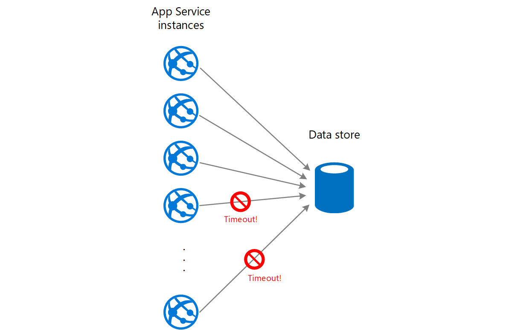

# ‏Queue-Based Load Leveling pattern

از صفی استفاده کنید که به عنوان یک بافر بین یک تسک و سرویسی که آن را فراخوانی می‌کند، عمل می‌کند تا بارهای سنگین متناوب را که می‌توانند باعث از کار افتادن سرویس یا  time-out تسک شوند را هموار کند. این مورد می‌تواند جهت به حداقل رساندن تأثیر اوج تقاضا روی در دسترس بودن(availability) و پاسخگویی (responsiveness) هم برای تسک و هم برای سرویس کمک کند.

### **طرح صورت مسئله:**

بسیاری از راه حلها در فضا و معماری ابری شامل اجرای تسک‌هایی است که سرویس هایی را فراخوانی می‌کنند. در این محیط، اگر سرویسی تحت بارهای سنگین متناوبی قرار گیرد، می‌تواند باعث مشکلاتی در کارایی یا  اطمینان سنجی (reliability) شود.  
  
یک سرویس می‌تواند بخشی از همان راه‌حلی باشد که تسک‌هایش که از آن استفاده می‌کنند یا می‌تواند یک سرویس شخص ثالث(third-party) باشد که دسترسی به منابع پرکاربرد مانند حافظه پنهان(cache) یا سرویس ذخیره‌سازی را فراهم می‌کند. اگر از همان سرویسی که توسط تعدادی از تسک‌هایی که به طور همزمان اجرا می‌شوند استفاده شود، پیش بینی حجم درخواستهای سرویس در هر زمان ممکن است دشوار باشد.  
  
یک سرویس ممکن است حالت اوج تقاضا را تجربه کند که باعث می‌شود بیش از حد بارگذاری شود و نتواند به درخواستها به موقع پاسخ دهد. تعداد زیاد درخواست همزمان روی سرویس  در صورتی که نتواند پاسخ به حجم بالایی از این درخواست‌ها پاسخ دهی کند، می‌تواند منجر به شکست سرویس شود.

## راه حل

راه حل را اصلاح کنید و یک صف بین تسک و سرویس تعریف کنید. تسک و سرویس به صورت ناهمزمان اجرا می‌شوند. تسک پیامی حاوی دادههای مورد نیاز سرویس را به یک صف ارسال می‌کند. صف به عنوان یک بافر عمل می‌کند و پیام را تا زمانی که توسط سرویس بازیابی شود ذخیره می‌کند. این سرویس پیامها را از صف بازیابی می‌کند و آنها را پردازش می‌کند. درخواست‌های تعدادی از تسک‌ها که می‌توانند با نرخ تغییرات بسیار  تولید شوند، می‌توانند از طریق همان صف پیام به سرویس ارسال شوند. این شکل استفاده از یک صف برای تراز کردن بار روی یک سرویس را نشان می‌دهد.

صف، تسک‌ها را از سرویس جدا می‌کند و سرویس می‌تواند پیام‌ها را بدون توجه به حجم درخواست‌های تسک‌ها همزمان با سرعت خودش مدیریت کند. علاوه بر این، اگر سرویس در زمانی که پیامی را به صف ارسال می‌کند، در دسترس نباشد، هیچ تاخیری برای انجام تسک وجود ندارد.

این الگو دارای مزایای زیر است:

*‏  می‌تواند جهت به حداکثر رساندن در دسترس بودن (availability) سرویس کمک کند زیرا تأخیرهای ایجاد شده در سرویسها تأثیر فوری و مستقیمی بر برنامه نخواهد داشت در نتیجه می‌تواند به ارسال کردن پیامها در صف ادامه دهد حتی زمانی که سرویس در دسترس نیست یا  زمانی که پیامها را پردازش نمی‌کند.

*‏ می‌تواند به حداکثر کردن مقیاس‌پذیری کمک کند، زیرا هم تعداد صف‌ها و هم تعداد سرویس‌ها می‌توانند برای پاسخگویی به تقاضا متفاوت باشند.

*‏ می‌تواند به کنترل هزینه‌ها کمک کند، زیرا تعداد نمونه‌های سرویس deploy شده فقط باید برای برآورده کردن بار متوسط (average load) به جای بار اوج (peak load) کافی باشد.

> برخی از سرویسها زمانی که تقاضا به آستانه ای می‌رسد که سیستم ممکن است از کار بیفتد، الگوی throttling را اجرا می‌کنند. throttling می‌تواند عملکرد موجود را کاهش دهد. برای اطمینان از عدم رسیدن به این آستانه، می‌توانید با کمک این سرویس‌ها load leveling را پیاده‌سازی کنید.

### مسائل و ملاحظات:

هنگام تصمیم گیری در مورد نحوه اجرای این الگو به نکات زیر توجه کنید:  
  
*‏ در پیاده سازی منطق این برنامه مهم است که نرخ مدیریت پیامها توسط سرویسها را کنترل کنیم تا از تسخیر منبع هدف جلوگیری شود. از انتقال افزایش تقاضا به مرحله بعدی سیستم خودداری کنید. سیستم را تحت بار آزمایش کنید تا مطمئن شوید که سطح کارایی مورد نیاز را فراهم می‌کند و تعداد صف‌ها و تعداد نمونه‌های سرویسی که پیام‌ها را مدیریت می‌کنند را برای رسیدن به این هدف تنظیم کنید.  

*‏ صفهای پیام (Message queues) یک مکانیسم ارتباطی یک طرفه هستند. اگر تسک‌ای انتظار پاسخ از یک سرویس را دارد، ممکن است لازم باشد مکانیزمی را پیاده سازی کرد که سرویس بتواند از آن برای ارسال پاسخ استفاده کند. برای اطلاعات بیشتر، به [Asynchronous Messaging Primer](https://learn.microsoft.com/en-us/previous-versions/msp-n-p/dn589781(v=pandp.10)) مراجعه کنید.  

*‏ اگر  [autoscaling](https://learn.microsoft.com/en-us/azure/architecture/best-practices/auto-scaling) را برای سرویس‌هایی که در حال گوش دادن به درخواست‌ها در صف هستند را اعمال می‌کنید، حتما مراقب باشید که این مورد می‌تواند منجر به افزایش تداخل و تضاد برای مصرف هر گونه منابعی شود که این سرویسها به اشتراک می‌گذارند و اثربخشی استفاده از صف برای تراز کردن بار(load balance) را کاهش می‌دهد.  

*‏ بسته به load قرار گرفته روی سرویس می‌توانید در موقعیتی قرار بگیرید که در آن به طور موثر همیشه در پردازش درخواست‌ها عقب هستید به خصوص در زمانی که در آن سیستم همیشه درخواست‌های بیشتری را نسبت به آنچه که شما پردازش می‌کنید در صف قرار می‌دهد. تنوع بار ترافیکی ورودی به برنامه شما باید در نظر گرفته شود.  

*‏ بسته به ماندگاری صف می‌تواند اطلاعات را از دست بدهد. اگر صف شما خراب شد یا اطلاعات را از دست داد (به دلیل محدودیتهای سیستم)، این احتمال وجود دارد که در تحویل پیام‍ها تضمینی نداشته باشید. رفتار صف و محدودیتهای سیستم شما باید بر اساس نیازهای راه حل شما در نظر گرفته شود.

### **چه زمانی از این الگو استفاده کنیم؟**

این الگو برای هر برنامه ای که از سرویس هایی استفاده می‌کند که در معرض بارگذاری بیش از حد هستند، مفید است.  
  
اگر برنامه انتظار پاسخی از سرویس با حداقل تأخیر داشته باشد، این الگو مفید نیست.

## مثال

یک web app، دادهها را در یک data store خارجی می‌نویسد. اگر تعداد زیادی از نمونه‌های web app به طور همزمان اجرا شوند، ممکن است data store نتواند به سرعت به درخواست‌ها پاسخ دهد که باعث می‌شود درخواست‌ها دچار   time-out شده یا حذف یا درنهایت دچار شکست شوند. نمودار زیر نشان می‌دهد که یک data store تحت تأثیر تعداد زیادی درخواست همزمان از نمونه‌های یک application است.

برای حل این مشکل، می‌توانید از یک صف برای تراز کردن بار بین نمونههای برنامه و ذخیره داده استفاده کنید. یک برنامه Azure Functions پیام‌ها را از صف می‌خواند و درخواست‌های خواندن/نوشتن را به data store انجام می‌دهد. منطق این اپلیکیشن در این function app می‌تواند سرعت ارسال درخواست‌ها را به data store کنترل کند تا از فروپاشی ذخیره‌گاه داده جلوگیری کند. (در غیر این صورت function app فقط همان مشکل را در backend ایجاد می‌کند).

## قدم بعدی

راهنمایی زیر ممکن است هنگام اجرای این الگو نیز مرتبط باشد:  
  
* [Asynchronous Messaging Primer](https://learn.microsoft.com/en-us/previous-versions/msp-n-p/dn589781(v=pandp.10)). صفهای پیام(Message queues) ذاتا ناهمزمان هستند. در نتیجه ممکن است نیاز به طراحی مجدد منطق برنامه در یک سری از تسک‌ها باشد به خصوص زمان که برقراری ارتباط مستقیم با یک سرویس به استفاده از Message queues تطبیق داده شده باشد. به طور مشابه، ممکن است لازم باشد یک سرویس برای پذیرش درخواست‌های یک Message queues مجدداً بازسازی شود. از طرف دیگر، ممکن است بتوان یک سرویس پروکسی را همانطور که در مثال توضیح داد، پیاده سازی کرد.  
  
* ا[Choose between Azure messaging services](https://learn.microsoft.com/en-us/azure/event-grid/compare-messaging-services). که اطلاعاتی در مورد انتخاب مکانیزم پیام رسانی و صف بندی در برنامههای Azure. است  
  
* [Asynchronous message-based communication](https://learn.microsoft.com/en-us/dotnet/architecture/microservices/architect-microservice-container-applications/asynchronous-message-based-communication)

## منابع مرتبط

*‏ [Web-Queue-Worker architecture style](https://learn.microsoft.com/en-us/azure/architecture/guide/architecture-styles/web-queue-worker). وب و worker هر دو stateless هستند. وضعیت Session را می‌توان در یک کش توزیع شده (distributed cache) ذخیره کرد. هر تسک طولانی مدت توسط worker به صورت ناهمزمان انجام می‌شود. worker می‌تواند توسط پیام‌های موجود در صف فعال شود یا بر اساس برنامه‌ای برای پردازش دسته‌ای اجرا شود.  

الگوهای زیر نیز ممکن است هنگام اجرای این الگو مرتبط باشند:  
  
*‏ الگوی [Competing Consumers pattern](./Competing%20Consumers%20pattern.md) ممکن است بتوان چندین نمونه از یک سرویس را اجرا کرد که هر کدام به عنوان یک مصرف کننده پیام (consumer) از  load-leveling queue عمل می‌کنند. شما می‌توانید از این روش برای تنظیم نرخ دریافت و ارسال پیامها به یک سرویس استفاده کنید.  
  
*‏ الگوی [Throttling pattern](./Throttling%20pattern.md). یک راه ساده برای پیاده‌سازی throttling با یک سرویس، استفاده از سطح‌بندی بار مبتنی بر صف(queue-based load leveling) و مسیریابی همه درخواست‌ها به یک سرویس از طریق یک صف پیام(message queue) است. این سرویس می‌تواند درخواست‌ها را با سرعتی پردازش کند که تضمین کند منابع مورد نیاز سرویس تمام نشده‌اند و میزان درگیری که ممکن است رخ دهد را کاهش دهد.