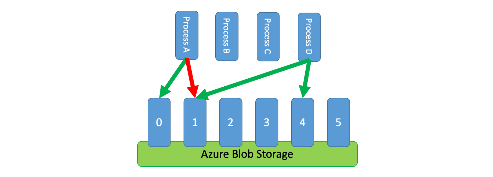

# ‏Rate Limiting pattern

  

 بسیاری از سرویس‌ها برای کنترل منابعی که مصرف می‌کنند از الگوی «محدودسازی» ([throttling ](./Throttling%20pattern.md) pattern) استفاده می‌کنند. این الگو، محدودیت‌هایی را بر نرخ دسترسی سایر برنامه‌ها یا سرویس‌ها به سرویس موردنظر اعمال می‌کند.
 
 استفاده از الگوی «محدودکردن نرخ» (rate limiting pattern) می‌تواند به شما در جلوگیری یا به‌حداقل‌رساندن خطاهای «محدودسازی» مرتبط با این محدودیت‌ها کمک کند و همچنین پیش‌بینی دقیق‌تر توان عملیاتی (throughput) را برایتان به همراه داشته باشد.
 
 الگوی «محدودکردن نرخ» در بسیاری از سناریوها مناسب است، اما به طور خاص برای وظایف خودکار تکراری در مقیاس بزرگ مانند پردازش دسته‌ای (batch processing) بسیار مفید است.
 
 ## زمینه و مشکل
 
 انجام تعداد زیادی عملیات با استفاده از یک سرویس محدود شده (throttled service) می‌تواند منجر به افزایش ترافیک و توان عملیاتی شود، زیرا باید درخواست‌‌های رد شده را ردیابی کنید و سپس دوباره آن عملیات را retry یا تست کنید. با افزایش تعداد عملیات، یک throttling limit ممکن است چندین دفعه ارسال مجدد داده‌ها را نیاز داشته باشد که منجر به افزایش کارایی می‌شود.
 
 
 به‌عنوان‌مثال، retryهای ساده زیر را در مورد فرایند خطا برای واردکردن داده‌ها به Azure Cosmos DB در نظر بگیرید: 
 
 ۱- برنامه شما باید ۱۰۰۰۰ رکورد را در Azure Cosmos DB وارد کند. دریافت هر رکورد ۱۰ واحد درخواست یا واحدهای درخواستی (Request Units) یا به‌اختصار RUs هزینه دارد که در مجموع به 100000 RU برای تکمیل‌کردن این کار نیاز دارد.
 
 ۲- نمونه Azure Cosmos DB شما دارای 20000 RU ظرفیت تدارک‌دیده‌شده است.
 
 ۳- شما تمام ۱۰۰۰۰ رکورد را به Azure Cosmos DB ارسال می‌کنید. ۲۰۰۰ رکورد با موفقیت نوشته شده و ۸۰۰۰ رکورد ثبت شده است.
 
 ۴- شما ۸۰۰۰ رکورد باقیمانده را به Azure Cosmos DB ارسال می‌کنید. ۲۰۰۰ رکورد با موفقیت نوشته شده و ۶۰۰۰ رکورد ثبت شده است.
 
 ۵- شما ۶۰۰۰ رکورد باقیمانده را به Azure Cosmos DB ارسال می‌کنید. ۲۰۰۰ رکورد با موفقیت نوشته شده و ۴۰۰۰ رکورد ثبت شده است.
 
 ۶- شما ۴۰۰۰ رکورد باقیمانده را به Azure Cosmos DB ارسال می‌کنید. ۲۰۰۰ رکورد با موفقیت نوشته شده و ۲۰۰۰ رکورد ثبت شده است.
 
 ۷- شما ۲۰۰۰ رکورد باقیمانده را به Azure Cosmos DB ارسال می‌کنید. همه با موفقیت نوشته شده‌اند.
 
 
 کار واردکردن داده‌ها با موفقیت انجام شد، اما تنها پس از ارسال ۳۰۰۰۰ رکورد به Azure Cosmos DB حتی اگر کل مجموعه فقط از ۱۰۰۰۰ رکورد تشکیل شده بود.
 
 در مثال بالا عوامل دیگری وجود دارد که باید در نظر گرفته شود: 
 
 -‏ تعداد زیاد خطاها همچنین می‌تواند منجر به کار اضافی برای log این خطاها و پردازش داده‌های ثبت شده را حاصل شود. این رویکرد ساده ۲۰,۰۰۰ خطا را مدیریت کرده است، و log این خطاها ممکن است هزینه پردازش، حافظه یا منابع ذخیره‌سازی را به همراه داشته باشد.
 
 -‏‏ بدون اینکه از محدودیت‌های اعمال‌شده‌ی سرویس انتقال (throttling limits) اطلاعی داشته باشد، رویکرد ساده نمی‌تواند پیش‌بینی کند که فرایند انتقال داده چقدر طول خواهد کشید. محدودکردن نرخ (Rate limiting) به شما این امکان را می‌دهد که زمان موردنیاز برای انتقال را محاسبه کنید.
 ## راه‌حل
 
 محدودیت نرخ یا Rate limit می‌تواند ترافیک شما را کاهش دهد و با کاهش تعداد رکوردهای ارسال شده به یک سرویس در یک دوره زمانی معین، به طور محسوسی توان عملیاتی را بهبود بخشد.
 یک سرویس ممکن است بر اساس معیار‌های مختلف در طول زمان throttle شود، مانند: 
 
 *‏ تعداد عملیات (مثلاً ۲۰ درخواست در ثانیه).
 *‏ مقدار داده‌ها (مثلاً ۲ گیگابایت در دقیقه).
 *‏ هزینه‌‌های مالی نسبی عملیات (به‌عنوان‌مثال، ۲۰۰۰۰ ریال در ثانیه).
 
 محدودکردن نرخ برای مدیریت مصرف سرویس
 
 فارغ از معیاری که برای محدودسازی (throttling) استفاده می‌شود، پیاده‌سازی محدودکردن نرخ (rate limit) شما شامل کنترل تعداد و/یا اندازه عملیات است که در یک بازه زمانی مشخص به سرویس ارسال می‌شود. این کار به شما کمک می‌کند تا درعین‌حال که از ظرفیت محدودسازی سرویس تجاوز نمی‌کنید، استفاده خود را از آن بهینه کنید.
 
 محدودکردن نرخ برای عدم تطابق سرعت
 
 در سناریوهایی که APIهای شما می‌توانند درخواست‌ها را سریع‌تر از آنچه سرویس‌های انتقال محدود شده (throttled) اجازه می‌دهند، مدیریت کنند، باید نحوه استفاده سریع از سرویس را مدیریت کنید. بااین‌حال، تنها درنظرگرفتن محدودسازی (throttling) به‌عنوان یک مشکل عدم تطابق سرعت انتقال داده؛ به‌سادگی بافر کردن درخواست‌های انتقال تا زمانی که سرویس محدود شده بتواند به آن برسد، ریسک‌پذیر است. درصورتی‌که برنامه شما در این سناریو دچار خطا (crash) شود، خطر ازدست‌رفتن هر گونه داده‌ای که بافر شده است را به همراه دارد.
 
 استفاده از سیستم پیام‌رسانی بادوام برای جلوگیری از ریسک
 
 برای جلوگیری از این خطر، رکوردهای خود را به یک سیستم پیام‌رسانی (messaging) بادوام بفرستید که بتواند میزان مصرف کامل داده‌ها در سرویس شما را کنترل کند. (سرویس‌هایی مانند Azure Event Hubs می‌توانند میلیون‌ها عملیات را در ثانیه انجام دهند). سپس می‌توانید از یک یا چند پردازشگر برای خواندن رکوردها از سیستم پیام‌رسانی با نرخ کنترل‌شده‌ای استفاده کنید که در محدوده‌‌های سرویس throttled است. ارسال رکوردها به سیستم پیام‌رسانی می‌تواند میزان مصرف حافظه داخلی را بهینه کند و به شما امکان می‌دهد که فقط رکوردهایی را که در یک بازه زمانی معین پردازش می‌شوند را بعد از پردازش حذف کنید.
 ‏ Azure چندین سرویس پیام‌رسانی بادوام ارائه می‌دهد که می‌توانید با این الگو از آنها استفاده کنید، از جمله: 
 
 *‏ Azure Event Hubs: یک سرویس پیام‌رسانی با حجم بالا و تأخیر کم است که می‌تواند میلیون‌ها رویداد را در ثانیه مدیریت کند.
 *‏ Azure Service Bus: یک سرویس پیام‌رسانی انعطاف‌پذیر است که از پیام‌رسانی صف و انتشار/اشتراک (publish/subscribe) پشتیبانی می‌کند.
 
 *‏ Azure Service Bus: یک سرویس پیام‌رسانی انعطاف‌پذیر است که از پیام‌رسانی صف و انتشار/اشتراک (publish/subscribe) پشتیبانی می‌کند.
 *‏ Azure Queue Storage: یک سرویس ذخیره‌سازی ابری مقیاس‌پذیر برای پیام‌های بزرگ است که برای صف کردن ایمن و قابل‌اعتماد پیام‌ها در برنامه‌های ابری طراحی شده است.
 *‏ Azure Event Hubs: یک سرویس پیام‌رسانی با حجم بالا و تأخیر کم است که می‌تواند میلیون‌ها رویداد را در ثانیه مدیریت کند.
 
 

  

وقتی رکوردها را ارسال می‌کنید، ممکن است دوره زمانی که برای انتشار رکوردها استفاده می‌کنید نسبت به دوره زمانی که از سرویس محدودسازی می‌گذرد دقیق‌تر باشد. سیستم‌ها اغلب محدودیت‌ها را بر اساس بازه‌‌های زمانی تنظیم می‌کنند که به‌راحتی می‌توانید آن را درک کرده و با آن کار کنید. بااین‌حال، برای رایانه‌ای که یک سرویس را اجرا می‌کند، این بازه‌های زمانی ممکن است در مقایسه با سرعت پردازش اطلاعات بسیار طولانی باشد. به‌عنوان‌مثال، یک سیستم ممکن است در هر ثانیه یا در دقیقه محدود (throttle) شود، اما معمولاً این کد در حدود نانوثانیه یا میلی‌ثانیه پردازش می‌شود.
 
درحالی‌که ضروری نیست؛ ولی توصیه می‌شود برای بهبود توان عملیاتی، مقادیر کمتری از رکوردها را به‌دفعات بیشتر ارسال کنید. پس به‌جای اینکه بخواهید یک‌بار در ثانیه یا یک‌بار در دقیقه موارد موردنظر را به‌صورت دسته‌ای منتشر کنید، می‌توانید برای حفظ میزان مصرف منابع خود (حافظه، CPU، شبکه و غیره) با سرعت یکنواخت‌تر عمل کنید و از به‌وقوع‌پیوستن گلوگاه در سیستم جلوگیری کنید. به‌عنوان مثالی برای هجوم درخواست‌‌های لحظه‌ای، اگر یک سرویس اجازه ۱۰۰ عملیات در ثانیه را بدهد، پیاده‌سازی یک محدودکننده نرخ (rate limiter) ممکن است درخواست‌ها را با آزادکردن ۲۰ عملیات در هر ۲۰۰ میلی‌ثانیه یکسان کند، همان‌طور که در نمودار زیر نشان‌داده‌شده است.

  
  

  

محدودکردن نرخ برای فرایندهای غیرهماهنگ
  
علاوه بر این، گاهی اوقات لازم است چندین فرایند ناهماهنگ یک سرویس را به اشتراک بگذارند. برای پیاده‌سازی محدودیت نرخ در این سناریو، می‌توانید به طور منطقی ظرفیت سرویس را تقسیم‌بندی کنید و سپس از یک سیستم حذف متقابل توزیع شده برای مدیریت قفل‌های انحصاری روی آن پارتیشن‌ها استفاده کنید. سپس فرایندهای ناهماهنگ می‌توانند هر زمان که به ظرفیت نیاز داشته باشند برای قفل‌کردن آن پارتیشن‌ها رقابت کنند. برای هر پارتیشنی که یک فرایند برای آن قفل نگه می‌دارد، مقدار مشخصی ظرفیت به آن داده می‌شود.
به‌عنوان‌مثال، اگر سیستم محدود شده حدود ۵۰۰ درخواست در ثانیه را اجازه مجاز می‌داند، ممکن است شما ۲۰ پارتیشن به ارزش ۲۵ درخواست در هر ثانیه برای هر کدام ایجاد کنید. اگر فرایندی نیاز به صدور ۱۰۰ درخواست داشته باشد، ممکن است از سیستم ممانعت متقابل توزیع شده (distributed mutual exclusion) برای چهار پارتیشن دیگر درخواست کند. درنتیجه ممکن است سیستم دو پارتیشن به مدت ۱۰ ثانیه را در دسترس قرار دهد. سپس این فرایند به ۵۰ درخواست در ثانیه محدودیت نرخ یا rate limit می‌دهد و تسک را در دو ثانیه انجام می‌دهد و سپس قفل را آزاد می‌کند.
  
  
یکی از راه‌‌های پیاده‌سازی این الگو، استفاده از Azure Storage است. در این سناریو، شما یک Blob (شیء باینری بزرگ) به مقدار ۰ بایتی برای هر پارتیشن منطقی در یک ظرف ایجاد می‌کنید. سپس برنامه‌‌های شما می‌توانند مستقیماً برای مدت کوتاهی (مثلاً ۱۵ ثانیه) در برابر آن Blob قراردادهای انحصاری ([exclusive leases](https://learn.microsoft.com/en-us/rest/api/storageservices/lease-blob)) دریافت کنند. برای هر قرارداد اجاره که یک برنامه اعطا می‌شود، آن برنامه می‌تواند از ظرفیت آن پارتیشن استفاده کند. سپس برنامه باید زمان قرارداد/اجاره را ردیابی کند تا پس از انقضای آن، بتواند از ظرفیتی که داده شده است دیگر استفاده نکند. هنگام پیاده‌سازی این الگو، اغلب اوقات می‌خواهید هر فرایند زمانی که به ظرفیت نیاز دارد، تلاش کند تا یک پارتیشن تصادفی را اجاره کند.
برای کاهش بیشتر تأخیر، ممکن است مقدار کمی از ظرفیت انحصاری را برای هر فرایند اختصاص دهید. در این صورت یک فرایند تنها در صورتی به دنبال دریافت اجاره ظرفیت مشترک است که نیاز به فراتر رفتن از ظرفیت رزرو شده خود داشته باشد.

  

  

به‌عنوان جایگزینی برای Azure Storage، می‌توانید این نوع سیستم مدیریت قرارداد را با استفاده از فناوری‌هایی مانند [Zookeeper](https://zookeeper.apache.org/), [Consul](https://www.consul.io/), [etcd](https://etcd.io/), [Redis/Redsync](https://github.com/go-redsync/redsync) و غیره پیاده‌سازی کنید.
  
  
## مسائل و ملاحظات: 
  
*‏ درحالی‌که الگوی محدودکننده نرخ می‌تواند تعداد خطاهای محدودسازی سرویس را کاهش دهد، برنامه شما همچنان باید به‌درستی خطاهای محدودسازی را که ممکن است رخ دهد مدیریت کند.
  
*‏ اگر برنامه شما دارای چندین جریان کاری(workstreams) است که به همان سرویس محدود شده دسترسی دارند، پس باید همه آنها را در استراتژی محدودکردن نرخ خود ادغام کنید. به‌عنوان‌مثال، ممکن است از بارگذاری انبوه رکوردها (bulk loading records) در پایگاه‌داده پشتیبانی کنید؛ اما هم‌زمان از اعمال کوئری روی رکوردها را در همان پایگاه‌داده پشتیبانی کنید. می‌توانید با اطمینان از اینکه همه جریان‌های کاری از طریق سازوکار محدودکننده نرخ یکسانی عبور می‌کنند، ظرفیت را مدیریت کنید. از طرف دیگر، می‌توانید ظرفیت‌های جداگانه‌ای را برای هر جریان کاری در نظر بگیرید.
  
*‏ سرویس محدود شده ممکن است در چندین برنامه استفاده شود. در برخی - اما نه همه - موارد، می‌توان نوع مصرف را هدایت کرد (همان‌طور که در بالا نشان‌داده‌شده است). اگر شروع به مشاهده تعداد بیشتر از حد انتظار خطاهای محدودسازی کردید، ممکن است نشانه اختلاف بین برنامه‌هایی باشد که به یک سرویس دسترسی دارند. اگر چنین است، ممکن است لازم باشد به طور موقت میزان توان اعمال شده توسط سازوکار محدودکننده نرخ خود را کاهش دهید تا زمانی که استفاده از سایر برنامه‌ها کاهش یابد.
  
## چه زمانی از این الگو استفاده کنیم؟
  
از این الگو برای موارد زیر استفاده کنید: 
*‏ کاهش خطاهای محدودسازی ناشی از یک سرویس با محدودیت نرخ
  
*‏ کاهش ترافیک در مقایسه با یک روش ساده retry بر روی خطاها.
  
*‏ کاهش مصرف حافظه با خروج از صف (dequeue) رکوردها فقط در زمانی که ظرفیت پردازش آنها وجود دارد.
  
## مثال
  
این برنامه نمونه به کاربران اجازه می‌دهد تا رکوردهای با انواع مختلف را به یک API ارسال کنند. برای هر نوع رکورد یک پردازشگر کار اختصاصی (job processor) وجود دارد که مراحل زیر را انجام می‌دهد: 
۱- اعتبارسنجی (Validation)
۲- غنی‌سازی داده‌ها (Enrichment)
۳- درج رکورد در پایگاه‌داده (Insertion)
  
همه اجزای برنامه (API، job processor A، و  job processor B) فرایندهای جداگانه‌ای هستند که ممکن است به طور مستقل مقیاس‌بندی شوند. این فرایندها مستقیماً با یکدیگر ارتباط برقرار نمی‌کنند.

  

  ۱- یک کاربر ۱۰۰۰۰ رکورد از نوع A را به API ارسال می‌کند.
۲- API آن ۱۰۰۰۰ رکورد را در صف A قرار می‌دهد.
۳- یک کاربر ۵۰۰۰ رکورد از نوع B را به API ارسال می‌کند.
۴- API آن ۵۰۰۰ رکورد را در صف B قرار می‌دهد.
۵- Job Processor A می‌بیند که Queue A دارای رکورد است و سعی می‌کند یک قرارداد(lease) انحصاری در blob 2 به دست آورد.
۶- Job Processor B می‌بیند که Queue B دارای رکورد است و سعی می‌کند یک قرارداد انحصاری در blob 2 به دست آورد.
۷- Job Processor A موفق به دریافت قرارداد نامه نمی‌شود.
۸- Job Processor B قرارداد blob 2 را به مدت ۱۵ ثانیه دریافت می‌کند. اکنون می‌تواند درخواست‌های محدود به پایگاه‌داده را با نرخ ۱۰۰ در ثانیه رتبه‌بندی کند.
۹- Job Processor B 100 رکورد را از صف B جدا می‌کند و آنها را می‌نویسد.
۱۰- یک ثانیه می‌گذرد.
۱۱- Job Processor A می‌بیند که Queue A رکورد‌های بیشتری دارد و سعی می‌کند قرارداد انحصاری را در blob 6 به دست آورد.
۱۲- Job Processor B می‌بیند که Queue B رکورد‌های بیشتری دارد و سعی می‌کند قرارداد انحصاری را در blob 3 به دست آورد.
۱۳- Job Processor A قرارداد blob 6 را به مدت ۱۵ ثانیه دریافت می‌کند. اکنون می‌تواند درخواست‌های محدود به پایگاه‌داده را با نرخ ۱۰۰ در ثانیه رتبه‌بندی کند.
۱۴- Job Processor B قرارداد blob 3 را به مدت ۱۵ ثانیه دریافت می‌کند. اکنون می‌تواند درخواست‌های محدود به پایگاه‌داده را با نرخ ۲۰۰ در ثانیه رتبه‌بندی کند. (همچنین قرارداد 2 blob را نیز در اختیار دارد.)
۱۵- Job Processor A 100 رکورد را از صف A جدا می‌کند و آنها را می‌نویسد.
۱۶- Job Processor B 200 رکورد را از صف B جدا می‌کند و آنها را می‌نویسد.
۱۷- یک ثانیه می‌گذرد.
۱۸- Job Processor A می‌بیند که Queue A رکورد‌های بیشتری دارد و سعی می‌کند یک قرارداد انحصاری در blob 0 به دست آورد.
۱۹- Job Processor B می‌بیند که Queue B رکورد‌های بیشتری دارد و سعی می‌کند یک قرارداد انحصاری در blob 1 به دست آورد.
۲۰- Job Processor A قرارداد blob 0 را به مدت ۱۵ ثانیه دریافت می‌کند. اکنون می‌تواند درخواست‌های محدود به پایگاه‌داده را با نرخ ۲۰۰ در ثانیه رتبه‌بندی کند. (همچنین قرارداد blob 6 را نیز دارد.)
۲۱- Job Processor B قرارداد blob 1 را به مدت ۱۵ ثانیه دریافت می‌کند. اکنون می‌تواند درخواست‌های محدود به پایگاه‌داده را با نرخ ۳۰۰ در ثانیه رتبه‌بندی کند. (همچنین قرارداد blob 2 و 3 را نیز دارد.)
۲۲- Job Processor A 200 رکورد را از صف A جدا می‌کند و آنها را می‌نویسد.
۲۳- Job Processor B 300 رکورد را از صف B جدا می‌کند و آنها را می‌نویسد.
۲۴- و غیره...
  
انقضای اجاره و کاهش درخواست‌ها
  
پس از گذشت ۱۵ ثانیه، ممکن است یکی یا هر دو کار همچنان تکمیل نشوند. با منقضی شدن اجاره‌ها، یک پردازشگر همچنین باید تعداد درخواست‌هایی را که از صف خارج (dequeue) کرده و می‌نویسد، کاهش دهد.
  
پیاده‌سازی در زبان‌های برنامه‌نویسی
  
پیاده‌سازی این الگو که در Go پیاده‌سازی شده است در [GitHub](https://github.com/mspnp/go-batcher) موجود است و همین‌طور پیاده‌سازی جاوا در [GitHub](https://github.com/Azure-Samples/java-rate-limiting-pattern-sample) در دسترس است.
  
## منابع مرتبط
  
الگوها و راهنمایی‌های زیر نیز ممکن است هنگام اجرای این الگو مرتبط باشند: 
*‏ الگوی محدودسازی یا [Throttling](./Throttling%20pattern.md). الگوی محدودکننده نرخ که در اینجا موردبحث قرار می‌گیرد، به طور معمول در پاسخ به سرویسی که محدود شده است (throttled) پیاده‌سازی می‌شود.
  
*‏ الگوی باز تکرار یا [Retry](./Retry%20pattern.md). هنگامی که درخواست‌ها برای سرویس محدود شده منجر به خطاهای محدودسازی می‌شوند، معمولاً مناسب است که پس از یک بازه زمانی مناسب دوباره آن‌ها را retry کنید.
  
این الگو با الگوی تراز سطح بار مبتنی بر صف ([Queue-Based Load Leveling](./Queue-Based%20Load%20Leveling%20pattern.md) مشابه است؛ اما از چند جهت کلیدی با الگوی محدودکردن نرخ که در این قسمت بیان شد متفاوت است: 
  
۱- محدودکردن نرخ (Rate limiting) لزوماً نیازی به استفاده از صف برای مدیریت بار ندارد، اما نیاز به استفاده از یک سرویس پیام‌رسانی بادوام دارد. به‌عنوان‌مثال، یک الگوی محدودکننده نرخ می‌تواند از سرویس‌هایی مانند  Apache Kafka یا Azure Event Hubs استفاده کند.
  
۲- الگوی محدودکننده نرخ، مفهوم یک سیستم ممانعت متقابل توزیع شده (distributed mutual exclusion) را در پارتیشن‌ها معرفی می‌کند که به شما امکان می‌دهد ظرفیت چندین فرایند ناهماهنگ را که با یک سرویس محدود شده ارتباط برقرار می‌کنند را مدیریت کنید.
  
۳- یک الگوی تراز سطح بار مبتنی بر صف (queue-based load leveling) در هر زمان که عدم تطابق کارکرد بین سرویس‌ها یا بهبود انعطاف‌پذیری وجود داشته باشد، قابل‌اجرا است. این مورد باعث می‌شود که الگوی گسترده‌تری نسبت به محدودکردن نرخ که به طور خاص به دسترسی مؤثر به یک سرویس محدود شده می‌پردازد را داشته باشد.