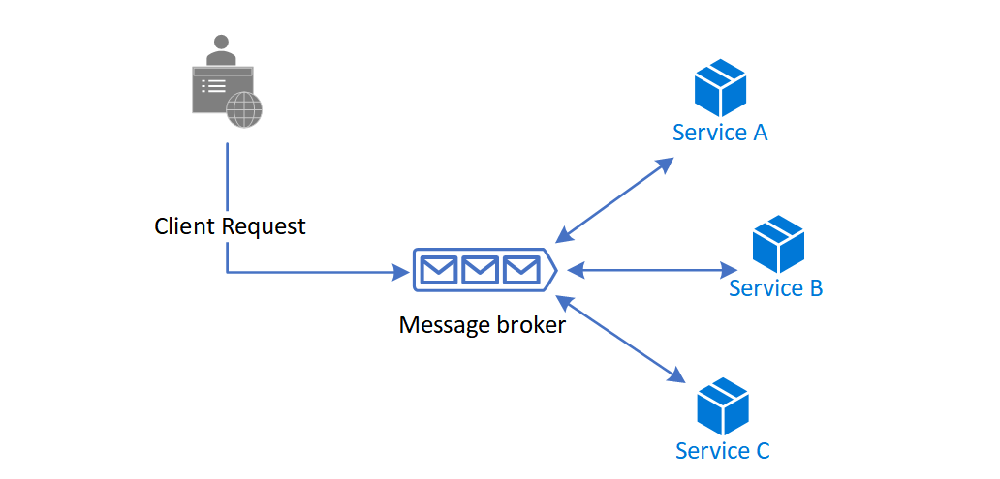

# ‏Saga distributed transactions pattern

## مقدمه

الگوی طراحی Saga راهی برای مدیریت سازگاری داده‌ها (data consistency) در میان میکروسرویس‌ها در سناریو‌های تراکنش توزیع شده (distributed transaction) است. Saga در واقع دنباله ‌ای از تراکنشها است که سرویس‌ها را به روزرسانی می‌کند و پیام یا رخدادی را برای راه اندازی تراکنش بعدی منتشر می‌کند. اگر مرحله ‌ای با شکست مواجه شود، Saga تراکنش‌های جبرانی را اجرا می‌کند که تراکنش‌های قبلی را  بی اثر می‌کند.

### **زمینه و مشکل**

تراکنش یک واحد منفرد از منطق یا کار مورد نظر است که گاهی از چندین عملیات تشکیل شده است. در یک تراکنش، یک رویداد یک تغییر حالت است که برای یک موجودیت اتفاق می‌افتد و یک فرمان تمام اطلاعات مورد نیاز برای انجام یک عملیات یا راه‌اندازی یک رویداد مربوط به حالت بعدی را در بر می‌گیرد.

تراکنش باید _atomic_، سازگار(_consistent_)، ایزوله(_isolated_) و بادوام(_durable_)  یا به اختصار (ACID) باشد. تراکنش‌‌های درون یک سرویس از نوع ACID هستند، اما سازگاری داده‌‌های بین سرویس‌‌های مختلف به یک استراتژی مدیریت تراکنش‌‌های در بین این سرویس‌ها نیاز دارد.

در معماری‌های چند سرویس(multiservices):

*‏ _Atomicity_ مجموعه ‌ای تقسیم ناپذیر و تقلیل ناپذیر از عملیات است که همگی باید اتفاق بیافتند یا هیچکدام رخ ندهد.

*‏ سازگاری(_Consistency_) به این معنی است که تراکنش داده‌ها را فقط از یک حالت معتبر به حالت معتبر دیگر می‌آورد.

*‏ ایزوله سازی(_Isolation_) تضمین می‌کند که تراکنش‌‌های موازی همان حالت داده‌ای را ایجاد می‌کنند که تراکنش‌‌هایی متوالی اجرا و ایجاد می‌کنند.

*‏ دوام(_Durability_) تضمین می‌کند که تراکنش‌های واقعی حتی در صورت خرابی سیستم یا قطع برق ثابت باقی می‌مانند.

یک مدل پایگاه داده به ازایه هر میکروسرویس ( [database-per-microservice](https://learn.microsoft.com/en-us/dotnet/architecture/cloud-native/distributed-data#database-per-microservice-why)) مزایای بسیاری را برای معماری میکروسرویسها فراهم می‌کند. کپسوله کردن داده‌ها در هر حوزه خاص، به هر سرویس اجازه می‌دهد تا از بهترین نوع ذخیره داده و طراحی  استفاده کند و ذخیره داده خود را در صورت لزوم مقیاس‌دهی یا scale کند و از تاثیرگذاری خرابی سایر سرویس‌های دیگر محفوظ مانده شود. با این حال، اطمینان از سازگاری داده‌ها در دیتابیس‌‌های سرویس‌‌های خاص، چالش‌‌هایی را ایجاد می‌کند.

تراکنش‌‌های توزیع‌شده مانند پروتکل[two-phase commit (2PC)](https://en.wikipedia.org/wiki/Two-phase_commit_protocol) به همه عوامل موثر  در یک تراکنش نیاز دارد تا ادامه انجام تراکنش جدید یا برگشت (roll back) به تراکنش قبلی را به شیوه مناسب انجام دهد. با این حال، برخی از پیاده‌سازی‌‌های خاص مانند استفاده از پایگاه‌‌های داده NoSQL و message brokerها از این مدل پشتیبانی نمی‌کنند.

یکی دیگر از محدودیت‌های تراکنش توزیع شده، هماهنگی(synchronicity) و در دسترس بودن (availability) ارتباطات بین فرآیندی [interprocess communication (IPC)](https://en.wikipedia.org/wiki/Inter-process_communication) است. IPC ارائه شده توسط سیستم عامل به فرآیند‌های جداگانه این اجازه را می‌دهد تا داده‌ها را به اشتراک بگذارند. برای انجام تراکنش‌‌های توزیع‌شده، همه سرویس‌‌های مشارکت‌کننده و موثر باید در دسترس باشند که این مورد به طور بالقوه system availability را کاهش می‌دهد. پیاده سازی‌های این معماری با IPC به همراه  وجود محدودیت در تراکنش‌ها، کاندیدای مناسبی برای الگوی Saga می‌باشد.

## راه حل

الگوی Saga مدیریت تراکنش را با استفاده از دنباله ‌ای از تراکنش‌های محلی(_local transactions_) فراهم می‌کند. _local transactions_، تلاشی atomic است که توسط یک مشارکت کننده در الگوی Saga انجام می‌شود. هر تراکنش محلی پایگاه داده را به روزرسانی می‌کند و پیام یا رویدادی را برای راه اندازی تراکنش محلی بعدی در Saga منتشر می‌کند. اگر یک تراکنش محلی با شکست مواجه شود، Saga یک سری تراکنش‌های جبرانی را اجرا می‌کند که تغییرات ایجاد شده توسط تراکنش‌های محلی قبلی را خنثی می‌کند.

در الگو‌های Saga :

*‏ تراکنش‌های قابل جبران (_Compensable transactions_)، تراکنش‌هایی هستند که به طور بالقوه می‌توانند با  تراکنش دیگری با عملکرد معکوس، خنثی شوند.

*‏ تراکنش محوری(_pivot transaction_) یک نوع نقطه قابل/غیرقابل ادامه در یک Saga است. اگر _pivot transaction_ فعال شود، Saga تا لحظه ن‌هایی تکمیل شدن آن تراکنش در حال اجرا می‌باشد. _pivot transaction_ می‌تواند تراکنشی باشد که نه قابل جبران است و نه قابل اجرای مجدد یا می‌تواند آخرین تراکنش قابل جبران یا اولین تراکنش قابل  اجرای مجدد در Saga باشد.

*‏ تراکنش‌‌های قابل تکرار(_Retryable transactions_)، تراکنش‌‌هایی هستند که از تراکنش محوری پیروی می‌کنند و موفقیت انجام آنها تضمین می‌شود.

دو رویکرد رایج اجرای Saga وجود دارد، _choreography_ و _orchestration_. هر رویکرد مجموعه ‌ای از چالشها و فناوری‌های خاص خود را برای هماهنگ کردن workflow دارد.

### ‏Choreography

‏ Choreography برای هماهنگ کردن Saga هاست که در آن مشارکت کنندگان در رویدادها(participants exchange) را بدون یک نقطه کنترل متمرکز مبادله می‌کنند. با choreography، هر تراکنش محلی(local transaction، رویداد‌هایی را منتشر می‌کند که تراکنش‌های محلی را در سایر سرویس‌های دیگر تحریک می‌کند.

#### مزایای این الگو:

*‏ برای گردش‌کار‌های ساده که به شرکت‌کنندگان کمی نیاز دارند و به منطق هماهنگ کننده خاصی نیاز ندارند، این الگو مناسب و خوب است.

*‏ نیازی به اجرای سرویس و نگهداری اضافی ندارد.

*‏ یک نقطه شکست را معرفی نمی‌کند، زیرا مسئولیتها بین مشارکت کنندگان Saga توزیع می‌شود.

#### معایب این الگو:

*‏ هنگام اضافه کردن مراحل جدید، ممکن است Workflowها کمی گیج کننده شود، زیرا ردیابی اینکه کدام شرکت کنندگان Saga به کدام دستورها گوش می‌دهند دشوار است.

*‏ خطر وابستگی چرخه ای(cyclic dependency) بین شرکت کنندگان Saga وجود دارد زیرا آنها باید دستورات یکدیگر را مورد استفاده قرار دهند.

*‏ تست یکپارچه سازی (Integration testing) دشوار است زیرا همه سرویسها باید برای در حال شبیه سازی یک تراکنش در حال اجرا باشند.

### Orchestration

‏ Orchestration راهی برای هماهنگ کردن الگو Saga  است که در آن یک کنترل کننده متمرکز به مشارکت کنندگان Saga می‌گوید که چه تراکنش‌های محلی را باید اجرا کنند. saga orchestrator تمام تراکنشها را مدیریت می‌کند و به شرکت کنندگان می‌گوید که کدام عملیات را بر اساس رویدادها انجام دهند. ارکستراتور درخواست‌‌های Saga را اجرا می‌کند، حالات هر تسک را ذخیره و تفسیر می‌کند و بازیابی شکست  را با تراکنش‌‌های جبران‌کننده مدیریت می‌کند.

#### مزایا

*‏ این روش برای گردش‌‌های کاری(workflows) پیچیده که شامل بسیاری از مشارکت کنندگان یا مشارکت کنندگان جدیدی است که به مرور زمان اضافه می‌شوند، مناسب است.  

*‏ زمانی خوب است که بر هر شرکت کننده در هر فرآیند مکانیزم کنترل وجود داشته باشد و بر جریان فعالیتها کنترل داشته باشد.  

*‏ وابستگی‌های چرخه ای(cyclical dependencies) را معرفی نمی‌کند، زیرا orchestrator به طور یک جانبه به شرکت کنندگان Saga وابسته است.  

*‏ مشارکت کنندگان Saga نیازی به دانستن دستورات سایر مشارکت کنندگان ندارند. تفکیک واضح نگرانی ها(separation of concerns) در واقع business logic برنامه را ساده می‌کند.

#### معایب

*‏ پیچیدگی طراحی اضافی مستلزم اجرای یک منطق هماهنگ کننده است.  

*‏ یک نقطه شکست اضافی وجود دارد، زیرا orchestrator گردش کار کامل را مدیریت می‌کند.

### مسائل و ملاحظات:

*‏ الگوی Saga ممکن است در ابتدا چالش برانگیز باشد، زیرا نیاز به روش جدیدی از تفکر در مورد نحوه هماهنگ کردن یک تراکنش و حفظ ثبات داده‌ها برای یک فرآیند  که چندین میکروسرویس را در بر می‌گیرد، دارد.

*‏ اشکال زدایی الگوی Saga معمولا سخت است و با افزایش مشارکت کنندگان، پیچیدگی آن افزایش می‌یابد.

*‏ داده‌ها را نمی‌توان به عقب بازگرداند یا به نوعی role back کرد، زیرا شرکت کنندگان Saga تغییراتی را در پایگاه داده محلی خود انجام می‌دهند.

*‏ پیاده‌سازی باید بتواند مجموعه‌ای از خرابی‌‌های گذرا را مدیریت کند و برای کاهش اثرات جانبی و اطمینان از ثبات داده‌ها(data consistency) حالت Idempotence را ایجاد کند. Idempotence به این معنی است که یک عمل را می‌توان چندین بار بدون تغییر در نتیجه اولیه تکرار کرد. برای اطلاعات بیشتر، به راهنمای اطمینان از  [idempotence](https://learn.microsoft.com/en-us/azure/architecture/reference-architectures/containers/aks-mission-critical/mission-critical-data-platform#idempotent-message-processing) در هنگام پردازش پیامها و به روز رسانی وضعیت‌ها  مراجعه کنید.

*‏ بسیار مناسب است که با استفاده از  خاصیت observability برای مانیتور کردن و ردیابی گردش‌کار‌های saga استفاده کنید. 

*‏ فقدان جداسازی داده‌‌های مشارکت کننده‌ها، چالش‌ پایداری داده‌ها را تحمیل می‌کند. اجرای Saga باید شامل اقدامات متقابل برای کاهش ناهنجاری‌‌های مربوط به این مورد باشد.

ناهنجاری‌های زیر می‌توانند بدون پیش‌بینی‌‌های در نظر گرفته شده رخ دهند:

*‏ به روز رسانی‌های از دست رفته(_Lost updates_)، زمانی که یک Saga بدون خواندن تغییرات ایجاد شده توسط Saga دیگر داده‌‌های خود را می‌نویسد.

*‏ خواندن کثیف(_Dirty reads_)، زمانی که یک تراکنش یا یک Saga به‌روزرسانی‌‌های ساخته شده توسط Saga‌ای را می‌خواند که هنوز آن به‌روزرسانی‌ها را تکمیل نکرده است.

*‏ خواندن فازی/غیر تکرار نشدنی(_Fuzzy/nonrepeatable reads_,)، زمانی که مراحل مختلف Saga داده‌‌های متفاوتی را می‌خوانند، زیرا به‌روزرسانی داده‌ها بین موارد خوانده شده رخ می‌دهد.

اقدامات متقابل پیشنهادی برای کاهش یا پیشگیری از ناهنجاریها عبارتند از:

*‏ قفل معنایی(_Semantic lock_)، یک قفل در سطح برنامه که در آن تراکنش قابل جبران Saga از یک سمافور برای نشان دادن به‌روزرسانی در حال انجام استفاده می‌کند.

*‏ به روز رسانی‌های جابجایی پذیر(_Commutative updates_) که می‌توانند به هر ترتیبی اجرا شوند و نتیجه یکسانی را ایجاد کنند.

*‏ دیدگاه بدبینانه(_Pessimistic view_): ممکن است یک Saga داده‌های کثیف را بخواند، در حالی که Saga دیگری در حال اجرای تراکنش قابل جبران برای عقب انداختن عملیات است. دیدگاه بدبینانه (Pessimistic view) دوباره ترتیب و نظم دهی Saga را انجام می‌دهد، بنابراین داده‌ها در یک تراکنش قابل تجدید(retryable) به روزرسانی می‌شوند، که امکان خواندن کثیف(dirty read) را از بین می‌برد.

*‏ مقدار بازخوانی تأیید می‌کند که داده‌ها بدون تغییر هستند و سپس رکورد را به روز می‌کند. اگر رکورد تغییر کرده باشد، مراحل لغو می‌شود و Saga ممکن است دوباره راه اندازی شود.

*‏ یک نسخه فایل  (_version file_)، عملیاتها را در یک رکورد به محض رسیدن آنها ثبت می‌کند و سپس آنها را به ترتیب صحیح اجرا می‌کند.

*‏ براساس ارزش و خطرپذیری تجاری مربوط به هر درخواست جهت حالت دینامیک و پویا، معمولا از مکانیزم‌‌های همزمانی (concurrency) استفاده می‌کند. درخواست‌های کم خطر به نفع Sagaها هستند، در حالی که درخواست‌های با ریسک بالا به نفع تراکنش‌های توزیع شده هستند.

## **چه زمانی از این الگو استفاده کنیم؟**

در صورت نیاز از الگوی Saga استفاده کنید:

*‏ از سازگاری داده ها(data consistency) در یک سیستم توزیع شده بدون اتصال بالا(tight coupling) اطمینان حاصل کنید.

*‏ اگر یکی از عملیات‌های به صورت سریالی شکست خورد، به بازگشت (Roll back) یا جبران کنید.

الگوی Saga کمتر مناسب برای موارد زیر است:

*‏ تراکنش‌‌های بهم پیوسته (Tightly coupled)

*‏ تراکنش‌های جبرانی (Compensating transactions) که در مشارکت کنندگان قبلی رخ می‌دهد.

*‏ وابستگی‌های چرخه ‌ای (Cyclic dependencies)

## مثال

[Orchestration-based Saga on Serverless](https://github.com/Azure-Samples/saga-orchestration-serverless) یک مرجع پیاده‌سازی Saga با استفاده از رویکرد orchestration است که سناریوی انتقال پول را با گردش‌‌های کاری موفق و ناموفق شبیه‌سازی می‌کند.

## قدم بعدی

- [Distributed data](https://learn.microsoft.com/en-us/dotnet/architecture/cloud-native/distributed-data)
- Richardson, Chris. 2018: _Microservices Patterns_. Manning Publications.

## منابع مرتبط

الگو‌های زیر نیز ممکن است هنگام اجرای این الگو مفید باشند:

*‏ [Choreography](https://learn.microsoft.com/en-us/azure/architecture/patterns/choreography) به جای تکیه بر یک نقطه کنترل مرکزی، هر یک از اجزای سیستم را در فرآیند تصمیم گیری (decision-making) درباره جریان‌کار (workflow) یک تراکنش تجاری را شرکت می‌دهد.

*‏ تراکنش‌های جبرانی([Compensating transactions](https://learn.microsoft.com/en-us/azure/architecture/patterns/compensating-transaction)) کار انجام شده توسط یک سری مراحل را خنثی می‌کند و در ن‌هایت در صورت شکست یک یا چند مرحله یک عملیات ثابت را تعریف می‌کند. برنامه‌‌های میزبانی شده در محیط ابری که فرآیندها و گردش‌‌های کاری پیچیده را پیاده‌سازی می‌کنند، اغلب از این مدل سازگاری ن‌هایی(_eventual consistency_) پیروی می‌کنند.

*‏ الگوی [Retry](https://learn.microsoft.com/en-us/azure/architecture/patterns/retry) به یک برنامه اجازه می‌دهد تا هنگام تلاش برای اتصال به یک سرویس یا شبکه، با تلاش مجدد(retry) کردن روی عملیات ناموفق، خرابی‌‌های گذرا را مدیریت کند. retry می‌تواند پایداری برنامه را بهبود بخشد.

*‏ قطع کننده مدار ([Circuit breaker](https://learn.microsoft.com/en-us/azure/architecture/patterns/circuit-breaker)) خطا‌هایی را که در هنگام اتصال به یک سرویس یا منبع remote بازیابی می‌شود، به زمان متغیری نیاز دارد. Circuit breaker می‌تواند پایداری و انعطاف پذیری یک application را بهبود بخشد.

*‏ [Health endpoint monitoring](https://learn.microsoft.com/en-us/azure/architecture/patterns/health-endpoint-monitoring)، این مورد بررسی‌‌های عملکردی را در برنامه‌ای اجرا می‌کند که ابزار‌های خارجی می‌توانند از طریق endpointها و در فواصل زمانی منظم به آن دسترسی داشته باشند. مانیتور کردن Health endpoint می‌تواند به تأیید درستی عملکرد برنامه‌ها و سرویس‌ها کمک کند.