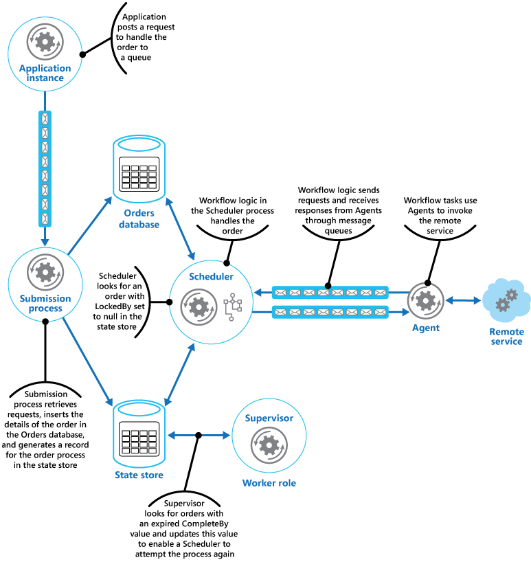

مجموعه ای از اقدامات توزیع شده را به عنوان یک عملیات واحد هدایت کنید. اگر هر یک از اقدامات با شکست مواجه د، سعی کنید شکستها را به طور واضحی مدیریت کنید، در غیر این صورت کار انجام شده را لغو کنید. بنابراین کل عملیات به طور کلی با موفقیت قطعی یا شکست قطعی مواجه می‌شود. این گزینه می‌تواند انعطاف‌پذیری را به یک سیستم توزیع‌شده اضافه کند و آن را قادر می‌سازد تا اقداماتی را که به دلیل استثناهای گذرا، خطاهای طولانی‌مدت و خرابی‌های فرآیندی، شکست می‌خورند را بازیابی و دوباره راه اندازی کند.

## **طرح صورت مسئله:**

یک برنامه وظایفی را انجام می‌دهد که شامل تعدادی مرحله است که برخی از آنها ممکن است سرویس‌‌های remote را فراخوانی کنند یا به منابع remote دسترسی پیدا کنند. گام‌های جداگانه ممکن است مستقل از یکدیگر باشند، اما توسط منطق برنامه‌ای که تسک‌ها را اجرا می‌کند، هماهنگ می‌شوند.  
  
در صورت امکان، برنامه باید اطمینان حاصل کند که کار تا آخرین مرحله تکمیل شده و به طرز صحیحی اجرا می‌شود و هر گونه نقصی را که ممکن است هنگام دسترسی به سرویس‌ها یا منابع remote رخ دهد را برطرف کند. خرابی و شکست می‌تواند به دلایل زیادی رخ دهد. به عنوان مثال، ممکن است شبکه از کار افتاده باشد، ارتباطات شاید قطع شود، یک سرویس remote ممکن است پاسخگو نباشد یا در حالت ناپایدار باشد یا یک منبع remote ممکن است به طور موقت غیرقابل دسترسی باشد که یک احتمال آن د به دلیل محدودیت منابع است. در بسیاری از موارد خرابی‌ها گذرا هستند و با استفاده از الگوی Retry قابل کنترل هستند.  
  
اگر برنامه یک خطای دائمی تری را تشخیص دهد که نمی‌تواند به راحتی آن را بازیابی کند، باید بتواند سیستم را به حالت ثابت بازگرداند و از یکپارچگی کل عملیات اطمینان حاصل کند.

## راه حل

الگوی Scheduler Agent Supervisor بازیگران زیر را تعریف می‌کند. این بازیگران مراحلی را که قرار است به عنوان بخشی از تسک کلی اجرا شوند هماهنگ و هدایت می‌کنند.

* در واقع این Scheduler  مراحلی را که تسک‌ها را تشکیل می‌دهند مرتب می‌کند تا به ترتیب اجرا شوند و عملیات مورد نظر را روی آنها را  اجرا و هدایت می‌کند. این مراحل را می‌توان در یک pipeline یا گردش‌کار (workflow) ترکیب کرد. سیستم زمانی بندی یا در اصلاح Scheduler  مسئول اطمینان از اینکه مراحل این گردش کار به ترتیب درست انجام شده است، می‌باشد. همانطور که هر مرحله انجام می‌شود، Scheduler وضعیت گردش‌کار را ثبت می‌کند، مانند «این مرحله هنوز شروع نشده است»، «مرحله در حال اجرا» یا «مرحله تکمیل شده است». اطلاعات وضعیت همچنین باید شامل حد بالایی از زمان مجاز برای اتمام مرحله باشد که به آن زمان تکمیل (complete-by time) می‌گویند. اگر مرحله ای نیاز به دسترسی به یک سرویس یا منبع remote داشته باشد، Scheduler عامل مناسب را فراخوانی می‌کند و جزئیات کاری را که باید انجام شود به آن ارسال می‌کند. Scheduler معمولاً با استفاده از پیام‌های درخواست/پاسخ ناهمزمان با یک عامل ارتباط برقرار می‌کند. این را می‌توان با استفاده از صف‌ها پیاده سازی کرد، اگرچه می‌توان از سایر فناوریهای پیام رسانی توزیع شده به جای آن استفاده کرد.  
  
> این Scheduler عملکردی مشابه Process Manager  در الگوی [Process Manager](https://www.enterpriseintegrationpatterns.com/patterns/messaging/ProcessManager.html) انجام می‌دهد. گردش‌کار واقعی معمولاً توسط یک موتور گردش‌کار که توسط Scheduler کنترل، تعریف و اجرا می‌شود. این رویکرد منطق تجاری (business logic) در گردش‌کار را از Scheduler جدا می‌کند.  
  
* یک نماینده (Agent) حاوی منطقی است که یک تماس با یک سرویس remote یا دسترسی به یک منبع remote را که توسط یک مرحله در یک تسک به آن ارجاع می‌شود را محصور (encapsulates) می‌کند. هر Agent معمولاً تماس‌ها را به یک سرویس یا منبع منفرد پیوند می‌دهد و منطق مدیریت خطا و امتحان مجدد (retry) مناسب را پیاده‌سازی می‌کند (با توجه به محدودیت زمانی که بعداً توضیح داده خواهد شد). هنگام اجرای منطق retry، یک شناسه پایدار را در بین تمام تلاش‌های مجدد ارسال کنید تا سرویس remote بتواند از آن برای هر منطق کپی‌برداری که ممکن است داشته باشد استفاده کند. اگر مراحل در گردش کار که توسط Scheduler اجرا می‌شود از چندین سرویس و منبع در مراحل مختلف استفاده می‌کنند، هر مرحله ممکن است به یک Agent متفاوت اشاره کند (این جزییاتِ پیاده سازی الگو است).  
  
* یک ناظر (Supervisor)  وضعیت مراحل انجام تسک توسط Scheduler را نظارت می‌کند. همینطور این Supervisor به صورت دوره ای اجرا می‌شود (فرکانس این دوره اجرایی مربوط به ویژگی‌های سیستم خواهد بود) و وضعیت مراحل نگهداری شده توسط Scheduler را بررسی می‌کند. اگر مواردی را شناسایی کند که به پایان رسیده یا شکست خورده اند، ترتیبی می‌دهد که Agent مناسب مرحله را بازیابی کند یا اقدام اصلاحی مناسب را انجام دهد (این ممکن است شامل تغییر وضعیت یک مرحله باشد). توجه داشته باشید که اقدامات بازیابی یا اصلاحی توسط Scheduler و Agents اجرا می‌شود. Supervisor  باید به سادگی درخواست کند که این اقدامات انجام شود.

Scheduler، Agent و Supervisor اجزای منطقی هستند و اجرای فیزیکی آنها به فناوری مورد استفاده بستگی دارد. به عنوان مثال، چندین عامل منطقی ممکن است به عنوان بخشی از یک وب سرویس واحد پیاده سازی شوند.  
  
Scheduler اطلاعات مربوط به پیشرفت کار و وضعیت هر مرحله را در یک ذخیره‌گاه داده بادوام(durable data store)، به نام ذخیره‌گاه وضعیت(state store) را نگهداری می‌کند. Supervisor می‌تواند از این اطلاعات برای کمک به تعیین اینکه آیا یک مرحله شکست خورده است استفاده کند. شکل زیر رابطه بین Scheduler، Agents، Supervisor  و ذخیره‌گاه وضعیت را نشان می‌دهد.


```
توجه داشته باشید  
  
این نمودار یک نسخه ساده شده از این الگو را نشان می‌دهد. در یک پیاده‌سازی واقعی، ممکن است نمونه‌های زیادی از Scheduler که همزمان اجرا می‌شوند، وجود داشته باشد که هر کدام دارای زیرمجموعه‌ای از تسک‌ها هستند. به طور مشابه، سیستم می‌تواند چندین نمونه از هر عامل یا حتی چندین Supervisor  را اجرا کند. در این مورد، Supervisorها باید کار خود را با دقت با یکدیگر هماهنگ کنند تا اطمینان حاصل کنند که برای بازیابی مراحل و تسک‌های ناموفق مشابه رقابت نمی‌کنند. الگوی انتخاب رهبر [Leader Election pattern](https://learn.microsoft.com/en-us/azure/architecture/patterns/leader-election) یک راه حل ممکن برای این مشکل ارائه می‌دهد.
```


هنگامی که برنامه برای اجرای یک تسک آماده است، درخواستی را به Scheduler ارسال می‌کند. Scheduler اطلاعات وضعیت اولیه مربوط به کار و مراحل آن (مثلاً مرحله‌ای که هنوز شروع نشده است) را در ذخیره سازی وضعیت ثبت می‌کند و سپس شروع به انجام عملیات تعریف شده توسط گردش کار (workflow) می‌کند. زمانی که Scheduler هر مرحله را شروع می‌کند، اطلاعات مربوط به وضعیت آن مرحله را در ذخیره‌ساز وضعیت، به‌روزرسانی می‌کند (مثلاً مرحله اجرا).  


اگر مرحله ای به یک سرویس یا منبع remote اشاره کند، Scheduler  پیامی را به Agent مربوطه ارسال می‌کند. پیام حاوی اطلاعاتی است که عامل باید به سرویس منتقل کند یا به منبع دسترسی داشته باشد، علاوه بر زمان کامل عملیات. اگر Agent عملیات خود را با موفقیت انجام دهد، پاسخی را به Scheduler برمی‌گرداند. سپس Scheduler می‌تواند اطلاعات وضعیت را در ذخیره‌سازی وضعیت به‌روزرسانی کند (مثلاً مرحله تکمیل شده) و مرحله بعدی را انجام دهد. این روند تا زمانی که کل تسک کامل شود ادامه می‌یابد.  
  
یک Agent می‌تواند هر منطقی را که برای انجام کارش لازم است را پیاده‌سازی کند. با این حال، اگر Agent کار خود را قبل از انقضای دوره کامل به پایان نرساند، Scheduler  فرض می‌کند که عملیات شکست خورده است. در این حالت، Agent باید کار خود را متوقف کند و سعی نکند چیزی را به Scheduler بازگرداند (حتی یک پیام خطا) یا هر نوع بازیابی را امتحان کند. دلیل این محدودیت این است که پس از اتمام زمان یا شکست یک مرحله، ممکن است نمونه دیگری از Agent برای اجرای مرحله شکست برنامه‌ریزی شود (این فرآیند در ادامه توضیح داده می‌شود ).  
  
اگر Agent ناموفق باشد، Scheduler  پاسخی دریافت نخواهد کرد. این الگو بین مرحله ای که به پایان رسیده و مرحله ای که واقعاً شکست خورده است، تمایزی قائل نمی‌شود.  
  
اگر یک مرحله به پایان برسد یا ناموفق باشد، ذخیره‌سازی وضعیت حاوی رکوردی است که نشان می‌دهد مرحله در حال اجرا است، اما زمان کامل به پایان رسیده است. Supervisor به دنبال چنین مراحلی می‌گردد و سعی می‌کند آنها را بازیابی کند. یکی از استراتژی‌های ممکن این است که Supervisor مقدار کامل شده را به‌روزرسانی کند تا زمان در دسترس برای تکمیل مرحله را افزایش دهد و سپس پیامی را به Scheduler بفرستد که مرحله‌ای را که زمان آن تمام شده است را شناسایی کند. سپس Scheduler می‌تواند سعی کند این مرحله را تکرار کند. با این حال، این طراحی مستلزم آن است که تسک‌ها [idempotent](https://en.wikipedia.org/wiki/Idempotence)  باشد (برای یاد آوری Idempotence به فصل مقدمه رجوع کنید). همچنین سیستم باید دارای زیرساخت مناسب برای حفظ ثبات(consistency) باشد. برای اطلاعات بیشتر، زیرساخت‌های تکرارپذیر([Repeatable Infrastructure](https://learn.microsoft.com/en-us/azure/architecture/framework/devops/automation-infrastructure))، [Architect Azure applications](https://learn.microsoft.com/en-us/azure/architecture/reliability/architect) برای انعطاف‌پذیری و در دسترس بودن و راهنمای تصمیم‌گیری سازگاری منابع ([Resource consistency decision guide](https://learn.microsoft.com/en-us/azure/cloud-adoption-framework/decision-guides/resource-consistency)) را ببینید.  
  
ممکن است ناظر نیاز داشته باشد که در صورت عدم موفقیت یا اتمام مراحل مشابه، از تکرار مجدد آن جلوگیری کند. برای انجام این کار، Supervisor  می‌تواند برای هر مرحله یک تعداد تلاش مجدد را به همراه اطلاعات وضعیت در ذخیره‌سازی وضعیت حفظ کند. اگر این تعداد از آستانه از پیش تعریف شده فراتر رود، Supervisor  می‌تواند یک استراتژی انتظار برای مدت طولانی را پیش از اطلاع به Scheduler  که باید مرحله را retry کند، به این امید که خطا در این دوره برطرف شود. از طرف دیگر، Supervisor  می‌تواند پیامی به Scheduler  ارسال کند تا با اجرای یک الگوی تراکنش جبران‌کننده([Compensating Transaction](https://learn.microsoft.com/en-us/azure/architecture/patterns/compensating-transaction))، تمام تسک را لغو کند. این رویکرد بستگی به این دارد که برنامه‌ریز و عوامل اطلاعات لازم را برای اجرای عملیات جبران‌کننده برای هر مرحله که با موفقیت انجام شده است را ارائه دهند.

> هدف Supervisor نظارت بر Scheduler  و Agenها نیست و در صورت شکست، آنها را مجددا راه اندازی می‌کند. این جنبه از سیستم باید توسط زیرساختی که این اجزا در آن اجرا می‌شوند مدیریت شود. به طور مشابه، Supervisor  نباید از عملیات تجاری واقعی تسک ای که توسط Scheduler  انجام می‌شود (از جمله نحوه جبران در صورت شکست این تسک‌ها) اطلاع نداشته باشد. این هدف منطق گردش کار پیاده سازی شده توسط Scheduler است. مسئولیت انحصاری Supervisor  این است که تعیین کند آیا یک مرحله شکست خورده است و ترتیبی دهد که آن مرحله تکرار شود یا کل کار حاوی مرحله شکست خورده لغو شود.


اگر Scheduler پس از خرابی دوباره راه اندازی شود، یا گردش کار در حال انجام توسط Scheduler به طور غیرمنتظره‌ای خاتمه یابد، Scheduler  باید بتواند وضعیت هر تسک در حال اجرا را که در هنگام شکست انجام فعالیت می‌داد را تعیین کند و آماده باشد که این کار را از آن نقطه از سر بگیرد. جزئیات پیاده سازی این فرآیند احتمالاً وابسته به ویژگی‌های سیستم است. اگر کار قابل بازیابی نیست، ممکن است لازم باشد کاری که قبلاً توسط آن انجام شده است لغو شود. این ممکن است به اجرای یک تراکنش جبرانی ([compensating transaction](https://learn.microsoft.com/en-us/azure/architecture/patterns/compensating-transaction)) نیز نیاز داشته باشد.  
  
مزیت کلیدی این الگو این است که سیستم در مواقع خرابی موقت یا غیرقابل جبران و غیرمنتظره تا حدی انعطاف پذیر است. این سیستم را می‌توان طوری ساخت که خود ترمیم کننده باشد. به عنوان مثال، اگر یک Agent یا Scheduler شکست بخورد، می‌توان تسک جدیدی را شروع کرد و Supervisor  می‌تواند ترتیبی دهد که یک تسک از سر گرفته شود. اگر Supervisor شکست بخورد، نمونه دیگری را می‌توان شروع کرد و می‌تواند از جایی که خرابی رخ داده است، مدیریت شود. اگر برنامه ریزی شده است که Supervisor به صورت دوره ای اجرا شود، یک نمونه جدید می‌تواند به طور خودکار پس از یک بازه از پیش تعریف شده شروع شود. ذخیره ساز حالت را می‌توان برای دستیابی به درجه انعطاف پذیری بیشتر تکرار یا به نوعی کپی کرد.

## مسائل و ملاحظات:

هنگام تصمیم گیری در مورد نحوه اجرای این الگو باید نکات زیر را در نظر بگیرید:  
  
* اجرای این الگو ممکن است دشوار باشد و نیاز به آزمایش کامل هر حالت خرابی احتمالی سیستم دارد.  
  
* منطق recovery/retry  پیاده‌سازی شده توسط Scheduler پیچیده و وابسته به اطلاعات وضعیت موجود در ذخیره‌سازی وضعیت است. همچنین ممکن است لازم باشد اطلاعات مورد نیاز برای اجرای یک تراکنش جبرانی در یک ذخیره ساز داده بادوام ثبت (durable data store) شود.  
  
* اینکه Supervisor چند وقت یکبار اجرا می‌شود مهم خواهد بود. پس باید به اندازه کافی اجرا شود تا مانع از مسدود شدن هر گونه گام ناموفق برنامه برای مدت طولانی شود، اما نباید آنقدر اجرا شود که تبدیل به سربار شود.  
  
* مراحل انجام شده توسط Agent را می‌توان بیش از یک بار اجرا کرد. منطقی که این مراحل را اجرا می‌کند باید idempotent باشد.
## **چه زمانی از این الگو استفاده کنیم؟**

از این الگو زمانی استفاده کنید که فرآیندی که در یک محیط توزیع شده اجرا می‌شود، مانند محیط ابری، پس این الگو باید در برابر خرابی ارتباطاتی یا شکست عملیاتی مقاوم باشد.  
  
این الگو ممکن است برای کارهایی که از سرویس‌های remote استفاده نمی‌کنند یا به منابع remote دسترسی ندارند، مناسب نباشد.

## مثال

یک برنامه وب که یک سیستم تجارت الکترونیک را پیاده سازی می‌کند در Microsoft Azure مستقر شده است. کاربران می‌توانند این اپلیکیشن را برای مرور محصولات موجود و ثبت سفارش اجرا کنند. رابط کاربری به عنوان یک سرویس تحت وب اجرا می‌شود و عناصر پردازش سفارش برنامه به عنوان مجموعه ای از سرویس‌های worker  پیاده سازی می‌شوند. بخشی از منطق پردازش سفارش‌ها شامل دسترسی به یک سرویس remote است و این جنبه از سیستم می‌تواند مستعد خطاهای گذرا یا طولانی مدت باشد. به همین دلیل، طراحان از الگوی Scheduler Agent Supervisor برای پیاده سازی عناصر پردازش سفارش سیستم استفاده کردند.  
  
هنگامی که یک مشتری سفارشی را ارسال می‌کند، برنامه پیامی می‌سازد که سفارش را توصیف می‌کند و این پیام را در یک صف ارسال می‌کند. یک فرآیند ارسال جداگانه که در سرویس worker  اجرا می‌شود، پیام را بازیابی می‌کند، جزئیات سفارش را در پایگاه داده سفارش‌ها درج می‌کند و یک رکورد برای فرآیند سفارش در ذخیره‌ساز وضعیت (state store) ایجاد می‌کند. توجه داشته باشید که درجها در پایگاه داده سفارشات و ذخیره سازی حالت به عنوان بخشی از همان عملیات انجام می‌شود. فرآیند ارسال به گونه ای طراحی شده است که اطمینان حاصل شود که هر دو درج با هم کامل می‌شوند.  


اطلاعات وضعیتی که فرآیند ارسال برای سفارش ایجاد می‌کند شامل:

* شماره سفارش(**OrderID**). شناسه سفارش در پایگاه سفارشات.  
  
* قفل شده  (LockedBy). شناسه نمونه سرویس worker  که سفارش‌ها را مدیریت می‌کند. ممکن است چندین نمونه فعلی از سرویس worker  در حال اجرای Scheduler وجود داشته باشد، اما هر سفارش فقط باید توسط یک نمونه مدیریت شود.  
  
* تکمیل شده (CompleteBy). زمانی که سفارش باید پردازش شود.  
  
* حالت پردازشی (Process State). وضعیت فعلی تسک که مربوط به انجام  سفارش‌ها است. حالتهای ممکن عبارتند از:  
  
	* انتظار (**Pending**). سفارش ایجاد شده است اما پردازش هنوز شروع نشده است.  
	* در حال پردازش (**Processing**). سفارش در حال حاضر در حال پردازش است.  
	* پردازش شده (**Processed**). سفارش با موفقیت پردازش شد.  
	* خطا (**Error**). پردازش سفارش ناموفق بود.  

* تعداد شکست (**FailureCount**). تعداد دفعاتی که پردازش برای سفارش انجام شده است.

در این حالت، قسمت `OrderID` از شناسه سفارش جدید کپی می‌شود. فیلدهای `LockedBy` و `CompleteBy` روی  `null`، قسمت `ProcessState` روی  `Pending` و فیلد  `FailureCount` روی  مقدار `0` تنظیم شده است.

```
توجه داشته باشید  
  
در این مثال، منطق رسیدگی (handling logic) به سفارش نسبتاً ساده است و فقط یک مرحله دارد که یک سرویس remote را فراخوانی می‌کند. در یک سناریوی چند مرحله‌ای پیچیده‌تر، فرآیند ارسال احتمالاً شامل چندین مرحله می‌شود، بنابراین چندین رکورد در ذخیره‌ساز وضعیت (state store) ایجاد می‌شود - هر کدام وضعیت یک مرحله جداگانه را توصیف می‌کنند.
```


همچنین Scheduler  به عنوان بخشی از سرویس worker  اجرا می‌شود و منطق تجاری که سفارش را مدیریت می‌کند را پیاده سازی می‌کند. نمونه‌ای از Scheduler polling برای سفارش‌های جدید، ذخیره‌سازی وضعیت را برای سوابقی بررسی می‌کند که در آن فیلد `LockedBy` تهی است و قسمت `ProcessState` در  حالت انتظار است. هنگامی که Scheduler یک سفارش جدید پیدا می‌کند، بلافاصله فیلد `LockedBy` را با `ID` نمونه خود پر می‌کند، فیلد `CompleteBy` را روی زمان مناسب تنظیم می‌کند و قسمت `ProcessState` را روی پردازش تنظیم می‌کند. این کد به گونه ای طراحی شده است که انحصاری و اتمی باشد تا اطمینان حاصل شود که دو نمونه همزمان از Scheduler نمی‌توانند به طور همزمان یک سفارش را مدیریت کنند.  
  
سپس Scheduler گردش کار تجاری (business workflow) را اجرا می‌کند تا سفارش را به صورت ناهمزمان پردازش کند و مقدار آن را در قسمت `OrderID` از ذخیره‌ساز وضعیت ارسال می‌کند. گردش کاری که سفارش را مدیریت می‌کند، جزئیات سفارش را از پایگاه داده سفارشات بازیابی می‌کند و کار خود را انجام می‌دهد. هنگامی که مرحله ای در گردش کار پردازش سفارش نیاز به فراخوانی سرویس remote دارد، از یک Agent استفاده می‌کند. مرحله گردش کار با استفاده از یک جفت صف پیام Azure Service Bus که به عنوان کانال درخواست/پاسخ عمل می‌کنند با عامل مورد نظر ارتباط برقرار می‌کند. شکل 1 نمای سطح بالا از راه حل را نشان می‌دهد.



پیامی که از یک مرحله گردش کار به Agent ارسال می‌شود، سفارش را توصیف می‌کند و شامل زمان تکمیل شدن تسک نیز می‌شود. اگر Agent قبل از انقضای زمان زمان تکمیل شدن تسک، پاسخی از سرویس remote دریافت کند، یک پیام پاسخ را در صف Service Bus که مربوط به جریان کار در حال گوش دادن است، ارسال می‌کند. هنگامی که مرحله گردش کار پیام پاسخ معتبر را دریافت می‌کند، پردازش خود را کامل می‌کند و Scheduler فیلد ProcessState وضعیت سفارش را روی پردازش شده تنظیم می‌کند. در این مرحله، پردازش سفارش با موفقیت به پایان می‌رسد.  
  
اگر قبل از اینکه Agent پاسخی از سرویس remote دریافت کند، زمان تکمیل به پایان برسد، Agent به سادگی پردازش آن را متوقف می‌کند و رسیدگی به سفارش را خاتمه می‌دهد. به طور مشابه، اگر گردش کار رسیدگی به سفارش از زمان تکمیل سفارش بیشتر شود، آن گردش کار هم نیز خاتمه می‌یابد. در هر دو حالت، وضعیت سفارش در ذخیره ساز  وضعیت (state store)  روی مرحله در حال پردازش (processing) تنظیم شده است، اما زمان تکمیل نشان می‌دهد که زمان پردازش سفارش گذشته است و فرآیند ناموفق تلقی می‌شود. توجه داشته باشید که اگر عاملی که به سرویس remote دسترسی دارد، یا گردش کاری که سفارش را مدیریت می‌کند (یا هر دو) به طور غیرمنتظره ای خاتمه یابد، اطلاعات موجود در ذخیره ساز حالت دوباره روی در حال پردازش تنظیم شده باقی می‌ماند و در نهایت دارای یک مقدار کامل منقضی شده خواهد بود.  
  
اگر Agent در حین تماس با سرویس remote، خطای غیرقابل جبران و غیر گذرا را شناسایی کند، می‌تواند یک پاسخ خطا را به گردش کار(workflow) ارسال کند. Scheduler می‌تواند وضعیت سفارش را به صورت خطا تنظیم کند و رویدادی را مطرح کند که به اپراتور هشدار می‌دهد. سپس اپراتور می‌تواند سعی کند دلیل خرابی را به صورت دستی حل کند و مرحله پردازش ناموفق را دوباره ارسال کند.  
  
Supervisor به صورت دوره ای ذخیره ساز وضعیت را بررسی می‌کند و به دنبال سفارش‌هایی با ارزش تمام شده منقضی شده است. اگر Supervisor رکوردی را پیدا کند، فیلد `FailureCount` را افزایش می‌دهد. اگر مقدار شمارش خرابی کمتر از مقدار آستانه مشخص شده باشد، Supervisor فیلد `LockedBy` را به `null` بازنشانی می‌کند و فیلد `CompleteBy` را با یک زمان انقضا جدید به‌روزرسانی می‌کند و فیلد `ProcessState` را در حالت انتظار تنظیم می‌کند. یک نمونه از `Scheduler` می‌تواند این سفارش را دریافت کند و پردازش آن را مانند قبل انجام دهد. اگر مقدار تعداد خرابی از یک آستانه مشخص فراتر رود، دلیل شکست غیر گذرا فرض می‌شود. Supervisor وضعیت سفارش را روی خطا تنظیم می‌کند و رویدادی را مطرح می‌کند که به اپراتور هشدار می‌دهد.

> در این مثال، Supervisor در یک سرویس worker مجزا پیاده سازی شده است. می‌توانید از استراتژی‌های مختلفی برای ترتیب دادن اجرای کار Supervisor استفاده کنید، از جمله استفاده از سرویس Azure Scheduler (در این الگو نباید با مؤلفه Scheduler اشتباه گرفته شود). برای اطلاعات بیشتر در مورد سرویس Azure Scheduler، به صفحه [Scheduler](https://azure.microsoft.com/services/scheduler/) مراجعه کنید.


اگرچه در این مثال نشان داده نشده است اما ممکن است Scheduler  نیاز داشته باشد برنامه‌ای را که سفارش را ارسال کرده است را در مورد پیشرفت و وضعیت سفارش مطلع کند. پس برنامه و Scheduler از یکدیگر جدا می‌شوند تا هر گونه وابستگی بین آنها حذف شود. برنامه از این که کدام نمونه از Scheduler  سفارش را مدیریت می‌کند یا از کدام  برنامه، سفارش را پست کرده است، هیچ اطلاعی ندارد.  
  
برای اجازه دادن به گزارش وضعیت سفارش، برنامه می‌تواند از صف پاسخ خصوصی خود استفاده کند. جزئیات این صف پاسخ به عنوان بخشی از درخواست ارسال شده به فرآیند ارسال، که شامل این اطلاعات در ذخیره‌ساز وضعیت می‌شود، گنجانده می‌شود. سپس Scheduler پیام‌هایی را به این صف ارسال می‌کند که وضعیت سفارش را نشان می‌دهد (درخواست دریافت، سفارش تکمیل شده، سفارش ناموفق است و غیره). باید شناسه سفارش را در این پیام‌ها لحاظ کند تا بتوان آنها را با درخواست اصلی برنامه مرتبط کرد.

##  قدم بعدی
راهنمایی زیر ممکن است هنگام اجرای این الگو نیز مرتبط باشد:  
  
* [Asynchronous Messaging Primer](https://learn.microsoft.com/en-us/previous-versions/msp-n-p/dn589781(v=pandp.10)) اجزای موجود در الگوی Scheduler Agent Supervisor معمولاً جدا از یکدیگر اجرا می‌شوند و به صورت ناهمزمان ارتباط برقرار می‌کنند. این گزینه برخی از رویکردهایی را که می‌توان برای پیاده‌سازی ارتباطات ناهمزمان (asynchronous communication) بر اساس صف‌های پیام استفاده کرد را توضیح می‌دهد.  
  
* [Reference 6: A Saga on Sagas](https://learn.microsoft.com/en-us/previous-versions/msp-n-p/jj591569(v=pandp.10)) . مثالی که نشان می‌دهد چگونه الگوی CQRS از یک مدیر فرآیند استفاده می‌کند (بخشی از راهنمای سفر CQRS).  
  
*  [Microsoft Azure Scheduler](https://azure.microsoft.com/services/scheduler/)

## Related resources

الگوهای زیر نیز ممکن است هنگام اجرای این الگو مرتبط باشند:  
  
* [Retry pattern](https://learn.microsoft.com/en-us/azure/architecture/patterns/retry). یک Agent می‌تواند از این الگو برای آزمایش مجدد  عملیاتی استفاده کند که به یک سرویس یا منبع remote دسترسی پیدا می‌کند که قبلاً شکست خورده است. زمانی از این الگو استفاده کنید که انتظار می‌رود علت شکست زودگذر و قابل اصلاح باشد.  
  
* [Circuit Breaker pattern](https://learn.microsoft.com/en-us/azure/architecture/patterns/circuit-breaker). یک Agent می‌تواند از این الگو برای رسیدگی به خطاهایی استفاده کند که تصحیح آنها زمان متغیری در هنگام اتصال به یک سرویس یا منبع remote نیاز دارد.  
  
* [Compensating Transaction pattern](https://learn.microsoft.com/en-us/azure/architecture/patterns/compensating-transaction). اگر گردش کاری که توسط یک Scheduler  انجام می‌شود نتواند با موفقیت تکمیل شود، ممکن است لازم باشد هر کاری که قبلا انجام شده است لغو شود. الگوی تراکنش جبرانی توضیح می‌دهد که چگونه می‌توان به این امر برای عملیاتی که از مدل سازگاری نهایی پیروی می‌کند، دست یافت. این نوع عملیات معمولاً توسط یک Scheduler اجرا می‌شود که فرآیندها و گردشهای کاری پیچیده را انجام می‌دهد.  
  
* [Leader Election pattern](https://learn.microsoft.com/en-us/azure/architecture/patterns/leader-election) ممکن است لازم باشد اقدامات چندین نمونه از یک Supervisor  هماهنگ شود تا از تلاش آنها برای بازیابی همان فرآیند ناموفق جلوگیری شود. الگوی انتخاب رهبر نحوه انجام این کار را توضیح می‌دهد.  
  
*  [Cloud Architecture: The Scheduler-Agent-Supervisor pattern](https://learn.microsoft.com/en-us/archive/blogs/clemensv/cloud-architecture-the-scheduler-agent-supervisor-pattern) on Clemens Vasters' blog

*    [Process Manager pattern](https://www.enterpriseintegrationpatterns.com/patterns/messaging/ProcessManager.html)