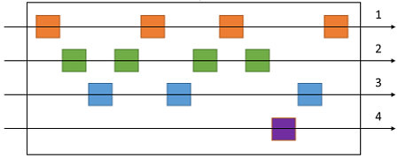
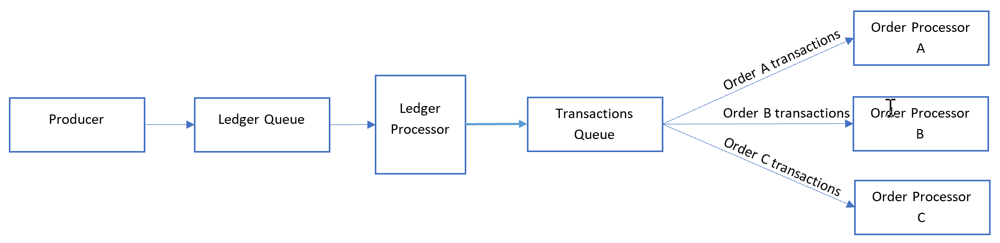

# Sequential Convoy pattern

مجموعه ‌ای از پیام‌های مرتبط و مشابه را به ترتیبی که تعریف شدهاند را پردازش می‌کند، بدون اینکه پردازش گروه‌‌های دیگری از پیامها مسدود شود.

## **زمینه و مشکل**

برنامه‌ها معمولاً نیاز دارند دنباله‌ای از پیام‌ها را به ترتیبی که می‌رسند پردازش کنند، در حالی که  می‌توانند برای مدیریت load ‌ای که در حال افزایش است، scale out کنند. در یک معماری توزیع‌شده، پردازش این پیام‌ها به ترتیبی که دریافت شده‌اند به هیچ وجه ساده نیست، زیرا workerها می‌توانند به طور مستقل scale کنند و اغلب پیام‌ها را به‌طور مستقل با استفاده از الگوی   [Competing Consumers pattern](./Competing%20Consumers%20pattern.md)  دریافت  کنند.

به عنوان مثال، یک سیستم ردیابی سفارش (order tracking)، لیستی را دریافت می‌کند که حاوی سفارشات و عملیات مربوط به آن سفارشها است. این عملیات می‌تواند ایجاد یک سفارش، افزودن یک تراکنش به سفارش، اصلاح تراکنش گذشته یا حذف یک سفارش باشد. در این سیستم، عملیات باید به صورت first-in-first-out (FIFO) انجام شود، اما فقط در سطح سفارش (order). با این حال، صف اولیه یک لیست حاوی تراکنش‌‌های بسیاری از سفارش‌ها را دریافت می‌کند که ممکن است به‌ هم‌ پیوسته باشد.

  
###   راه حل

پیام‌‌های مرتبط را به دسته‌‌هایی در  سیستم نوبت دهی Push کنید و از  صف شنود (queue (listeners بخواهید که فقط از یک دسته، یک پیام در یک زمان، انتخاب و قفل  و pull کند.  
  
در اینجا الگوی عمومی  Sequential Convoy pattern به نظر می‌رسد:

همانطور که در نمودار زیر نشان داده شده است، در صف، پیام‌‌های دسته‌‌های مختلف در ن‌هایت ممکن است به هم متصل شوند:

## مسائل و ملاحظات:

هنگام تصمیم گیری در مورد نحوه اجرای این الگو، نکات زیر را در نظر بگیرید:

*‏ **واحد  Category/scale:**  کدام ویژگی پیام‌‌های دریافتی‌تان را می‌توانید  scale out کنید؟ در سناریوی پیگیری سفارش (order tracking scenario)، این ویژگی متناسب با order ID است.  

*‏ **خروجی Throughput.** مقدار خروجی target message شما چقدر است؟ اگر بسیار زیاد است، ممکن است لازم باشد در الزامات FIFO خود را تجدید نظر کنید. به عنوان مثال، آیا می‌توانید برای پیامها مقدار start/end را اعمال کنید یا  آنها را بر اساس زمان مرتب کنید و سپس یک دسته را برای پردازش بفرستید؟  

*‏ **ظرفیت‌‌های سرویس یا Service capabilities:** آیا انتخاب گذرگاه پیام (message bus) شما امکان پردازش یک‌باره پیام‌ها را در یک صف یا دسته‌بندی صف فراهم می‌کند؟  

*‏ **تکامل پذیری (Evolvability):** چگونه دسته جدیدی از پیامها را به سیستم اضافه می‌کنید؟ برای مثال، فرض کنید سیستم مبتنی بر لیست شرح داده شده در بالا برای یک مشتری خاص است. اگر نیاز داشتید مشتری جدیدی را وارد کنید، آیا می‌توانید مجموعه‌ای از پردازش کننده‌ها مبتنی بر لیست‌‌های مختلف را داشته باشید که پردازشها را در هر customer ID توزیع می‌کنند؟  

*‏ این احتمال وجود دارد که مصرف‌کنندگان پیامی را دریافت کنند که به دلیل تاخیر شبکه در هنگام ارسال پیام‌ها، ناموفق است. استفاده از اعداد متوالی را برای تأیید سفارش در نظر بگیرید. همچنین ممکن است در آخرین پیام تراکنش یک پرچم خاص «end of sequence» قرار دهید. فناوری‌‌های Stream processing مانند Spark یا Azure Stream Analytics می‌توانند پیام‌ها را به ترتیب در یک پنجره زمانی پردازش کنند.

## **چه زمانی از این الگو استفاده کنیم؟**

از این الگو زمانی استفاده کنید که:  
  
*‏ شما پیام‌هایی دارید که به ترتیب می‌رسند و باید به همان ترتیب پردازش شوند.  

*‏ پیام‌‌های دریافتی به‌گونه‌ای «دسته‌بندی» می‌شوند یا می‌توان آن‌ها را به‌گونه‌ای «رده‌بندی» کرد که دسته‌بندی به یک واحد مقیاس پذیر برای سیستم تبدیل شود.  

این الگو ممکن است برای موارد زیر مناسب نباشد:  
  
*‏ سناریو‌هایی با توان عملیاتی بسیار بالا (میلیون‌ها پیام/دقیقه یا ثانیه)، زیرا نیازمندی پیاده سازی FIFO باعث می‌شود که مقیاس‌پذیری قابل انجام توسط سیستم، محدود شود.

## مثال

در مورد Azure ، این الگوی می‌تواند با استفاده از Azure Service Bus [message sessions](https://learn.microsoft.com/en-us/azure/service-bus-messaging/message-sessions) اجرا شود. برای consumerها ، می‌توانید از برنامه‌های منطقی با   [Service Bus peek-lock connector](https://learn.microsoft.com/en-us/azure/connectors/connectors-create-api-servicebus) یا عملکرد‌های Azure با  [Service Bus trigger](https://learn.microsoft.com/en-us/azure/azure-functions/functions-bindings-service-bus) استفاده کنید.  
  
در مثال قبلی که order-tracking است، هر پیام موجود در لیست را به ترتیب دریافت شده پردازش کنید و هر تراکنش را به صف دیگری ارسال کنید که در آن دسته روی  order ID تنظیم شده باشد. یک تراکنش هرگز در این سناریو چندین سفارش نخواهد داشت ، بنابراین consumerها هر دسته را به صورت موازی هر چند به صورت FIFO در این گروه پردازش می‌کنند.  
  
 معمولا "پردازشگر دفتر کل" (ledger processor) با استفاده از محتوای هر پیام در اولین صف، پیامها را پشت سر می‌گذارد و پردازش میکنند:

پردازشگر دفتر کل (ledger processor)  به موارد زیر رسیدگی می‌کند:  
  
1- بررسی یک تراکنش در لیست در هر لحظه.  
2- تنظیم session ID پیام برای مطابقت با order ID.  
3- ارسال هر تراکنش موجود در لیست (ledger transaction) به یک صف ثانویه با  session ID روی order ID تنظیم شده است.  

consumerها به صف ثانویه گوش می‌دهند که در آن همه پیامها را با order IDها منطبق به ترتیب از صف پردازش می‌کنند. consumerها از حالت [peek-lock](https://learn.microsoft.com/en-us/azure/service-bus-messaging/message-transfers-locks-settlement#peeklock) استفاده می‌کنند.  
  
وقتی مقیاس پذیری (scalability) را در نظر می‌گیریم، لیست مورد پردازش یک گلوگاه اصلی است. تراکنش‌های مختلف ارسال شده به لیست می‌تواند به همان order ID اشاره کند. با این حال، پیام‌ها می‌توانند بعد از لیست تعداد سفارش‌ها در یک محیط serverless منتشر شوند.

## قدم بعدی

اطلاعات زیر ممکن است هنگام اجرای این الگو مرتبط باشد:

- [Message sessions: first in, first out (FIFO)](https://learn.microsoft.com/en-us/azure/service-bus-messaging/message-sessions)
- [Peek-Lock Message (Non-Destructive Read)](https://learn.microsoft.com/en-us/rest/api/servicebus/peek-lock-message-non-destructive-read)
- [In order delivery of correlated messages in Logic Apps by using Service Bus sessions](https://learn.microsoft.com/en-us/archive/blogs/logicapps/in-order-delivery-of-correlated-messages-in-logic-apps-by-using-service-bus-sessions) (MSDN blog)
