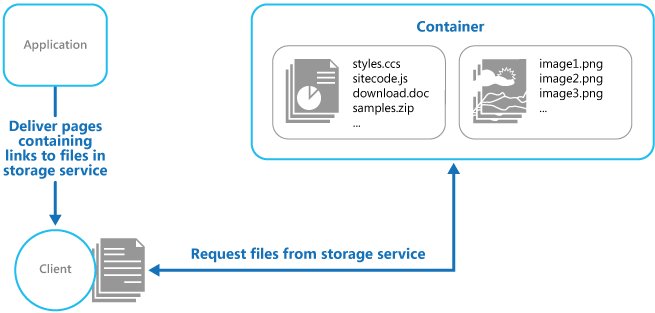

محتوای ثابت یا استاتیک را در یک سرویس ذخیره سازی مبتنی بر ابر مستقر کنید که با این روش می‌توان آنها را مستقیماً به کلاینت تحویل دهد. در نتیجه با این کار ممکن است نیاز به استفاده از نمونه‌ها و منابع محاسباتی گران قیمت را کاهش داد.

## **طرح صورت مسئله:**

برنامه و application های تحت وب معمولاً شامل برخی از عناصر محتوای استاتیک هستند. این محتوای ثابت یا استاتیک ممکن است شامل صفحات HTML و منابع دیگری مانند تصاویر و اسنادی باشد که در دسترس کاربر هستند به عنوان بخشی از یک صفحه HTML (مانند تصاویر درون خطی، شیوه نامه ها، و فایل های جاوا اسکریپت سمت سرویس گیرنده) و یا به عنوان دانلودهای جداگانه ( مانند اسناد PDF) باشند.  
  
اگرچه وب سرورها برای رندر پویا(dynamic rendering) و ذخیره خروجی(output caching) بهینه شده‌اند، اما همچنان باید درخواست های دانلود محتوای استاتیک را انجام دهند. این مسئله منابع پردازشی را مصرف می کند که اغلب می توان از آنها استفاده بهتری کرد.

## راه حل

در اکثر محیط‌های میزبانی ابری، می‌توانید برخی از منابع یک برنامه و صفحات استاتیک را در یک سرویس ذخیره‌سازی قرار دهید. سرویس ذخیره‌سازی می‌تواند درخواست‌ها را برای این منابع ارائه کند و بار روی منابع محاسباتی که سایر درخواست‌های وب را مدیریت می‌کنند را کاهش دهد. هزینه ذخیره سازی میزبان ابری (cloud-hosted storage) معمولاً بسیار کمتر از نمونه‌های دیگر و حتی نمونه‌های محاسباتی است.  
  
هنگام میزبانی(hosting) برخی از بخش‌های یک اپلیکیشن در یک سرویس ذخیره‌سازی باید ملاحظات اصلی مربوط به استقرار برنامه و ایمن‌سازی منابعی  که قرار نیست برای کاربران ناشناس در دسترس باشند.

زمانی که بخش‌هایی از یک برنامه را در یک سرویس ذخیره‌سازی میزبانی می‌کنید، اصلی‌ترین ملاحظات مربوط به deployment برنامه و ایمن‌سازی منابعی است که قرار نیست برای کاربران ناشناس در دسترس باشند.

## مسائل و ملاحظات:

* هنگام تصمیم گیری در مورد نحوه اجرای این الگو به نکات زیر توجه کنید:  
  
* سرویس ذخیره سازی میزبان باید یک  HTTP endpoint را نشان دهد که کاربران می توانند برای دانلود منابع استاتیک به آن دسترسی داشته باشند. برخی از سرویس‌های ذخیره‌سازی از HTTPS نیز پشتیبانی می‌کنند، بنابراین امکان میزبانی منابع در سرویس‌های ذخیره‌سازی که نیاز به SSL دارند وجود دارد.  
  
* برای حداکثر کارایی (performance) برنامه و در دسترس بودن (availability)، استفاده از یک شبکه تحویل محتوا (content delivery network (CDN)) را برای ذخیره کردن محتویات قابل ذخیره سازی در مراکز داده متعدد در سراسر جهان در نظر بگیرید. با این حال، احتمالاً باید برای استفاده از CDN هزینه کنید.  
  
* حساب‌های ذخیره‌سازی اغلب به‌طور پیش‌فرض برای ایجاد انعطاف‌پذیری در برابر رویدادهایی که ممکن است بر یک مرکز داده(datacenter) تأثیر بگذارد، به‌صورت جغرافیایی تکثیر(geo-replicated) می‌شوند. این بدان معنی است که آدرس IP ممکن است تغییر کند، اما URL ثابت باقی می ماند.  
  
* هنگامی که برخی از محتواها در یک حساب ذخیره سازی قرار دارند و محتوای دیگر در یک نمونه محاسباتی میزبانی شده است، استقرار و به روز رسانی برنامه چالش برانگیزتر می شود. ممکن است مجبور شوید پیاده‌سازی‌های جداگانه‌ای انجام دهید و برنامه و محتوا را برای مدیریت آسان‌تر نسخه‌ (version) بندی کنید—مخصوصاً زمانی که محتوای استاتیک شامل فایل‌های اسکریپت یا مؤلفه‌های رابط کاربری باشد. در این صورت اگر فقط منابع استاتیک باید به‌روزرسانی شوند، می‌توان آن‌ها را به سادگی در حساب ذخیره‌سازی آپلود کرد، بدون اینکه نیازی به استقرار مجدد برنامه باشد.  
  
* سرویس‌های ذخیره‌سازی ممکن است استفاده از نام‌های دامنه سفارشی را پشتیبانی نکنند. در این مورد لازم است URL کامل منابع در لینک‌ها مشخص شود زیرا آنها در دامنه متفاوتی از محتوای تولید شده به صورت پویا بوده و دارای لینک‌هایی منابع مورد نظر هستند.  
  
* کانتینرهای ذخیره‌سازی (storage containers) باید برای دسترسی خواندن عمومی(public) پیکربندی شوند، اما مهم است که اطمینان حاصل شود که برای دسترسی به نوشتن عمومی پیکربندی نشده‌اند تا از آپلود محتوا توسط کاربران جلوگیری شود.  
  
* برای کنترل دسترسی به منابعی که نباید به صورت ناشناس در دسترس باشند، از یک کلید یا توکن valet استفاده کنید. برای اطلاعات بیشتر الگوی [Valet Key](https://learn.microsoft.com/en-us/azure/architecture/patterns/valet-key) را ببینید.

## **چه زمانی از این الگو استفاده کنیم؟**

این الگو برای موارد زیر مفید است:  
  
* به حداقل رساندن هزینه میزبانی وب سایت ها و برنامه هایی که حاوی برخی منابع استاتیک هستند.  
  
* به حداقل رساندن هزینه میزبانی وب سایت‌هایی که فقط از محتوا و منابع استاتیک تشکیل شده‌اند. بسته به قابلیت‌های سیستم ذخیره سازی ارائه دهنده میزبانی، ممکن است امکان میزبانی کامل یک وب سایت کاملا استاتیک در یک حساب ذخیره سازی (storage account) وجود داشته باشد.  
  
* آشکارسازی (Exposing) منابع و محتوای استاتیک برای برنامه‌های که  در محیط‌های میزبانی دیگر یا سرورهای داخلی (on-premises servers) در حال اجرا هستند.  
  
* قرار دادن محتوا در بیش از یک منطقه جغرافیایی با استفاده از یک شبکه توزیع محتوا (CDN) که محتویات حساب ذخیره سازی را در چندین مرکز داده (datacenter) در سراسر جهان ذخیره می کند.  
  
* نظارت بر هزینه‌ها و مصرف پهنای باند. استفاده از یک حساب ذخیره‌سازی جداگانه برای بخش‌هایی یا تمامی محتوای استاتیک اجازه می‌دهد تا هزینه‌ها را به‌راحتی از هزینه‌های میزبانی و زمان اجرا جدا کرد.

این الگو ممکن است در شرایط زیر مفید نباشد:  
  
* برنامه نیاز دارد قبل از ارسال محتوای استاتیک به کاربر، برخی فرآیندهای پردازشی را روی آن انجام دهد. به عنوان مثال، ممکن است لازم باشد یک ثبت زمانی (timestamp) به یک سند اضافه شود.
  
* در حالتی که حجم محتوای استاتیک بسیار کم باشد. هزینه سربار بازیابی این محتوا از فضای ذخیره سازی جداگانه می تواند بیشتر از هزینه جداسازی آن از منبع محاسباتی باشد.


## مثال

‏ Azure Storage از ارائه محتوای استاتیک مستقیماً از یک کانتینر ذخیره سازی پشتیبانی می کند و فایل ها از طریق درخواست‌های دسترسی ناشناس ارائه می شوند. به طور پیش‌فرض، فایل‌ها یک URL در زیر دامنه  `core.windows.net` مانند `https://contoso.z4.web.core.windows.net/image.png`  دارند. می توانید یک نام دامنه سفارشی را پیکربندی کنید و از Azure CDN برای دسترسی به فایل ها از طریق HTTPS استفاده کنید. برای اطلاعات بیشتر،  [Static website hosting in Azure Storage](https://learn.microsoft.com/en-us/azure/storage/blobs/storage-blob-static-website) را ببینید.



 وب سایت استاتیک معمولا فایل ها را برای کاربران ناشناس در دسترس قرار می دهد. اگر می‌خواهید کنترل کنید چه کسی می‌تواند به فایل‌ها دسترسی داشته باشد، می‌توانید فایل‌ها را در حافظه Azure blob ذخیره کنید و سپس برای محدود کردن دسترسی، امضاهای دسترسی مشترک ([shared access signatures](https://learn.microsoft.com/en-us/azure/storage/common/storage-dotnet-shared-access-signature-part-1)) را ایجاد کنید.  
  
پیوندها یا لینک‌های موجود در صفحاتی که به کاربر‌ها تحویل داده می شوند باید URL کامل منبع را مشخص کنند. اگر منبع با یک کلید Valet محافظت می شود، مانند امضای دسترسی مشترک(shared access signature)، این امضا باید در URL گنجانده شود.  
  
یک برنامه که استفاده از حافظه خارجی برای منابع استاتیک را نشان می دهد در  [GitHub](https://github.com/mspnp/cloud-design-patterns/tree/master/static-content-hosting) موجود است. این مثال از فایل های پیکربندی برای تعیین حساب ذخیره سازی و محفظه ای که محتوای استاتیک را در خود نگه می دارد، استفاده می کند.

```xml
<Setting name="StaticContent.StorageConnectionString"
         value="UseDevelopmentStorage=true" />
<Setting name="StaticContent.Container" value="static-content" />
```

کلاس  `Settings` در فایل Settings.cs پروژه StaticContentHosting.Web حاوی روش هایی برای استخراج این مقادیر و ساخت یک مقدار رشته ای حاوی URL  حساب ذخیره سازی ابری است.

```csharp
public class Settings
{
  public static string StaticContentStorageConnectionString {
    get
    {
      return RoleEnvironment.GetConfigurationSettingValue(
                              "StaticContent.StorageConnectionString");
    }
  }

  public static string StaticContentContainer
  {
    get
    {
      return RoleEnvironment.GetConfigurationSettingValue("StaticContent.Container");
    }
  }

  public static string StaticContentBaseUrl
  {
    get
    {
        var blobServiceClient = new BlobServiceClient(StaticContentStorageConnectionString);

        return string.Format("{0}/{1}", blobServiceClient.Uri.ToString().TrimEnd('/'), StaticContentContainer.TrimStart('/'));
    }
  }
}
```

کلاس  `StaticContentUrlHtmlHelper` در فایل StaticContentUrlHtmlHelper.cs روشی به نام `StaticContentUrl` را نشان می دهد که اگر URL ارسال شده به آن با کاراکتر مسیر ریشه ASP.NET شروع شود، URL حاوی مسیر حساب ذخیره سازی ابری ایجاد می کند.

```csharp
public static class StaticContentUrlHtmlHelper
{
  public static string StaticContentUrl(this HtmlHelper helper, string contentPath)
  {
    if (contentPath.StartsWith("~"))
    {
      contentPath = contentPath.Substring(1);
    }

    contentPath = string.Format("{0}/{1}", Settings.StaticContentBaseUrl.TrimEnd('/'),
                                contentPath.TrimStart('/'));

    var url = new UrlHelper(helper.ViewContext.RequestContext);

    return url.Content(contentPath);
  }
}
```

فایل Index.cshtml در پوشه Views\Home حاوی یک  image است که از روش  `StaticContentUrl` برای ایجاد URL برای گزینه  `src` خود استفاده می کند.

```html

```


## قدم بعدی

لینک [Static Content Hosting sample](https://github.com/mspnp/cloud-design-patterns/tree/master/static-content-hosting)  یک مثال از  برنامه‌ای جهت پیاده سازی این الگو را نشان می دهد.

## منابع مرتبط

الگوی [Valet Key](https://learn.microsoft.com/en-us/azure/architecture/patterns/valet-key). اگر قرار نیست منابع مورد نظر  برای کاربران ناشناس در دسترس باشد، از این الگو برای محدود کردن دسترسی مستقیم استفاده کنید. 

[Serverless web application on Azure](https://learn.microsoft.com/en-us/azure/architecture/web-apps/serverless/architectures/web-app). یک معماری مرجع که از میزبانی وب سایت استاتیک با توابع Azure برای پیاده سازی یک برنامه وب بدون سرور استفاده می کند.