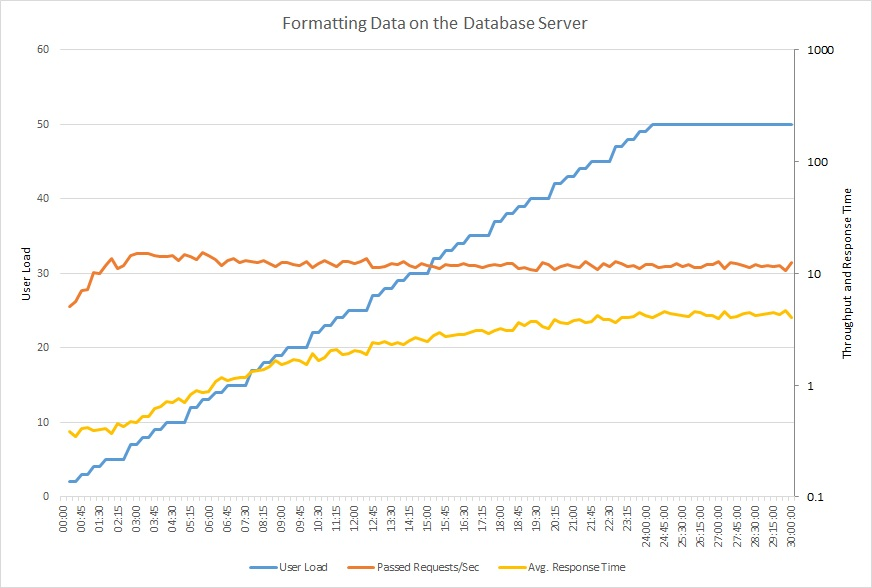
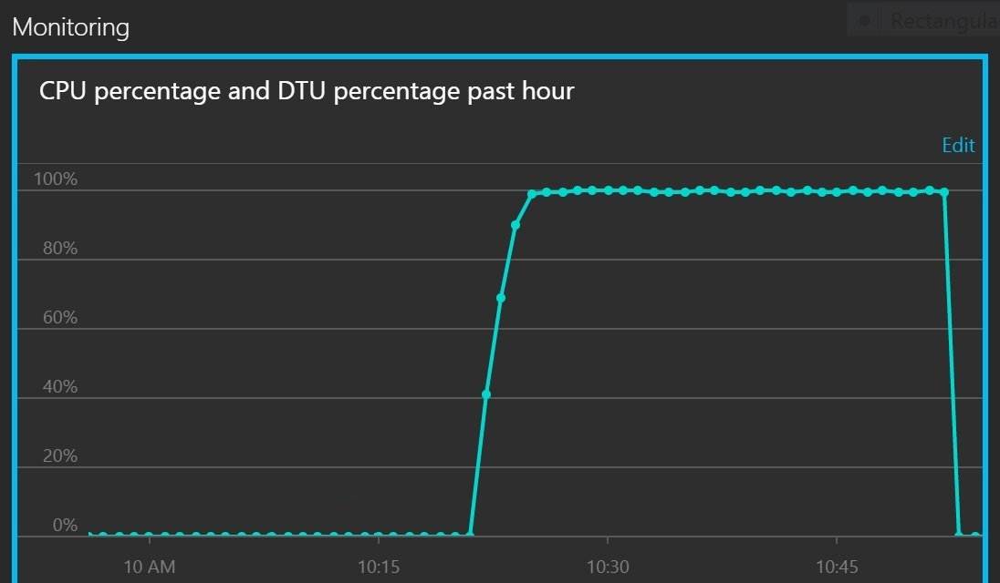
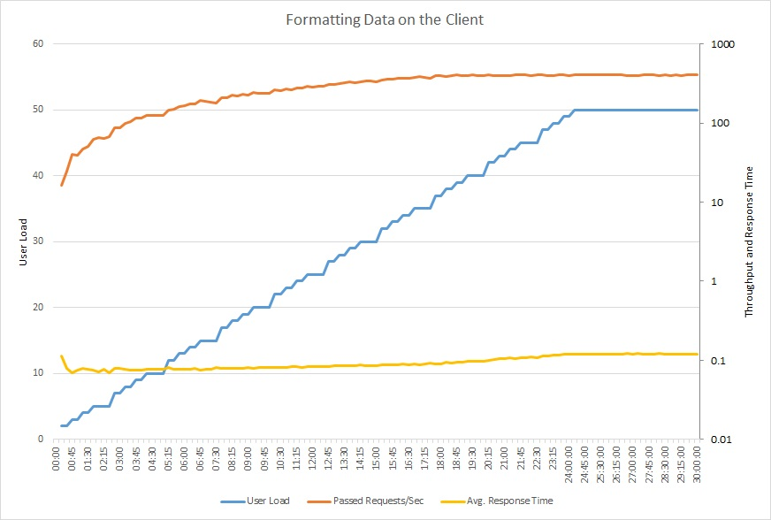
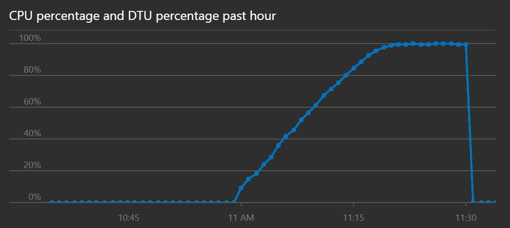

# Busy Database antipattern

انتقال پردازش به سرور پایگاه داده می‌تواند باعث شود بخش قابل توجهی از زمان آن صرف اجرای کد شود، به جای اینکه به درخواست‌های ذخیره و بازیابی داده پاسخ دهد.

## شرح مشکل

بسیاری از سیستم‌های پایگاه داده می‌توانند کد اجرا کنند. نمونه‌هایی از این موارد رویه‌های ذخیره‌شده (stored procedures) و تریگرها (triggers) هستند. اغلب، انجام این پردازش نزدیک به داده‌ها کارآمدتر از انتقال داده به یک برنامه‌ی کاربردی برای پردازش است. با این حال، استفاده بیش از حد از این ویژگی‌ها می‌تواند به دلایل مختلف به عملکرد آسیب برساند:

* سرور پایگاه داده ممکن است به جای پذیرش درخواست‌های جدید از سمت کاربر و بازیابی داده، زمان زیادی را صرف پردازش کند.
* یک پایگاه داده معمولاً یک منبع مشترک است، بنابراین می‌تواند در دوره‌های استفاده زیاد به یک گلوگاه تبدیل شود.
* اگر میزان استفاده از مخزن داده محدود باشد، هزینه‌های زمان اجرا ممکن است بیش از حد شود. این مورد به ویژه در مورد سرویس‌های مدیریت‌شده‌ی پایگاه داده صادق است. برای مثال، پایگاه داده Azure SQL برای واحدهای تراکنش پایگاه داده (DTU) هزینه دریافت می‌کند.
* پایگاه‌های داده ظرفیت محدودی برای ارتقای عمودی دارند و ارتقای افقی آن‌ها کار ساده‌ای نیست. بنابراین، بهتر است پردازش را به یک منبع محاسباتی مانند ماشین مجازی یا برنامه‌ی App Service منتقل کنید که به راحتی قابلیت ارتقای افقی را دارد.

##  علت‌های رایج این ضدالگو:

*  نگاه کردن به پایگاه داده به عنوان یک سرویس به جای یک مخزن:  ممکن است یک برنامه از سرور پایگاه داده برای فرمت‌دهی داده‌ها (به عنوان مثال، تبدیل به XML)، دستکاری داده‌های رشته‌ای یا انجام محاسبات پیچیده استفاده کند.
*  تلاش توسعه‌دهندگان برای نوشتن پرس‌و‌جوهایی که نتایج آن‌ها بتواند مستقیماً به کاربران نمایش داده شود. به عنوان مثال، یک پرس‌و‌جو ممکن است فیلدها را ترکیب کند یا تاریخ، زمان و ارز را بر اساس موقعیت مکانی فرمت کند.
*  تلاش توسعه‌دهندگان برای رفع ضدالگوی «جستجوی اضافی» با انتقال محاسبات به پایگاه داده.
*  استفاده از رویه‌های ذخیره‌شده برای کپسوله‌سازی منطق کسب‌و‌کار، شاید به این دلیل که نگهداری و به‌روزرسانی آن‌ها آسان‌تر در نظر گرفته می‌شود.

## مثال

این مثال ۲۰ سفارش با ارزش‌ترین را برای یک قلمرو فروش خاص بازیابی می‌کند و نتایج را به صورت XML فرمت‌دهی می‌کند. این مثال از توابع Transact-SQL برای تجزیه داده‌ها و تبدیل نتایج به XML استفاده می‌کند. نمونه کامل را می‌توانید [اینجا](link to the complete sample) پیدا کنید.

```sql
SELECT TOP 20
  soh.[SalesOrderNumber]  AS '@OrderNumber',
  soh.[Status]            AS '@Status',
  soh.[ShipDate]          AS '@ShipDate',
  YEAR(soh.[OrderDate])   AS '@OrderDateYear',
  MONTH(soh.[OrderDate])  AS '@OrderDateMonth',
  soh.[DueDate]           AS '@DueDate',
  FORMAT(ROUND(soh.[SubTotal],2),'C')
                          AS '@SubTotal',
  FORMAT(ROUND(soh.[TaxAmt],2),'C')
                          AS '@TaxAmt',
  FORMAT(ROUND(soh.[TotalDue],2),'C')
                          AS '@TotalDue',
  CASE WHEN soh.[TotalDue] > 5000 THEN 'Y' ELSE 'N' END
                          AS '@ReviewRequired',
  (
  SELECT
    c.[AccountNumber]     AS '@AccountNumber',
    UPPER(LTRIM(RTRIM(REPLACE(
    CONCAT( p.[Title], ' ', p.[FirstName], ' ', p.[MiddleName], ' ', p.[LastName], ' ', p.[Suffix]),
    '  ', ' '))))         AS '@FullName'
  FROM [Sales].[Customer] c
    INNER JOIN [Person].[Person] p
  ON c.[PersonID] = p.[BusinessEntityID]
  WHERE c.[CustomerID] = soh.[CustomerID]
  FOR XML PATH ('Customer'), TYPE
  ),

  (
  SELECT
    sod.[OrderQty]      AS '@Quantity',
    FORMAT(sod.[UnitPrice],'C')
                        AS '@UnitPrice',
    FORMAT(ROUND(sod.[LineTotal],2),'C')
                        AS '@LineTotal',
    sod.[ProductID]     AS '@ProductId',
    CASE WHEN (sod.[ProductID] >= 710) AND (sod.[ProductID] <= 720) AND (sod.[OrderQty] >= 5) THEN 'Y' ELSE 'N' END
                        AS '@InventoryCheckRequired'

  FROM [Sales].[SalesOrderDetail] sod
  WHERE sod.[SalesOrderID] = soh.[SalesOrderID]
  ORDER BY sod.[SalesOrderDetailID]
  FOR XML PATH ('LineItem'), TYPE, ROOT('OrderLineItems')
  )

FROM [Sales].[SalesOrderHeader] soh
WHERE soh.[TerritoryId] = @TerritoryId
ORDER BY soh.[TotalDue] DESC
FOR XML PATH ('Order'), ROOT('Orders')
```


کاملاً واضح است که این یک پرس‌وجوی پیچیده است. همانطور که بعداً خواهیم دید، این پرس‌و‌جو از منابع پردازشی قابل توجهی در سرور پایگاه داده استفاده می‌کند.

##  چگونه مشکل را برطرف کنیم

پردازش را از سرور پایگاه داده به سایر لایه‌های برنامه منتقل کنید. در حالت ایده‌آل،  باید پایگاه داده را به انجام عملیات دسترسی به داده محدود کنید و فقط از قابلیت‌هایی استفاده کنید که پایگاه داده برای آن‌ها بهینه‌سازی شده است، مانند جمع (aggregation) در یک RDBMS.

برای مثال، کد Transact-SQL قبلی را می‌توان با دستوری جایگزین کرد که به سادگی داده‌های مورد پردازش را بازیابی می‌کند.

```csharp
SELECT
soh.[SalesOrderNumber]  AS [OrderNumber],
soh.[Status]            AS [Status],
soh.[OrderDate]         AS [OrderDate],
soh.[DueDate]           AS [DueDate],
soh.[ShipDate]          AS [ShipDate],
soh.[SubTotal]          AS [SubTotal],
soh.[TaxAmt]            AS [TaxAmt],
soh.[TotalDue]          AS [TotalDue],
c.[AccountNumber]       AS [AccountNumber],
p.[Title]               AS [CustomerTitle],
p.[FirstName]           AS [CustomerFirstName],
p.[MiddleName]          AS [CustomerMiddleName],
p.[LastName]            AS [CustomerLastName],
p.[Suffix]              AS [CustomerSuffix],
sod.[OrderQty]          AS [Quantity],
sod.[UnitPrice]         AS [UnitPrice],
sod.[LineTotal]         AS [LineTotal],
sod.[ProductID]         AS [ProductId]
FROM [Sales].[SalesOrderHeader] soh
INNER JOIN [Sales].[Customer] c ON soh.[CustomerID] = c.[CustomerID]
INNER JOIN [Person].[Person] p ON c.[PersonID] = p.[BusinessEntityID]
INNER JOIN [Sales].[SalesOrderDetail] sod ON soh.[SalesOrderID] = sod.[SalesOrderID]
WHERE soh.[TerritoryId] = @TerritoryId
AND soh.[SalesOrderId] IN (
    SELECT TOP 20 SalesOrderId
    FROM [Sales].[SalesOrderHeader] soh
    WHERE soh.[TerritoryId] = @TerritoryId
    ORDER BY soh.[TotalDue] DESC)
ORDER BY soh.[TotalDue] DESC, sod.[SalesOrderDetailID]
``` 


سپس برنامه از API‌های System.Xml.Linq  فریم‌ورک دات نت برای فرمت‌دهی نتایج به صورت XML استفاده می‌کند.

```csharp
// Create a new SqlCommand to run the Transact-SQL query
using (var command = new SqlCommand(...))
{
    command.Parameters.AddWithValue("@TerritoryId", id);

    // Run the query and create the initial XML document
    using (var reader = await command.ExecuteReaderAsync())
    {
        var lastOrderNumber = string.Empty;
        var doc = new XDocument();
        var orders = new XElement("Orders");
        doc.Add(orders);

        XElement lineItems = null;
        // Fetch each row in turn, format the results as XML, and add them to the XML document
        while (await reader.ReadAsync())
        {
            var orderNumber = reader["OrderNumber"].ToString();
            if (orderNumber != lastOrderNumber)
            {
                lastOrderNumber = orderNumber;

                var order = new XElement("Order");
                orders.Add(order);
                var customer = new XElement("Customer");
                lineItems = new XElement("OrderLineItems");
                order.Add(customer, lineItems);

                var orderDate = (DateTime)reader["OrderDate"];
                var totalDue = (Decimal)reader["TotalDue"];
                var reviewRequired = totalDue > 5000 ? 'Y' : 'N';

                order.Add(
                    new XAttribute("OrderNumber", orderNumber),
                    new XAttribute("Status", reader["Status"]),
                    new XAttribute("ShipDate", reader["ShipDate"]),
                    ... // More attributes, not shown.

                    var fullName = string.Join(" ",
                        reader["CustomerTitle"],
                        reader["CustomerFirstName"],
                        reader["CustomerMiddleName"],
                        reader["CustomerLastName"],
                        reader["CustomerSuffix"]
                    )
                   .Replace("  ", " ") //remove double spaces
                   .Trim()
                   .ToUpper();

               customer.Add(
                    new XAttribute("AccountNumber", reader["AccountNumber"]),
                    new XAttribute("FullName", fullName));
            }

            var productId = (int)reader["ProductID"];
            var quantity = (short)reader["Quantity"];
            var inventoryCheckRequired = (productId >= 710 && productId <= 720 && quantity >= 5) ? 'Y' : 'N';

            lineItems.Add(
                new XElement("LineItem",
                    new XAttribute("Quantity", quantity),
                    new XAttribute("UnitPrice", ((Decimal)reader["UnitPrice"]).ToString("C")),
                    new XAttribute("LineTotal", RoundAndFormat(reader["LineTotal"])),
                    new XAttribute("ProductId", productId),
                    new XAttribute("InventoryCheckRequired", inventoryCheckRequired)
                ));
        }
        // Match the exact formatting of the XML returned from SQL
        var xml = doc
            .ToString(SaveOptions.DisableFormatting)
            .Replace(" />", "/>");
    }
}
```


	**توجه:**
	این کد تا حدودی پیچیده است. برای یک برنامه‌ی جدید، شاید ترجیح دهید از یک کتابخانه‌ی سریال‌سازی (serialization library) استفاده کنید. با این حال، فرض بر این است که تیم توسعه در حال بازنگاری (refactoring) یک برنامه‌ی موجود است، بنابراین این متد (method) باید دقیقاً همان فرمت کد اصلی را برگرداند.

## نکات قابل توجه

بسیاری از سیستم‌های پایگاه داده برای انجام انواع خاصی از پردازش داده، مانند محاسبه‌ی مقادیر تجمعی روی مجموعه‌های داده‌ی بزرگ، به شدت بهینه‌سازی شده‌اند. آن دسته از پردازش‌ها را از پایگاه داده خارج نکنید.

اگر با جابه‌جایی پردازش، پایگاه داده مجبور شود حجم بسیار بیشتری از داده‌ها را از طریق شبکه انتقال دهد، این کار را انجام ندهید. برای اطلاعات بیشتر، به ضدالگوی «[Extraneous Fetching](https://learn.microsoft.com/en-us/azure/architecture/antipatterns/extraneous-fetching/)» مراجعه کنید.

اگر پردازش را به یک لایه از برنامه منتقل می‌کنید، ممکن است آن لایه برای رسیدگی به کار اضافی نیاز به ارتقای افقی (scale out) داشته باشد. 

##  چگونه مشکل را تشخیص دهیم

علائم یک پایگاه داده شلوغ، کاهش نامتناسب در توان عملیاتی (throughput) و زمان پاسخ‌دهی در عملیات دسترسی به پایگاه داده است.

برای کمک به شناسایی این مشکل، می‌توانید مراحل زیر را انجام دهید:

از پایش عملکرد (performance monitoring) برای شناسایی میزان زمانی که سیستم تولید صرف انجام فعالیت‌های پایگاه داده می‌کند، استفاده کنید.

کارهایی را که توسط پایگاه داده در این مدت انجام می‌شود، بررسی کنید.

اگر گمان می‌کنید که عملیات خاصی ممکن است باعث فعالیت بیش از حد پایگاه داده شود، در یک محیط کنترل‌شده، تست بار (load testing) انجام دهید. هر تست باید مجموعه‌ای از عملیات مشکوک را با بار کاربری متغیر اجرا کند. تله‌متری (telemetry) حاصل از تست بار را برای مشاهده‌ی نحوه‌ی استفاده از پایگاه داده بررسی کنید.

اگر فعالیت پایگاه داده حاکی از پردازش قابل توجه اما ترافیک داده کم باشد، بررسی کنید که آیا پردازش را می‌توان به نحو بهتری در جای دیگری انجام داد یا خیر.

اگر حجم فعالیت پایگاه داده کم باشد یا زمان پاسخ‌دهی نسبتاً سریع باشد، بعید است که یک پایگاه داده شلوغ، مشکل عملکردی ایجاد کند. 


## نمونه‌ی تشخیص

بخش‌های زیر این مراحل را برای نمونه‌ی برنامه‌ی توصیف‌شده در ابتدای متن، به کار می‌گیرند.

##  نظارت بر حجم فعالیت پایگاه داده

نمودار زیر نتایج اجرای تست بار روی نمونه‌ی برنامه را با استفاده از بارگذاری مرحله‌ای تا ۵۰ کاربر همزمان نشان می‌دهد. حجم درخواست‌ها به سرعت به یک محدودیت می‌رسد و در آن سطح باقی می‌ماند، در حالی که میانگین زمان پاسخ‌دهی به طور پیوسته افزایش می‌یابد. برای این دو معیار از مقیاس لگاریتمی استفاده شده است.




نمودار بعدی میزان استفاده از CPU و DTU را به عنوان درصدی از سهمیه سرویس نشان می‌دهد. DTU‌ها معیاری از میزان پردازشی که پایگاه داده انجام می‌دهد را ارائه می‌دهند. نمودار نشان می‌دهد که استفاده از CPU و DTU هر دو به سرعت به ۱۰۰% رسیده‌اند.





## بررسی کارهایی که توسط پایگاه داده انجام می‌شود

ممکن است وظایفی که توسط پایگاه داده انجام می‌شود، عملیات دسترسی واقعی به داده باشند نه پردازش، بنابراین درک دستورات SQL که در حین شلوغی پایگاه داده اجرا می‌شوند، مهم است. برای ثبت ترافیک SQL و همبسته‌سازی عملیات SQL با درخواست‌های برنامه، سیستم را مانیتور کنید.

اگر عملیات پایگاه داده صرفاً عملیات دسترسی به داده باشند، بدون پردازش زیاد، ممکن است مشکل «جستجوی اضافی» باشد.

##  پیاده‌سازی راه‌حل و تأیید نتیجه

نمودار زیر یک تست بار را با استفاده از کد به‌روزشده نشان می‌دهد. توان عملیاتی به طور قابل توجهی بالاتر است، بیش از ۴۰۰ درخواست در ثانیه در مقابل ۱۲ درخواست قبلی. میانگین زمان پاسخ‌دهی نیز بسیار کمتر است، کمی بالاتر از ۰.۱ ثانیه در مقایسه با بیش از ۴ ثانیه.





میزان استفاده از CPU و DTU نشان می‌دهد که با وجود افزایش توان عملیاتی، زمان رسیدن سیستم به اشباع بیشتر طول کشیده است.





## منابع مرتبط

- [Extraneous Fetching antipattern](https://learn.microsoft.com/en-us/azure/architecture/antipatterns/extraneous-fetching/)

