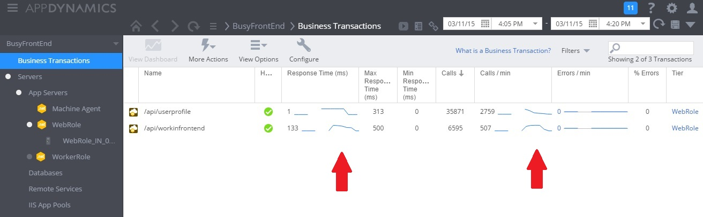
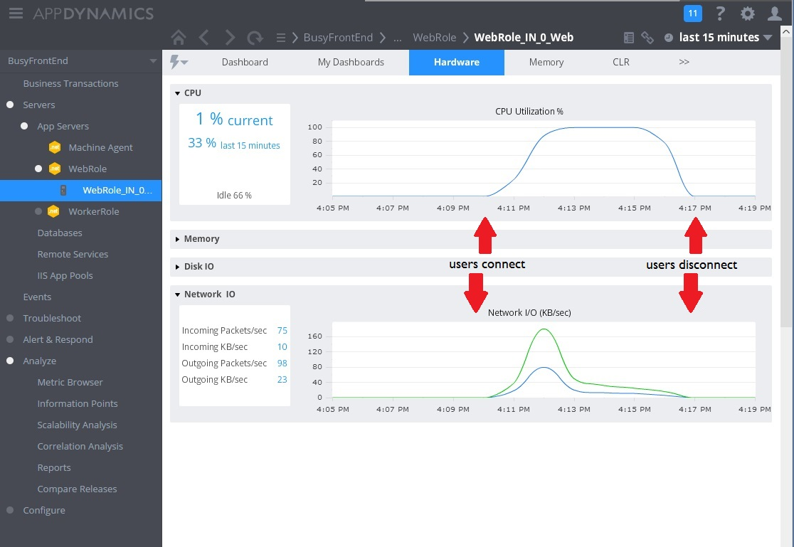
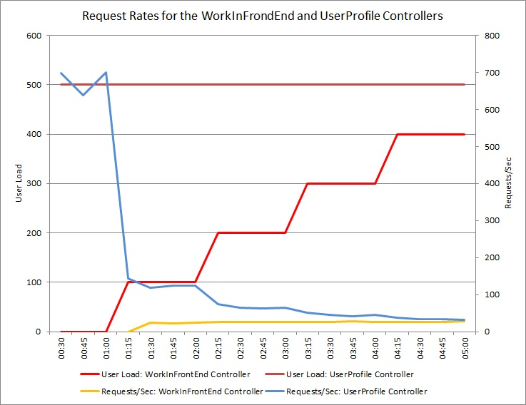
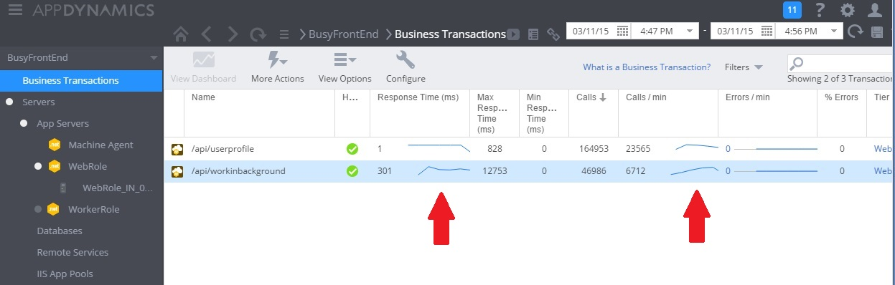
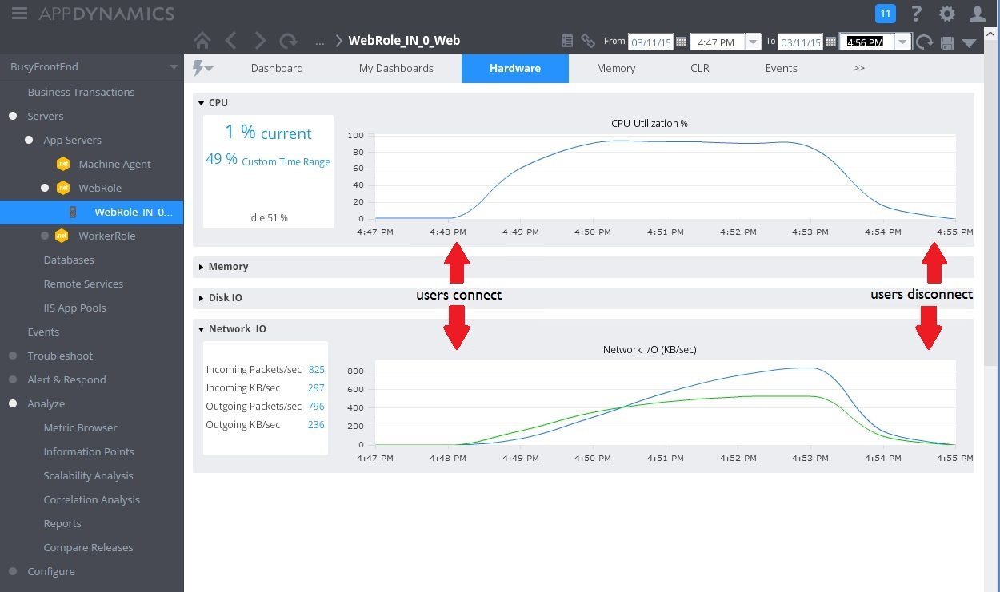
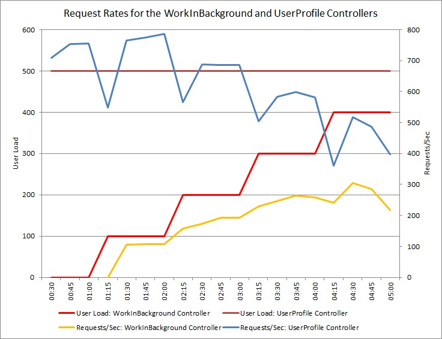

# Busy Front End antipattern


##  فرانت‌اند شلوغ (Busy Front End)

انجام کارهای ناهمزمان (آسنکرون) روی تعداد زیادی از رشته‌های پس‌زمینه (background thread) می‌تواند باعث کمبود منابع برای سایر کارهای همزمان در پیش‌زمینه (foreground task) شود و در نتیجه زمان پاسخ‌دهی را به سطوح غیرقابل قبولی کاهش دهد.

[لینک به توضیحات مشکل](https://learn.microsoft.com/en-us/azure/architecture/antipatterns/busy-front-end/#problem-description)

## شرح مشکل

وظایف با منابع زیاد (resource-intensive) می‌توانند زمان پاسخ‌دهی به درخواست‌های کاربر را افزایش داده و تأخیر بالایی ایجاد کنند. یکی از راه‌های بهبود زمان پاسخ‌دهی، انتقال یک وظیفه با منابع زیاد به یک رشته جداگانه است. این رویکرد به برنامه اجازه می‌دهد در حالی که پردازش در پس‌زمینه اتفاق می‌افتد، پاسخگو باقی بماند. با این حال، کارهایی که روی یک رشته پس‌زمینه اجرا می‌شوند همچنان منابع را مصرف می‌کنند. اگر تعداد آن‌ها زیاد باشد، می‌توانند باعث کمبود منابع برای رشته‌هایی شوند که درخواست‌ها را مدیریت می‌کنند.

**توجه:**

اصطلاح "_منبع_" می‌تواند شامل موارد زیادی مانند استفاده از CPU، اشغال حافظه و ورودی/خروجی شبکه یا دیسک باشد.

این مشکل زمانی به طور معمول رخ می‌دهد که یک برنامه به صورت یک قطعه کد یکپارچه (monolithic) توسعه داده شود، به طوری که تمام منطق کسب‌و‌کار در یک لایه واحد با لایه ارائه (presentation layer) به اشتراک گذاشته شود.

در اینجا یک مثال با استفاده از ASP.NET وجود دارد که این مشکل را نشان می‌دهد. نمونه کامل را می‌توانید [اینجا](https://github.com/mspnp/performance-optimization/tree/main/BusyFrontEnd) پیدا کنید.


```csharp
public class WorkInFrontEndController : ApiController
{
    [HttpPost]
    [Route("api/workinfrontend")]
    public HttpResponseMessage Post()
    {
        new Thread(() =>
        {
            //Simulate processing
            Thread.SpinWait(Int32.MaxValue / 100);
        }).Start();

        return Request.CreateResponse(HttpStatusCode.Accepted);
    }
}

public class UserProfileController : ApiController
{
    [HttpGet]
    [Route("api/userprofile/{id}")]
    public UserProfile Get(int id)
    {
        //Simulate processing
        return new UserProfile() { FirstName = "Alton", LastName = "Hudgens" };
    }
}
```

- متد `Post` در کنترل‌کننده `WorkInFrontEnd` یک عملیات  HTTP POST را پیاده‌سازی می‌کند. این عملیات یک وظیفه طولانی مدت و با مصرف زیاد CPU را شبیه‌سازی می‌کند. این کار برای اینکه عملیات POST به سرعت تکمیل شود، روی یک رشته جداگانه انجام می‌شود.

- متد `Get` در کنترل‌کننده `UserProfile` یک عملیات HTTP GET را پیاده‌سازی می‌کند. این روش به منابع CPU بسیار کمتری نیاز دارد.


مهم‌ترین نگرانی نیازهای منابع روش `Post` است. اگرچه این روش کار را روی یک رشته پس‌زمینه قرار می‌دهد، اما همچنان می‌تواند منابع CPU قابل توجهی مصرف کند. این منابع با سایر عملیات‌هایی که توسط کاربران همزمان دیگر انجام می‌شود، به اشتراک گذاشته می‌شود. اگر تعداد متوسطی از کاربران همزمان این درخواست را ارسال کنند، به احتمال زیاد عملکرد کلی کاهش می‌یابد و همه عملیات کند می‌شوند. به عنوان مثال، کاربران ممکن است تأخیر قابل توجهی در روش `Get` تجربه کنند.


##  چگونه مشکل را برطرف کنیم

فرایندهایی که منابع زیادی مصرف می‌کنند را به یک بک‌اند (back end) جداگانه منتقل کنید.

با این رویکرد، فرانت‌اند وظایف با منابع زیاد را در یک صف پیام (message queue) قرار می‌دهد. بک‌اند وظایف را برای پردازش ناهمزمان (آسنکرون) برمی‌دارد. این صف همچنین به عنوان یک تراز کننده بار (load leveler) عمل می‌کند و درخواست‌ها را برای بک‌اند بافر می‌کند. اگر طول صف خیلی زیاد شود، می‌توانید مقیاس خودکار (autoscaling) را برای مقیاس افقی (scale out) بک‌اند پیکربندی کنید.

در اینجا یک نسخه اصلاح‌شده از کد قبلی آورده شده است. در این نسخه، روش `Post` یک پیام را در صف Service Bus قرار می‌دهد.

```csharp
public class WorkInBackgroundController : ApiController
{
    private static readonly QueueClient QueueClient;
    private static readonly string QueueName;
    private static readonly ServiceBusQueueHandler ServiceBusQueueHandler;

    public WorkInBackgroundController()
    {
        var serviceBusConnectionString = ...;
        QueueName = ...;
        ServiceBusQueueHandler = new ServiceBusQueueHandler(serviceBusConnectionString);
        QueueClient = ServiceBusQueueHandler.GetQueueClientAsync(QueueName).Result;
    }

    [HttpPost]
    [Route("api/workinbackground")]
    public async Task<long> Post()
    {
        return await ServiceBusQueueHandler.AddWorkLoadToQueueAsync(QueueClient, QueueName, 0);
    }
}
```

بک‌اند پیام‌ها را از صف Service Bus می‌گیرد و پردازش را انجام می‌دهد.

```csharp
public async Task RunAsync(CancellationToken cancellationToken)
{
    this._queueClient.OnMessageAsync(
        // This lambda is invoked for each message received.
        async (receivedMessage) =>
        {
            try
            {
                // Simulate processing of message
                Thread.SpinWait(Int32.MaxValue / 1000);

                await receivedMessage.CompleteAsync();
            }
            catch
            {
                receivedMessage.Abandon();
            }
        });
}
```

## نکات قابل توجه

- این رویکرد کمی پیچیدگی بیشتری به برنامه اضافه می‌کند. شما باید صف‌بندی و خارج کردن از صف را با دقت مدیریت کنید تا از دست رفتن درخواست‌ها در صورت خرابی جلوگیری کنید.
- برنامه برای صف پیام به یک سرویس اضافی وابسته می‌شود.
- محیط پردازش باید به اندازه کافی مقیاس‌پذیر باشد تا بتواند حجم کاری مورد انتظار را مدیریت کند و به اهداف توان عملیاتی مورد نیاز برسد.
- در حالی که این رویکرد باید پاسخگویی کلی را بهبود بخشد، وظایفی که به بک‌اند منتقل می‌شوند ممکن است زمان بیشتری برای تکمیل نیاز داشته باشند. 

##  چگونه مشکل را تشخیص دهیم

علائم یک فرانت‌اند شلوغ شامل تأخیر بالا هنگام انجام وظایف با منابع زیاد است. کاربران نهایی به احتمال زیاد زمان پاسخ‌دهی طولانی یا خرابی‌هایی را گزارش می‌کنند که ناشی از زمان‌دار شدن سرویس‌ها (services timing out) است. این خرابی‌ها همچنین می‌توانند خطای HTTP 500 (سرور داخلی) یا خطای HTTP 503 (سرویس در دسترس نیست) را برگردانند. گزارش‌های رویداد (event logs) سرور وب را بررسی کنید که احتمالاً حاوی اطلاعات دقیق‌تری در مورد دلایل و شرایط بروز خطاها هستند.

برای کمک به شناسایی این مشکل، می‌توانید مراحل زیر را انجام دهید:

* پایش فرایند (process monitoring) سیستم تولید را انجام دهید تا نقاطی را که زمان پاسخ‌دهی کند می‌شود، شناسایی کنید.
* داده‌های تله‌متری (telemetry data) را که در این نقاط ثبت شده‌اند، بررسی کنید تا ترکیب عملیات انجام‌شده و منابع مورد استفاده را تعیین کنید.
* هر گونه همبستگی بین زمان پاسخ‌دهی ضعیف و حجم و ترکیبات عملیاتی را که در آن زمان اتفاق افتاده است، بیابید.
* بارگذاری آزمایشی (load test) روی هر عملیات مشکوک انجام دهید تا مشخص کنید کدام عملیات منابع را مصرف می‌کنند و سایر عملیات را از منابع محروم می‌کنند.
* کد منبع آن عملیات را بررسی کنید تا دلیل احتمالی مصرف بیش از حد منابع توسط آن‌ها را مشخص کنید.


## نمونه‌ی تشخیص

بخش‌های زیر این مراحل را برای نمونه‌ی برنامه‌ی توصیف‌شده در ابتدای متن، به کار می‌گیرند.

###  شناسایی نقاط کندی

در هر متد، مدت زمان و منابع مصرف‌شده توسط هر درخواست را ردیابی کنید. سپس برنامه را در تولید (production) مانیتور کنید. این کار می‌تواند یک نمای کلی از نحوه رقابت درخواست‌ها با یکدیگر ارائه دهد. در دوره‌های پراسترس، درخواست‌های کند و پرمصرف به احتمال زیاد بر سایر عملیات تأثیر می‌گذارند و این رفتار را می‌توان با مانیتور کردن سیستم و توجه به افت عملکرد مشاهده کرد.

تصویر زیر یک داشبورد مانیتورینگ را نشان می‌دهد. (ما برای تست‌هایمان از AppDynamics استفاده کردیم.) در ابتدا، سیستم بار کمی دارد. سپس کاربران شروع به درخواست متد GET در UserProfile می‌کنند. عملکرد تا زمانی که کاربران دیگر شروع به ارسال درخواست به متد POST در WorkInFrontEnd نکنند، نسبتاً خوب است. در آن نقطه، زمان پاسخ‌دهی به طور چشمگیری افزایش می‌یابد (اولین فلش). زمان پاسخ‌دهی فقط پس از کاهش حجم درخواست‌ها به کنترلر WorkInFrontEnd بهبود می‌یابد (دومین فلش).




## بررسی داده‌های تله‌متری و یافتن همبستگی

تصویر بعدی برخی از معیارهای جمع‌آوری‌شده برای نظارت بر استفاده از منابع در همان بازه زمانی را نشان می‌دهد. در ابتدا، کاربران کمی به سیستم دسترسی دارند. با اتصال کاربران بیشتر، استفاده از CPU بسیار بالا می‌رود (۱۰۰٪). همچنین توجه داشته باشید که نرخ ورودی/خروجی شبکه در ابتدا با افزایش استفاده از CPU بالا می‌رود. اما هنگامی که استفاده از CPU به اوج خود می‌رسد، ورودی/خروجی شبکه در واقع کاهش می‌یابد. دلیل این امر این است که سیستم پس از پر شدن ظرفیت CPU، فقط می‌تواند تعداد نسبتاً کمی از درخواست‌ها را مدیریت کند. با قطع اتصال کاربران، بار CPU کاهش می‌یابد.





در این مرحله، به نظر می‌رسد متد Post در کنترلر WorkInFrontEnd  گزینه اصلی برای بررسی دقیق‌تر است. برای تأیید فرضیه، کار بیشتر در یک محیط کنترل‌شده مورد نیاز است.


## انجام تست بار

گام بعدی انجام تست‌ها در یک محیط کنترل‌شده است. برای مثال، مجموعه‌ای از تست‌های بار را اجرا کنید که هر درخواست را به نوبت شامل یا حذف کند تا اثرات را ببینید.

نمودار زیر نتایج یک تست بار را نشان می‌دهد که روی یک استقرار (deployment) مشابه سرویس ابری مورد استفاده در تست‌های قبلی انجام شده است. تست از بار ثابتی از ۵۰۰ کاربر برای انجام عملیات Get در کنترلر UserProfile به همراه بار مرحله‌ای از کاربران برای انجام عملیات Post در کنترلر WorkInFrontEnd استفاده کرد.




## ادامه‌ی نمونه‌ی تشخیص

در ابتدا، بار مرحله‌ای برابر با 0 است، بنابراین تنها کاربران فعال، درخواست‌های UserProfile را انجام می‌دهند. سیستم قادر است به طور تقریبی به 500 درخواست در ثانیه پاسخ دهد. پس از 60 ثانیه، بار 100 کاربر اضافی شروع به ارسال درخواست‌های POST به کنترلر WorkInFrontEnd می‌کنند. تقریباً بلافاصله، حجم کاری ارسال شده به کنترلر UserProfile به حدود 150 درخواست در ثانیه کاهش می‌یابد. دلیل این امر نحوه عملکرد ابزار تست بار است. این ابزار قبل از ارسال درخواست بعدی، منتظر پاسخی می‌ماند، بنابراین هر چه زمان دریافت پاسخ بیشتر طول بکشد، نرخ درخواست کمتر می‌شود.

با ارسال درخواست‌های POST بیشتر توسط کاربران به کنترلر WorkInFrontEnd، نرخ پاسخ‌دهی کنترلر UserProfile همچنان کاهش می‌یابد. اما توجه داشته باشید که حجم درخواست‌های رسیدگی شده توسط کنترلر WorkInFrontEnd نسبتاً ثابت باقی می‌ماند. اشباع سیستم با نزدیک شدن نرخ کلی هر دو درخواست به یک حد ثابت اما پایین، آشکار می‌شود.

## بررسی کد منبع

گام نهایی بررسی کد منبع است. تیم توسعه‌دهنده از این موضوع آگاه بود که متد Post ممکن است زمان قابل توجهی را صرف کند، به همین دلیل پیاده‌سازی اصلی از یک رشته جداگانه استفاده می‌کرد. این کار مشکل فوری را حل کرد، زیرا متد Post برای انتظار تکمیل یک کار طولانی‌مدت، مسدود نمی‌شد.

با این حال، کاری که توسط این متد انجام می‌شود همچنان CPU، حافظه و سایر منابع را مصرف می‌کند. فعال کردن این فرآیند برای اجرا به صورت ناهمزمان (آسنکرون) ممکن است در واقع عملکرد را خراب کند، زیرا کاربران می‌توانند بدون کنترل، تعداد زیادی از این عملیات را به طور همزمان راه‌اندازی کنند. تعداد رشته‌هایی که یک سرور می‌تواند اجرا کند محدود است. فراتر از این محدودیت، برنامه احتمالاً زمانی که سعی می‌کند یک رشته جدید راه‌اندازی کند، با یک خطا (exception) مواجه می‌شود.

**توجه:**

این بدان معنا نیست که شما باید از عملیات‌های ناهمزمان اجتناب کنید. انجام یک انتظار ناهمزمان (asynchronous await) روی یک فراخوانی شبکه، یک رویه‌ی توصیه‌شده است. (ضدالگوی I/O همزمان را ببینید.) مشکل اینجا این است که کار با مصرف زیاد CPU در یک رشته دیگر ایجاد شد.

## پیاده‌سازی راه‌حل و تأیید نتیجه

تصویر زیر، نظارت بر عملکرد را پس از پیاده‌سازی راه‌حل نشان می‌دهد. بار شبیه به بار نشان داده شده قبلی بود، اما زمان پاسخ‌دهی برای کنترلر UserProfile اکنون بسیار سریع‌تر است. حجم درخواست‌ها در همان مدت زمان، از 2759 به 23565 افزایش یافت.





توجه داشته باشید که کنترلر WorkInBackground نیز حجم بسیار بیشتری از درخواست‌ها را مدیریت کرد. با این حال، در این مورد نمی‌توانید مقایسه مستقیمی انجام دهید، زیرا کاری که در این کنترلر انجام می‌شود، کاملاً با کد اصلی متفاوت است. نسخه جدید به سادگی یک درخواست را در صف قرار می‌دهد، به جای اینکه یک محاسبه زمان‌بر انجام دهد. نکته اصلی این است که این روش دیگر کل سیستم را در زیر بار کند نمی‌کند.

استفاده از CPU و شبکه نیز بهبود عملکرد را نشان می‌دهد. استفاده از CPU هرگز به 100٪ نرسید و حجم درخواست‌های شبکه مدیریت‌شده بسیار بیشتر از قبل بود و تا زمانی که حجم کاری کاهش نیافته بود، کاهش نیافت.





نمودار زیر نتایج یک تست بار را نشان می‌دهد. حجم کلی درخواست‌های سرویس‌دهی شده در مقایسه با تست‌های قبلی به طور قابل توجهی بهبود یافته است.


 

### منابع مرتبط


- [Autoscaling best practices](https://learn.microsoft.com/en-us/azure/architecture/best-practices/auto-scaling)
- [Background jobs best practices](https://learn.microsoft.com/en-us/azure/architecture/best-practices/background-jobs)
- [Queue-Based Load Leveling pattern](https://learn.microsoft.com/en-us/azure/architecture/patterns/queue-based-load-leveling)
- [Web Queue Worker architecture style](https://learn.microsoft.com/en-us/azure/architecture/guide/architecture-styles/web-queue-worker)