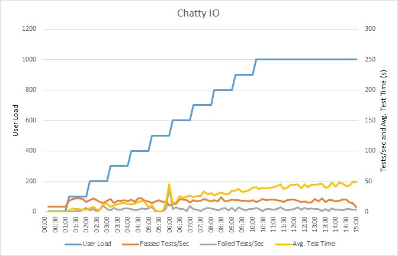
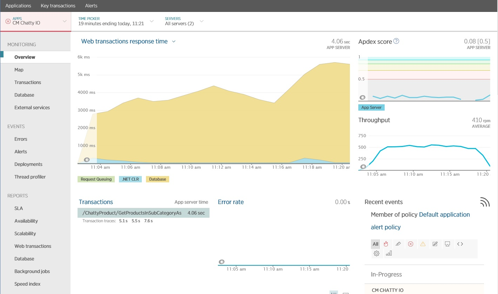
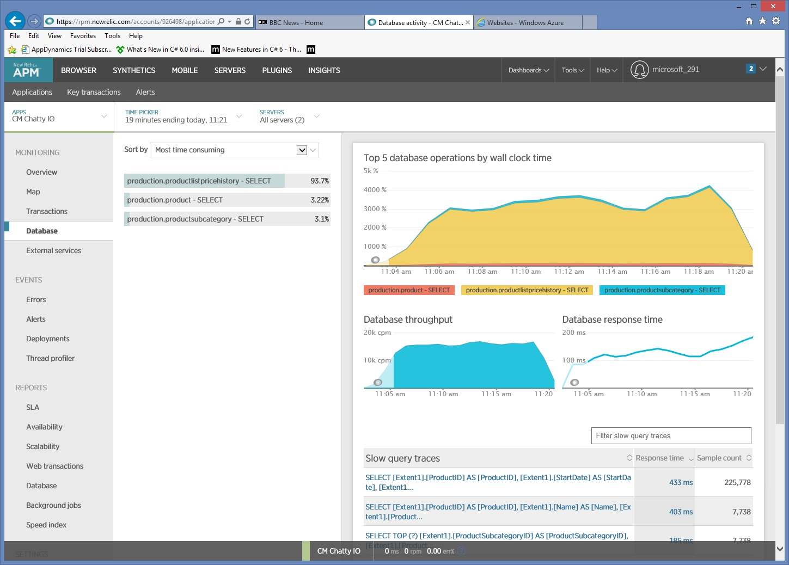
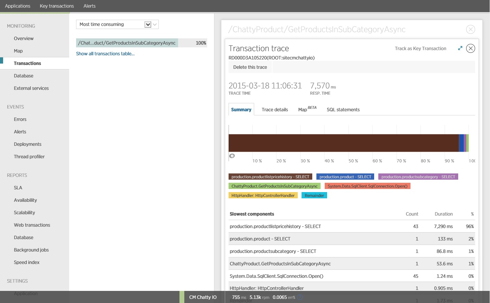
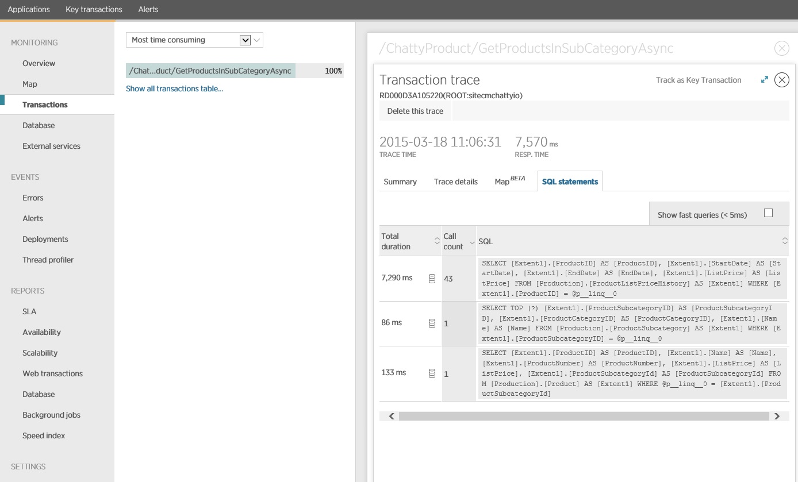
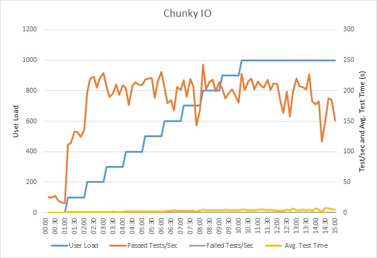
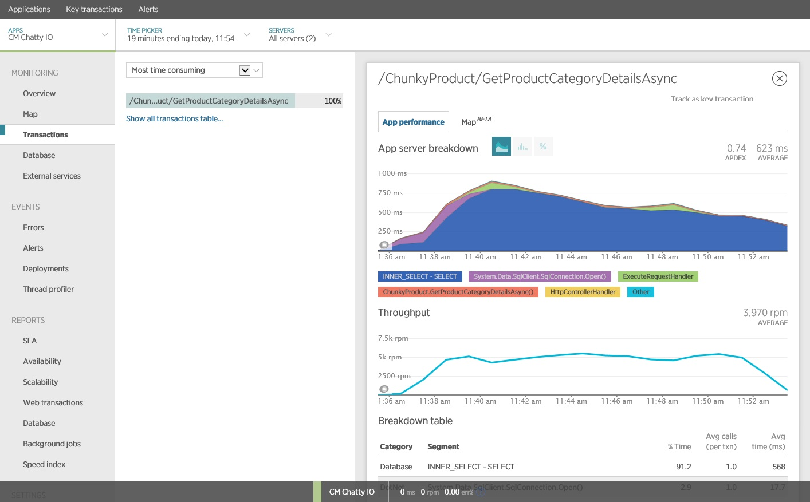
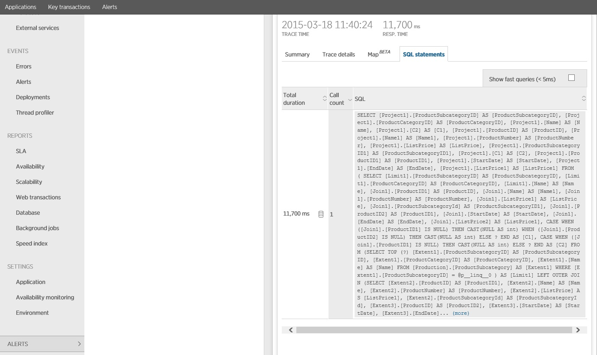

# Chatty I-O antipattern

تاثیر تجمعی تعداد زیادی از درخواست‌های ورودی/خروجی (I/O) می‌تواند تأثیر قابل توجهی بر عملکرد و پاسخ‌دهی داشته باشد.

## شرح مشکل

فراخوانی‌های شبکه و سایر عملیات ورودی/خروجی به طور ذاتی نسبت به کارهای محاسباتی کند هستند. هر درخواست ورودی/خروجی به طور معمول سربار قابل توجهی دارد و اثر تجمعی چندین عملیات ورودی/خروجی می‌تواند سیستم را کند کند. در اینجا برخی از دلایل رایج برای I/O پرحرف آورده شده است:

- خواندن و نوشتن تک تک رکوردها در یک پایگاه داده به عنوان درخواست‌های مجزا

نمونه‌ی زیر از یک پایگاه داده حاوی محصولات می‌خواند. سه جدول وجود دارد: Product، ProductSubcategory و ProductPriceListHistory. کد با اجرای مجموعه‌ای از پرس و جوها، تمام محصولات موجود در یک زیرمجموعه را به همراه اطلاعات قیمت‌گذاری بازیابی می‌کند:

1. زیرمجموعه را از جدول ProductSubcategory پرس و جو کنید.
2. تمام محصولات موجود در آن زیرمجموعه را با پرس و جو از جدول Product پیدا کنید.
3. برای هر محصول، داده‌های قیمت‌گذاری را از جدول ProductPriceListHistory پرس و جو کنید.

برنامه از [Entity Framework](https://learn.microsoft.com/en-us/ef) برای پرس و جو از پایگاه داده استفاده می‌کند. نمونه کامل را می‌توانید [اینجا](https://github.com/mspnp/performance-optimization/tree/main/ChattyIO) پیدا کنید.

```csharp
public async Task<IHttpActionResult> GetProductsInSubCategoryAsync(int subcategoryId)
{
    using (var context = GetContext())
    {
        // Get product subcategory.
        var productSubcategory = await context.ProductSubcategories
                .Where(psc => psc.ProductSubcategoryId == subcategoryId)
                .FirstOrDefaultAsync();

        // Find products in that category.
        productSubcategory.Product = await context.Products
            .Where(p => subcategoryId == p.ProductSubcategoryId)
            .ToListAsync();

        // Find price history for each product.
        foreach (var prod in productSubcategory.Product)
        {
            int productId = prod.ProductId;
            var productListPriceHistory = await context.ProductListPriceHistory
                .Where(pl => pl.ProductId == productId)
                .ToListAsync();
            prod.ProductListPriceHistory = productListPriceHistory;
        }
        return Ok(productSubcategory);
    }
}
```


‍
این مثال مشکل را به طور آشکار نشان می‌دهد، اما گاهی اوقات یک O/RM می‌تواند مشکل را پنهان کند، اگر به طور ضمنی رکوردهای فرزند را به صورت تک به تک بازیابی کند. این به عنوان "مشکل N+1" شناخته می‌شود.

- اجرای یک عمل منطقی واحد به عنوان یک سری از درخواست‌های HTTP

این اغلب زمانی اتفاق می‌افتد که توسعه‌دهندگان سعی می‌کنند از الگوی شیءگرا (object-oriented paradigm) پیروی کنند و با اشیاء از راه دور مانند اشیاء محلی در حافظه رفتار کنند. این می‌تواند منجر به رفت و برگشت‌های (round trip) زیادی در شبکه شود. به عنوان مثال، وب API زیر ویژگی‌های جداگانه‌ی اشیاء User را از طریق متدهای GET جداگانه HTTP در معرض دید قرار می‌دهد:

```csharp
public class UserController : ApiController
{
    [HttpGet]
    [Route("users/{id:int}/username")]
    public HttpResponseMessage GetUserName(int id)
    {
        ...
    }

    [HttpGet]
    [Route("users/{id:int}/gender")]
    public HttpResponseMessage GetGender(int id)
    {
        ...
    }

    [HttpGet]
    [Route("users/{id:int}/dateofbirth")]
    public HttpResponseMessage GetDateOfBirth(int id)
    {
        ...
    }
}
```

در حالی که از نظر فنی مشکلی در این رویکرد وجود ندارد، به احتمال زیاد اکثر کاربران برای دریافت چندین ویژگی برای هر User به چندین درخواست نیاز دارند که منجر به کد سمت کاربر (client code) مانند کد زیر می‌شود:

```csharp
HttpResponseMessage response = await client.GetAsync("users/1/username");
response.EnsureSuccessStatusCode();
var userName = await response.Content.ReadAsStringAsync();

response = await client.GetAsync("users/1/gender");
response.EnsureSuccessStatusCode();
var gender = await response.Content.ReadAsStringAsync();

response = await client.GetAsync("users/1/dateofbirth");
response.EnsureSuccessStatusCode();
var dob = await response.Content.ReadAsStringAsync();
```

- خواندن و نوشتن روی یک فایل روی دیسک

ورودی/خروجی فایل (File I/O) شامل باز کردن یک فایل و رفتن به نقطه‌ی مناسب قبل از خواندن یا نوشتن داده است. هنگامی که عملیات کامل شد، ممکن است فایل برای صرفه‌جویی در منابع سیستم‌عامل بسته شود. برنامه‌ای که دائماً مقادیر کمی از اطلاعات را می‌خواند و روی یک فایل می‌نویسد، سربار ورودی/خروجی قابل توجهی ایجاد خواهد کرد. درخواست‌های نوشتن کوچک همچنین می‌توانند منجر به تکه‌تکه شدن فایل (fragmentation) شوند و در نتیجه عملیات ورودی/خروجی بعدی را کندتر کنند.

مثال زیر از یک FileStream برای نوشتن یک شیء Customer به یک فایل استفاده می‌کند. ایجاد FileStream فایل را باز می‌کند و dispose کردن آن فایل را می‌بندد. (دستور using به طور خودکار شیء FileStream را dispose می‌کند.) اگر برنامه این روش را به طور مکرر با اضافه شدن مشتریان جدید فراخوانی کند، سربار ورودی/خروجی می‌تواند به سرعت انباشته شود.

```csharp
private async Task SaveCustomerToFileAsync(Customer customer)
{
    using (Stream fileStream = new FileStream(CustomersFileName, FileMode.Append))
    {
        BinaryFormatter formatter = new BinaryFormatter();
        byte [] data = null;
        using (MemoryStream memStream = new MemoryStream())
        {
            formatter.Serialize(memStream, customer);
            data = memStream.ToArray();
        }
        await fileStream.WriteAsync(data, 0, data.Length);
    }
}
```

## نحوه‌ی رفع مشکل

با بسته‌بندی کردن داده‌ها در درخواست‌های بزرگ‌تر و کمتر، تعداد درخواست‌های ورودی/خروجی را کاهش دهید.

به جای چندین پرس و جوی کوچک‌تر، داده‌ها را از پایگاه داده به عنوان یک پرس و جوی واحد دریافت کنید. در اینجا یک نسخه اصلاح‌شده از کد که اطلاعات محصول را بازیابی می‌کند آورده شده است:

```csharp
public async Task<IHttpActionResult> GetProductCategoryDetailsAsync(int subCategoryId)
{
    using (var context = GetContext())
    {
        var subCategory = await context.ProductSubcategories
                .Where(psc => psc.ProductSubcategoryId == subCategoryId)
                .Include("Product.ProductListPriceHistory")
                .FirstOrDefaultAsync();

        if (subCategory == null)
            return NotFound();

        return Ok(subCategory);
    }
}
```


- از اصول طراحی REST برای وب API پیروی کنید. در اینجا یک نسخه اصلاح‌شده از وب API از مثال قبلی آورده شده است. به جای متدهای GET جداگانه برای هر ویژگی، یک متد GET واحد وجود دارد که User را برمی‌گرداند. این کار باعث می‌شود بدنه‌ی پاسخ برای هر درخواست بزرگ‌تر شود، اما به احتمال زیاد هر کاربر درخواست‌های API کمتری ارسال می‌کند.

```csharp
public class UserController : ApiController
{
    [HttpGet]
    [Route("users/{id:int}")]
    public HttpResponseMessage GetUser(int id)
    {
        ...
    }
}

// Client code
HttpResponseMessage response = await client.GetAsync("users/1");
response.EnsureSuccessStatusCode();
var user = await response.Content.ReadAsStringAsync();
```

- از اصول طراحی REST برای وب API پیروی کنید. در اینجا یک نسخه اصلاح‌شده از وب API از مثال قبلی آورده شده است. به جای متدهای GET جداگانه برای هر ویژگی، یک متد GET واحد وجود دارد که User را برمی‌گرداند. این کار باعث می‌شود بدنه‌ی پاسخ برای هر درخواست بزرگ‌تر شود، اما به احتمال زیاد هر کاربر درخواست‌های API کمتری ارسال می‌کند.

```csharp
// Save a list of customer objects to a file
private async Task SaveCustomerListToFileAsync(List<Customer> customers)
{
    using (Stream fileStream = new FileStream(CustomersFileName, FileMode.Append))
    {
        BinaryFormatter formatter = new BinaryFormatter();
        foreach (var customer in customers)
        {
            byte[] data = null;
            using (MemoryStream memStream = new MemoryStream())
            {
                formatter.Serialize(memStream, customer);
                data = memStream.ToArray();
            }
            await fileStream.WriteAsync(data, 0, data.Length);
        }
    }
}

// In-memory buffer for customers.
List<Customer> customers = new List<Customers>();

// Create a new customer and add it to the buffer
var customer = new Customer(...);
customers.Add(customer);

// Add more customers to the list as they are created
...

// Save the contents of the list, writing all customers in a single operation
await SaveCustomerListToFileAsync(customers);
```

- برای ورودی/خروجی فایل (File I/O)، میتوانید بافر کردن داده‌ها در حافظه و سپس نوشتن داده‌های بافر شده به عنوان یک عملیات واحد در یک فایل را در نظر بگیرید. این رویکرد سربار ناشی از باز و بسته شدن مکرر فایل را کاهش می‌دهد و به کاهش تکه‌تکه شدن فایل در دیسک کمک می‌کند.


**ملاحظات (Molaghezat)**

دو نمونه اول تماس‌های I/O کمتری برقرار می‌کنند، اما هر کدام اطلاعات بیشتری را بازیابی می‌کنند. شما باید بین این دو عامل مصالحه (Mosahe) را در نظر بگیرید. پاسخ صحیح به الگوهای استفاده واقعی بستگی دارد. برای مثال، در نمونه API وب، ممکن است مشخص شود که مشتریان اغلب فقط به نام کاربری نیاز دارند. در این صورت، ممکن است منطقی باشد که آن را به عنوان یک تماس API جداگانه در معرض دید قرار دهید. برای اطلاعات بیشتر، الگوی ضد [Extraneous Fetching](https://learn.microsoft.com/en-us/azure/architecture/antipatterns/extraneous-fetching/) را ببینید.

هنگام خواندن داده‌ها، درخواست‌های I/O خود را خیلی بزرگ نکنید. یک برنامه فقط باید اطلاعاتی را بازیابی کند که به احتمال زیاد از آنها استفاده خواهد کرد.

گاهی اوقات تقسیم‌بندی اطلاعات برای یک شی به دو بخش مفید است، داده‌های دسترسی مکرر که مربوط به اکثر درخواست‌ها است و داده‌های دسترسی کمتر که به ندرت مورد استفاده قرار می‌گیر  گیرند. اغلب داده‌های با دسترسی مکرر بخش نسبتاً کوچکی از کل داده‌های یک شیء هستند، بنابراین بازگرداندن فقط آن بخش می‌تواند باعث صرفه‌جویی قابل توجه در سربار I/O شود.

هنگام نوشتن داده، برای کاهش احتمال رقابت (Reqabat) در طول یک عملیات طولانی، از قفل کردن منابع برای مدت طولانی‌تر از حد نیاز خودداری کنید. اگر یک عملیات نوشتن چندین مخزن داده، فایل یا سرویس را در بر می‌گیرد، سپس رویکرد نهایتا سازگار (Nahayatan Sazgar) را اتخاذ کنید. راهنمای[Data Consistency](https://learn.microsoft.com/en-us/previous-versions/msp-n-p/dn589800(v=pandp.10)) را ببینید.

اگر قبل از نوشتن داده‌ها را در حافظه بافر می‌کنید، داده‌ها در صورت خرابی فرآیند آسیب‌پذیر هستند. اگر نرخ داده به طور معمول دارای انفجار (Enfejar) یا نسبتاً پراکنده (Porakandeh) است، ممکن است بافر کردن داده‌ها در یک صف با دوام خارجی مانند [Event Hubs](https://azure.microsoft.com/services/event-hubs) ایمن‌تر باشد.

به فکر ذخیره‌سازی میانجی (Dakhire Sazmani) داده‌هایی باشید که از یک سرویس یا پایگاه داده بازیابی می‌کنید. این می‌تواند با اجتناب از درخواست‌های مکرر برای داده‌های مشابه، به کاهش حجم I/O کمک کند. برای اطلاعات بیشتر، به [Caching best practices](https://learn.microsoft.com/en-us/azure/architecture/best-practices/caching) مراجعه کنید.

**نحوه تشخیص مشکل (Nohve تشخيص مشکل)**

علائم I/O پرتحرک (Chatty)  شامل تأخیر بالا (Taakhir Bala) و توان عملیاتی پایین (Touan Emaliati Paeen) است. کاربران نهایی به احتمال زیاد به دلیل رقابت بیشتر برای منابع I/O، زمان‌های پاسخ طولانی یا خرابی‌هایی را گزارش می‌کنند که ناشی از زمان‌دار شدن سرویس‌ها است.

برای کمک به شناسایی علل هر گونه مشکلی می‌توانید مراحل زیر را انجام دهید:

برای شناسایی عملیات‌هایی با زمان پاسخ ضعیف، نظارت بر فرایند (Nazarte Bar Faraynd) سیستم تولید را انجام دهید.
بارگذاری آزمایشی (Bargozari Azemayeshi) هر عملیاتی که در مرحله قبل شناسایی شده است را انجام دهید.
در طول آزمایش‌های بار، داده‌های تله‌متری (Telemetri) را در مورد درخواست‌های دسترسی به داده‌ای که توسط هر عملیات انجام می‌شود، جمع‌آوری کنید.
برای هر درخواستی که به مخزن داده ارسال می‌شود، آمار دقیق را جمع‌آوری کنید.
برای تعیین محل احتمالی گلوگاه‌های (Golehgah) I/O، برنامه را در محیط آزمایش پروفایل کنید (Profile).
به دنبال هر یک از این علائم باشید:

* تعداد زیادی درخواست I/O کوچک به یک فایل خاص.
* تعداد زیادی درخواست شبکه کوچک که توسط یک نمونه برنامه به یک سرویس خاص ارسال می‌شود.
* تعداد زیادی درخواست کوچک که توسط یک نمونه برنامه به یک مخزن داده خاص ارسال می‌شود.
* برنامه‌ها و سرویس‌هایی که به I/O وابسته می‌شوند.

**تشخیص نمونه (Tashkhis Namune)**

بخش‌های زیر این مراحل را برای مثالی که در ابتدا نشان داده شده است که یک پایگاه داده را پرس و جو می‌کند، اعمال می‌کنند.

آزمایش بار روی برنامه را انجام دهید
این نمودار نتایج آزمایش بار را نشان می‌دهد. میانگین زمان پاسخ بر حسب ده‌ها ثانیه به ازای هر درخواست اندازه‌گیری می‌شود. نمودار تأخیر بسیار بالایی را نشان می‌دهد. با بار 1000 کاربر، ممکن است یک کاربر تقریباً یک دقیقه برای دیدن نتایج یک پرس و جو منتظر





	
	**توجه (Tatvagheh)**
	این برنامه به عنوان یک برنامه وب سرویس برنامه Azure (Azure App Service web app) با استفاده از پایگاه داده SQL Azure مستقر شده است. تست بار از یک حجم کاری مرحله‌ای شبیه‌سازی‌شده تا 1000 کاربر همزمان استفاده کرد. پایگاه داده با یک استخر اتصال (Estekhr Etesal) پیکربندی شد که از حداکثر 1000 اتصال همزمان پشتیبانی می‌کند تا احتمال تأثیر رقابت برای اتصالات بر نتایج کاهش یابد.

**نظارت بر برنامه (Nazarte Bar Barname)**

می‌توانید از یک بسته نظارت بر عملکرد برنامه (APM) برای ضبط و تجزیه و تحلیل معیارهای کلیدی که ممکن است I/O پرتحرک را شناسایی کند، استفاده کنید. اینکه کدام معیارها مهم هستند به حجم کاری I/O بستگی دارد. برای این مثال، درخواست‌های I/O جالب، پرس و جوهای پایگاه داده بودند.

تصویر زیر نتایج تولید شده با استفاده از [New Relic APM]([New Relic APM](https://newrelic.com/products/application-monitoring)) را نشان می‌دهد. میانگین زمان پاسخ پایگاه داده در حداکثر حجم کاری به حدود 5.6 ثانیه به ازای هر درخواست رسید. این سیستم در طول آزمایش به طور متوسط ​​از 410 درخواست در دقیقه پشتیبانی می‌کرد.



**جمع‌آوری اطلاعات دسترسی دقیق به داده‌ها (Jam’-آوری Ettela’at Dastresi Dakigh be Dadeha)**

بررسی عمیق‌تر داده‌های نظارت نشان می‌دهد که برنامه سه دستور SQL SELECT مختلف را اجرا می‌کند. اینها با درخواست‌های ایجاد شده توسط Entity Framework برای دریافت داده از جداول ProductListPriceHistory، Product و ProductSubcategory مطابقت دارند. علاوه بر این، پرس و جویی که داده‌ها را از جدول ProductListPriceHistory بازیابی می‌کند، از نظر بزرگی، پراستفاده‌ترین دستور SELECT است.




مشخص شد که متد GetProductsInSubCategoryAsync که در ابتدا نشان داده شد، 45 پرس و جوی SELECT انجام می‌دهد. هر پرس و جو باعث می‌شود برنامه یک اتصال SQL جدید باز کند.





	توجه (Tatvagheh)
	این تصویر، اطلاعات ردیابی (Radiyabi) را برای کندترین نمونه عملیات GetProductsInSubCategoryAsync در تست بار نشان می‌دهد. در یک محیط تولید، بررسی ردیابی کندترین نمونه‌ها برای دیدن اینکه آیا الگویی وجود دارد که مشکلی را نشان دهد، مفید است. اگر فقط به مقادیر میانگین نگاه کنید، ممکن است مشکلات ناشی از بار را که به طور چشمگیری بدتر می‌شوند نادیده بگیرید.

تصویر بعدی عبارات SQL واقعی اجرا شده را نشان می‌دهد. پرس و جویی که اطلاعات قیمت را به دست می‌آورد برای هر محصول جداگانه در زیرمجموعه محصول اجرا می‌شود. استفاده از یک اتصال (Etesal) به طور قابل توجهی تعداد تماس های پایگاه داده را کاهش می‌دهد. 




اگر از یک O/RM مانند Entity Framework استفاده می‌کنید، ردیابی پرس و جوهای SQL می‌تواند بینشی در مورد چگونگی ترجمه تماس های برنامه نویسی به عبارات SQL توسط O/RM و نشان دادن مناطقی که دسترسی به داده‌ها ممکن است بهینه شود، ارائه دهد.

**پیاده سازی راه حل و تأیید نتیجه (Piandeh Sazi Rah-e Hal va Taeyid Natijeh)**

بازنویسی فراخوانی به Entity Framework نتایج زیر را به همراه داشت.




این تست بار روی همان استقرار با استفاده از همان پروفایل بار انجام شد. این بار نمودار تأخیر بسیار کمتری را نشان می‌دهد. میانگین زمان درخواست در 1000 کاربر بین 5 تا 6 ثانیه است، در حالی که قبلا تقریبا یک دقیقه بود.

این بار سیستم به طور متوسط ​​از 3970 درخواست در دقیقه پشتیبانی کرد، در مقایسه با 410 درخواست در تست قبلی.



ردیابی دستور SQL نشان می‌دهد که تمام داده‌ها در یک دستور SELECT واحد دریافت می‌شوند. اگرچه این پرس و جو به طور قابل توجهی پیچیده تر است، اما تنها یک بار در هر عملیات انجام می‌شود. و در حالی که اتصالات پیچیده می‌توانند گران شوند، سیستم های پایگاه داده رابطه‌ای برای این نوع پرس و جو بهینه شده اند.



## منابع مرتبط

- [API Design best practices](https://learn.microsoft.com/en-us/azure/architecture/best-practices/api-design)
- [Caching best practices](https://learn.microsoft.com/en-us/azure/architecture/best-practices/caching)
- [Data Consistency Primer](https://learn.microsoft.com/en-us/previous-versions/msp-n-p/dn589800(v=pandp.10))
- [Extraneous Fetching antipattern](https://learn.microsoft.com/en-us/azure/architecture/antipatterns/extraneous-fetching/)
- [No Caching antipattern](https://learn.microsoft.com/en-us/azure/architecture/antipatterns/no-caching/)