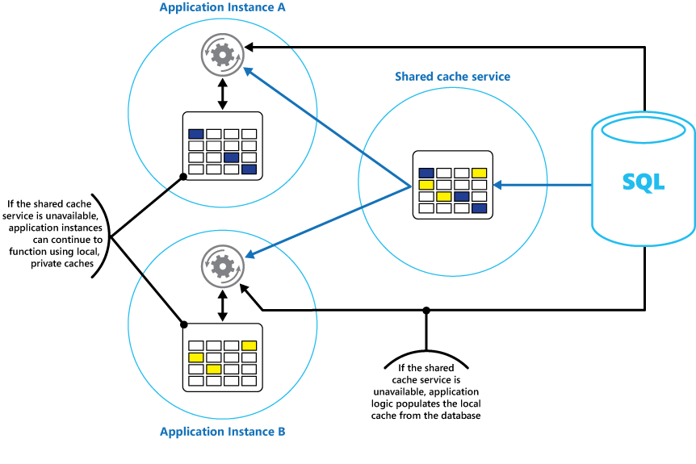

"کشینگ (Caching) یک تکنیک رایج است که برای بهبود عملکرد و مقیاس‌پذیری یک سیستم به کار می‌رود. در این روش، داده‌‌های پرکاربرد به صورت موقت در یک حافظه‌ی سریع و نزدیک به برنامه کپی می‌شوند. اگر این حافظه‌ی سریع نسبت به منبع اصلی داده به برنامه نزدیک‌تر باشد، کشینگ می‌تواند به طور قابل توجهی زمان پاسخگویی برای برنامه‌‌های کاربردی مشتری را با ارائه سریع‌تر داده، بهبود بخشد.

کشینگ زمانی مؤثرتر است که یک نمونه از برنامه‌ی مشتری به طور مکرر داده‌ی یکسانی را بخواند، به خصوص اگر شرایط زیر در مورد منبع اصلی داده صدق کند:

داده نسبتاً ایستا (بدون تغییر) باقی می‌ماند. سرعت آن در مقایسه با سرعت کش پایین‌تر است. دسترسی به آن با رقابت بالایی همراه است. منبع اصلی داده دور است و تأخیر شبکه باعث کندی دسترسی می‌شود."

## کشینگ در برنامه‌‌های توزیع‌شده (Distributed Applications)

برنامه‌‌های توزیع‌شده معمولاً از یکی یا هر دو استراتژی زیر برای کش کردن داده‌ها استفاده می‌کنند:

- **کشینگ خصوصی (Private Caching):** در این روش، داده‌ها به صورت محلی روی کامپیوتری که یک نمونه از برنامه یا سرویس را اجرا می‌کند، نگهداری می‌شود.
- **کشینگ اشتراکی (Shared Cache):** این نوع کش به عنوان یک منبع مشترک عمل می‌کند که چندین فرایند و ماشین می‌توانند به آن دسترسی داشته باشند.

در هر دو حالت، کشینگ می‌تواند هم در سمت کاربر (Client-Side) و هم در سمت سرور (Server-Side) انجام شود. کشینگ سمت کاربر توسط فرایندی انجام می‌شود که رابط کاربری یک سیستم مانند مرورگر وب یا برنامه دسکتاپ را ارائه می‌دهد. کشینگ سمت سرور توسط فرایندی انجام می‌شود که سرویس‌‌های تجاری را به صورت از راه دور ارائه می‌دهد.

### کشینگ خصوصی

اساسی‌ترین نوع کش، یک حافظه‌ی درون حافظه (In-Memory Store) است. این حافظه در فضای آدرس‌دهی یک فرایند واحد قرار دارد و مستقیماً توسط کدی که در آن فرایند اجرا می‌شود، قابل دسترسی است. این نوع کش دسترسی سریعی دارد و همچنین می‌تواند روشی مؤثر برای ذخیره‌سازی حجم متوسطی از داده‌‌های ایستا باشد. اندازه یک کش معمولاً با مقدار حافظه‌ی موجود در ماشینی که فرایند را میزبانی می‌کند، محدود می‌شود.

اگر نیاز به کش کردن اطلاعات بیشتری از حداکثر ظرفیت فیزیکی حافظه دارید، می‌توانید داده‌‌های کش شده را روی سیستم فایل محلی بنویسید. دسترسی به این فرآیند نسبت به داده‌‌هایی که در حافظه نگهداری می‌شوند، کندتر خواهد بود، اما همچنان باید سریع‌تر و مطمئن‌تر از بازیابی داده‌ها از طریق شبکه باشد.

اگر چندین نمونه از یک برنامه که از این مدل استفاده می‌کند به طور همزمان اجرا شوند، هر نمونه برنامه کش مستقل خود را دارد که یک کپی از داده‌ها را در خود جای می‌دهد.

کش را به عنوان یک تصویر لحظه‌ای از داده‌‌های اصلی در یک نقطه از گذشته در نظر بگیرید. اگر این داده‌ها ایستا نباشند، به احتمال زیاد نمونه‌‌های مختلف برنامه نسخه‌‌های متفاوتی از داده‌ها را در کش‌‌های خود نگه می‌دارند. بنابراین، همان کوئری که توسط این نمونه‌ها انجام می‌شود، می‌تواند نتایج متفاوتی را به همراه داشته باشد، همانطور که در شکل ۱ نشان داده شده است.

 شکل 1: استفاده از کش درون حافظه ( _in-memory_) در نمونه‌‌های مختلف یک برنامه
##   کشینگ اشتراکی (Shared Caching)

استفاده از کشینگ اشتراکی می‌تواند نگرانی‌‌هایی را که با کشینگ درون حافظه وجود دارد، برطرف کند. این نگرانی‌ها ناشی از احتمال تفاوت داده‌ها در هر کش است. کشینگ اشتراکی تضمین می‌کند که نمونه‌‌های مختلف برنامه، نمای یکسانی از داده‌‌های کش شده را مشاهده کنند. در این روش، کش در یک مکان جداگانه قرار می‌گیرد که معمولاً به عنوان بخشی از یک سرویس مجزا میزبانی می‌شود، همانطور که در شکل ۲ نشان داده شده است.

شکل 2 - استفاده از کش شارد شده

## مزایای مهم کشینگ اشتراکی

یکی از مزایای مهم رویکرد کشینگ اشتراکی، مقیاس‌پذیری‌ای است که ارائه می‌دهد. بسیاری از سرویس‌‌های کشینگ اشتراکی با استفاده از یک خوشه‌ی سرور (Cluster) و نرم‌افزاری که به طور شفاف داده‌ها را در سراسر خوشه توزیع می‌کند، پیاده‌سازی می‌شوند. یک نمونه از برنامه به سادگی درخواستی را به سرویس کش ارسال می‌کند. زیرساخت اساسی، محل داده‌ی کش شده در خوشه را تعیین می‌کند. شما به راحتی می‌توانید با افزودن سرور‌های بیشتر، کش را مقیاس‌بندی کنید.

با این حال، رویکرد کشینگ اشتراکی دارای دو معایب اصلی است:

- دسترسی به کش کندتر است، زیرا دیگر به صورت محلی در هر نمونه‌ی برنامه نگهداری نمی‌شود.
- نیاز به پیاده‌سازی یک سرویس کش مجزا ممکن است باعث پیچیدگی راه‌حل شود.

## ملاحظات مربوط به استفاده از کشینگ

بخش‌‌های زیر با جزئیات بیشتر ملاحظات مربوط به طراحی و استفاده از کش را شرح می‌دهند.

### چه زمانی برای کش کردن داده تصمیم بگیریم؟

کشینگ می‌تواند به طور چشمگیری عملکرد، مقیاس‌پذیری و در دسترس بودن را بهبود بخشد. هر چه داده‌ی بیشتری داشته باشید و تعداد کاربرانی که نیاز به دسترسی به این داده دارند بیشتر باشد، مزایای کشینگ افزایش می‌یابد. کشینگ تأخیر (Latency) و درگیری (Contention) مرتبط با مدیریت حجم زیادی از درخواست‌‌های همزمان در منبع داده اصلی را کاهش می‌دهد.

برای مثال، یک پایگاه داده ممکن است تنها از تعداد محدودی اتصال همزمان پشتیبانی کند. با این حال، بازیابی داده از یک کش اشتراکی به جای پایگاه داده‌ی زیربنایی، این امکان را برای یک برنامه‌ی کاربردی مشتری فراهم می‌کند که حتی در صورت اشغال بودن تمام اتصالات در دسترس، به این داده دسترسی داشته باشد. علاوه بر این، اگر پایگاه داده در دسترس نباشد، برنامه‌‌های کاربردی مشتری ممکن است بتوانند با استفاده از داده‌‌هایی که در کش نگهداری می‌شوند به کار خود ادامه دهند.

داده‌‌هایی را که به طور مکرر خوانده می‌شوند اما به ندرت تغییر می‌کنند (برای مثال، داده‌‌هایی که نسبت عملیات خواندن آن‌ها نسبت به عملیات نوشتن بیشتر است) را برای کش کردن در نظر بگیرید. با این حال، توصیه نمی‌شود که از کش به عنوان منبع اصلی نگه‌داری اطلاعات حیاتی استفاده کنید. در عوض، اطمینان حاصل کنید که تمام تغییراتی که برنامه‌ی شما نمی‌تواند از دست دادنشان چشم‌پوشی کند، همیشه در یک منبع داده‌ی پایدار ذخیره شوند. اگر کش در دسترس نباشد، برنامه‌ی شما همچنان می‌تواند با استفاده از منبع داده به کار خود ادامه دهد و شما اطلاعات مهمی را از دست نخواهید داد.

### نحوه‌ی موثر کش کردن داده را تعیین کنید

کلید استفاده‌ی مؤثر از کش، تعیین مناسب‌ترین داده برای کش شدن و کش کردن آن در زمان مناسب است. این داده را می‌توان برای اولین باری که توسط یک برنامه بازیابی می‌شود، به صورت درخواستی به کش اضافه کرد. برنامه فقط باید یک بار داده را از منبع داده بازیابی کند و دسترسی‌‌های بعدی می‌توانند با استفاده از کش تأمین شوند.

از طرف دیگر، یک کش می‌تواند به طور کامل یا بخشی از آن به طور پیش‌فرض با داده پر شود، که معمولاً زمانی که برنامه راه‌اندازی می‌شود، اتفاق می‌افتد (رویکردی که با عنوان سیدینگ (Seeding) شناخته می‌شود). با این حال، ممکن است پیاده‌سازی سیدینگ برای یک کش بزرگ توصیه نشود، زیرا این رویکرد می‌تواند هنگام راه‌اندازی برنامه، بار ناگهانی و سنگینی را بر روی منبع داده‌ی اصلی تحمیل کند.

اغلب، تحلیل الگو‌های استفاده می‌تواند به شما در تصمیم‌گیری در مورد پر کردن کامل یا بخشی از کش به صورت پیش‌فرض و انتخاب داده‌ای که باید کش شود، کمک کند. برای مثال، می‌توانید کش را با داده‌ی پروفایل ایستا (Static) کاربرانی که به طور منظم (احتمالاً هر روز) از برنامه استفاده می‌کنند، سید کنید، اما این کار را برای کاربرانی که فقط هفته‌ای یک بار از برنامه استفاده می‌کنند، انجام ندهید.

کشینگ معمولاً برای داده‌‌هایی که تغییرناپذیر هستند (Immutable) یا به ندرت تغییر می‌کنند، به خوبی کار می‌کند. نمونه‌‌هایی از این نوع داده‌ها شامل اطلاعات مرجع مانند اطلاعات محصول و قیمت‌گذاری در یک برنامه‌ی تجارت الکترونیک یا منابع ایستا اشتراکی‌ای است که ساخت آن‌ها پرهزینه است. برخی یا تمام این داده‌ها را می‌توان در راه‌اندازی برنامه به کش بارگذاری کرد تا تقاضا برای منابع را به حداقل برساند و عملکرد را بهبود.

##   توجه به زمان انقضای کش

به زمان انقضای کش و اشیایی که در آن قرار دارند، به دقت توجه کنید. اگر زمان انقضا را خیلی کوتاه تنظیم کنید، اشیاء خیلی زود منقضی می‌شوند و مزایای استفاده از کش را کاهش می‌دهید. اگر این زمان را خیلی طولانی در نظر بگیرید، خطر از مد افتادن داده‌ها وجود دارد.

## پر کردن (Eviction) داده‌ها از کش

مراقب زمان انقضای کش و اشیایی که در آن قرار دارند باشید. اگر زمان انقضا را خیلی کوتاه تنظیم کنید، اشیاء خیلی زود منقضی می‌شوند و مزایای استفاده از کش را کاهش می‌دهید. اگر این زمان را خیلی طولانی در نظر بگیرید، خطر از مد افتادن داده‌ها وجود دارد. همچنین ممکن است اگر به داده‌ها اجازه داده شود برای مدت طولانی در کش باقی بمانند، کش پر شود. در این صورت، هر درخواستی برای افزودن موارد جدید به کش ممکن است باعث شود برخی موارد در فرآیندی به نام پر کردن اجباری (Eviction) به زور حذف شوند.

سرویس‌‌های کش معمولاً داده‌ها را بر اساس کمترین میزان استفاده‌ی اخیر (LRU) حذف می‌کنند، اما شما معمولاً می‌توانید این رویکرد را لغو کرده و از حذف اجباری موارد جلوگیری کنید. با این حال، اگر این روش را اتخاذ کنید، خطر پر شدن حافظه‌ی در دسترس کش وجود دارد. برنامه‌ای که تلاش می‌کند موردی را به کش اضافه کند، با یک خطا مواجه خواهد شد.

برخی از پیاده‌سازی‌‌های کشینگ ممکن است سیاست‌‌های پر کردن اضافی را ارائه دهند. چندین نوع سیاست پر کردن وجود دارد که عبارتند از:

- سیاست بر اساس آخرین مورد استفاده‌شده (با فرض اینکه دیگر به داده نیاز نباشد).
- سیاست FIFO (اولین ورودی، اولین خروجی) (قدیمی‌ترین داده‌ها ابتدا حذف می‌شوند).
- یک سیاست حذف صریح بر اساس رویدادی که راه‌اندازی می‌شود (مانند تغییر داده‌ها).

## به‌روزرسانی نکردن داده‌ها در کش سمت کاربر

به طور کلی، داده‌‌هایی که در یک کش سمت کاربر قرار دارند، خارج از حوزه‌ی اختیارات سرویسی در نظر گرفته می‌شوند که داده‌ها را به کاربر ارائه می‌دهد. یک سرویس نمی‌تواند مستقیماً یک کاربر را مجبور کند که اطلاعاتی را به یک کش سمت کاربر اضافه یا از آن حذف کند.

این بدان معناست که ممکن است یک کاربر که از یک کش با پیکربندی ضعیف استفاده می‌کند، به استفاده از اطلاعات قدیمی ادامه دهد. برای مثال، اگر سیاست‌‌های انقضای کش به درستی اجرا نشوند، یک کاربر ممکن است از اطلاعات قدیمی‌ای که به صورت محلی کش شده استفاده کند، در حالی که اطلاعات در منبع داده‌ی اصلی تغییر کرده است.

اگر یک برنامه‌ی وب را توسعه می‌دهید که داده‌ها را از طریق یک اتصال HTTP ارائه می‌کند، می‌توانید به طور ضمنی یک وب‌کلینت (مانند مرورگر یا پروکسی وب) را مجبور کنید تا آخرین اطلاعات را دریافت کند. این کار امکان‌پذیر است اگر یک منبع با تغییر در شناسه‌ی منبع‌یاب یکپارچه (URI) آن منبع به‌روز شود. وب‌کلینت‌ها معمولاً از URI یک منبع به عنوان کلید در کش سمت کاربر استفاده می‌کنند، بنابراین اگر URI تغییر کند، وب‌کلینت هر نسخه‌ی کش‌شده‌ی قبلی از یک منبع را نادیده می‌گیرد و به جای آن نسخه‌ی جدید را دریافت می‌کند.

