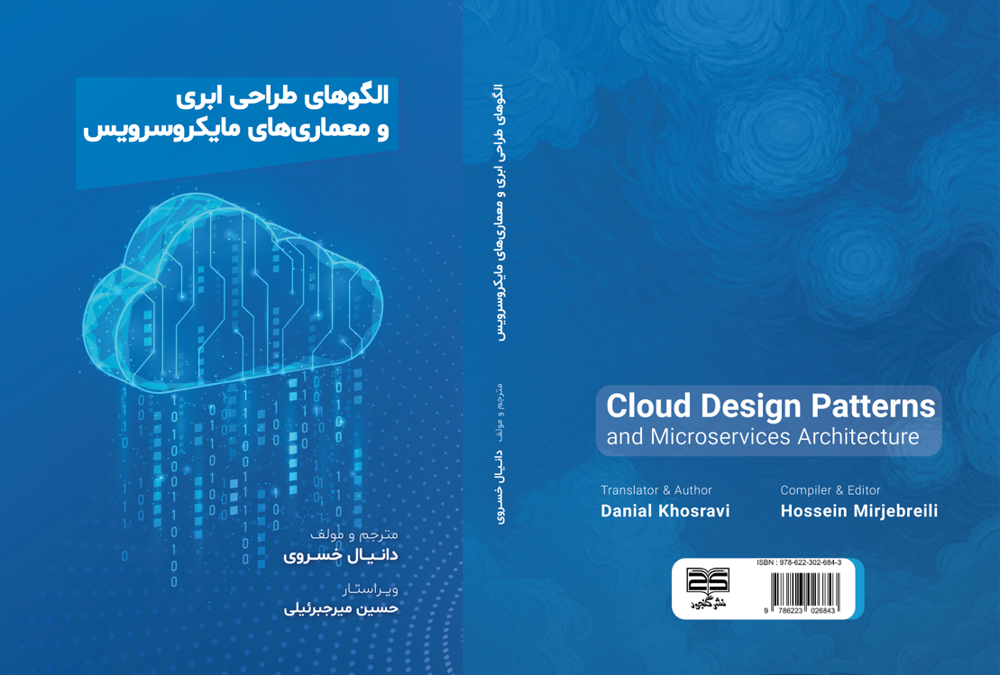

# الگو‌های طراحی ابری

در اینجا نسخه پیش از انتشار کتاب  معماری‌های میکروسرویس  ( دیزاین پترین‌های ابری) آورده شده است.
 بزودی نسخه چاپی کتاب به صورت pdf در همین جا در اختیار علاقه‌مندان قرار خواهد گرفت.

برای دانلود نسخه pdf کتاب روی لینک زیر کلیک کنید:

[دانلود](https://github.com/DannyRavi/cloud_software_farsi/releases/download/1.0.2/cloud-microservice.pdf)

به طور کلی الگو‌های طراحی در محیط ابری به سه دسته زیر تقسیم می‌شوند:

- ‏ الگو‌های مدیریت داده
- ‏  طراحی و پیاده‌سازی
- ‏ پیام‌رسانی

مدیریت داده عنصر کلیدی در اپلیکیشن‌‌های ابری است و بیشتر ویژگی‌‌های کیفی را تحت تأثیر قرار می‌دهد. داده‌ها معمولاً در مکان‌‌های مختلف و در چندین سرور به دلایلی مانند عملکرد، مقیاس‌پذیری یا در دسترس بودن میزبانی می‌شوند و این کار می‌تواند طیف وسیعی از چالش‌ها را ایجاد کند. به عنوان مثال، بکپارچگی داده‌ها باید حفظ شود و داده‌ها معمولاً باید در مکان‌های  مختلف همگام‌سازی شوند.  
  

## تاریخچه و اهداف

ترجمه این متن در حدود 2 دو سال پیش شروع شده است و به صورت تدریجی ادامه داشته است و نسخه‌های اولیه از این ترجمه در [ویرگول](https://virgool.io/@dany_kh)  موجود است.
با توجه به این که متن‌های مربوط به سیستم‌های توزیع شده و سیستم‌های ابری بسیار متنوع و جدید هستند و نظر به اینکه هدف اصلی این ترجمه‌ها رسیدن به یک کتاب در حوزه **الگوهای طراحی ابری** است و با توجه به زمان محدود جهت کار روی ترجمه این متن‌ها؛ تصمیم گرفتم هر قسمت از کتاب را به صورت آنلاین منتشر کنم و ترجمه‌های جدیدتر را به تدریج به متن اصلی اضافه کنم.
همینطور بزودی نسخه اولیه کتاب به صورت pdf در همین ریپوزیتوری آماده خواهد شد و قطعا این کتاب دارای بروزرسانی‌ها و نسخه‌هایِ مختلفی خواهد بود. 

## راهنمای مطالعه

برای افرادی که با این طراحی‌های ابری و سیستم‌های توضیح شده آشنايی مقدماتی دارند، پیشنهاد می‌شود که  در ابتدا متن [مقدماتی](./docs/cloud-intro.md) را مطالعه کرده و سپس الگوهای بیان شده در زیر را مطالعه کنند.
توجه شود که ممکن است متن‌ها در نسخه اپلیکیشن گیتهاب در گوشی‌های هوشمند به طور مناسب نشان داده نشده باشد و پیشنهاد می‌شود از نسخه مرورگر به مطالعه متن‌ها پرداخته شود.

در زیر الگو‌های کاربردی جهت مدیریت داده در فضای ابری به طور خلاصه معرفی شده است.

همینطور برخی از کدها و برنامه‌های مربوط به این الگوهای ابری در آدرس  [example](./example/)  موجود است.

#  الگو‌های مدیریت داده 

| الگو                   | خلاصه                                                                                                                                                                                                                                                       |
| ---------------------- | ----------------------------------------------------------------------------------------------------------------------------------------------------------------------------------------------------------------------------------------------------------- |
| [Cache-Aside](./docs/Cache-Aside%20pattern.md)            | داده‌ها را در صورت نیاز در حافظه کَش از یک ذخیره‌گاه داده بارگیری کنید                                                                                                                                                                                      |
| [CQRS](./docs/CQRS.md)                   | 
برای جداسازی عملیات خواندن داده از عملیات به‌روزرسانی و نوشتن داده، از رابط‌‌های کاربری (interfaces) جداگانه استفاده کنید.                                                                                                                                   |
| [Event Sourcing](./docs/Event%20Sourcing%20pattern.md)         | 
از یک ذخیرگاه‌ برای ثبت کل توالی رخداد‌هایی که بیانگر اعمال انجام‌ برای ثبت کل توالی رخداد‌هایی که بیانگر اعمال انجام‌شده روی داده در یک دامنه (domain) هستند، از یک ذخیره‌ساز صرفا الحاقی (append-only store) استفاده کنید. (append-only store) استفاده کنید. |
| [Index Table](./docs/Index%20Table%20pattern.md)            | 
 برای بهبود کارایی کوئری‌ها، روی فیلد‌هایی در مخزن‌‌های داده که اغلب اوقات در کوئری ارجاع داده می‌شوند، ایندکس ایجاد کنید.                                                                                                                                     |
| [Materialized View](./docs/Materialized%20View%20pattern.md)      | 
 برای بهبود کارایی   کوئری‌ها (queries) زمانی که داده در یکی یا چند مخزن داده به شکل بهینه برای عملیات مورد نیاز فرمت‌بندی نشده است، از نما‌های از پیش پرشده (prepopulated views) بر روی این داده‌ها استفاده کنید.‌                                           |
| [Sharding](./docs/Sharding%20pattern.md)           |
 یک مخزن داده را به مجموعه‌ای از پارتیشن‌‌های افقی یا شارد (shard) تقسیم کنید.                                                                                                                                                                                |
| [Static Content Hosting](./docs/Static%20Content%20Hosting%20pattern.md) |
 محتوای استاتیک را در یک سرویس ذخیره سازی مبتنی بر ابر مستقر کنید که می‌تواند آنها را مستقیماً به کاربر تحویل دهد.                                                                                                                                           |
| [Valet Key](./docs/Valet%20Key%20pattern.md)              | 
 از رمز (token) یا کلیدی استفاده کنید که دسترسی مستقیم محدودی به یک منبع یا سرویس خاص را برای کاربرها فراهم می‌کند.                                                                                                                                           |

یک طراحی خوب شامل عواملی مانند **یکنواختی و انسجام** در طراحی و استقرار اجزا، **نگهداری‌پذیری** برای ساده‌سازی مدیریت و توسعه، و **قابلیت استفاده مجدد** برای استفاده از اجزا و زیرسامانه‌ها در دیگر برنامه‌ها و سناریوها می‌شود. تصمیماتی که در فاز طراحی و پیاده‌سازی گرفته می‌شوند، تاثیر بسیار زیادی بر کیفیت و **هزینه کل مالکیت** (TCO) برای برنامه‌ها و سرویس‌‌های ابری میزبانی‌شده دارند.

## الگو‌های طراحی و پیاده‌سازی

| الگو                                                                                                                           | خلاصه                                                                                                                                                                                  |
| ------------------------------------------------------------------------------------------------------------------------------ | -------------------------------------------------------------------------------------------------------------------------------------------------------------------------------------- |
| [Ambassador](./docs/Ambassador%20pattern.md)                                         | 
 یک سرویس جانبی که به جای سرویس مصرف‌کننده (consumer) یا برنامه، درخواست ‌های شبکه ‌ای ارسال می‌کند.                                                                                      |
| [Anti-Corruption Layer](./docs/Anti-corruption%20Layer%20pattern.md)                   | 
 پیاده سازی یک لایه نمایشی یا آداپتور بین یک برنامه مدرن و یک سیستم قدیمی.                                                                                                              |
| [Backends for Frontends](./docs/Backends%20for%20Frontends.md)                 | 
 ایجاد سرویس ‌های پشتیبان مجزا که توسط اپلیکیشن یا رابط ‌های کاربری خاصی مصرف می‌شوند.                                                                                                    |
| [CQRS](./docs/CQRS.md)                                                     | 
جداسازی عملیات خواندن داده از عملیات به روزرسانی داده با استفاده از رابط ‌های جداگانه. (Command Query Responsibility Segregation)                                                       |
| [Compute Resource Consolidation](./docs/Compute%20Resource%20Consolidation%20pattern.md) |  
 ادغام چندین کار یا عملیات در یک واحد محاسباتی واحد.                                                                                                                                    |
| [Edge Workload Configuration](./docs/Edge%20Workload%20Configuration%20pattern.md)       | 
 تنوع زیاد سیستم‌ها و دستگاه‌ها در محل تولید می‌تواند پیکربندی بار کاری را به یک مشکل دشوار تبدیل کند.                                                                                  |
| [External Configuration Store](./docs/External%20Configuration%20Store%20pattern.md)     | 
 انتقال اطلاعات پیکربندی از بسته استقرار برنامه به یک مکان مرکزی.                                                                                                                       |
| [Gateway Aggregation](./docs/Gateway%20Aggregation%20pattern.md)                       | 
 استفاده از یک درگاه برای جمع آوری چندین درخواست جداگانه به یک درخواست واحد.                                                                                                            |
| [Gateway Offloading](./docs/Gateway%20Offloading%20pattern.md)                         | 
 واگذاری عملکرد سرویس مشترک یا خاص به یک درگاه پروکسی                                                                                                                                   |
| [Gateway Routing](./docs/Gateway%20Routing%20pattern.md)                               | 
 مسیریابی درخواست‌ها به سرویس‌‌های مختلف با استفاده از یک نقطه انتهایی واحد.                                                                                                             |
| [Leader Election](./docs/Leader%20Election%20pattern.md)                               | 
 هماهنگ سازی اقدامات انجام شده توسط مجموعه ‌ای از نمونه‌‌های تسک همکاری کننده در یک برنامه توزیع شده با انتخاب یک نمونه به عنوان رهبر که مسئولیت مدیریت سایر نمونه‌ها را بر عهده می‌گیرد. |
| [Pipes and Filters](./docs/Pipes%20and%20Filters%20pattern.md)                           | 
 تجزیه یک کار که پردازش پیچیده ‌ای را انجام می‌دهد به مجموعه ‌ای از عناصر جداگانه که قابل استفاده مجدد هستند.                                                                             |
| [Sidecar](./docs/Sidecar%20pattern.md)                                               | 
 استقرار اجزای یک برنامه در یک فرآیند یا ظرف جداگانه برای ارائه جداسازی و کپسوله سازی.                                                                                                  |
| [Static Content Hosting](./docs/Static%20Content%20Hosting%20pattern.md)                 | 
استقرار محتوای استاتیک در یک سرویس ذخیره سازی ابری که می‌تواند آنها را مستقیماً به کاربر تحویل دهد.                                                                                    |
| [Strangler Fig](./docs/Strangler%20Fig%20pattern.md)                                   | 
 مهاجرت تدریجی یک سیستم قدیمی با جایگزینی تدریجی قطعات خاصی از قابلیت‌ها با برنامه‌ها و سرویس ‌های جدید.                                                                                 |

### الگو‌های پیام رسانی

طبیعت توزیع‌شده‌ی برنامه‌‌های ابری، زیرساختی برای پیام‌رسانی را طلب می‌کند که اجزا و سرویس‌ها را به هم متصل نماید. در حالت ایده‌آل، این اتصال باید با کوپلینگ ضعیف (loose coupling) برقرار شود تا حداکثر مقیاس‌پذیری را به دست آورد. پیام‌رسانی ناهمزمان (Asynchronous messaging) به طور گسترده مورد استفاده قرار می‌گیرد و مزایای زیادی را به همراه دارد، اما در عین حال چالش‌‌هایی را نیز به وجود می‌آورد، مانند ترتیب پیام‌ها، مدیریت پیام‌‌های سمی (poison message)، ایدم‌پوتنسی (idempotency) و موارد دیگر.

| الگو                                                                                                                   | خلاصه                                                                                                                                                                                                           |
| ---------------------------------------------------------------------------------------------------------------------- | --------------------------------------------------------------------------------------------------------------------------------------------------------------------------------------------------------------- |
| [Asynchronous Request-Reply](./docs/Asynchronous%20Request-Reply%20pattern.md)        | 
 جداسازی پردازش بک‌اند از یک host فرانت‌اند، جایی که پردازش بک‌اند نیاز به ناهمزمان بودن دارد، اما فرانت‌اند همچنان به یک پاسخ واضح نیاز دارد.                                                                   |
| [Claim Check](./docs/Claim-Check%20pattern.md)                               | 
 تقسیم یک پیام بزرگ به یک **Claim Check** و یک محموله (payload) برای جلوگیری از تحت‌الشعاع قرار دادن یک باس پیام‌رسانی (message bus).                                                                            |
| [Choreography](./docs/Choreography%20pattern.md)                             | 
 مشارکت هر مؤلفه سیستم در فرآیند تصمیم‌گیری در مورد گردش کار تراکنش تجاری، به جای تکیه بر یک نقطه کنترل مرکزی.                                                                                                   |
| [Competing Consumers](./docs/Competing%20Consumers%20pattern.md)               | 
 اجازه دادن به چندین مصرف‌کننده همزمان برای پردازش پیام‌‌های دریافتی در همان کانال پیام‌رسانی.                                                                                                                    |
| [Pipes and Filters](./docs/Pipes%20and%20Filters%20pattern.md)                   | 
 اجازه دادن به چندین مصرف‌کننده همزمان برای پردازش پیام‌‌های دریافتی در همان کانال پیام‌رسانی.                                                                                                                    |
| [Priority Queue](./docs/Priority%20Queue%20pattern.md)                         | 
 اولویت‌بندی درخواست‌‌هایی که به سرویس‌ها ارسال می‌شوند به گونه‌ای که درخواست‌‌های با اولویت بالاتر سریع‌تر از درخواست‌‌های با اولویت پایین‌تر دریافت و پردازش شوند.                                                |
| [Publisher-Subscriber](./docs/Publisher-Subscriber%20pattern.md)             | 
 این امکان را به یک برنامه می‌دهد که به‌طور ناهمزمان رویدادها را به چندین مصرف‌کننده علاقه‌مند اعلام کند، بدون اینکه فرستنده‌ها را به گیرنده‌ها متصل کند.                                                        |
| [Queue-Based Load Leveling](./docs/Queue-Based%20Load%20Leveling%20pattern.md)   | 
 استفاده از یک صف که به عنوان یک بافر بین یک تسک و سرویسی که فراخوانی می‌کند عمل می‌کند تا بار‌های سنگین متناوب را تحمل کند.                                                                                      |
| [Saga](./docs/Saga%20distributed%20transactions%20pattern.md)                         | 
 مدیریت انسجام داده در سراسر میکروسرویس‌ها در سناریو‌های تراکنش توزیع‌شده. saga توالی از تراکنش‌‌هایی است که هر سرویس را به‌روزرسانی می‌کند و یک پیام یا رویداد را برای راه‌اندازی مرحله بعدی تراکنش منتشر می‌کند. |
| [Scheduler Agent Supervisor](./docs/Scheduler%20Agent%20Supervisor%20pattern.md) | 
 هماهنگی مجموعه‌ای از اقدامات در سراسر مجموعه‌ای توزیع‌شده از سرویس‌ها و سایر منابع از راه دور.                                                                                                                  |
| [Sequential Convoy](./docs/Sequential%20Convoy%20pattern.md)                   | 
 پردازش مجموعه‌ای از پیام‌‌های مرتبط به ترتیب تعریف‌شده، بدون مسدود کردن پردازش گروه‌‌های دیگر پیام‌ها.                                                                                                            |

### سایر الگوهای کاربردی در معماری ابری

| الگو                                                                                                                   | خلاصه                                                                                                                                                                                                           |
| ---------------------------------------------------------------------------------------------------------------------- | --------------------------------------------------------------------------------------------------------------------------------------------------------------------------------------------------------------- |
| [Throttling](./docs/Throttling%20pattern.md)        | 
 کنترل مصرف منابع برای جلوگیری از بارگذاری بیش از حد و تضمین عملکرد و SLA حتی در زمان تقاضای بالا روی سیستم.                                                                   |

| [Retry Pattern](./docs/Retry%20pattern.md)                               | 
 مدیریت خطاهای موقتی با استفاده از روش تلاش مجدد برای عملیات‌ها و  افزایش انعطاف‌پذیری و پایداری سیستم.                                                                       |

| [Rate Limiting](./docs/Rate%20Limiting%20pattern.md)                             | 
 محدود کردن تعداد درخواست‌ها در یک دوره زمانی و جلوگیری از سوء استفاده و حفظ منابع.                                                                                     
              |
| [Messaging Bridge](./docs/Messaging%20Bridge.md)               | 
  اتصال دو سیستم ناهمگن از طریق پیام رسانی و تسهیل تبادل داده‌ها و همکاری بین آن‌ها.                                                                                     
                               |
| [Geode](./docs/Geode%20pattern.md)                   | 
 استقرار یک سرویس در چندین گره جغرافیایی و بهبود در دسترس بودن و کارایی آن با توزیع پردازش در مناطق مختلف.                                                                                     
                              |
| [Gatekeeper](./docs/Gatekeeper%20pattern.md)                         | 
 کنترل دسترسی به یک سرویس با احراز هویت به همراه افزایش امنیت و انطباق با مقررات.                                                |

| [Federated Identity](./docs/Federated%20Identity%20pattern.md)             | 
 احراز هویت کاربران در چندین سیستم به همراه تجربه کاربری ساده‌تر و مدیریت هویت متمرکز.                                                        |

| [Deployment Stamp Traffic Routing](./docs/Deployment%20Stamps%20pattern.md)   | 
 مسیریابی ترافیک به نسخه‌های مختلف یک برنامه و آزمایش و استقرار تدریجی   تغییرات آن.                                                                                       |

| [Circuit Breaker](./docs/Circuit%20Breaker%20pattern.md)                         | 
متوقف کردن موقت عملیات در صورت بروز خطای مکرر و جلوگیری از خطاهای سریالی و حفظ پایداری. |

| [Bulkhead](./docs/Bulkhead%20pattern.md) | 
 جداسازی اجزای سیستم برای محدود کردن خطا و افزایش انعطاف پذیری و قابلیت اطمینان آن.                                                                                        

                         |
| [Compensating Transaction Pattern](./docs/Compensating%20Transaction%20pattern.md)                   | 
 لغو یا جبران تراکنش‌های ناقص و حفظ انسجام داده‌ها و صحت سیستم.                                                                                     
                       |
| [Health Endpoint Monitoring Pattern](./docs/Health%20Endpoint%20Monitoring%20pattern.md)                   | 
 نظارت بر سلامت یک سرویس از طریق یک نقطه پایانی و تشخیص و رفع سریع مشکلات.                                                                                    
                        |

  

  

  
